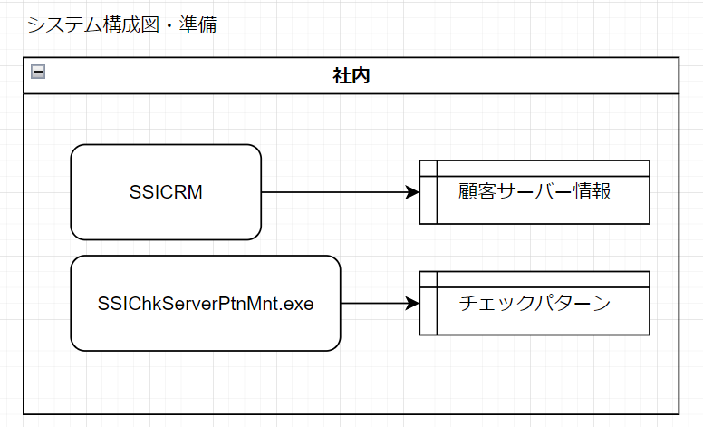
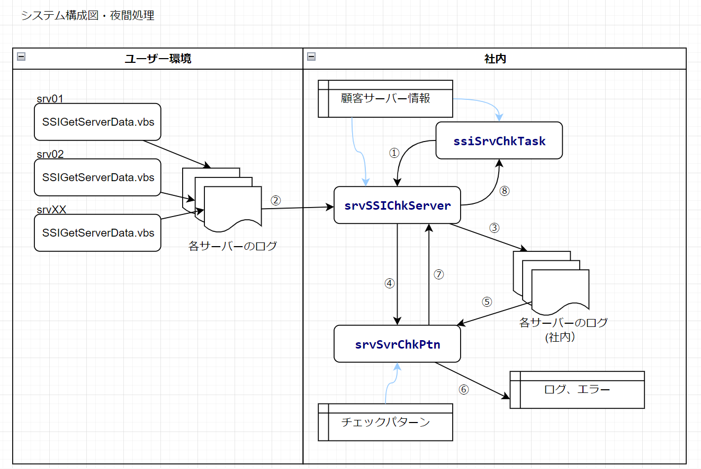
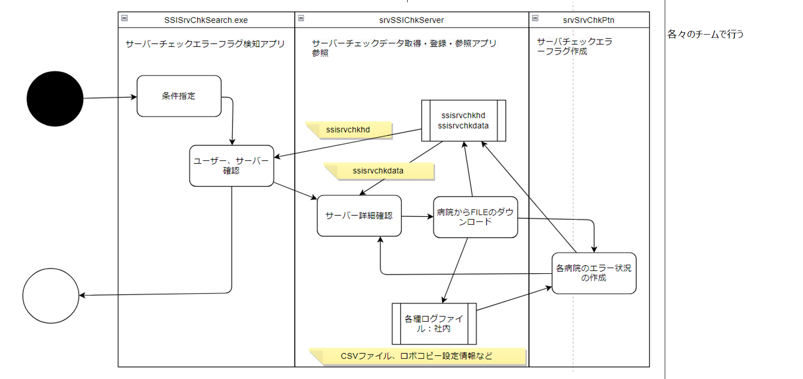
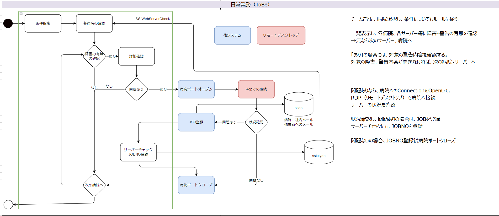

# システム構成図・準備

## 処理１：顧客情報の登録

# システム構成図・夜間処理

## 概要
自動での処理　朝４時？からssiSrvChkTask(ピンクスライム)起点で処理が行われる 
## 事前作業
ユーザーごとに、病院毎にポートをオープンする

## 処理
- ①**ssiSrvChkTask**:srvSSIChkServerの呼び出し
- ②**srvSSIChkServer**:ユーザー環境のサーバーからログ（ファイル）の入手
- ③**srvSSIChkServer**:ログを社内のサーバーに保存
- ④**srvSSIChkServer**:srvSrvChkPtnの呼び出し
- ⑤**srvSrvChkPtn**:社内保存済みのログの収集
- ⑥**srvSrvChkPtn**:ログ確認して、ログ、エラーなどを登録
- ⑦**srvSrvChkPtn**:srvSSIChkServerへ戻る
- ⑧**srvSSIChkServer**:ssiSrvChkTaskへ戻る

## 事後処理
次のユーザーの有無を確認して、なければ処理完了

# システム構成図 サーバーチェック業務 現状

# システム構成図 サーバーチェック業務 更新後
