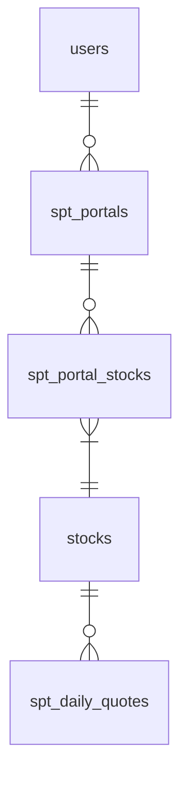
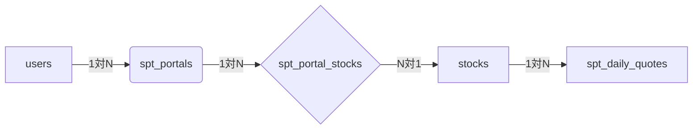

# 要件定義書
## 1. 全体での概要と目的
### ◆概要
株式市場は常に変動し、多くの投資家が感情に左右されず、客観的かつ論理的な投資判断を下すことに困難を感じています。「StockProfit10」は、この課題を解決するために開発された株式投資シミュレーション＆シグナル提供アプリケーションです。過去の膨大な株価データと独自開発の分析アルゴリズムに基づいた「買い・売りシグナル」を提供し、さらにそのシグナルが過去の相場でどれほどの成果を上げたかを具体的に示す「シミュレーション機能」を搭載しています。これにより、ユーザーは冷静な判断を促され、自信を持って売買タイミングを見極められるよう支援します。

### ◆目的
本アプリケーションの究極の目的は、ユーザーが株式投資において**「もしあの時買っていたら、売っていたら」という疑問を解消し、具体的な根拠に基づいた自信ある売買判断を下せる環境を提供**することです。具体的には、以下の主要な価値を提供します。

- 「10%のキャピタルゲイン獲得」を現実的な目標としてサポート: アプリの提案するシグナルに従った場合の過去の取引成果をシミュレーションすることで、その有効性をユーザーが体感し、目標達成に向けた具体的なきっかけと安心感を得られるようにします。
- 感情に左右されない客観的な意思決定の支援: 過去のデータに基づいた買い・売りシグナルと、それによるシミュレーション結果を提供することで、ユーザーが自身の判断を客観的に検証し、感情的な売買を抑制できるようサポートします。
- 株式投資学習・検証の促進: 実際の資金を投入する前に、様々な条件でのシミュレーションを繰り返すことで、ユーザーが投資戦略の有効性を試行錯誤し、スキルを向上させるための学習ツールとしての役割も果たします。
この信頼性と納得感の醸成を通じて、ユーザーのアプリ利用継続を促し、最終的に彼らの安定的な資産形成に貢献します。

## 2. アプリケーションの提供価値と主要機能
### 2.1. 提供価値
「StockProfit10」は、以下の価値をユーザーに提供します。

- 過去実績に基づいた信頼性の可視化: 独自シグナルによるシミュレーションを通じて、「もしあの時取引していたらどうなっていたか」を明確に示し、アプリの信頼性を感覚だけでなくデータで納得いただけます。
- 客観的な売買タイミングの提示: 20日・60日移動平均線、出来高といった客観的指標に基づく「買い・売りシグナル」を提供し、感情に流されない冷静な投資判断を支援します。
- パーソナライズされた投資戦略の検証: 銘柄、期間、取引単位、手数料など、ユーザーが細かく条件を設定できるシミュレーション機能により、個々の投資スタイルに合わせた戦略の有効性を事前に検証できます。
- シンプルなUI/UX: 複雑な株価データを直感的かつ分かりやすく表示することで、投資初心者から経験者まで、誰もがストレスなくアプリを操作し、必要な情報を得られるデザインを目指します。
- 投資行動を促すための「きっかけ」提供: 実際の売買を直接サポートするのではなく、ユーザーが自信を持って売買判断を下すための「確かな情報と根拠」を提供することに特化し、自主的な投資行動を強力に後押しします。
### 2.2. 主要機能一覧
本アプリケーションは、上記提供価値を実現するために、以下の主要な機能を提供します。

- ユーザー管理機能:
    - ログイン、サインアップ、パスワード再設定、ユーザー情報編集
- ポートフォリオ管理機能:
    - 複数のポートフォリオ作成・管理
    - ポートフォリオへの銘柄追加・削除
    - ポートフォリオ内の銘柄表示順、グループ管理
- 株価情報表示機能:
    - 個別銘柄の株価チャート表示（日足、移動平均線表示）
    - 過去の株価データ閲覧
- 買い・売りシグナル通知機能:
    - 独自アルゴリズム（20日・60日移動平均線、出来高など）に基づく「買いシグナル」「売りシグナル」の算出と表示
    - シグナル発生時のユーザーへの通知（アプリ内通知、将来的にメール通知も検討）
- シミュレーション機能（中核機能）:
    - 指定銘柄・期間での売買シミュレーション実行
    - アプリ推奨シグナル、またはカスタム条件（指定価格、日付）による売買トリガー設定
    - 購入株数/金額、手数料の設定
    - シミュレーション結果の表示（総損益、損益率、取引履歴一覧）
    - 株価チャート上へのシミュレーション売買タイミング、シグナル表示
- データ連携機能:
    - YahooFinanceAPIからの最新株価データ取得、および過去データの蓄積管理

## 3. シミュレーション機能
### ◆目的
ユーザーが「StockProfit10」の提案する買いシグナルと売りシグナルに従って取引を行った場合、過去のデータに基づいてどの程度の利益または損失が発生したかをシミュレートし、その結果を可視化することで、アプリの有効性を体感し、利用継続を促します。

### ◆動機
「買い」「売り」候補を提示するだけでなく、「もしあの時買っていたら、売っていたら」というユーザーの疑問に答えることで、ツールの信頼性と納得感を高めます。これにより、ユーザーはより安心してアプリのシグナルを活用できるようになります。


## 要件
### シミュレーションの基本ロジック
対象銘柄: ポートフォリオに登録されている銘柄、またはユーザーが指定する単一の銘柄。
期間設定: ユーザーがシミュレーション対象期間（開始日、終了日）を指定できる。
買いのトリガー:
アプリの買いシグナル: 「20日平均線と60日平均線によるゴールデンクロス」と「出来高のボーダーライン」の条件を満たした場合。
ユーザー指定の買い値: 特定の株価になった場合。
日付指定: 特定の日に購入したと仮定する。
売りのトリガー:
アプリの売りシグナル: 「購入時より10%アップ」または「購入時より10%ダウン」の条件を満たした場合。
ユーザー指定の売り値: 特定の株価になった場合。
日付指定: 特定の日に売却したと仮定する。
購入・売却単位: ユーザーが1回の取引で売買する株数または購入金額を指定できる。
取引コスト: ユーザーが設定する手数料（購入時、売却時）を考慮する。
データソース: spt_daily_quotes テーブルに格納されている過去の株価データを使用。YahooFinanceAPIから取得した履歴データが前提。
### シミュレーション結果の表示
損益額: シミュレーション期間中の総損益（売却益 - 購入費用 - 手数料）。
損益率: 総損益を購入総額で割ったパーセンテージ。
取引履歴: シミュレーション期間中の各取引（購入、売却）の詳細（日付、銘柄、株数、価格、損益）。
チャート表示: 実際の株価チャート上に、購入・売却のタイミングとシグナルをプロットして可視化。
2.3. 設定項目
シミュレーション期間: 開始日、終了日
購入株数 / 購入金額: 1回あたりの取引単位
手数料: 購入時手数料、売却時手数料（固定額または割合）
買いシグナル利用: アプリのシグナル、またはカスタム条件
売りシグナル利用: アプリのシグナル、またはカスタム条件

### 術的考慮事項
シミュレーションの実装における考慮事項
データ量: 長期間、複数の銘柄でシミュレーションを行う場合、処理に時間がかかる可能性があります。非同期処理やバックグラウンドでの実行も検討が必要です。
精度: 日次データのみを使用するため、日中の値動きや指値・成行などの細かい取引条件は考慮できません。あくまで「ルール通りの売買」をシミュレートするツールであることを明記することが重要です。
パフォーマンス: 大量の過去データに対する移動平均線の計算や、売買条件のチェックは計算コストが高くなる可能性があります。効率的なアルゴリズムやデータベースクエリの最適化が必要です。
YahooFinanceAPIの利用制限: 過去データの取得期間やリクエスト回数に制限があるため、効率的にデータを取得・キャッシュする仕組みが必要です。


# 外部設計書

## 1.1. ドキュメントの目的
本システム「StockProfit10」についての説明です。

## 1.2. システムの概要
### ◆動機
株式ってどこまでいっても複雑だとは思う。
ただし、シンプルに、冷静に判断できないかなぁと
期待した判断ができない理由としては「」
なぜできないか？というと、外的要因の可能性が高いと思う
そこらへん含めて、冷静に判断して買い時を作るアプリを作りたい


### ◆目的

１０％のキャピタルゲインを得るためのきっかけを与えるアプリ
- 気になる株を登録
- 過去の実績の分析
- 買いシグナルとして、対象の株を気になる株から上げる
- チャンスの基準は株価自体が日付単位でみたときに上がり調子
  - ２０日の平均線、６０日の平均線から判断する
  - 日ごとの出来高は別途ボーダーライン設ける
- 売り時シグナルも出す
  - 株価が購入時より１０％アップが出る
  - 株価が購入時より１０％ダウンでシグナルが出る
- 「買い」「売り」候補を挙げる
  - 実際の売買まではサポートしない
- 「買い」「売り」候補を挙げる 
  - 購入、売却ルールに基づいた過去のシミュレーション機能を提供する

## 1.3. 想定ユーザー・利用シナリオ

株式購入売却で得したい人


## 1.4. 技術スタック（Technology Stack）

#### 1. 開発環境・ホスティング

| 項目           | 使用技術・サービス                        |
| ------------ | -------------------------------- |
| フロントエンド      | Next.js (Reactベース、App Router使用)  |
| バックエンド（BaaS） | Supabase（データベース、認証、ストレージ）        |
| デプロイ先        | Vercel（CI/CD含む）                  |
| データベース       | Supabase PostgreSQL              |
| 外部API        | YahooFinanceAPI（株価情報）               |
| デザイン管理       | Figma                            |
| メール送信        | Supabase Functions（または外部メールサービス） |

#### 2. 開発言語・ライブラリ

- TypeScript
- Tailwind CSS（UI設計時に記述）
- shadcn/ui（UIコンポーネントライブラリ）
- react-query / tanstack-query（API管理）
- chart.js / recharts（チャート表示用）

#### 4. 前提条件
自動での売買は想定していないので、売買するきっかけを見つけるためのツールです。

#### 5. 用語定義

## 1.5. システム構成
本システムは、Next.jsのApp Router、Supabaseの機能、およびTypeScriptを活用したSPA（Single Page Application）として構築されます。効率的な開発と保守性を確保するため、以下のディレクトリ構成を基本的な指針とします。各ディレクトリの目的と格納されるファイルの概要を以下に示します。

```
.
├── .vscode/               # VS Codeの設定ファイル（推奨設定、拡張機能、デバッグ設定など）
├── public/                # 静的アセット（ブラウザから直接アクセス可能な画像、faviconなど）
│   └── images/            # アプリケーションで使用する画像ファイル
├── src/                   # アプリケーションの主要なソースコード
│   ├── app/               # Next.js App Routerのルートディレクトリ。ルーティング構造に準拠
│   │   ├── (auth)/        # 認証関連のルートグループ（例: ログイン、サインアップ、パスワードリセット）
│   │   │   ├── login/
│   │   │   │   └── page.tsx       # ログインページ
│   │   │   └── signup/
│   │   │       └── page.tsx       # サインアップページ
│   │   ├── (main)/        # メイン機能のルートグループ（認証後のページ群）
│   │   │   ├── layout.tsx # メイン機能共通のレイアウト（ナビゲーション、フッターなど）
│   │   │   ├── page.tsx   # メイン画面（ダッシュボードなど）のページ
│   │   │   ├── portfolios/
│   │   │   │   ├── page.tsx                 # ポートフォリオ一覧ページ
│   │   │   │   ├── [id]/                    # 個別ポートフォリオ詳細（動的ルーティング）
│   │   │   │   │   ├── page.tsx              # 個別ポートフォリオ表示ページ
│   │   │   │   │   ├── conditions/           # 監視条件指定画面のルート
│   │   │   │   │   │   └── page.tsx
│   │   │   │   │   ├── portfolio-conditions/ # ポートフォリオ条件指定画面のルート
│   │   │   │   │   │   └── page.tsx
│   │   │   │   │   └── settings/             # ポートフォリオ設定指定画面のルート
│   │   │   │   │       └── page.tsx
│   │   │   ├── simulation/ # シミュレーション機能のルート
│   │   │   │   ├── page.tsx # シミュレーション結果表示、設定フォーム
│   │   │   │   └── [id]/ # 個別シミュレーション結果詳細（特定の銘柄に対するシミュレーション）
│   │   │   │       └── page.tsx
│   │   │   ├── action/
│   │   │   │   └── simulation.ts # シミュレーション実行に関するサーバーアクション
│   │   │   ├── notifications/ # 通知確認画面のルート
│   │   │   │   └── page.tsx
│   │   │   └── user-settings/ # ユーザー設定画面のルート
│   │   │       └── page.tsx
│   │   ├── action/        # Next.js Server Actions の定義ファイル群
│   │   │   ├── auth.ts        # 認証（ログイン、サインアップ）に関するサーバーアクション
│   │   │   ├── user.ts        # ユーザー情報（編集、取得）に関するサーバーアクション
│   │   │   ├── portfolio.ts   # ポートフォリオ（作成、編集、削除）に関するサーバーアクション
│   │   │   └── stock.ts       # 銘柄（追加、削除、シミュレーション設定）に関するサーバーアクション
│   │   ├── favicon.ico
│   │   ├── globals.css        # グローバルスタイルシート（Tailwind CSSのインポートなど）
│   │   └── layout.tsx         # アプリケーション全体のルートレイアウト
│   │   └── loading.tsx        # ページ全体のローディングUI（オプション）
│   ├── components/        # 再利用可能なUIコンポーネントおよびドメインごとの実装
│   │   ├── ui/            # shadcn/uiのコンポーネント群（カスタマイズ版含む）
│   │   │   ├── button.tsx
│   │   │   ├── dialog.tsx
│   │   │   └── ...
│   │   ├── common/        # 汎用的なUIコンポーネント（アプリ全体で利用）
│   │   │   ├── Header.tsx         # アプリケーションヘッダー
│   │   │   ├── Footer.tsx         # アプリケーションフッター
│   │   │   ├── LoadingSpinner.tsx # ローディングスピナー
│   │   │   └── ConfirmationDialog.tsx # 確認ダイアログ
│   │   ├── atoms/         # Atomic DesignのAtoms層（最小単位のUI要素）
│   │   │   ├── Button.tsx
│   │   │   └── Input.tsx
│   │   ├── molecules/     # Atomic DesignのMolecules層（Atomsの組み合わせ）
│   │   │   ├── LoginForm.tsx
│   │   │   └── StockCard.tsx
│   │   ├── organisms/     # Atomic DesignのOrganisms層（Moleculesの組み合わせ）
│   │   │   ├── PortfolioList.tsx
│   │   │   └── ChartDisplay.tsx
│   │   ├── domain/        # ドメインごとのコンポーネントやビジネスロジックに近い実装
│   │   │   ├── Portfolio/ # ポートフォリオドメイン
│   │   │   │   ├── PortfolioEditor.tsx          # ポートフォリオ編集コンポーネント
│   │   │   │   ├── PortfolioDetailView.tsx      # ポートフォリオ詳細表示コンポーネント
│   │   │   │   ├── api/                         # クライアント側で利用するAPI呼び出し関数
│   │   │   │   │   ├── portfolioApi.ts          # ポートフォリオ関連のAPI
│   │   │   │   │   └── stockApi.ts              # ポートフォリオ内の銘柄関連API
│   │   │   │   └── hooks/                       # ポートフォリオ関連のカスタムフック
│   │   │   │       └── usePortfolio.ts
│   │   │   ├── Stock/     # 銘柄（株式）ドメイン
│   │   │   │   ├── StockSearchBar.tsx           # 銘柄検索バー
│   │   │   │   ├── StockChart.tsx               # 株価チャート表示
│   │   │   │   ├── api/
│   │   │   │   │   └── yFinanceClient.ts        # YahooFinanceAPIクライアント
│   │   │   │   └── analysis/                    # 銘柄分析ロジック
│   │   │   │       └── movingAverage.ts         # 移動平均線計算
│   │   │   ├── Notification/ # 通知ドメイン
│   │   │   │   ├── NotificationList.tsx         # 通知一覧表示
│   │   │   │   └── api/
│   │   │   │       └── notificationApi.ts
│   │   │   ├── Simulation/ # シミュレーション関連コンポーネント
│   │   │   │   ├── SimulationForm.tsx # シミュレーション条件入力フォーム
│   │   │   │   ├── SimulationResultTable.tsx # シミュレーション結果テーブル
│   │   │   │   ├── SimulationChart.tsx # シミュレーション結果表示用チャート
│   │   │   │   ├── api/ # クライアント側で利用するAPI呼び出し関数
│   │   │   │   │   └── simulationApi.ts # シミュレーション関連API
│   │   │   │   └── hooks/ # シミュレーション関連カスタムフック
│   │   │   │       └── useSimulation.ts
│   │   │   └── User/      # ユーザー設定ドメイン
│   │   │       ├── UserProfileForm.tsx          # ユーザー情報編集フォーム
│   │   │       └── api/
│   │   │           └── userApi.ts
│   ├── lib/               # 汎用的なユーティリティ関数やサービス
│   │   ├── db/            # Supabaseクライアントの初期化と共通DB操作ヘルパー
│   │   │   └── supabase.ts
│   │   ├── utils/         # その他の汎用ユーティリティ（日付フォーマット、数値計算など）
│   │   │   ├── datetime.ts
│   │   │   └── common.ts
│   │   ├── auth.ts        # 認証関連のヘルパー関数（Supabase Authとの連携）
│   │   └── api/           # 外部APIとの連携（サーバー側で呼び出す共通ロジックなど）
│   │       └── yFinanceService.ts # YahooFinanceAPIトークン管理、呼び出しロジック
│   ├── types/             # TypeScriptの型定義ファイル
│   │   ├── db.d.ts            # データベーススキーマの型
│   │   ├── yFinance.d.ts       # YahooFinanceAPIレスポンスの型
│   │   ├── component.d.ts     # コンポーネントpropsの型
│   │   └── index.d.ts         # その他の汎用型定義
│   ├── contexts/          # React Context APIの定義（グローバルな状態管理）
│   │   └── AuthContext.tsx    # 認証状態管理用のコンテキスト
│   ├── constants/         # アプリケーション全体で使用する定数定義
│   │   └── routes.ts          # ルーティングパスの定数
│   │   └── messages.ts        # 表示メッセージの定数
│   │   └── common.ts          # その他の定数
│   ├── styles/            # スタイル関連ファイル（もしあれば）
│   │   └── tailwind.css
│   └── assets/            # その他のアセット（アイコン、フォントなど）
├── supabase/              # Supabase関連の構成ファイル、マイグレーション、Edge Functions
│   ├── migrations/        # データベーススキーマのバージョン管理用SQLファイル
│   │   └── 20240101_initial_schema.sql
│   ├── functions/         # Supabase Edge Functionsのソースコード
│   └── seed.sql           # 開発環境用の初期データ投入スクリプト
├── .env.local             # 環境変数定義ファイル（本番環境ではVercelの環境変数で設定）
├── next.config.mjs        # Next.jsのビルド設定ファイル
├── postcss.config.mjs     # PostCSSの設定ファイル（主にTailwind CSS用）
├── tailwind.config.ts     # Tailwind CSSの設定ファイル
├── tsconfig.json          # TypeScriptのコンパイラ設定ファイル
├── package.json           # プロジェクトの依存関係とスクリプト定義
├── package-lock.json      # npm/yarnによる依存関係のロックファイル
└── README.md              # プロジェクトの概要、開発環境セットアップ手順、主要コマンドなど
```


# 画面設計（UI Layout）
## 2.1. 画面一覧

| No. | 画面名                     | htmlファイル名         | 概要・目的                           | 主な機能・補足   | 
| --- | -------------------------- | ---------------------- | ------------------------------------ | ---------------------------------------------------- | 
| 1   | ログイン画面               |                        | ユーザーがシステムにログインする画面 | メール・パスワード入力、ログイン処理、エラー表示     | 
| 2   | サインイン画面             |                        | 新規ユーザー登録画面                 | 名前、メール、パスワード入力、認証メール送信         | 
| 3   | ユーザー設定画面           | profile_edit           | ユーザーの情報や通知設定を編集       | 名前・パスワード変更、通知設定ON/OFF                 | 
| 4   | メイン画面                 |                        | ユーザーがログイン後最初に見る画面   | 案内メッセージ、通知一覧への導線                     | 
| 5   | 通知確認画面               | notifications           | 通知の一覧を表示                     | 通知一覧、既読・未読管理、詳細表示                   | 
| 6   | ポートフォリオ一覧         | portfolio_list         | 作成済みポートフォリオの一覧表示     | 新規作成、削除、各ポートフォリオへのリンク           | 
| 7   | ポートフォリオ画面         | portfolio_detail       | 個別のポートフォリオ管理画面         | 監視株の追加・削除、シミュレーション買・売の設定     | 
| 8   | 監視条件指定画面           | condition              | 売買の推奨条件を設定する画面         | ゴールデンクロスなどの条件、価格や期間の指定         | 
| 9   | ポートフォリオ条件指定画面 | portfolio_conditions   | 売買時の制約やフィルタ条件を指定     | 購入金額上限、手数料、出来高フィルタなど             | 
| 10  | チャート | stock_chart | 株のチャート、状態の確認| 様々なテクニカル指標も表示可能 | 
| 11 | シミュレーション設定・結果画面 | simulation | 指定したルールで過去の株価データに基づきシミュレーションを実行し、結果を表示 | 銘柄選択、期間指定、売買条件設定、取引単位指定、損益計算結果表示、取引履歴表示、チャート表示以下に保存しています。|
| 12 | シミュレーション設定・結果画面 | simulation | 指定したルールで過去の株価データに基づきシミュレーションを実行し、結果を表示 | 銘柄選択、期間指定、売買条件設定、取引単位指定、損益計算結果表示、取引履歴表示、チャート表示以下に保存しています。|
|13	|APIデータ確認画面	|api_data_viewer	YahooFinanceAPIから取得した株価データ（未加工）を一覧で確認し、データベースへの登録を指示する画面。	銘柄コード・期間入力、API呼び出し結果のJSON表示、テーブル形式でのデータ表示、データベース登録ボタン。|

_012_ui_mockup


## 2.2. 画面遷移図（UI Flow Diagram）

```mermaid
graph TD
    Login[ログイン画面] -->|ログイン成功| Main[メイン画面]
    Signin[サインイン画面] -->|アカウント作成| Main
    Main --> Notifications[通知確認画面]
    Main --> Portfolios[ポートフォリオ一覧]
    Portfolios --> Portfolio[ポートフォリオ詳細]
    Portfolio --> AddStock[監視株追加]
    Portfolio --> RemoveStock[監視株削除]
    Portfolio --> SimBuy[シミュレーション買設定]
    Portfolio --> SimSell[シミュレーション売設定]

    Portfolio --> WatchCondition[監視条件指定]
    WatchCondition --> BuyCond[購入推奨条件]
    WatchCondition --> SellCond[売却推奨条件]
    Portfolio --> PortfolioConditions[ポートフォリオ条件指定]
    PortfolioConditions --> BudgetLimit[購入金額上限]
    PortfolioConditions --> Fee[手数料指定]
    PortfolioConditions --> Volume[出来高条件]

    Main --> UserSettings[ユーザー設定画面]
    Portfolio --> PortfolioSettings[ポートフォリオ設定指定]

    Portfolios --> Simulation[シミュレーション設定・結果画面]
    Simulation --> SimulationDetail[個別シミュレーション詳細]
    Main --> ApiDataViewer[APIデータ確認画面] %% 追加

    %% オプションでラベルも表示
    Login:::entry
    Signin:::entry
    Main:::main
    Simulation:::new_feature
    ApiDataViewer:::new_feature %% 追加

classDef entry fill:#eef;
classDef main fill:#cfc;
classDef new_feature fill:#cff;
```

## 2.3. 各画面の詳細設計(UI Deital)
### 画面ID
### ワイヤーフレーム（またはモック）
```
+-------------------------------------------------+
| StockProfit10                                   |
| Header (共通ヘッダー)                           |
+-------------------------------------------------+
| APIデータ確認                                   |
|-------------------------------------------------|
| [銘柄コード入力欄] [期間選択（開始日〜終了日）] | [API呼び出しボタン]  |
|                                                 |
| [Loading Spinner (API呼び出し中)]               |
|                                                 |
| **APIレスポンス (JSON形式)** |
| +---------------------------------------------+ |
| | {                                           | |
| |   "chart": {                                | |
| |     "result": [                             | |
| |       {                                     | |
| |         "meta": {...},                      | |
| |         "timestamp": [...],                 | |
| |         "indicators": {...}                 | |
| |       }                                     | |
| |     ]                                       | |
| | }                                           | |
| +---------------------------------------------+ |
|                                                 |
| **整形済みデータ (テーブル形式)** |
| +---------------------------------------------+ |
| | 日付       | 始値  | 高値  | 安値  | 終値  | 出来高  |
| |------------|-------|-------|-------|-------|---------|
| | 2024-05-01 | 100.0 | 102.5 | 99.8  | 101.2 | 123456  |
| | 2024-05-02 | 101.5 | 103.0 | 100.5 | 102.8 | 234567  |
| | ...        | ...   | ...   | ...   | ...   | ...     |
| +---------------------------------------------+ |
|                                                 |
| [データベースに登録ボタン]                      |
| [メッセージ表示エリア（登録成功/失敗など）]    |
+-------------------------------------------------+
| Footer (共通フッター)                           |
+-------------------------------------------------+

```

- 入力項目・表示項目
    - 入力項目:
        - 銘柄コード: テキスト入力フィールド。Yahoo Financeの銘柄コード（例: 7203.T）。
        - 期間選択: カレンダーピッカーなどで開始日と終了日を選択。
    - 表示項目:
        - APIレスポンス（JSON形式）: YahooFinanceAPIから返却された未加工のJSONデータを整形して表示。読み取り専用。
        - 整形済みデータ（テーブル形式）: JSONデータから主要な株価情報（日付、始値、高値、安値、終値、出来高）を抽出し、テーブル形式で表示。読み取り専用。
    - メッセージ表示エリア: API呼び出しの成功/失敗、データベース登録の成功/失敗、エラーメッセージなどを表示。
- バリデーション仕様
    - 銘柄コード: 必須入力。半角英数字とピリオドのみ許可。
    - 期間選択: 開始日と終了日が必須。開始日が終了日より過去であること。過去の株価データ取得のため、未来の日付は指定不可。
    - API呼び出し制限: YahooFinanceAPIの利用制限（リクエスト回数など）に抵触する可能性があれば、ユーザーに注意喚起メッセージを表示。
- アクション（ボタン・リンク）
    - 「API呼び出し」ボタン:
        - 入力された銘柄コードと期間でYahooFinanceAPIを呼び出し、結果を画面に表示。
        - 呼び出し中はボタンを無効化し、ローディング表示。
    - 「データベースに登録」ボタン:
        - 画面に表示されている整形済みデータをspt_daily_quotesテーブルに登録。
        - 登録中はボタンを無効化し、ローディング表示。
        - 登録成功/失敗に応じてメッセージ表示エリアを更新。
- エラーメッセージ仕様
    - API呼び出し失敗:
        - 「株価データの取得に失敗しました。銘柄コードまたは期間をご確認ください。」
        - 「APIの利用制限を超過しました。しばらく時間をおいてお試しください。」（429 Too Many Requests時）
        - 「Yahoo Finance APIとの通信エラーが発生しました。時間をおいて再度お試しください。」（500 Server Error時）
    - データベース登録失敗:
        - 「データベースへの登録に失敗しました。システム管理者にお問い合わせください。」
        - （詳細なエラーがあれば、開発者向けにログに出力）
    - バリデーションエラー:
        - 「銘柄コードは必須です。」
        - 「期間を正しく入力してください。」
- 状態遷移（例：読み込み中／エラー表示）
    - 初期状態: 入力フィールドと「API呼び出し」ボタンが表示されている状態。データ表示エリアは空。
    - API呼び出し中: 「API呼び出し」ボタンが無効化され、ローディングスピナーが表示される。
    - API呼び出し成功: JSONデータとテーブル形式のデータが表示され、「データベースに登録」ボタンが有効化される。
    - API呼び出し失敗: エラーメッセージが表示される。
    - データベース登録中: 「データベースに登録」ボタンが無効化され、ローディングスピナーが表示される。
    - データベース登録成功: 成功メッセージが表示される。
    - データベース登録失敗: エラーメッセージが表示される。
### 入力項目・表示項目
### バリデーション仕様
### アクション（ボタン・リンク）
### エラーメッセージ仕様
### 状態遷移（例：読み込み中／エラー表示）

# 機能仕様（ユースケース）
## 1. 機能一覧
## 2. 各機能の処理概要
### シミュレーション機能
#### 3.1. シミュレーション実行機能
- ユースケース名: シミュレーション実行
- アクター: ユーザー
- 概要: ユーザーが指定した銘柄、期間、売買条件に基づき、過去の株価データを用いて仮想的な取引を行い、その損益を計算・表示する。
- 事前条件:
  - ユーザーがログインしている。
  - YahooFinanceAPIから対象期間の株価データが取得済みである（spt_daily_quotesにデータが存在する）。
- 主フロー:
  - ユーザーがポートフォリオ一覧または個別銘柄詳細画面からシミュレーション機能を選択する。
  - ユーザーがシミュレーション設定画面で以下の項目を入力する:
    - 対象銘柄（ポートフォリオ内の銘柄から選択、または銘柄コードを直接入力）
    - シミュレーション開始日、終了日
    - 1回あたりの購入株数または購入金額
    - 購入時手数料、売却時手数料
    - 買いシグナル（アプリの推奨シグナルを使用するか、カスタム条件を指定するか）
    - 売りシグナル（アプリの推奨シグナルを使用するか、カスタム条件を指定するか）
  - ユーザーが「シミュレーション実行」ボタンをクリックする。
  - システムは指定された期間の株価データをspt_daily_quotesから取得する。
  - システムは指定された売買条件に基づき、日付順に仮想的な取引（購入・売却）をシミュレートする。
  - システムは各取引の損益を計算し、総損益、損益率を算出する。
  - システムはシミュレーション結果（総損益、損益率、取引履歴、チャート）を画面に表示する。
- 代替フロー:
  - 株価データ不足: 指定期間の株価データが不足している場合、エラーメッセージを表示し、シミュレーションを実行しない。
  - 無効な入力: 入力された設定値が無効な場合（例: 開始日 > 終了日）、エラーメッセージを表示する。
### 3.2 YahooFinanceAPIデータ確認・登録機能
- ユースケース名: YahooFinanceAPIデータ確認・登録
- アクター: ユーザー
- 概要: ユーザーが指定した銘柄と期間でYahooFinanceAPIから株価データを取得し、その結果を確認後、データベースに登録する。
- 事前条件:
  - ユーザーがログインしている。
- 主フロー:
  - ユーザーがメイン画面またはポートフォリオ一覧から「APIデータ確認」機能を選択する。
  - ユーザーがAPIデータ確認画面で以下の項目を入力する:
    - 対象銘柄コード
    - 期間（開始日、終了日）
  - ユーザーが「API呼び出し」ボタンをクリックする。
  - システムは入力された情報に基づき、src/components/domain/Stock/api/yFinanceClient.tsを経由してsrc/lib/api/yFinanceService.tsを呼び出し、YahooFinanceAPIから株価データを取得する。
  - システムは取得した未加工のJSONデータを画面の「APIレスポンス」エリアに表示する。
  - システムはJSONデータから必要な株価情報を抽出し、整形してテーブル形式で「整形済みデータ」エリアに表示する。
  - ユーザーが「データベースに登録」ボタンをクリックする。
  - システムは表示されている整形済みデータをspt_daily_quotesテーブルに登録する。この際、Next.js Server Actions (src/app/action/stock.ts内に関数を追加) を介してSupabaseにデータを挿入する。
  - システムはデータベース登録の成否をメッセージ表示エリアに表示する。
- 代替フロー:
  - API呼び出し失敗:
    - YahooFinanceAPIからのレスポンスがエラー（4xx, 5xx）の場合、エラーメッセージを画面に表示し、データの表示・登録は行わない。
    - ネットワークエラーの場合も同様にエラーメッセージを表示。
  - データ形式不正: YahooFinanceAPIから予期しない形式のデータが返却された場合、エラーメッセージを表示し、整形済みデータの表示・登録は行わない。
  - データベース登録時の重複: spt_daily_quotesテーブルに既に存在する日付のデータに対して登録を試みた場合、UPSERT（存在すれば更新、なければ挿入）またはエラーメッセージを表示する。
  - 無効な入力: 入力された銘柄コードや期間がバリデーションルールに違反する場合、エラーメッセージを表示し、API呼び出しを行わない。
## 3. 操作シーケンス図（必要に応じて）

# 外部インターフェース仕様
## 4.1. API仕様（Yahoo Financeなど外部APIとの連携）
YahooFinanceAPIからのデータ取得は既存の定義で問題ありません。シミュレーションロジックは主にバックエンド（Supabase FunctionsまたはNext.js Server Actions）で実装し、spt_daily_quotesテーブルに蓄積されたデータを利用します。
本システムでは、株価情報などを取得するために外部APIとの連携を行います。以下に各APIの仕様を記載します。

### API 1: 株価時系列情報取得（YahooFinanceAPI）

- **レスポンス例**:


- 主な利用目的:
  - 過去の株価情報を取得し、買いシグナルの判定に利用。
  - 20日・60日移動平均線の算出。

### エラー仕様（共通）
401 Unauthorized: トークンの期限切れ、未認証
429 Too Many Requests: APIの利用制限を超過（一定時間リトライを停止）
500 Server Error: YahooFinance側の問題、再試行を推奨


### 認証トークンの取得（初回）


### 利用API名・エンドポイント
### 認証方式（トークン、OAuth等）
### リクエスト仕様（パラメータ、ヘッダ）
### レスポンス仕様（JSON構造、エラーコード）
## 4.2. 外部サービスとの連携（メール、通知、Googleログイン等）

# 非機能要件
## 5.1. セキュリティ要件
## 5.2. パフォーマンス要件
## 5.3. アクセシビリティ・レスポンシブ対応
## 5.4. ログ・監視要件

# 権限・認可設計
## 6.1. ユーザー種別と権限一覧
## 6.2. 各画面・機能へのアクセス制御

# エラーハンドリング設計
## 1. 画面別エラーケースと対応
## 2. API通信失敗時の処理
## 3. 想定される異常系とメッセージ方針

# 通知・メッセージ設計
## 8.1. 表示メッセージ一覧（成功/失敗/警告）
## 8.2. トースト・モーダルの使用ルール
## 8.3. メール・通知のトリガーと文面

# データ設計（外部的な観点）
## 1. 主要エンティティとデータ項目
### spt_daily_quotes

| カラム名        | 型           | 補足                |
| ----------- | ----------- | ----------------- |
| code        | `text`      | 銘柄コード（例: 7203）PK  |
| date        | `date`      | 日付（例: 2024-06-01）PK|
| open        | `numeric`   | 始値                |
| high        | `numeric`   | 高値                |
| low         | `numeric`   | 安値                |
| close       | `numeric`   | 終値                |
| volume      | `bigint`    | 出来高               |
| created_at | `timestamp` | データ挿入日時（自動）       |


```sql
CREATE TABLE spt_daily_quotes (
    code TEXT NOT NULL,
    date DATE NOT NULL,
    open NUMERIC,
    high NUMERIC,
    low NUMERIC,
    close NUMERIC,
    volume BIGINT,
    created_at TIMESTAMP DEFAULT now(),
    PRIMARY KEY (code, date) -- こちらに変更
);
```

### spt_stock_view_history
| カラム名   | 型                       | 補足                                                                              | 
| ---------- | ------------------------ | --------------------------------------------------------------------------------- | 
| id         | BIGSERIAL                | 主キー。参照履歴の一意な識別子。自動採番。                                        | 
| user_id    | UUID                     | 参照したユーザーのID。stock_user テーブルの id を参照。                           | 
| stock_code | TEXT                     | 参照した銘柄のコード。spt_daily_quotes または spt_stocks テーブルの code を参照。 | 
| viewed_at  | TIMESTAMP WITH TIME ZONE | 銘柄が参照された日時。自動的に現在日時が設定されます。                            | 

```sql
CREATE TABLE spt_stock_view_history (
    id BIGSERIAL PRIMARY KEY,
    user_id UUID REFERENCES stock_user(id) ON DELETE CASCADE NOT NULL,
    stock_code TEXT NOT NULL, -- spt_daily_quotes or spt_stocks の code を参照
    viewed_at TIMESTAMP WITH TIME ZONE DEFAULT now() NOT NULL
);

GRANT USAGE ON SEQUENCE spt_stock_view_history_id_seq TO authenticated;

-- インデックスを追加して検索パフォーマンスを向上
CREATE INDEX idx_spt_stock_view_history_user_id ON spt_stock_view_history (user_id);
CREATE INDEX idx_spt_stock_view_history_stock_code ON spt_stock_view_history (stock_code);
CREATE INDEX idx_spt_stock_view_history_viewed_at ON spt_stock_view_history (viewed_at DESC);

-- RLS (Row Level Security) を有効にする場合はここで設定
ALTER TABLE public.spt_stock_view_history DISABLE ROW LEVEL SECURITY;

-- スキーマの使用権限 (これは既存であれば再実行しても問題ないです)
GRANT USAGE ON SCHEMA "public" TO anon;
GRANT USAGE ON SCHEMA "public" TO authenticated;

-- テーブルへのアクセス権限
GRANT SELECT, INSERT, UPDATE, DELETE ON ALL TABLES IN SCHEMA "public" TO authenticated;
GRANT SELECT, INSERT, UPDATE, DELETE ON ALL TABLES IN SCHEMA "public" TO anon;

```
### spt_user
 
|カラム名|型|補足|
|-------|---|----|
|id|uuid|主キー|（Supabase認証のauth.usersテーブルのidと連携）。|
|email|text|ユーザーのメールアドレス。認証に利用されます。|
|name|text|ユーザーが設定する表示名。|

```sql
CREATE TABLE stock_user (
    id UUID PRIMARY KEY,
    email TEXT,
    name TEXT
);

ALTER TABLE public.spt_daily_quotes DISABLE ROW LEVEL SECURITY;

-- スキーマの使用権限 (これは既存であれば再実行しても問題ないです)
GRANT USAGE ON SCHEMA "public" TO anon;
GRANT USAGE ON SCHEMA "public" TO authenticated;

-- テーブルへのアクセス権限
GRANT SELECT, INSERT, UPDATE, DELETE ON ALL TABLES IN SCHEMA "public" TO authenticated;
GRANT SELECT, INSERT, UPDATE, DELETE ON ALL TABLES IN SCHEMA "public" TO anon;

```

### spt_portals
ユーザーが作成するポートフォリオ（銘柄リストのまとまり）を格納するテーブルです

| カラム名      | 型        | 補足                                                                                                                                                    | 
| ------------- | --------- | ------------------------------------------------------------------------------------------------------------------------------------------------------- | 
| id            | uuid      | 主キー（Supabaseのgen_random_uuid()などで自動生成）。                                                                                                   | 
| user_id       | uuid      | ポートフォリオを作成したユーザーのID。stock_usersテーブルのidを参照し、ユーザー削除時にはポートフォリオも削除されます。NOT NULL制約で必須項目とします。 | 
| name          | text      | ポートフォリオ名。ユーザーごとに一意である必要があります。NOT NULL制約で必須項目とします。                                                              | 
| memo          | text      | ポートフォリオに関する注釈やメモ（任意項目）。                                                                                                          | 
| created_at    | timestamp | レコードが挿入された日時。now()で自動的にタイムスタンプが設定されます。                                                                                 | 
| display_order | integer   | ポートフォリオ一覧での表示順（小さいほど上位に表示）。デフォルト値は0です。                                                                             | 
```sql
CREATE TABLE spt_portals (
    id UUID PRIMARY KEY,
    user_id UUID REFERENCES users(id) ON DELETE CASCADE,
    name TEXT NOT NULL,
    memo TEXT, -- ポータルへの注釈・メモ（任意）
    created_at TIMESTAMP DEFAULT now(),
    display_order INTEGER DEFAULT 0,-- 表示順
    UNIQUE (user_id, name)
);

```

### spt_portal_stocks（ポータルと銘柄のリレーション：多対多対応）
spt_portalsテーブルと株銘柄（stock_daily_quotesテーブルに紐づく概念）の多対多のリレーションを管理する中間テーブルです。特定のポートフォリオにどの銘柄が追加されているかを管理します。

| カラム名      | 型        | 補足                                                                                                                                                | 
| ------------- | --------- | --------------------------------------------------------------------------------------------------------------------------------------------------- | 
| id            | uuid      | 主キー（Supabaseのgen_random_uuid()などで自動生成）。                                                                                               | 
| portal_id     | uuid      | 関連するポートフォリオのID。stock_portalsテーブルのidを参照し、ポートフォリオ削除時にはこのレコードも削除されます。NOT NULL制約で必須項目とします。 | 
| stock_code    | text      | ポートフォリオに追加された銘柄のコード（例: '7203'）。NOT NULL制約で必須項目とします。                                                              | 
| added_at      | timestamp | 銘柄がポートフォリオに追加された日時。now()で自動的にタイムスタンプが設定されます。                                                                 | 
| display_order | integer   | ポートフォリオ内での銘柄の表示順。デフォルト値は0です。                                                                                             | 
| group_name    | text      | 銘柄のグループ名（任意項目）。例: '成長株', '高配当' など。                                                                                         | 
| memo          | text      | 個々の銘柄に対する注釈やメモ（任意項目）。                                                                                                          | 

```sql
CREATE TABLE spt_portal_stocks (
  id UUID PRIMARY KEY,
  portal_id UUID REFERENCES portals(id) ON DELETE CASCADE,
  stock_code TEXT NOT NULL,  -- 銘柄コード（例: '7203'）
  added_at TIMESTAMP DEFAULT now(),
  display_order INTEGER DEFAULT 0, -- 銘柄の表示順
  group_name TEXT, -- 銘柄のグループ名（任意）
  memo TEXT,       -- 銘柄への注釈・メモ（任意）
  UNIQUE (portal_id, stock_code)
);

```

### spt_stocks

個々の銘柄（企業）の基本情報

| カラム名     | 型        | 補足                                                                                                         | 
| ------------ | --------- | ------------------------------------------------------------------------------------------------------------ | 
| code         | text      | 主キー。銘柄コード（例: 7203）。YahooFinanceAPIなどで一意に識別されるコードで、NOT NULL制約で必須項目とします。 | 
| name         | text      | 銘柄名/会社名（例: トヨタ自動車）。NOT NULL制約で必須項目とします。 | 
| market       | text      | 上場市場（例: 東証プライム, ナスダック など）。任意項目。| 
| industry     | text      | 業種（例: 自動車, 電気機器 など）。任意項目。        | 
| tradable     | boolean   | 取引可能フラグ。現在取引されている銘柄かどうかを示す（任意、デフォルトTRUEなど）。   | 
| listing_date | date      | 上場日。任意項目。 | 
| created_at   | timestamp | レコードが挿入された日時。now()で自動的にタイムスタンプが設定されます。| 
| updated_at   | timestamp | レコードが最終更新された日時。now()で自動更新されるように設定することが一般的です。 | 

```sql
CREATE TABLE spt_stocks (
    code TEXT PRIMARY KEY, -- 銘柄コードを主キーとする
    name TEXT NOT NULL,
    market TEXT,
    industry TEXT,
    tradable BOOLEAN DEFAULT TRUE,
    listing_date DATE,
    created_at TIMESTAMP WITH TIME ZONE DEFAULT now(),
    updated_at TIMESTAMP WITH TIME ZONE DEFAULT now()
);

```

### `spt_company_stock_details`

| カラム名             | 型           | 説明                |
| ---------------- | ----------- | ----------------- |
| `code`         | VARCHAR(10) | 株式コード（ユニーク）       |
| `market_cap`     | BIGINT      | 時価総額（百万円）         |
| `issued_shares`  | BIGINT      | 発行済株式数            |
| `div_yield`      | FLOAT       | 配当利回り（%）          |
| `dividend`       | FLOAT       | 1株配当（円）           |
| `per`            | FLOAT       | PER（倍）            |
| `pbr`            | FLOAT       | PBR（倍）            |
| `eps`            | FLOAT       | EPS（円）            |
| `bps`            | FLOAT       | BPS（円）            |
| `roe`            | FLOAT       | ROE（%）            |
| `equity_ratio`   | FLOAT       | 自己資本比率（%）         |
| `min_price`      | INTEGER     | 最低購入代金（円）         |
| `unit_shares`    | INTEGER     | 単元株数              |
| `high_price_ytd` | INTEGER     | 年初来高値（円）          |
| `low_price_ytd`  | INTEGER     | 年初来安値（円）          |
| `roa`            | FLOAT       | ROA（%）            |
| `operating_margin`| FLOAT       | 営業利益率（%）         |
| `free_cash_flow` | BIGINT      | フリーキャッシュフロー（百万円） |
| `interest_coverage`| FLOAT       | インタレストカバレッジレシオ |
| `beta`           | FLOAT       | ベータ値              |
| `peg_ratio`      | FLOAT       | PEGレシオ            |
| `updated_at`     | DATE        | 最終更新日（YYYY-MM-DD） |


```sql
CREATE TABLE public.spt_company_stock_details (
    code VARCHAR(10) PRIMARY KEY,
    market_cap BIGINT,
    issued_shares BIGINT,
    div_yield FLOAT,
    dividend FLOAT,
    per FLOAT,
    pbr FLOAT,
    eps FLOAT,
    bps FLOAT,
    roe FLOAT,
    equity_ratio FLOAT,
    min_price INTEGER,
    unit_shares INTEGER,
    high_price_ytd INTEGER,
    low_price_ytd INTEGER,
    roa FLOAT,
    operating_margin FLOAT,
    free_cash_flow BIGINT,
    interest_coverage FLOAT,
    beta FLOAT,
    peg_ratio FLOAT,
    updated_at DATE
);

ALTER TABLE public.spt_company_stock_details DISABLE ROW LEVEL SECURITY;

```

### spt_notifications
データ構造: spt_notifications テーブル（別途定義が必要）
id: UUID
user_id: UUID (ユーザーID)
stock_code: TEXT (対象銘柄コード)
type: TEXT (通知の種類: 'BUY_SIGNAL', 'SELL_SIGNAL', 'INFO' など)
message: TEXT (通知メッセージ)
is_read: BOOLEAN (既読/未読)
created_at: TIMESTAMP

### spt_simulations （シミュレーション結果の保存用テーブル）
ユーザーが実行したシミュレーションの設定と結果を保存するテーブル。

| カラム名               | 型        | 補足                                                     | 
| ---------------------- | --------- | -------------------------------------------------------- | 
| id                     | uuid      | 主キー   | 
| user_id                | uuid      | ユーザーID (usersテーブル参照) | 
| portal_id              | uuid      | 関連するポートフォリオID (spt_portalsテーブル参照、任意) | 
| stock_code             | text      | 対象銘柄コード (spt_stocksテーブル参照) | 
| start_date             | date      | シミュレーション開始日   | 
| end_date               | date      | シミュレーション終了日 | 
| buy_amount_per_trade   | numeric   | 1回あたりの購入金額（または株数）| 
| buy_fee_rate           | numeric   | 購入手数料率（例: 0.001 = 0.1%）                         | 
| sell_fee_rate          | numeric   | 売却手数料率         | 
| buy_condition_type     | text      | 買い条件の種類 (APP_SIGNAL, CUSTOM_PRICE, CUSTOM_DATE)   | 
| sell_condition_type    | text      | 売り条件の種類 (APP_SIGNAL, CUSTOM_PRICE, CUSTOM_DATE)   | 
| custom_buy_price       | numeric   | カスタム買い条件の株価 (任意)                            | 
| custom_sell_price      | numeric   | カスタム売り条件の株価 (任意)                            | 
| total_profit_loss      | numeric   | 総損益               | 
| total_profit_loss_rate | numeric   | 総損益率             | 
| trade_count            | integer   | 総取引回数           | 
| created_at             | timestamp | シミュレーション実行日時                                 | 
| memo                   | text      | シミュレーションに関するメモ (任意)                      | 

```sql
CREATE TABLE spt_simulations (
    id UUID PRIMARY KEY DEFAULT gen_random_uuid(),
    user_id UUID REFERENCES users(id) ON DELETE CASCADE,
    portal_id UUID REFERENCES spt_portals(id) ON DELETE SET NULL, -- ポートフォリオと紐付けないシミュレーションも考慮
    stock_code TEXT REFERENCES spt_stocks(code) ON DELETE CASCADE,
    start_date DATE NOT NULL,
    end_date DATE NOT NULL,
    buy_amount_per_trade NUMERIC, -- 1回あたりの購入金額 or 株数
    buy_fee_rate NUMERIC DEFAULT 0,
    sell_fee_rate NUMERIC DEFAULT 0,
    buy_condition_type TEXT NOT NULL, -- 'APP_SIGNAL', 'CUSTOM_PRICE', 'CUSTOM_DATE'
    sell_condition_type TEXT NOT NULL, -- 'APP_SIGNAL', 'CUSTOM_PRICE', 'CUSTOM_DATE'
    custom_buy_price NUMERIC,
    custom_sell_price NUMERIC,
    total_profit_loss NUMERIC,
    total_profit_loss_rate NUMERIC,
    trade_count INTEGER,
    created_at TIMESTAMP DEFAULT now(),
    memo TEXT
);
```

### spt_simulation_trades （シミュレーション中の個々の取引履歴）
シミュレーションで発生した個々の仮想取引（購入、売却）の詳細を記録するテーブル

| カラム名               | 型      | 補足                      | 
| ---------------------- | ------- | ------------------------------------------------------------- | 
| id                     | uuid    | 主キー                    | 
| simulation_id          | uuid    | 関連するシミュレーションID (spt_simulationsテーブル参照)      | 
| trade_date             | date    | 取引日                    | 
| trade_type             | text    | BUY または SELL           | 
| stock_code             | text    | 銘柄コード                | 
| price                  | numeric | 取引価格                  | 
| quantity               | integer | 取引株数                  | 
| fee                    | numeric | 取引手数料                | 
| profit_loss            | numeric | この取引における損益 (売却時のみ計算)                         | 
| cumulative_profit_loss | numeric | この取引までの累積損益 (参考情報)                             | 
| memo                   | text    | 取引に関するメモ (例: "買いシグナル発生", "10%利益達成" など) | 

```sql
CREATE TABLE spt_simulation_trades (
    id UUID PRIMARY KEY DEFAULT gen_random_uuid(),
    simulation_id UUID REFERENCES spt_simulations(id) ON DELETE CASCADE,
    trade_date DATE NOT NULL,
    trade_type TEXT NOT NULL, -- 'BUY', 'SELL'
    stock_code TEXT NOT NULL,
    price NUMERIC NOT NULL,
    quantity INTEGER NOT NULL,
    fee NUMERIC DEFAULT 0,
    profit_loss NUMERIC, -- 売却時のみ、この取引での損益
    cumulative_profit_loss NUMERIC, -- その時点での累積損益
    memo TEXT,
    created_at TIMESTAMP DEFAULT now()
);
```


### jpx_company_master
| カラム名         | データ型   | NULL許容 | 説明         | 主キー/その他                  | 
| ---------------- | ---------- | -------- | ------------------------------------------------ | ------------------------------ | 
| code             | TEXT       | NO       | 銘柄コード（例: "1301", "130A"）                 | 主キー (一意性が保証される)    | 
| company_name     | TEXT       | NO       | 銘柄名（例: "極洋"）                             |                                | 
| market_segment   | TEXT       | NO       | 市場・商品区分（例: "プライム（内国株式）"）     |                                | 
| industry_33_code | TEXT       | YES      | 33業種コード（例: "50", "-" は空文字列）         | NULL許容（ETFなどの場合）      | 
| industry_33_name | TEXT       | YES      | 33業種区分（例: "水産・農林業", "-" は空文字列） | NULL許容（ETFなどの場合）      | 
| industry_17_code | TEXT       | YES      | 17業種コード（例: "1", "-" は空文字列）          | NULL許容（ETFなどの場合）      | 
| industry_17_name | TEXT       | YES      | 17業種区分（例: "食品", "-" は空文字列）         | NULL許容（ETFなどの場合）      | 
| scale_code       | TEXT       | YES      | 規模コード（例: "7", "-" は空文字列）            | NULL許容（ETFなどの場合）      | 
| scale_name       | TEXT       | YES      | 規模区分（例: "TOPIX Small 2", "-" は空文字列）  | NULL許容（ETFなどの場合）      | 
| updated_at       | TIMESTAMPZ | NO       | レコード最終更新日時                             | NOW() のデフォルト値を設定推奨 | 

```sql
---
CREATE TABLE public.jpx_company_master (
    code TEXT PRIMARY KEY,                          -- 銘柄コードを主キーとする
    company_name TEXT NOT NULL,                     -- 銘柄名
    market_segment TEXT NOT NULL,                   -- 市場・商品区分
    industry_33_code TEXT,                          -- 33業種コード (NULL許容)
    industry_33_name TEXT,                          -- 33業種区分 (NULL許容)
    industry_17_code TEXT,                          -- 17業種コード (NULL許容)
    industry_17_name TEXT,                          -- 17業種区分 (NULL許容)
    scale_code TEXT,                                -- 規模コード (NULL許容)
    scale_name TEXT,                                -- 規模区分 (NULL許容)
    updated_at TIMESTAMPTZ DEFAULT NOW() NOT NULL   -- レコード最終更新日時
);

-- RLSを無効にする
ALTER TABLE public.jpx_company_master DISABLE ROW LEVEL SECURITY;

-- スキーマの使用権限 (これは既存であれば再実行しても問題ないです)
GRANT USAGE ON SCHEMA "public" TO anon;
GRANT USAGE ON SCHEMA "public" TO authenticated;

-- テーブルへのアクセス権限
GRANT SELECT, INSERT, UPDATE, DELETE ON ALL TABLES IN SCHEMA "public" TO authenticated;
GRANT SELECT, INSERT, UPDATE, DELETE ON ALL TABLES IN SCHEMA "public" TO anon;

-- データを挿入または更新する際のポリシーの例（例：認証されたユーザーのみ）
-- Upsert (INSERT ON CONFLICT UPDATE) を利用する場合、INSERTとUPDATE両方のポリシーが必要になることがあります。
-- 特定のユーザーロールやサービスロールからの書き込みに制限することを検討してください。
-- CREATE POLICY "Enable write access for authenticated users" ON public.company_master_latest
--   FOR INSERT WITH CHECK (auth.role() = 'authenticated');
-- CREATE POLICY "Enable update access for authenticated users" ON public.company_master_latest
--   FOR UPDATE USING (auth.role() = 'authenticated');

```

importjpx01.html：
[その他統計資料](https://www.jpx.co.jp/markets/statistics-equities/misc/01.html)のXmlから取得する。
そこから、Xmlを開いて、全選択して、インポート画面へコピー


- ER図





## 2. 入出力データ仕様（CSV, JSON等）
## 3. データのマスキング・加工要件

# 添付資料
## 10.1. モック画像（Figma など）
StockProfit10 UI Mockup: https://www.figma.com/design/j6MqagLNYSju7cH2SVUpvK/Zettelkasten_tool_-shadcn-ui?node-id=2250-483&p=f&t=z9iOuObxKi30CYLo-0

## 10.2. APIドキュメントURL一覧
## 10.3. その他参考資料（画面設計ツール、バックログ等）
|サイト|説明|
|-|-|
| [excel to markdowntable](https://notepm.jp/markdown-table-tool)|エクセル→MDテーブル変換ツール|
|
