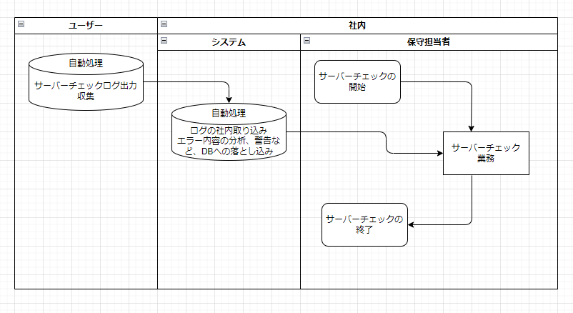
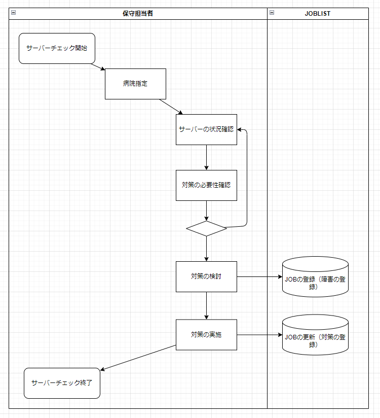

### ■業務フロー図

#### ▼業務フロー詳細
- ユーザー：サーバ―チェックログ出力、収集（自動処理）
- 社内：システム：ログの社内取り込み、エラー内容分析、警告などＤＢへの落としこみ（自動処理）
- 社内：保守担当者：サーバーチェック業務

### ■業務フロー・サーバーチェック業務

#### ▼業務フロー・サーバーチェック業務詳細
- サーバーチェックの開始
- 病院指定
- サーバーの状況確認
- 対策の必用性確認
    - 必要なら、サーバー実機に接続して、状況の確認
- 対策の検討
    - 必要なら、サーバー実機に接続して、状況の確認
    - 原因について、必要なら過去のJOBの確認や、社内での識者への問い合わせなども含む
- 対策の実施
    - サーバーへの設定、設定の見直しなどを含む
        - サーバーの設定変更時には病院への許可が必要
- サーバーチェックの終了

#### ▼業務フロー・サーバーチェック・例外
- サーバーチェックのログが未取得の場合もある。
    - 取得完了まで待つのが正しい行動になる。
- 至急で取得必要な場合は、ｘｘなどを実施することで取得可能
