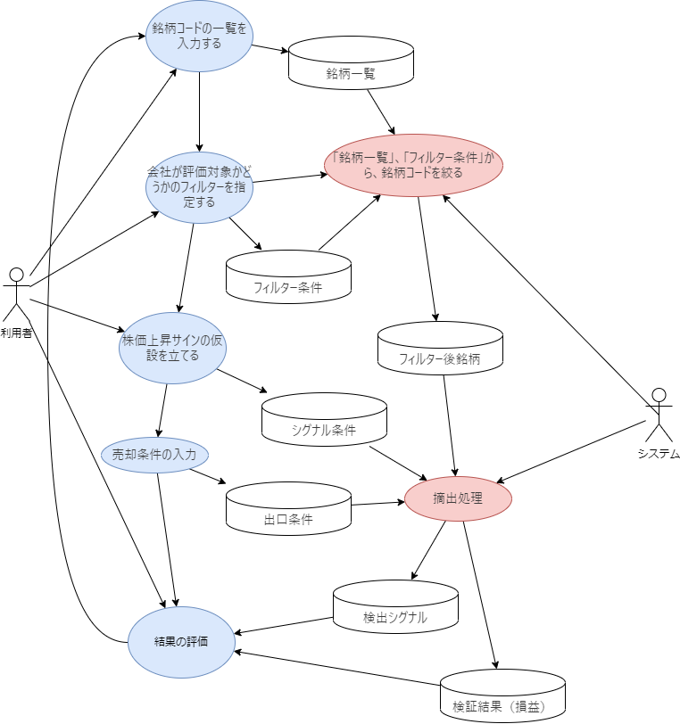

## StockCompass
### 目的
市場の動向を過去のデータをベースに分析するツール


### 動き
取得済みの市場データをベースに１０％上がるものを探すツールです。
過去の株式の市場は入手している前提で仮説を立てて、期待値１０％を見つける
１５日（市場公開日）ベースで、過去のデータの中で、以下のシナリオに沿うものを選別する

## 見出し2 {#section-id}


### 前提
- 株の購入金額は５０万円以下とする
- 出来高はｘｘｘ以上とする
- １００単位でのみ株は購入できる想定
- 株の売買には手数料が０．５％かかる、購入で０．５％、売却で０．５％とする。
- 利益に対しては税金が２０％かかるものとする。
- 外的要因は考慮に入れない

### 目的の明確化

* **何を予測したいのか？**
  * １４日後のトレンド
    * 起点＋起点前３日間＋起点後１０日間
  * 起点後株価の変動率１０％以上の物を探したい。


### データ準備
* **基本データ**
  * 日付、始値、高値、安値、終値、出来高などは持っている状態です。
  * 各企業ごとの現状での情報
    * 企業名、純資産、従業員数、発行株式数など
## 基本的な流れ
###　テーブル
|テーブル名	|最適な日本語名|
|-|-|
|日本語名|テーブル名|
|銘柄一覧|	spth_stock_universe|
|フィルター条件|	spth_filter_conditions|
|フィルター後銘柄|	spth_filtered_stocks|
|シグナル条件|	spht_entry_condition|
|検出シグナル|	spht_entry_hits|
|出口条件|	spht_exit_condition|
|検証結果（損益）|	spht_exit_record|

※spthは今回のドメインでの識別子です。spthのhはHypoの意味合いです。


### 目的
　利用者が、株式市場で株価上昇のサインを探すための処理
### 利用手順
* Step1：利用者：Stock、銘柄コードの一覧を入力する 
  * ポートフォリオがあれば、そこから銘柄コードの一覧を入手する
  * OutPut：「銘柄一覧」
* Step2：利用者；会社が評価対象かどうかのフィルターを指定する
  * 例）資産額、平均出来高、最低購入金額、決算発表前後3日は対象外とする、今日から1年前までが検索対象など
  * OutPut：「フィルター条件」
* Step3：システム：「銘柄一覧」、「フィルター条件」から、銘柄コードを絞る
  * OutPut：「フィルター後銘柄」
* Step4:利用者：対象となる銘柄コードを確認する。
* Step5:利用者：株価上昇サインの仮設を立てる
  * 例）移動平均線を超えてゴールデンクロスになった、過去３日間で平均上昇３％以上など
  * Output:「シグナル条件」
* Step6:利用者：売却条件の入力
  * 例）１０日後に売却する、１０％超える、１０％下がると売却する
  * Output:「出口条件」
* Step7:利用者：仮説、銘柄コード一覧を確認し、摘出の実施
* Step8:システム：摘出処理
  * 指定された、「シグナル条件」、「フィルター後銘柄」から、事象の発生している日付を確認
  * 「出口条件」の条件に従って、処理したとした場合に最終損益、損益発生日を登録する。
  * output:「検証結果（損益）」
* Step9:利用者：「検証結果（損益）」を参照する。必要なら、Step1,Step2,Step3などへ戻って再度評価を行う。

お送りいただいた仕様から、**画面一覧**と**機能一覧**を作成しました。これらを基に、プロジェクトの要件に合わせて調整してください。


---

#### 画面一覧

| 画面名 | 目的 | 主な要素 |
| --- | --- | --- |
| 1. 銘柄入力画面 | 分析したい銘柄コードを登録または選択する | ・銘柄コード入力（手入力、CSVインポート）<br>・既存ポートフォリオからの選択&<br>・登録/次へボタン |
| 2. フィルター条件設定画面 | 銘柄を絞り込むための条件を設定する | ・資産額、平均出来高などの数値入力<br>・日付範囲（決算発表前後、検索対象期間）設定<br>・条件保存/次へボタン |
| 3. フィルター後銘柄確認画面 | フィルターで絞り込まれた銘柄を確認する | ・絞り込み済み銘柄リスト（銘柄コード、銘柄名、フィルター適用日など）&<br>・確認/次へボタン |
| 4. シグナル条件設定画面 | 株価上昇サインの仮説（シグナル条件）を設定する | ・シグナル条件名入力<br>・テクニカル指標（移動平均線など）、上昇率、期間などの設定UI<br>・条件保存/次へボタン |
| 5. 出口条件設定画面 | 売却条件を設定する | ・出口条件名入力<br>・保有期間、目標利益率、損切り率などの設定UI<br>・条件保存/次へボタン |
| 6. 検証実行・履歴画面 | 設定条件で検証実行、過去の検証履歴を確認する | ・選択中の条件表示（フィルター、シグナル、出口）<br>・「検証実行」ボタン<br>・過去の検証実行リスト<br>・各結果へのリンク |
| 7. 検証結果（損益）詳細画面 | 個々の検証結果（損益）を詳細に参照する | ・シグナル発生/売却日時・株価<br>・損益額/率<br>・検証条件概要<br>・グラフ表示（オプション）<br>・前画面に戻るボタン |

#### 機能一覧

| カテゴリ | 機能名 | 詳細 |
| --- | --- | --- |
| 1. 銘柄管理 | 銘柄コード入力/登録 | 手入力、CSVインポートによる銘柄コードの追加 |
|| ポートフォリオ連携 | 既存ポートフォリオからの銘柄コード取得 |
|| 銘柄一覧表示 | 登録済み銘柄コードのリスト表示 |
| 2. フィルター条件管理 | フィルター条件の作成 | 資産額、出来高、購入金額、日付範囲などの条件設定 |
|| フィルター条件の保存/読込 | 設定済み条件の名前付き保存と再利用 |
|| 銘柄フィルタリング | 銘柄一覧とフィルター条件に基づき、銘柄を絞り込み |
| 3. シグナル条件管理 | シグナル条件の作成 | 移動平均線クロス、株価上昇率、期間など、上昇サインの条件設定 |
|| シグナル条件の保存/読込 | 設定済みシグナル条件の名前付き保存と再利用 |
| 4. 出口条件管理 | 出口条件の作成 | 保有期間、目標利益率、損切り率など、売却条件の設定 |
|| 出口条件の保存/読込 | 設定済み出口条件の名前付き保存と再利用 |
| 5. 検証実行 | 検証の実施 | 選択条件に基づき過去データでシミュレーションを実行し、損益を計算 |
|| 検証結果の保存 | 計算された損益データ（検出シグナル、売却情報など）をDBに保存 |
| 6. 結果参照・分析 | 検証結果一覧表示 | 過去の検証実行履歴と結果サマリーの表示 |
|| 検証結果詳細表示 | 個々のシグナル発生と売買シミュレーションの詳細表示（グラフ含む） |
|| 結果の並べ替え/フィルタリング | 損益率、発生日などで結果を並べ替えたり絞り込んだりする |


## 準備
- 評価対象の企業を選定する。
### 対象選定
- 企業の一覧は、個人ポートフォリオを指定することで対象とする。
### 機械的な条件で省けるもの
| カテゴリ   | イベント                       | 解説                                               |
| ---------- | ------------------------------ | -------------------------------------------------- |
| 決算発表日 | 四半期決算                     | 突発的な窓開け・高出来高になりやすいため、省く想定 |
| 出来高平均 | 出来高                         | 株式の売買が容易                                   |
| 株価       | 株価１００以上を想定           | 突発的な動きになる可能性あり                       |
| 資本金     | 想定外の動きの回避１００億以上 |                                                    |

### 省くのが難しいもの

| カテゴリ       | イベント                             | 解説                                                   |                                   |
| -------------- | ------------------------------------ | ------------------------------------------------------ | --------------------------------- |
| 決算関連       | 業績修正                             | 突発的な窓開け・高出来高になりやすい                   | APIで入手が困難                   |
| 決算内容       | 決算表開示                           | 結果次第・読み方次第なので                             | APIで入手が困難、人での判断が必要 |
| 株式アクション | 増資、株式分割、自社株買い、配当発表 | 流動性や需給が急変します                               | APIで入手が困難                   |
| IR/適時開示    | 大口契約、新製品発表、M\&A、事業譲渡 | 市場の期待・失望を大きく動かす要素                     | APIで入手が困難                   |
| 金融制度       | 日銀政策、金利変更、為替介入         | 外需系銘柄などに強い影響                               | APIで入手が困難                   |
| 経済指標       | 雇用統計、GDP、インフレ率            | 特にマクロ影響の強い業種は注意（銀行、輸出、建設など） | APIで入手が困難                   |
| 政治・規制     | 法改正、規制強化、政権交代           | インフラ・IT・金融などに特に影響大                     | APIで入手が困難                   |
| 海外市場       | 米FOMC、米決算、地政学リスク         | 時差の関係で翌営業日にギャップが生じやすい             | APIで入手が困難                   |
| 災害/突発事象  | 地震・感染症・戦争・テロ             | 非連続な売買の原因となるため除外が望ましい             | APIで入手が困難                   |

## 手順
- １：仮説の構築【仮説瀬舘】
  - Case１：平均サイン：３日間で、３％以上上がっている（過去x日間、y%以上の上昇が確認できる）
  - Case２：ゴールデンクロス：過去ｘ日間でゴールデンクロス発生、（a日平均線、b日平均線を基準に）
  - Case３：MACDサイン：過去ｘ日間でMACDでのサイン発生
  - Case４：パーフェクトオーダー：
      - 各サインは逆も想定すること 購入、売却でなく、空売り、購入の流れ。
- ２：仮説にあった株券、日付の調査【処理・仮説評価】
- ３：１０日間後への移動（n日後）
- ４；値動き評価・確認【処理・情報収集】
- ５：評価を分析  【評価画面】
　- 「１：仮説の構築」へ  
  **これの繰り返しで、４の評価を高くする**

### Case 1：平均線サイン

* **内容**：3日間で3％以上の上昇など、**一定期間内に急上昇している銘柄を探すケース**
* 「平均サイン」
「平均サイン：３日間で、３％以上上がっている（過去x日間、y%以上の上昇が確認できる）」という条件でサイン（シグナル）を作成する場合、株価や暗号資産などのトレンド分析や売買サインとして有効です。ただし、メリットや注意点を整理しておくと、精度や運用効率を高められます。

#### ✅ メリット
##### 1. **短期トレンドの把握が容易**
* 3日間・3%以上の上昇は、比較的短期で明確な上昇トレンドを示すため、短期売買において有効なシグナルになりやすいです。
##### 2. **客観的で再現性がある**
* 数値ベースの条件なので、誰が検証しても同じサインを再現できます。アルゴリズムトレードにも転用しやすいです。
##### 3. **バックテストがしやすい**

* 「過去x日間でy%以上」などパラメータを変えて検証することで、戦略の有効性を検証しやすくなります。

#### ⚠️ 注意点・デメリット
##### 1. **「だまし」の可能性**
* 短期的な急騰や一時的なニュースによって一時的に3%以上上昇しても、継続的なトレンドでない可能性があります。
　**対策：**
　- 出来高も条件に入れる（例：出来高が平均の2倍以上）。
　- 直近の安値や移動平均線の位置も見る。
##### 2. **レンジ相場に弱い**
* 横ばい（レンジ）相場の中で一時的に3%上がることがあり、すぐに反落するケースもあります。
　**対策：**
　- RSIやMACDと併用して、過熱感を判断。
　- ブレイクアウト条件も加える。

##### 3. **日数や割合のパラメータ選定が難しい**

* 3日・3%が最適とは限らず、銘柄や市場ごとに変える必要があります。

　**対策：**
　- セクター別、銘柄ボラティリティ別に条件を柔軟に設定。
　- バックテストで最適な「x日」「y%」を探る。
##### 4. **過去の再現性 ≠ 未来の予測性**
* 過去に機能した条件が今後も機能するとは限らない。
　**対策：**
　- 定期的な戦略の見直し。
　- 過剰最適化（オーバーフィッティング）に注意。

#### ✅ おすすめの実装パラメータ例

| 条件名   | 内容                                       |
| -------- | ------------------------------------------ |
| `x日間`  | 3〜5日程度が多い。変動の早い市場なら短く。 |
| `y%`     | 2〜5%。銘柄ボラティリティにより調整。      |
| 補助条件 | 出来高増、移動平均上抜け、RSI30→50、など   |
#### 🧠 まとめ
* メリット：短期トレンドを数値で定義できる、再現性が高い。
* 注意点：だまし、相場状況依存、パラメータ選定に注意。
* 補強策：他指標との併用、出来高や移動平均との合わせ技。


### Case 2：ゴールデンクロスシグナル（Golden Cross Signal）

* **内容**：**短期移動平均線が長期移動平均線を上抜ける現象**
* 「ゴールデンクロス検出」

### Case 3：MACDシグナル（MACD Signal）

* **内容**：MACDがシグナルラインを上抜ける、またはゼロラインを越えるなどの**MACDに基づくサイン**
* 「MACD上昇サイン」
  * 意味：MACDが上向きに転じたこと全般を指す。
  * 範囲：シグナルラインを上抜けた／ゼロラインを超えた、両方含む可能性がある。
  * 曖昧さ：やや広め。MACD自体が上向きでも、シグナルを抜けていないケースも含むかもしれない。

* 通常のMACD：
  * 短期EMA（例：12） - 長期EMA（例：26） = MACD線
  * MACD線とそのシグナル（例：9日EMA）を使ってクロスやゼロライン突破を判断

| 用語           | 内容                                 |
| -------------- | ------------------------------------ |
| EMA(12)        | 直近12日間の価格に基づく指数移動平均 |
| EMA(26)        | 直近26日間の価格に基づく指数移動平均 |
| MACD           | EMA(12) − EMA(26)                    |
| シグナルライン | MACDの9日EMA                         |

#### 変数
12-26-9


| 指標                    | 特徴                                                 |
| ----------------------- | ---------------------------------------------------- |
| **単純移動平均（SMA）** | 過去n日分をすべて「同じ重み」で平均する              |
| **指数移動平均（EMA）** | **直近の価格に大きな重み**、古い価格は徐々に軽くなる |


| 用語               | 内容                                                                                   |
| ------------------ | -------------------------------------------------------------------------------------- |
| **MACD**           | 2本の移動平均線（短期・長期）の差をとって得られる指標（例：12日EMA − 26日EMA）         |
| **シグナルライン** | 上記MACDの**9日間の指数移動平均（EMA）**。MACDの動きをスムーズにして、売買判断に使う線 |


🔢 MACDの基本構成
* 短期EMA（例：12日）
* 長期EMA（例：26日）
* MACD線 ＝ 12日EMA − 26日EMA（トレンドの勢いを表す）
* シグナルライン ＝ MACD線の 9日EMA

 一般的な売買シグナル：
| シグナル                     | 意味               |
| ---------------------------- | ------------------ |
| MACDがシグナルラインを上抜け | 買いサイン（上昇） |
| MACDがシグナルラインを下抜け | 売りサイン（下降） |
> MACDの勢いが強くなり、9日間の平均を上回ったタイミングを「トリガー」として見る。


### Case 4：パーフェクトオーダーシグナル（Perfect Order Signal）

* **内容**：短期・中期・長期の移動平均線が上から順に整列している、**強い上昇トレンドの形**
* **例名**：
  * 「パーフェクトオーダー」
  価格
　↑
　5日移動平均線（最も反応が早い）
　25日移動平均線（中期）
　75日移動平均線（長期）

 | 用語                     | 指標       | 内容                                  | 厳密には…                                            |
 | ------------------------ | ---------- | ------------------------------------- | ---------------------------------------------------- |
 | **パーフェクトオーダー** | 移動平均線 | 5日・25日・75日などが順に上向きに並ぶ | テクニカル分析で非常に多用される 4-20-60で作ってみる |
 | **三役上昇揃い**         | 一目均衡表 | 転換線・基準線・雲・遅行線の関係      | より伝統的かつ複雑な指標                             |

変数：５日線→X日線、２５日→Ｙ日線、７５日線→Ｚ日線　変数で、4-20-60を想定

| 移動平均 | 日数     | 主な意味・役割                                                              |
| -------- | -------- | --------------------------------------------------------------------------- |
| 短期線   | **5日**  | \*\*1週間（営業日ベース）\*\*の平均。トレーダーの超短期的な動き・勢いを表す |
| 中期線   | **25日** | \*\*約1か月（営業日）\*\*の平均。短期と長期の中間的なトレンドを反映         |
| 長期線   | **75日** | \*\*約3か月（1四半期）\*\*の平均。中長期の方向感を示す                      |


---
### 仮説立案ー１
* 三日間で３％の上昇が見られる場合は、継続して１３日間で１０％の上昇は推定できる。


#### ④ 特徴量の作成（Feature Engineering）

* 株価毎に、仮説に対しての実現率を調査する
  * 起点（株購入時点）の変数Ａ日前（３日前など）
  * 起点（株購入時点）と変数Ａ日前での値上がり率：変数Ｂ％（３％など）
  * 起点（株購入時点）の変数Ｃ日後（１０日後など）
  * 起点（株購入時点）と変数Ｃ日後での値上がり率：変数Ｄ％（１０％など）


#### ⑤ ラベリング（必要に応じて）

* **分類問題（上がる/下がる）** → ラベル（1:上昇, 0:下降）を付ける


#### ⑨ 可視化・レポート化

* 変数に応じて、より正確に近いデータを確認できるようにする。

---

### 仮説立案ー２
* ゴールデンクロス発生後の投資額に応じての利益率
* ゴールデンクロスの指標は２０日線、８０日線とする。

#### ④ 特徴量の作成（Feature Engineering）

* 株価毎に、仮説に対しての実現率を調査する
  * 起点はゴールデンクロス発生日とする
  * 起点（株購入時点）の変数A日後（１０日後など）
  * 起点（株購入時点）と変数A日後での値上がり率：変数B％（１０％など）


#### ⑤ ラベリング（必要に応じて）

* **分類問題（上がる/下がる）** → ラベル（1:上昇, 0:下降）を付ける


#### ⑨ 可視化・レポート化

* 変数に応じて、より正確に近いデータを確認できるようにする。

---


### 仮説立案ー３
* MACDでの数値が好転した場合
    * MACDとは株価のトレンド（方向性）や転換点を把握するために使われるテクニカル指標
#### ④ 特徴量の作成（Feature Engineering）

* 株価毎に、仮説に対しての実現率を調査する
  * 起点はゴールデンクロス発生日とする
  * 起点（株購入時点）の変数A日後（１０日後など）
  * 起点（株購入時点）と変数A日後での値上がり率：変数B％（１０％など）

### 仮説立案ー３
* MACDでの数値が好転した場合
    * MACDとは株価のトレンド（方向性）や転換点を把握するために使われるテクニカル指標
#### ④ 特徴量の作成（Feature Engineering）

* 株価毎に、仮説に対しての実現率を調査する
  * 起点はゴールデンクロス発生日とする
  * 起点（株購入時点）の変数A日後（１０日後など）
  * 起点（株購入時点）と変数A日後での値上がり率：変数B％（１０％など）

### 仮説立案ー４
* パーフェクトオーダー

#### ⑤ ラベリング（必要に応じて）

* **分類問題（上がる/下がる）** → ラベル（1:上昇, 0:下降）を付ける


#### ⑨ 可視化・レポート化

* 変数に応じて、より正確に近いデータを確認できるようにする。


---


### ServerFunction
#### StockCode0002

``` SQL
-- 関数: analyze_stock_00003
-- Next.js/Vercel、Server Actionなどのフロントエンドから呼び出されることを想定し、
-- 株価の仮説分析を動的なパラメータと日付範囲で行います。
-- 指定された期間と変動率に基づいて、仮説の前提条件の達成状況、結果条件の達成状況、
-- および各分析ポイントの詳細な情報（株価、日付、仮説ラベルなど）をテーブル形式で返します。
CREATE OR REPLACE FUNCTION analyze_stock_00003(
    p_stock_code TEXT DEFAULT NULL,           -- 分析対象の銘柄コード (NULLの場合は全銘柄)
    p_start_date_range_start DATE DEFAULT NULL, -- 分析の起点となる日付範囲の開始日 (NULLの場合は今日の日付を使用)
    p_start_date_range_end DATE DEFAULT NULL,   -- 分析の起点となる日付範囲の終了日 (NULLの場合は今日の日付を使用)
    p_variable_a_days INT DEFAULT 3,          -- 仮説の前提条件となる日数 (起点からA日前)
    p_variable_b_percent NUMERIC DEFAULT 3.0, -- 仮説の前提条件となる上昇率 (%)
    p_variable_c_days INT DEFAULT 13,         -- 仮説の結果条件となる日数 (起点からC日後)
    p_variable_d_percent NUMERIC DEFAULT 10.0 -- 仮説の結果条件となる上昇率 (%)
)
RETURNS TABLE (
    stock_code TEXT,          -- 銘柄コード
    start_date DATE,          -- 起点の日付
    date_a_days_ago DATE,     -- 起点A日前での日付
    close_a_days_ago NUMERIC, -- 起点A日前での株価
    current_close NUMERIC,    -- 起点での株価
    date_c_days_forward DATE, -- 起点C日後での日付
    close_c_days_forward NUMERIC, -- 起点C日後での株価
    change_percent_a_days NUMERIC, -- 変数A日間の変化率 (%)
    change_percent_c_days NUMERIC, -- 変数C日間の変化率 (%)
    condition_a_b_met INT,    -- 仮説の前提条件 (A日間B%上昇) を達成したかどうか (1:達成, 0:未達成)
    condition_c_d_met INT,    -- 仮説の結果条件 (C日間D%上昇) を達成したかどうか (1:達成, 0:未達成)
    hypothesis_label INT      -- 仮説ラベル (1:成功, 0:失敗)
)
LANGUAGE plpgsql
AS $$
BEGIN
    -- RETURN QUERY の後に続く SELECT ステートメント全体でロジックを構成します。
    -- p_start_date_range_start と p_start_date_range_end のNULLチェックはCOALESCE関数で処理します。
    RETURN QUERY
    WITH relevant_quotes AS (
        SELECT
            sq.code,
            sq.date,
            sq.close,
            -- PARTITION BY code ORDER BY date で銘柄ごとに日付順で処理し、
            -- p_variable_a_days日前の終値とその日付を取得します。
            LAG(sq.close, p_variable_a_days) OVER (PARTITION BY sq.code ORDER BY sq.date) AS close_a_days_ago,
            LAG(sq.date, p_variable_a_days) OVER (PARTITION BY sq.code ORDER BY sq.date) AS date_a_days_ago,
            -- p_variable_c_days日後の終値とその日付を取得します。
            LEAD(sq.close, p_variable_c_days) OVER (PARTITION BY sq.code ORDER BY sq.date) AS close_c_days_forward,
            LEAD(sq.date, p_variable_c_days) OVER (PARTITION BY sq.code ORDER BY sq.date) AS date_c_days_forward
        FROM
            spt_daily_quotes sq
        WHERE
            -- 特定の銘柄コードが指定されていればフィルタリング、そうでなければ全銘柄
            (p_stock_code IS NULL OR sq.code = p_stock_code)
            -- 分析に必要な全期間（起点範囲の開始A日前から終了C日後まで）のデータを取得
            -- COALESCEでNULLの場合にCURRENT_DATEを使用
            AND sq.date BETWEEN
                (COALESCE(p_start_date_range_start, CURRENT_DATE) - p_variable_a_days)
                AND (COALESCE(p_start_date_range_end, CURRENT_DATE) + p_variable_c_days)
    ),
    -- 株価変化率を計算し、起点となる日付範囲のデータのみを対象とします。
    calculated_changes AS (
        SELECT
            rq.code,
            rq.date,
            rq.close AS current_close,
            rq.date_a_days_ago,
            rq.close_a_days_ago,
            rq.date_c_days_forward,
            rq.close_c_days_forward,
            -- 変数A日間の株価変化率を計算します。ゼロ除算を避けるためにNULLIFを使用します。
            CASE
                WHEN rq.close_a_days_ago IS NOT NULL AND rq.close_a_days_ago != 0 THEN ((rq.close - rq.close_a_days_ago) / rq.close_a_days_ago) * 100
                ELSE NULL
            END AS change_percent_a_days,
            -- 変数C日後の株価変化率を計算します。
            CASE
                WHEN rq.close_c_days_forward IS NOT NULL AND rq.close != 0 THEN ((rq.close_c_days_forward - rq.close) / rq.close) * 100
                ELSE NULL
            END AS change_percent_c_days
        FROM
            relevant_quotes rq
        WHERE
            -- 起点となる日付範囲内のデータのみを最終的な分析対象とする
            -- COALESCEでNULLの場合にCURRENT_DATEを使用
            rq.date BETWEEN COALESCE(p_start_date_range_start, CURRENT_DATE) AND COALESCE(p_start_date_range_end, CURRENT_DATE)
            -- 仮説に必要な過去と未来のデータが存在することを保証
            AND rq.close_a_days_ago IS NOT NULL
            AND rq.close_c_days_forward IS NOT NULL
            AND rq.date_a_days_ago IS NOT NULL
            AND rq.date_c_days_forward IS NOT NULL
    ),
    -- 仮説の前提条件と結果条件を評価し、ラベリングします。
    hypothesis_results AS (
        SELECT
            cc.code,
            cc.date AS start_date, -- 起点日時
            cc.current_close,      -- 起点での株価
            cc.date_a_days_ago,    -- 起点A日前での日付
            cc.close_a_days_ago,   -- 起点A日前での株価
            cc.date_c_days_forward, -- 起点C日後での日付
            cc.close_c_days_forward, -- 起点C日後での株価
            cc.change_percent_a_days, -- 変数A日間の変化率
            cc.change_percent_c_days, -- 変数C日間の変化率
            -- 仮説の前提条件: 変数A日間で変数B%以上の上昇が確認されたかどうか (1:達成, 0:未達成)
            CASE
                WHEN (cc.change_percent_a_days IS NOT NULL AND cc.change_percent_a_days >= p_variable_b_percent) THEN 1
                ELSE 0
            END AS condition_a_b_met,
            -- 仮説の結果条件: 変数C日間で変数D%以上の上昇が確認されたかどうか (1:達成, 0:未達成)
            CASE
                WHEN (cc.change_percent_c_days IS NOT NULL AND cc.change_percent_c_days >= p_variable_d_percent) THEN 1
                ELSE 0
            END AS condition_c_d_met, -- ここが変更点
            -- 仮説のラベリング:
            -- 前提条件を満たし、かつ結果条件も満たした場合は 1 (成功)
            -- 前提条件は満たしたが、結果条件を満たさなかった場合は 0 (失敗)
            -- 仮説の前提条件を満たさない場合も 0 (失敗) とする
            CASE
                WHEN (cc.change_percent_a_days IS NOT NULL AND cc.change_percent_a_days >= p_variable_b_percent) THEN
                    CASE
                        WHEN (cc.change_percent_c_days IS NOT NULL AND cc.change_percent_c_days >= p_variable_d_percent) THEN 1 -- 仮説成功
                        ELSE 0 -- 仮説失敗 (前提条件は満たしたが結果条件は満たさず)
                    END
                ELSE 0 -- 仮説失敗 (前提条件を満たさず)
            END AS hypothesis_label
        FROM
            calculated_changes cc
    )
    -- hypothesis_results から各レコードをテーブル形式で返します。
    SELECT
        hr.code,
        hr.start_date,
        hr.date_a_days_ago,
        hr.close_a_days_ago,
        hr.current_close,
        hr.date_c_days_forward,
        hr.close_c_days_forward,
        hr.change_percent_a_days,
        hr.change_percent_c_days,
        hr.condition_a_b_met,
        hr.condition_c_d_met, -- 新しく追加された列
        hr.hypothesis_label
    FROM
        hypothesis_results hr
    ORDER BY
        hr.code, hr.start_date;
END;
$$;

```

```SQL
CREATE FUNCTION dbo.analyze_stock_00003 (
    @p_stock_code NVARCHAR(10) = NULL,           -- 分析対象の銘柄コード (NULLの場合は全銘柄)
    @p_start_date_range_start DATE = NULL,        -- 分析の起点となる日付範囲の開始日 (NULLの場合は今日の日付を使用)
    @p_start_date_range_end DATE = NULL,          -- 分析の起点となる日付範囲の終了日 (NULLの場合は今日の日付を使用)
    @p_variable_a_days INT = 3,                   -- 仮説の前提条件となる日数 (起点からA日前)
    @p_variable_b_percent DECIMAL(5, 2) = 3.0,    -- 仮説の前提条件となる上昇率 (%)
    @p_variable_c_days INT = 13,                  -- 仮説の結果条件となる日数 (起点からC日後)
    @p_variable_d_percent DECIMAL(5, 2) = 10.0    -- 仮説の結果条件となる上昇率 (%)
)
RETURNS @result TABLE (
    stock_code NVARCHAR(10),          -- 銘柄コード
    start_date DATE,                  -- 起点の日付
    date_a_days_ago DATE,             -- 起点A日前での日付
    close_a_days_ago DECIMAL(18, 2),  -- 起点A日前での株価
    current_close DECIMAL(18, 2),    -- 起点での株価
    date_c_days_forward DATE,        -- 起点C日後での日付
    close_c_days_forward DECIMAL(18, 2), -- 起点C日後での株価
    change_percent_a_days DECIMAL(5, 2), -- 変数A日間の変化率 (%)
    change_percent_c_days DECIMAL(5, 2), -- 変数C日間の変化率 (%)
    condition_a_b_met INT,            -- 仮説の前提条件 (A日間B%上昇) を達成したかどうか (1:達成, 0:未達成)
    condition_c_d_met INT,            -- 仮説の結果条件 (C日間D%上昇) を達成したかどうか (1:達成, 0:未達成)
    hypothesis_label INT              -- 仮説ラベル (1:成功, 0:失敗)
)
AS
BEGIN
    -- 仮説の前提条件と結果条件を評価し、テーブルを返します
    WITH relevant_quotes AS (
        SELECT
            sq.code,
            sq.date,
            sq.[close],
            -- LAG と LEAD を使って日付A日前とC日後のデータを取得
            LAG(sq.[close], @p_variable_a_days) OVER (PARTITION BY sq.code ORDER BY sq.date) AS close_a_days_ago,
            LAG(sq.date, @p_variable_a_days) OVER (PARTITION BY sq.code ORDER BY sq.date) AS date_a_days_ago,
            LEAD(sq.[close], @p_variable_c_days) OVER (PARTITION BY sq.code ORDER BY sq.date) AS close_c_days_forward,
            LEAD(sq.date, @p_variable_c_days) OVER (PARTITION BY sq.code ORDER BY sq.date) AS date_c_days_forward
        FROM
            spt_daily_quotes sq
        WHERE
            -- 特定の銘柄コードが指定されていればフィルタリング、そうでなければ全銘柄
            (@p_stock_code IS NULL OR sq.code = @p_stock_code)
            -- 分析に必要な全期間（起点範囲の開始A日前から終了C日後まで）のデータを取得
            AND sq.date BETWEEN
                (COALESCE(@p_start_date_range_start, GETDATE()) - @p_variable_a_days)
                AND (COALESCE(@p_start_date_range_end, GETDATE()) + @p_variable_c_days)
    ),
    -- 株価変化率を計算
    calculated_changes AS (
        SELECT
            rq.code,
            rq.date,
            rq.[close] AS current_close,
            rq.date_a_days_ago,
            rq.close_a_days_ago,
            rq.date_c_days_forward,
            rq.close_c_days_forward,
            -- 変数A日間の株価変化率
            CASE
                WHEN rq.close_a_days_ago IS NOT NULL AND rq.close_a_days_ago != 0 THEN ((rq.[close] - rq.close_a_days_ago) / rq.close_a_days_ago) * 100
                ELSE NULL
            END AS change_percent_a_days,
            -- 変数C日後の株価変化率
            CASE
                WHEN rq.close_c_days_forward IS NOT NULL AND rq.[close] != 0 THEN ((rq.close_c_days_forward - rq.[close]) / rq.[close]) * 100
                ELSE NULL
            END AS change_percent_c_days
        FROM
            relevant_quotes rq
        WHERE
            -- 起点となる日付範囲内のデータ
            rq.date BETWEEN COALESCE(@p_start_date_range_start, GETDATE()) AND COALESCE(@p_start_date_range_end, GETDATE())
            AND rq.close_a_days_ago IS NOT NULL
            AND rq.close_c_days_forward IS NOT NULL
            AND rq.date_a_days_ago IS NOT NULL
            AND rq.date_c_days_forward IS NOT NULL
    ),
    -- 仮説の前提条件と結果条件を評価
    hypothesis_results AS (
        SELECT
            cc.code,
            cc.date AS start_date,
            cc.current_close,
            cc.date_a_days_ago,
            cc.close_a_days_ago,
            cc.date_c_days_forward,
            cc.close_c_days_forward,
            cc.change_percent_a_days,
            cc.change_percent_c_days,
            -- 仮説の前提条件を評価
            CASE
                WHEN (cc.change_percent_a_days IS NOT NULL AND cc.change_percent_a_days >= @p_variable_b_percent) THEN 1
                ELSE 0
            END AS condition_a_b_met,
            -- 仮説の結果条件を評価
            CASE
                WHEN (cc.change_percent_c_days IS NOT NULL AND cc.change_percent_c_days >= @p_variable_d_percent) THEN 1
                ELSE 0
            END AS condition_c_d_met,
            -- 仮説のラベリング
            CASE
                WHEN (cc.change_percent_a_days IS NOT NULL AND cc.change_percent_a_days >= @p_variable_b_percent) THEN
                    CASE
                        WHEN (cc.change_percent_c_days IS NOT NULL AND cc.change_percent_c_days >= @p_variable_d_percent) THEN 1 -- 成功
                        ELSE 0 -- 失敗
                    END
                ELSE 0 -- 失敗
            END AS hypothesis_label
        FROM
            calculated_changes cc
    )
    -- hypothesis_results からデータを返す
    INSERT INTO @result
    SELECT
        hr.code,
        hr.start_date,
        hr.date_a_days_ago,
        hr.close_a_days_ago,
        hr.current_close,
        hr.date_c_days_forward,
        hr.close_c_days_forward,
        hr.change_percent_a_days,
        hr.change_percent_c_days,
        hr.condition_a_b_met,
        hr.condition_c_d_met,
        hr.hypothesis_label
    FROM
        hypothesis_results hr
    ORDER BY
        hr.code, hr.start_date;

    RETURN;
END;

--sample
SELECT *
FROM dbo.analyze_stock_00003(
    '2667',           -- 銘柄コード (NULLの場合は全銘柄)
    '2024-01-01',   -- 分析の起点となる日付範囲の開始日
    '2025-01-31',   -- 分析の起点となる日付範囲の終了日
    3,              -- 仮説の前提条件となる日数
    3.0,            -- 仮説の前提条件となる上昇率 (%)
    13,             -- 仮説の結果条件となる日数
    10.0            -- 仮説の結果条件となる上昇率 (%)
);
```

はい、承知いたしました。StockCompassをMVPベースで作成する上で必要な画面と機能について、添付の仕様書（`readme.md` と `readme_StockCompass.md`）を参照し、提案させていただきます。

MVPの目的は「最小限の機能で最大の価値を提供する」ことなので、核となる「シミュレーション機能」に焦点を当て、その周辺に必要な画面と機能を絞り込みます。

---

### StockCompass MVP 画面・機能提案

#### MVPのコア機能（仕様書に基づき再確認）

* **目的**: ユーザーが株式投資において「もしあの時買っていたら、売っていたら」という疑問を解消し、具体的な根拠に基づいた自信ある売買判断を下せる環境を提供すること。
* **中核**: 過去の株価データに基づいた「買い・売りシグナル」の提供と、そのシグナルが過去の相場でどれほどの成果を上げたかを具体的に示す「シミュレーション機能」。
* **前提の仮説**:
    * **Case 1: 平均サイン**：「3日間で3%以上の上昇が見られる場合は、継続して13日間で10%の上昇は推定できる。」（またはこれに準ずるルールベースの仮説）
    * **取引の前提**: 株の購入金額上限、出来高、100単位での購入、手数料、税金などを考慮。

---

#### MVPで実装すべき「画面」と「機能」の提案

MVPの範囲として、ユーザーが以下の主要なステップを実行できることを目指します。

1.  **銘柄の選定（フィルター）**
2.  **売買条件（シグナル・出口）の設定**
3.  **シミュレーション実行**
4.  **結果の確認**

これを実現するための画面と機能は以下の通りです。

---

**【MVP 画面一覧】**

仕様書にある「画面一覧」をベースに、MVPとして必要なものを厳選し、ユーザーのフローに沿って再構成しました。

1.  **ログイン画面 `[1]` / サインアップ画面 `[2]`**
    * **目的**: アプリケーションへのアクセス。
    * **理由**: 必須機能。ユーザー認証とセッション管理の基盤。
    * **主要要素**: ユーザー認証フォーム。

2.  **メイン画面（またはダッシュボード） `[4]`**
    * **目的**: アプリケーションの入り口。各機能へのナビゲーションハブ。
    * **理由**: ユーザーがログイン後最初に訪れる場所。主要機能への導線を提供。
    * **主要要素**: 各機能へのリンクボタン（例: ポートフォリオ、シミュレーション設定など）。

3.  **ポートフォリオ一覧画面 `[6]`**
    * **目的**: ユーザーが作成したポートフォリオの管理と選択。
    * **理由**: シミュレーション対象銘柄の選定に「ポートフォリオがあれば、そこから銘柄コードの一覧を入手する」という記述があるため、MVP段階でポートフォリオを通じた銘柄選定は重要。
    * **主要要素**: ポートフォリオのリスト、新規作成、編集、削除機能。

4.  **ポートフォリオ画面（詳細） `[7]`**
    * **目的**: 特定のポートフォリオ内の銘柄管理。
    * **理由**: ポートフォリオ内の銘柄の追加・削除、個々の銘柄の保有情報管理（もしMVPで「保有数」「購入価格」を考慮するなら）。
    * **主要要素**: 銘柄の追加/削除、銘柄リスト表示。

5.  **シグナル・出口条件設定画面（統合または簡易版）**
    * **目的**: シミュレーションに用いる買い・売り条件を設定。
    * **理由**: 仕様の `Step5`「株価上昇サインの仮設を立てる」と `Step6`「売却条件の入力」に該当。MVPでは、まずは「仮説立案ー１：三日間で３％の上昇が見られる場合は、継続して１３日間で１０％の上昇は推定できる」の条件設定に特化。
    * **主要要素**:
        * シミュレーション期間 (開始日, 終了日)
        * 購入・売却単位、手数料
        * **仮説1のパラメータ設定**: `p_variable_a_days`, `p_variable_b_percent`, `p_variable_c_days`, `p_variable_d_percent` の入力フォーム。
        * 「シミュレーション実行」ボタン。
    * **補足**: `[8] 監視条件指定画面` と `[9] ポートフォリオ条件指定画面` の機能は、MVPではこのシミュレーション設定画面に統合するか、最低限のフィルタリング機能（例: 購入金額50万円以下、出来高XXX以上）としてこの画面に含めるか、事前データ準備で対応すると良いでしょう。

6.  **シミュレーション結果画面 `[12]` (または `[7]` 内のタブ)**
    * **目的**: 実行したシミュレーションの結果（損益、取引履歴など）を確認。
    * **理由**: 仕様の `Step8`「摘出処理」と `Step9`「「検証結果(損益)」を参照する」に該当。MVPの最も重要なアウトプット。
    * **主要要素**:
        * 総損益額、損益率。
        * シミュレーション結果グラフ（オプション、最初は簡易的でも可）。
        * 個別の売買取引履歴リスト。
        * 検証条件のサマリー表示。

7.  **株価チャート画面 `[10]`**
    * **目的**: 個別銘柄の株価チャート表示。
    * **理由**: シミュレーション結果の視覚的確認や、銘柄分析の補助として必須。
    * **主要要素**: 日足チャート、移動平均線表示、拡大縮小、期間選択。

---

**【MVP 機能一覧】**

MVPとして優先的に実装すべき機能は、上記の画面でユーザーが実行する主要な操作です。

1.  **ユーザー認証・管理**
    * ユーザー登録 (サインアップ)
    * ログイン/ログアウト
    * ユーザー情報の基本編集 (パスワード変更など)

2.  **ポートフォリオ管理**
    * ポートフォリオの作成、編集（タイトル、説明）、削除
    * ポートフォリオ一覧表示とDndによる並び替え
    * ポートフォリオへの銘柄追加、削除

3.  **銘柄データ管理**
    * **YahooFinanceAPIからの日次株価データ取得**（`spt_daily_quotes` への蓄積）
        * これはバックエンド処理として定期的に実行されるか、`[14] APIデータ確認画面` の簡易版として手動実行を想定。MVPでは、まずはデータが存在すること前提で進めるのが効率的。
    * `spt_stocks`, `spt_company_stock_details` への銘柄基本情報の登録。

4.  **シミュレーションエンジン（中核）**
    * **「摘出処理」ロジックの実装**:
        * ユーザーが指定した銘柄（ポートフォリオから選択）、期間、**MVPのコア仮説（例: `analyze_stock_00003` 関数のような3日間3%上昇、13日後10%上昇）**、および取引前提（手数料、税金、単位）に基づき、過去データで仮想売買を実行。
        * 総損益、損益率、取引履歴の計算。
        * 結果のデータベースへの保存（`spt_simulations`, `spt_simulation_trades`）。
    * **条件フィルタリング**:
        * 「購入金額は50万円以下」、「出来高はXXX以上」などの、指定された「前提」をシミュレーションロジックに組み込む。

5.  **結果表示**
    * シミュレーション結果（総損益、損益率、取引履歴）の表示。
    * 銘柄別チャート表示。

---

**【MVPから除外を検討する機能（フェーズ2以降）】**

* **高度なフィルター条件設定**（複雑な日付条件、決算発表前後除外など）: 初期は基本的なフィルターに絞る。
* **複数のシグナル条件**（ゴールデンクロス、MACD、パーフェクトオーダーなど）： MVPではまず1つの代表的な仮説に絞る。
* **シグナル通知機能** `[5]`： シミュレーション結果の確認を優先し、通知は後回し。
* **高度なグラフ表示**： 初期は基本的な折れ線グラフで十分。
* **参照履歴一覧画面** `[15]`： MVPでは必須ではない。
* **ユーザー一覧画面** `[16]`： 管理者機能はMVPでは後回し。
* **データマスキング・加工要件**： まずは基本的なデータ表示から。
* **認証トークンの取得**： YahooFinanceAPIのデータ取得がバックエンドで行われるなら、直接ユーザーには見えないためMVPでは簡略化。
* **メール通知**： アプリ内通知を優先。

---

このMVPのスコープは、ユーザーがアプリケーションの最も重要な価値（過去データに基づくシミュレーションによる投資判断の根拠提供）を体験できる状態を目指しています。これにより、早期に市場投入し、ユーザーからのフィードバックを得ながら、次の開発フェーズへと進むことができます。

いかがでしょうか。この提案はMVPの方向性として適切でしょうか？

## 将来的にしたいこと
### ⑥ モデルの選択と学習

* **ルールベース検証**：最初の仮説をスクリプトで検証
* **機械学習を使うなら：**

  * ランダムフォレスト、XGBoost、LightGBM（初心者にも扱いやすい）
  * 時系列モデル：ARIMA、Prophet、LSTM（時系列性を活かすなら）

---

### ⑦ バックテスト（過去データで検証）

* 検証期間を「トレーニング」「検証」「テスト」に分ける（例: 60%/20%/20%）
* **指標例**：

  * 正解率、F1スコア、平均絶対誤差（MAE）、損益曲線（戦略の収益性）

---

### ⑧ 評価・改善

* 仮説が有効かどうかを判断
* 改善アイデア：

  * 特徴量を変える
  * 仮説を組み合わせる
  * モデルをチューニングする

---


---

## 💡補足

* 株価は**ノイズが多く再現性が低い**領域なので、**仮説検証型**は現実的かつ堅実なアプローチです。
* 初期は「ルールベース＋バックテスト」で全体像を掴み、精度向上を目指すなら機械学習に発展させるのがおすすめです。

---

## ご希望があれば：

* 仮説例のコード（Python）
* バックテスト用スクリプトのテンプレート
* 機械学習モデルの具体的な構成

などもお手伝いできます。どこから始めたいか教えてください。