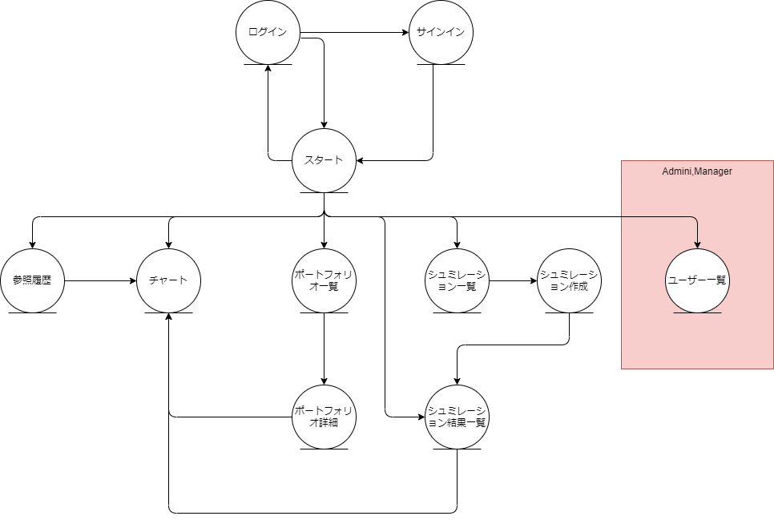

[Top](./README.md)

# 画面設計（UI Layout）
## 2.1. 画面一覧

| No. | 画面名                     | htmlファイル名         | 概要・目的                           | 主な機能・補足   | 
| --- | -------------------------- | ---------------------- | ------------------------------------ | ---------------------------------------------------- | 
| 1   | ログイン画面               |                        | ユーザーがシステムにログインする画面 | メール・パスワード入力、ログイン処理、エラー表示     | 
| 2   | サインイン画面             |                        | 新規ユーザー登録画面                 | 名前、メール、パスワード入力、認証メール送信         | 
| 3   | ユーザー設定画面           | profile_edit           | ユーザーの情報や通知設定を編集       | 名前・パスワード変更、通知設定ON/OFF                 | 
| 4   | メイン画面                 |                        | ユーザーがログイン後最初に見る画面   | 案内メッセージ、通知一覧への導線                     | 
| 5   | 通知確認画面               | notifications           | 通知の一覧を表示                     | 通知一覧、既読・未読管理、詳細表示                   | 
| 6   | ポートフォリオ一覧         | portfolio_list         | 作成済みポートフォリオの一覧表示     | 新規作成、削除、各ポートフォリオへのリンク           | 
| 7   | ポートフォリオ画面         | portfolio_detail       | 個別のポートフォリオ管理画面         | 監視株の追加・削除、シミュレーション買・売の設定     | 
| 8   | 監視条件指定画面           | condition              | 売買の推奨条件を設定する画面         | ゴールデンクロスなどの条件、価格や期間の指定         | 
| 9   | ポートフォリオ条件指定画面 | portfolio_conditions   | 売買時の制約やフィルタ条件を指定     | 購入金額上限、手数料、出来高フィルタなど             | 
| 10  | チャート | stock_chart | 株のチャート、状態の確認| 様々なテクニカル指標も表示可能 | 
| 11 | シミュレーション設定・結果画面 | simulation | 指定したルールで過去の株価データに基づきシミュレーションを実行し、結果を表示 | 銘柄選択、期間指定、売買条件設定、取引単位指定、損益計算結果表示、取引履歴表示、チャート表示以下に保存しています。|
| 12 | シミュレーション設定・結果画面 | simulation | 指定したルールで過去の株価データに基づきシミュレーションを実行し、結果を表示 | 銘柄選択、期間指定、売買条件設定、取引単位指定、損益計算結果表示、取引履歴表示、チャート表示以下に保存しています。|
|13	|APIデータ確認画面	|api_data_viewer|	YahooFinanceAPIから取得した株価データ（未加工）を一覧で確認し、データベースへの登録を指示する画面。	銘柄コード・期間入力、API呼び出し結果のJSON表示、テーブル形式でのデータ表示、データベース登録ボタン。|
|14	|参照履歴一覧画面	|StocksViewHistory|過去の参照履歴から、参照している株価コード、株価名称の一覧、および、取得済みデータの情報も表示する（取得済みデータは株価について、〇月〇日から〇月〇日までなど）、また対象の株のチャート画面への遷移もできるものとする|
|15	|ユーザー一覧	|UserList|SuperUser、Manager用の画面、利用者に管理者の権限、デバッカーの権限を与えることができる。|


## 2.2. 画面遷移図（UI Flow Diagram）



## 2.3. 各画面の詳細設計(UI Deital)

### ユーザー一覧
Superユーザーは、アプリケーションのユーザーを管理する権限を持つと想定し、ユーザー情報の閲覧、状態（有効/無効）の変更、役割の管理などができるような画面構成を提案します。


#### 画面ID
`UserList`

#### ワイヤーフレーム（またはモック）

```
+-------------------------------------------------+
| StockProfit10                                   |
| Header (共通ヘッダー) - Superユーザーメニュー   |
+-------------------------------------------------+
| ユーザー管理 > ユーザー一覧                |
|-------------------------------------------------|
| [検索フィルター]                                |
|   [ユーザー名入力] [メールアドレス入力] [役割選択ドロップダウン] [ステータス選択] [検索ボタン]
|                                                 |
| **ユーザーリスト** |
| +---------------------------------------------+ |
| | ユーザーID (UUID先頭8桁) | ユーザー名 | メールアドレス | Mem | DEB |     | ステータス | 登録日時   | 最終ログイン | 操作       |
| |------------------------|------------|----------------|----------|------------|------------|--------------|------------|
| | 1234abcd               | 山田 太郎  | yamada@example.com | Member   | 有効       | 2024-01-01 | 2025-06-14   | [編集] |
| | 5678efgh               | 鈴木 花子  | suzuki@example.com | Debugger | 有効       | 2024-02-15 | 2025-06-13   | [編集] |
| | 9012ijkl               | 田中 聡    | tanaka@example.com | Manager  | 有効       | 2024-03-20 | 2025-06-12   | [編集] |
| | ...                    | ...        | ...            | ...      | ...        | ...        | ...          | ...        |
| +---------------------------------------------+ |
| [ページネーション] (例: < 1 2 3 >)            |
+-------------------------------------------------+
| Footer (共通フッター)                           |
+-------------------------------------------------+
```

#### 入力項目・表示項目

* **入力項目**:
    * **ユーザー名**: テキスト入力フィールド。部分一致検索を可能にする。
    * **メールアドレス**: テキスト入力フィールド。部分一致検索を可能にする。
    * **役割選択**: ドロップダウンリスト。`roles` テーブルから取得した役割 (`Manager`, `Debugger`, `Member` など) を選択。複数選択も可能。
    * **ステータス選択**: ドロップダウンリスト。`有効`, `無効` などのステータスを選択。
    * **検索ボタン**: 入力されたフィルター条件でユーザーリストを絞り込む。

* **表示項目**:
    * **ユーザーリスト（テーブル形式）**:
        * **ユーザーID**: `spt_user.id` の先頭数桁（例: UUIDの先頭8桁）を表示。詳細画面へのリンクとなる。
        * **ユーザー名**: `spt_user.name`。
        * **メールアドレス**: `spt_user.email`。
        * **役割**: `user_roles` テーブルを介して`roles`テーブルから取得した役割名。複数ある場合はカンマ区切りなどで表示。
        * **ステータス**: ユーザーの有効/無効状態（例: Supabase Authの`confirmed_at`やカスタムフィールドによる）。
        * **登録日時**: `spt_user` または `auth.users` の作成日時。
        * **最終ログイン**: `auth.users` の `last_sign_in_at`。
        * **操作**: ユーザー詳細/編集画面へ遷移するためのボタンまたはリンク。

#### バリデーション仕様

* **検索フィルター**: 特に必須入力のバリデーションは不要。未指定なら全てを表示。
* **日付範囲**: もし登録日時や最終ログイン日時で期間検索を追加する場合は、開始日が終了日より過去または同日であること。未来の日付は指定不可。

#### アクション（ボタン・リンク）

* **「編集」ボタン/リンク**:
    * 押下時にはポップアップで、資格を複数選択できるようにする（Manager、Debugger、Memberなど）

#### エラーメッセージ仕様

* **データ取得エラー**:
    * ポップアップホバーでの表示。
    * 「ユーザーリストの取得中にエラーが発生しました。時間をおいて再度お試しください。」
* **検索結果なし**:
    * 「該当するユーザーはいません。」というメッセージを表示。

#### 状態遷移（例：読み込み中／エラー表示）

* **初期状態**: フィルター項目は空欄またはデフォルト値で表示。ユーザーリストは全ユーザーまたはページングの最初のページが表示されている。
* **検索実行中**: 検索ボタンが無効化され、リスト表示領域にローディングスピナーが表示される。
* **検索結果表示**: 検索条件に合致するユーザーがリストに表示される。
* **検索結果なし**: 「該当するユーザーはいません。」というメッセージが表示される。
* **エラー発生時**: ポップアップホバーでエラーメッセージが表示される。

#### 補足事項

* **権限管理**: この画面自体がSuperユーザーのみアクセス可能であることを前提とし、Next.jsのミドルウェアやサーバーサイドの認証チェックでアクセス制限をかける必要があります。
* **ユーザー状態の変更**: 詳細/編集画面で、ユーザーの有効/無効の切り替えや役割の付与/剥奪といった操作ができるようにします。これらの操作はServer Actionsを介してSupabaseの`auth.users`テーブルや`user_roles`テーブルを更新することになります。
* **データ取得**: `spt_user`, `roles`, `user_roles`, `auth.users` テーブルをJOINしてデータを取得するPostgreSQL関数（RPC）をSupabaseに作成し、それをNext.jsのServer Actionから呼び出すと効率的です。
    * `auth.users`テーブルはSupabaseの認証機能で管理されるため、直接参照するには特別な権限（Service Role Keyなど）が必要になる場合があります。RPC関数を使用することで、安全にアクセスできます。


### 画面詳細：StocksViewHistory

#### ワイヤーフレーム（またはモック）

```
+-------------------------------------------------+
| StockProfit10                                   |
| Header (共通ヘッダー)                           |
+-------------------------------------------------+
| 参照履歴一覧                                    |
|-------------------------------------------------|
| [検索フィルター]                                |
|   [期間選択] [検索ボタン]
|                                                 |
| **参照履歴リスト** |
| +---------------------------------------------+ |
| | 銘柄コード | 銘柄名     | 最終参照日時 | データ取得期間 | チャート |
| |------------|------------|--------------|----------------|----------|
| | 7203.T     | トヨタ自動車 | 2025-06-14   | 2020-01-01~2025-06-14 | [表示]   |
| | 9984.T     | ソフトバンクG| 2025-06-13   | 2022-03-01~2025-06-13 | [表示]   |
| | 6758.T     | ソニーグループ| 2025-06-12   | 2021-05-01~2025-06-12 | [表示]   |
| | ...        | ...        | ...          | ...            | ...      |
| +---------------------------------------------+ |
| [ページネーション] (例: < 1 2 3 >)            |
+-------------------------------------------------+
| Footer (共通フッター)                           |
+-------------------------------------------------+
```

#### 入力項目・表示項目

* **入力項目**:
    * **銘柄コード**: テキスト入力フィールド。部分一致検索を可能にする。
    * **銘柄名**: テキスト入力フィールド。部分一致検索を可能にする。
    * **期間選択**: カレンダーピッカーなどで参照日時を絞り込むための開始日と終了日を選択。
    * **検索ボタン**: 入力されたフィルター条件で履歴を絞り込む。
* **表示項目**:
    * **参照履歴リスト（テーブル形式）**:
        * **銘柄コード**: 参照された株価コード。
        * **銘柄名**: 参照された株価の名称。
        * **最終参照日時**: その銘柄が最後に参照された日時 (`spt_stock_view_history.viewed_at` の最新値)。
        * **データ取得期間**: データベースに取得済みの株価データ（`spt_daily_quotes` テーブルに存在するデータ）の最も古い日付から最も新しい日付まで。例: 「2023-01-01～2024-12-31」。データがない場合は「データなし」などと表示。
        * **チャート**: 対象の株のチャート画面へ遷移するためのボタンまたはリンク。

### バリデーション仕様
* **期間選択**: 開始日と終了日の両方が選択されていること。開始日が終了日より過去または同日であること。未来の日付は指定不可。
  * 未指定なら、すべてを表示

### アクション（ボタン・リンク）
* **検索ボタン**:
    * 入力されたフィルター条件に基づいて、参照履歴リストを更新する。
    * 検索中はローディングスピナーなどを表示。
* **「チャート表示」ボタン/リンク**:
    * 各行の「チャート」列にあるボタンをクリックすると、その銘柄の株価チャート画面（`stock_chart` 画面）へ遷移する。
    * 遷移時には、対象銘柄のコードをパラメータとして渡す。

```TypeScript
'use server'; // これをファイルの先頭に記述することで、Server Actionとして機能します

import { createClient } from '@supabase/supabase-js'; // Supabaseクライアントのインポート

// Supabaseクライアントの初期化
// Server Actionはサーバーサイドで実行されるため、環境変数を直接安全に利用できます。
// ただし、Next.jsのServer Actionでは、通常NEXT_PUBLIC_プレフィックスなしの環境変数も利用可能ですが、
// ここではフロントエンドと共有するためにNEXT_PUBLIC_を使用します。
// 実際のデプロイ時には、Vercelのプロジェクト設定でこれらの環境変数を設定してください。
const supabaseUrl = process.env.NEXT_PUBLIC_SUPABASE_URL!;
const supabaseAnonKey = process.env.NEXT_PUBLIC_SUPABASE_ANON_KEY!;
const supabase = createClient(supabaseUrl, supabaseAnonKey);

// get_period_stock_views 関数が返す行の型定義
// これはSupabaseのRPC関数の戻り値の型と一致させる必要があります
interface PeriodStockView {
  stock_code: string;
  stock_name: string;
  stock_market: string | null; // NULL許容の型に合わせる
  stock_industry: string | null; // NULL許容の型に合わせる
  period_view_count: number; // BIGINTはTypeScriptではnumberで扱われることが多い
  latest_viewed_at_in_period: string; // TIMESTAMP WITH TIME ZONE は通常stringで扱われる
}

interface GetPeriodStockViewsParams {
  startDate?: string | null; // YYYY-MM-DD
  endDate?: string | null;   // YYYY-MM-DD
  stockCode?: string | null;
  stockName?: string | null;
}

/**
 * 指定された期間とフィルター条件に基づいて、株価参照履歴の集計データを取得するServer Action。
 * この関数はSupabaseのPostgreSQL関数 'get_period_stock_views' を呼び出します。
 *
 * @param params フィルター条件を含むオブジェクト
 * @returns 集計された株価参照履歴の配列、またはエラーオブジェクト
 */
export async function getPeriodStockViewsAction(
  params: GetPeriodStockViewsParams
): Promise<PeriodStockView[] | { error: string }> {
  try {
    // SupabaseのRPC (Remote Procedure Call) メソッドを使って
    // PostgreSQL関数 'get_period_stock_views' を呼び出します。
    // 引数がundefined/nullの場合は、PostgreSQL関数のDEFAULT NULL設定が適用されます。
    const { data, error } = await supabase.rpc('get_period_stock_views', {
      start_date_param: params.startDate,
      end_date_param: params.endDate,
      stock_code_param: params.stockCode,
      stock_name_param: params.stockName,
    });

    // エラーハンドリング
    if (error) {
      console.error("Supabase RPC 呼び出しエラー (get_period_stock_views):", error.message);
      return { error: "参照履歴データの取得に失敗しました。" };
    }

    // 取得したデータを返す
    return data as PeriodStockView[]; // 型アサーション
  } catch (err: unknown) {
    console.error("Server Action 'getPeriodStockViewsAction' で予期せぬエラー:", err);
    let errorMessage = "データの取得中にサーバーエラーが発生しました。";
    if (err instanceof Error) {
      errorMessage = `データの取得中にサーバーエラーが発生しました: ${err.message}`;
    } else if (typeof err === "string") {
      errorMessage = `データの取得中にサーバーエラーが発生しました: ${err}`;
    }
    return { error: errorMessage };
  }
}
```
#### エラーメッセージ仕様

* **データ取得エラー**:
    * ポップアップホバーでの表示
    * 「参照履歴の取得中にエラーが発生しました。時間をおいて再度お試しください。」

#### 状態遷移（例：読み込み中／エラー表示）

* **初期状態**: 参照履歴リストは最新の履歴（またはページングの最初のページ）が表示されている。
* **検索実行中**: 検索ボタンが無効化され、リスト表示領域にローディングスピナーが表示される。
* **検索結果表示**: 検索条件に合致する履歴がリストに表示される。
* **検索結果なし**: 「該当する履歴はありません」というメッセージが表示される。
* **エラー発生時**: ポップアップホバーでの表示
