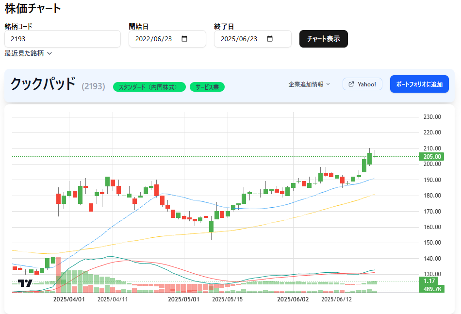

[Top](../README.md)

# displayChartの動き

## 画面



---

# displayChartの動き

## 概要 (Overview)
* この機能の目的や役割を簡潔に説明します。
    * 例: ユーザーが指定した銘柄の株価チャートを表示する。最新の株価データを効率的に取得・更新し、正確な情報を提供する。

## 主要技術スタック
* `use client` と `use server` の説明は、このセクションに配置すると良いでしょう。
    * **クライアントサイド (`use client`)**: 画面描画、ユーザー操作の処理、サーバーAPIの呼び出しなどを担当。
    * **サーバーサイド (`use server`)**: データベースとの連携、外部API（Yahoo Financeなど）からのデータ取得、データ加工、ビジネスロジックの実行などを担当。

## 処理フロー (Process Flow)
* ここに「処理詳細」の内容を整理して記述します。
    * **基本的なデータの流れ**:
        1. **チャート表示リクエスト**: ユーザーが銘柄コードと期間を指定してチャート表示をリクエストする。
        2. **DB情報確認**: 指定された期間のデータがDBに存在するか、最新であるかを確認する。
        3. **API呼び出し（必要に応じて）**: DBのデータが不足している場合、外部API (Yahoo Finance) から不足分のデータを取得する。
        4. **データ登録**: 取得した新しいデータをDBに登録する。
        5. **データ読み取り**: チャート表示に必要なデータをDBから読み込む。
        6. **表示処理**: 取得したデータに基づいてチャートを描画する。

* **詳細なデータ更新ロジック**: 「現状」と「更新後」の内容をここに具体的に記述します。
    * **企業情報の更新ロジック**:
        * 企業情報の最終更新日時を確認。
        * 24時間以内であれば更新不要。
        * 24時間以上経過していれば、企業情報を再取得・更新。
    * **株価情報の更新ロジック**:
        * 指定期間の開始日とDBに登録されている最新日付を比較。
        * DBにデータが不足している場合、最新日付の翌日から指定期間の終了日までのデータをYahoo Financeから取得。
        * 取得したデータをDBに登録。

## データ構造 (Data Structure)
* チャート表示に関連する主要なデータベーステーブル（例: `spt_stock_prices` や `spt_company_info` など、もしあれば）とそのカラムについて説明します。
* 閲覧履歴`spt_stock_view_history` を更新します。

## 用語 (Terminology)
*  `StockCode`: 銘柄を識別するための一意なコード（例: 2701, AAPLなど）。

## 運用・デプロイに関する事項
* パッケージのインストールやVercelへのデプロイ方法は、一般的な開発・デプロイ手順として、別のドキュメント（例: `DEVELOPMENT.md` や `DEPLOYMENT.md`）に切り出すことも検討できます。このドキュメントでは「この機能がVercel上で動作する」という事実を記述するに留めることも可能です。もしここに残すのであれば、セクション名を明確にします。

## データベース管理 (Database Management)
* テーブルサイズ調査のSQLクエリとSupabase Studioに関する補足は、データベースの運用や管理に関する情報として、独立したセクションにまとめると良いでしょう。これは`displayChart`の動きというよりは、システム全体の運用に関する知識となります。

### その他コメント


## 補足
- use client
  - クライアント側処理
    - 画面の描画や、サーバーの呼び出しなどをする
- use server
  - サーバー側の処理
    - Actionの下にある
    - データベースからのデータの取得や、yへのAPI接続の実施
    - データの差分を確認して、データベースへの登録などを担う

## 処理詳細
### コードに対するデータ読取
- 前提
  - StockCode、期間（開始日、終了日）は受け取る
  - そのまま条件として、DB情報確認を呼び出す
### DBの情報確認→欠陥の有無
- 処理
  - 登録済みデータの中で終了日以前の一番新しいもの確認
- 移動先
  - 終了日と同じなら、取得済みとみなして、「データ読取処理」へ
  - 終了日よりも前（条件が2025･6･1までで、データが5･31）なら、データ欠落有とみなして、API呼び出し処理へ
### APIの呼び出し
- 処理
- データベースのデータと指定された期間の終了日を
### API結果受領
### データの登録
### データの読み取り
### 表示処理


##
### 現状
- 1:企業情報の入手（ｘｘｘ）
- 2:ＹＦから株価の入手
- 3:DBへの登録
### 更新後
- 1:企業情報の確認
  - 対象情報の更新日を確認
  - 24時間以内なら更新対象外
  - 24時間以前なら、企業情報入手
- 2:ＹＦから株価の入手
  - 対象情報の株価がいつまであるかを確認
  - 今回の対象期間開始と登録済みデータの最新日付を確認
  - 対象期間の方が新しければ、データの最新日付の翌日からがデータの取得対象
  - ＹＦからの株価の取得
- 3:DBへの登録


### 3. **パッケージのインストール**

`yahoo-finance2` パッケージが必要です。Vercel でデプロイする前に、以下のコマンドを実行して依存関係をインストールしてください。

```bash
npm install yahoo-finance2
```

### 4. **Vercelへのデプロイ**

1. 上記のコードが完成したら、Next.js プロジェクトを Vercel にデプロイします。Vercel で GitHub リポジトリを連携させ、`next.config.js` をデフォルトのままデプロイするだけです。
2. Vercel では、`pages/api` フォルダ内の API Route を自動的にサーバーレス関数としてデプロイします。

これで、クライアントサイドからティッカーシンボルを入力し、ボタンをクリックすると Yahoo Finance からデータを取得し、画面に表示することができます。Vercel 上でも正常に動作するはずです。


## 補足 テーブルサイズ調査
``` sql
SELECT
  table_schema,
  table_name,
  pg_size_pretty(pg_total_relation_size(quote_ident(table_schema) || '.' || quote_ident(table_name))) AS total_size,
  pg_size_pretty(pg_relation_size(quote_ident(table_schema) || '.' || quote_ident(table_name))) AS table_only_size,
  (SELECT reltuples FROM pg_class WHERE relname = table_name) AS approx_rows
FROM information_schema.tables
WHERE table_schema = 'public'
  AND table_type = 'BASE TABLE'
ORDER BY pg_total_relation_size(quote_ident(table_schema) || '.' || quote_ident(table_name)) DESC;
```
|項目名|	内容|
|-|-|
|table_name|	テーブル名|
|total_size|	インデックスやTOASTデータも含む合計サイズ|
|table_only_size|	テーブル本体のサイズのみ|
|approx_rows|	おおよその行数（精密ではありません）|

✅ 方法2：Supabase Studioでは？
- 現在（2025年時点）Supabase Studio（Web管理画面）ではテーブルサイズの直接表示は非対応です。
- ただし：
  - 各テーブルのレコード件数は見えます
  - ストレージ全体の使用量は「Storage」→「Database Usage」などで確認可能
- 詳細なサイズを確認したい場合は SQLクエリで確認するのが最も確実です。

