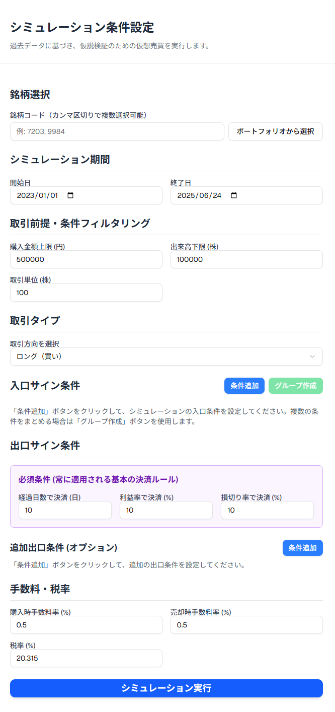

# 02_FormulatePlan: 計画の作成

## 役割の説明
### FormulatePlan（計画を作成する）
* **定義：** 計画の詳細を立てる、対象の銘柄、銘柄に対するフィルタ、Entry条件、Exit条件、TaxFeeなど
* **役割：** StockCompassの核となる「分析条件の定義」を担う役割です。ユーザーが様々な要素（銘柄、フィルター、売買シグナル、コストなど）を組み合わせて、**独自の検証シナリオを構築する**ためのUI/UXとロジックを包括します。`FormulatePlan` は「創造・定義」のフェーズです。
## 画面

## 機能詳細

### 1. 銘柄選択
* **対象選定:**
    * 企業の一覧は、個人のポートフォリオを指定することで対象とすることができます。
* **関連画面:**
    * **1. 銘柄入力画面:**
        * 銘柄コードの直接入力（手入力、CSVインポート）。
        * 既存ポートフォリオからの銘柄選択。

### 2. フィルター条件設定
* **機械的な条件で省けるもの:**
    * **（予定）**決算発表日: 四半期決算前後（突発的な窓開け・高出来高になりやすいため、省く想定）。
    * 出来高平均: 出来高が低い銘柄（株式の売買が容易な銘柄に限定するため）。
    * 株価: 株価100円未満の銘柄（突発的な動きになる可能性あり）。
    * 資本金: 資本金100億円未満の企業（想定外の動きを回避するため）。
* **省くのが難しいもの（考慮はするが、システムでの自動除外が困難なもの）:** 
    * 決算関連: 業績修正（API入手困難）。
    * 決算内容: 決算表開示（API入手困難、人での判断が必要）。
    * 株式アクション: 増資、株式分割、自社株買い、配当発表（API入手困難）。
    * IR/適時開示: 大口契約、新製品発表、M&A、事業譲渡（API入手困難）。
    * 金融制度: 日銀政策、金利変更、為替介入（API入手困難）。
    * 経済指標: 雇用統計、GDP、インフレ率（API入手困難）。
    * 政治・規制: 法改正、規制強化、政権交代（API入手困難）。
    * 海外市場: 米FOMC、米決算、地政学リスク（API入手困難）。
    * 災害/突発事象: 地震・感染症・戦争・テロ（API入手困難）。
* **関連画面:**
    * **2. フィルター条件設定画面:**
        * 資産額、平均出来高などの数値入力。
        * 日付範囲（決算発表前後、検索対象期間）設定。
    * **3. フィルター後銘柄確認画面:**
        * フィルターで絞り込まれた銘柄リストの表示。

### 3. シグナル条件設定（仮説構築）
ユーザーが株価上昇サインの仮説を定義します。各サインは逆（空売り、下降トレンド）も想定します。

* **Case 1：平均線サイン（一定期間内の急上昇銘柄）**
    * **内容**：3日間で3%以上の上昇など、一定期間内に急上昇している銘柄を探すケース。
    * **定義例**：「過去X日間でY%以上の上昇が確認できる」。
    * **メリット**：短期トレンドの把握が容易、客観的で再現性がある、バックテストがしやすい。
    * **注意点・デメリット**：「だまし」の可能性、レンジ相場に弱い、日数や割合のパラメータ選定が難しい、過去の再現性 ≠ 未来の予測性。
    * **おすすめの実装パラメータ例**：`x日間` (3〜5日程度)、`y%` (2〜5%)。補助条件として出来高増、移動平均上抜け、RSI30→50などを考慮。
* **Case 2：ゴールデンクロスシグナル**
    * **内容**：短期移動平均線が長期移動平均線を上抜ける現象を検出。
    * **定義例**：短期20日線が長期80日線を上抜ける。
* **Case 3：MACDシグナル**
    * **内容**：MACDがシグナルラインを上抜ける、またはゼロラインを越えるなどのMACDに基づくサインを検出。
    * **定義例**：MACD線がシグナルラインを上抜け。
    * **MACDの基本構成**：短期EMA（例：12日）、長期EMA（例：26日）、MACD線（短期EMA - 長期EMA）、シグナルライン（MACD線の9日EMA）。
* **Case 4：パーフェクトオーダーシグナル**
    * **内容**：短期・中期・長期の移動平均線が上から順に整列している強い上昇トレンドの形を検出。
    * **定義例**：価格 → 短期移動平均線（例：5日） → 中期移動平均線（例：25日） → 長期移動平均線（例：75日）の順で並んでいる。推奨変数例: 4-20-60日線。

* **関連画面:**
    * **4. シグナル条件設定画面:**
        * シグナル条件名入力。
        * テクニカル指標（移動平均線など）、上昇率、期間などの設定UI。

### 4. 売却条件設定（出口条件）
* **内容:** 株の売却タイミングを決定する条件を設定します。
* **定義例:**
    * 10日後に売却する（時間ベース）。
    * 10%超える（利益確定ライン）。
    * 10%下がると売却する（損切りライン）。
* **関連画面:**
    * **5. 出口条件設定画面:**
        * 出口条件名入力。
        * 保有期間、目標利益率、損切り率などの設定UI。

### 5. 取引前提条件・手数料・税金設定
* **前提:**
    * 株の購入金額は50万円以下とする。（可変）
    * 出来高はXXX以上とする。
    * 100単位でのみ株は購入できる想定。
    * 株の売買には手数料が0.5%かかる（購入で0.25%、売却で0.25%）。
    * 利益に対しては税金が20%かかるものとする。
    * **重要:** 外的要因は考慮に入れない（システムが自動で判断しない前提）。
* **関連するテーブル:**
    * `sptch_trade_parameters`: 最大購入金額、最低出来高、取引単位などを定義。
    * `sptch_fee_taxes`: 買い手数料率、売り手数料率、税率を定義。

### 関連するテーブル（詳細）

* **`sptch_analysis_conditions`**: `FormulatePlan`で定義されるすべての条件の組み合わせを指し示すメインのテーブル。ここで作成されたプランが保存されます。
* **`sptch_stock_selections_header`**: 銘柄選択条件のヘッダー情報。
* **`sptch_stock_selections_stocks`**: 銘柄選択条件の実データ（個々の銘柄コード）。
* **`sptch_simulation_periods`**: シミュレーション期間条件。
* **`sptch_trade_parameters`**: 取引前提条件。
* **`sptch_signals`**: 売買シグナル条件（エントリー・エグジットのセット）。
* **`sptch_entry_signals`**: エントリーシグナル条件の詳細（JSONB形式で具体的なロジックを格納）。
* **`sptch_exit_signals`**: エグジットシグナル条件の詳細（JSONB形式で具体的なロジックを格納）。
* **`sptch_fee_taxes`**: 手数料・税金条件。
