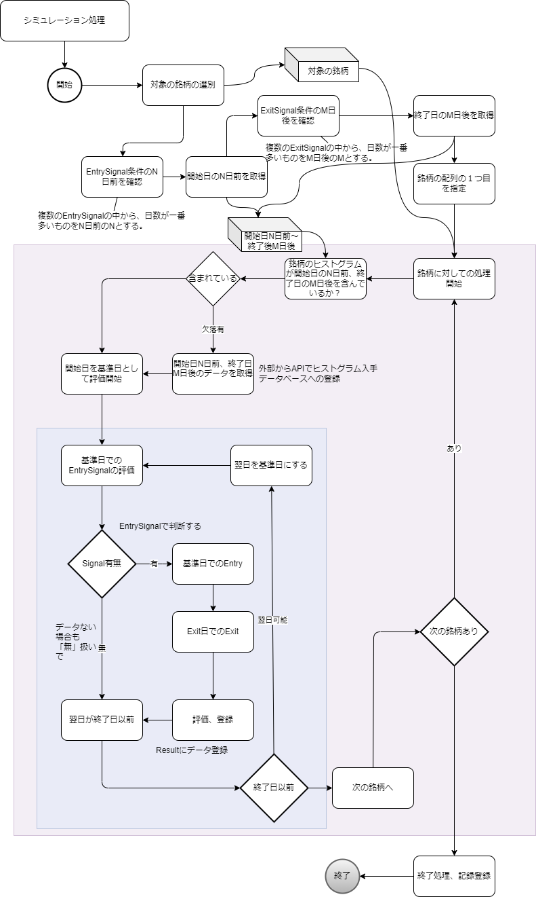

# 03_GenerateResultPlan: 計画に基づく結果生成

## 役割の説明
### GenerateResultPlan（計画に基づいて（収集済みデータから）結果を作成する）
* **定義：** 既存のデータから、結果の作成、作成されたデータをもとに、妥当な計画か判断する。
* **役割：** 既存のプランを用いて評価するための結果を導くことが責務です。ロバストネス検証のフロー図（StockCompass_LH_image03.drawio.png）に示されている複雑な計算ロジックが、この役割の具体的な内容です。

## 機能詳細

### 1. ロバストネス（プラン検証）ワークフロー
設定されたプラン（銘柄、シグナル、出口条件など）に基づき、過去の市場データを使ってシミュレーションを実行します。


* **01.01 シミュレーション期間取得処理:** シミュレーションの対象となる期間を取得します。
* **01.02 市場データ取得処理:** 対象期間の市場データ（日足データなど）を取得します。
* **01.03 株券情報取得処理:** 対象銘柄の基本情報を取得します。
* **01.04 選択銘柄の条件確認:** 選択された銘柄がプランの条件（フィルターなど）を満たすか確認します。
* **02.01 銘柄ごとのループ:** 対象となる各銘柄に対して以下の処理を繰り返します。
* **03.01 銘柄の起点を範囲を抽出（起点からXX日前など）:** シグナル検出の起点となる日付範囲を特定します。
* **03.02 起点日からX日前のデータ確認:** シグナル検出に必要な過去N日間のデータを取得します。
* **03.03 取得したデータの結果の確認:** シグナル条件（例: 移動平均線のクロス、特定期間内の価格変動率）を適用し、結果（シグナル発生の有無）を確認します。
* **03.04 Entryサインの確認:** エントリーシグナルが発生したかどうかを判定します。
* **03.05 次の日付へ（起点日＋1）→03.01へ:** 次の日に処理を進め、シグナル検出を続行します。
* **04.01 In Entry条件クリア:** エントリー条件をクリアした場合の処理を開始します。
* **04.02 データ登録、Entry条件クリアデータの登録:** エントリーが成立した時点のデータと条件クリア情報を記録します。
* **04.03 起点日からY日までのデータ取得:** ポジション保有期間（Y日間）のデータを取得します。
* **05.01 Y日まで一日ずつ実行:** ポジション保有期間中の各日について以下の処理を実行します。
* **05.02 タイムアウトの確認（Exitサインのタイムアウトの確認）:** Exitサインに時間的な制約（例: 〇日経過で強制売却）があるかを確認します。
* **05.04 Exitサインの確認:** エグジットシグナルが発生したかどうかを判定します。
* **05.05 翌日へ →05.01へ:** 次の日に処理を進め、Exitサインの確認を続行します。
* **06.01 Out:** エグジット条件をクリアした場合の処理を開始します。
* **06.02 データ登録、Outに基づいた計算の実行:** エグジットが成立した時点のデータ、最終損益、損益発生日などを記録し、計算を実行します。
* **06.03 次の銘柄の確認（有→02.01へ なし→終了）:** 全ての銘柄の処理が完了したかを確認し、次の銘柄へ進むか、処理を終了します。


### 2. データ準備
この役割を実行するために必要なデータです。
* **基本データ:**
    * 日付、始値、高値、安値、終値、出来高などの日次市場データ。
* **各企業ごとの現状での情報:**
    * 企業名、純資産、従業員数、発行株式数など（フィルター条件適用時に使用）。

### 3. アクティビティ図



# 🏗 ER図イメージ

```
sptch_analysis_conditions
├── sptch_simulation_results_stocks   ← フィルタリング銘柄結果
├── sptch_simulation_results_trade    ← トレードシミュレーション結果
├── sptch_simulation_results_summary  ← プラン全体の総合損益
├── sptch_simulation_results          ← シミュレーション実行状況と全体結果
│   └── sptch_simulation_logs         ← 各処理ステップの実行ログ
```

-----

### ER図要素の説明

  * **`sptch_analysis_conditions`**: 株の分析プランを定義する主要なテーブルです。
  * **`sptch_simulation_results_stocks`**: `sptch_analysis_conditions` に基づく銘柄フィルタリングの結果を格納します。どの銘柄が投資対象になったかを記録します。
  * **`sptch_simulation_results_trade`**: `sptch_analysis_conditions` に基づく個々の銘柄のトレードシミュレーション結果（エントリーからエグジットまで）を格納します。
  * **`sptch_simulation_results_summary`**: `sptch_analysis_conditions` に基づくプラン全体の総合的な損益結果を格納します。
  * **`sptch_simulation_results`**: 特定の分析プラン (`sptch_analysis_conditions`) に対するシミュレーション実行全体の状況（ステータス、開始/完了時刻、概要、エラーなど）を管理するテーブルです。
  * **`sptch_simulation_logs`**: `sptch_simulation_results` の各シミュレーション実行における個別の処理ステップの詳細なログ（開始/完了時刻、処理時間、詳細情報など）を記録します。


## 1 **sptch_simulation_results_stocks**

→ フィルタリング結果（銘柄ごとの判定結果）

| カラム名| データ型| 説明|
| :---------------------- | :---------- | :-------------------------------------------- |
| id  | BIGSERIAL   | 主キー   |
| analysis_condition_id | BIGINT  | 分析プランID（`sptch_analysis_conditions.id`への外部キー） |
| stock_code | VARCHAR(10) | 銘柄コード |
| filter_reason  | TEXT| 除外理由（例: 出来高不足・資本金不足・投資額オーバーなど）|
| score   | INTEGER | 自動判定のスコア（0: 対象外、1: 対象）|
| manual_score   | INTEGER | 手動での調整スコア（0: 対象外、1: 対象）   |
| created_at | TIMESTAMP   | 作成日時  |
| updated_at | TIMESTAMP   | 更新日時  |

## 2 **sptch_simulation_results_trade**

→ 銘柄ごとのトレードシミュレーション結果（Entry→Exit）

| カラム名| データ型  | 説明|
| :---------------------- | :------------ | :-------------------------------------------- |
| id  | BIGSERIAL | 主キー   |
| analysis_condition_id | BIGINT| 分析プランID（`sptch_analysis_conditions.id`への外部キー） |
| stock_code | VARCHAR(10)   | 銘柄コード |
| target_date| DATE  | 評価開始日（この日からシミュレーション開始）|
| target_close_price| NUMERIC(12,2) | 評価開始日の終値（参考用） |
| entry_date | DATE | **エントリー情報** エントリー日 |
| entry_close_price | NUMERIC(12,2) | **エントリー情報**エントリー時の株価（終値）|
| entry_quantity | INTEGER | **エントリー情報**エントリーした株数（100株単位など）|
| entry_amount | NUMERIC(14,2) | **エントリー情報**エントリー時の金額（株価×数量）|
| exit_date | DATE | **エグジット情報**エグジット日 |
| exit_close_price | NUMERIC(12,2) | **エグジット情報**エグジット時の株価（終値）|
| exit_quantity | INTEGER | **エグジット情報**エグジットした株数 |
| exit_amount | NUMERIC(14,2) |**エグジット情報** エグジット時の金額 |
| gross_profit_amount | NUMERIC(14,2) | **損益情報**税引前の利益金額 |
| gross_profit_rate | NUMERIC(7,4) | **税引前の利益率** |
| net_profit_amount | NUMERIC(14,2) | **損益情報**税引後の利益金額 |
| net_profit_rate | NUMERIC(7,4) | **損益情報**税引後の利益率 |
| created_at | TIMESTAMP | 作成日時 |
| updated_at | TIMESTAMP | 更新日時 |

---

## 3 **sptch_simulation_results_summary**

→ プラン全体の総合結果

| カラム名| データ型  | 説明|
| :---------------------- | :-------- | :-------------------------------------------- |
| id  | BIGSERIAL | 主キー   |
| analysis_condition_id | BIGINT| 分析プランID（`sptch_analysis_conditions.id`への外部キー） |
| gross_profit_amount | NUMERIC(14,2) | プラン全体の損益:税引前の総利益金額 |
| gross_profit_rate | NUMERIC(7,4) | プラン全体の損益:税引前の利益率（総合）|
| net_profit_amount | NUMERIC(14,2) | プラン全体の損益:税引後の総利益金額 |
| net_profit_rate | NUMERIC(7,4) | プラン全体の損益:税引後の利益率（総合）|
| created_at | TIMESTAMP | 作成日時 |
| updated_at | TIMESTAMP | 更新日時 |

---
## 4 **sptch_simulation_results**

* シミュレーションの実行状況と、その結果を保存するためのテーブル

* ユーザーが「シミュレーション実施」ボタンを押すと、initiateSimulationAction がこのテーブルに新しい行を1つ作成します。この時点では、status カラムに「pending (処理待ち)」という値が入ります。

* その後、バックグラウンドで動作している別のプログラム（Pythonなど）が、このテーブルを定期的にチェックし、status が「pending」の行を見つけたら、実際の重いシミュレーション計算を開始します。計算が完了したら、結果をこのテーブルの result_json や summary_json といったカラムに書き込み、status を「completed (完了)」に更新する、という流れです。


| カラム名 | 型 | 制約 | 説明 |
| --- | --- | --- | --- |
| id | BIGSERIAL | PRIMARY KEY | シミュレーション結果ID (自動採番される主キー) |
| analysis_condition_id  | BIGINT | NOT NULL, FK | 分析プランID (sptch_analysis_conditionsテーブルのIDを参照) |
| user_id | UUID | NOT NULL, FK | ユーザーID (auth.usersテーブルのIDを参照) |
| status | TEXT | NOT NULL, DEFAULT 'pending' | 処理ステータス (pending (保留中), running (実行中), completed (完了), failed (失敗)) |
| summary_json | JSONB | NULL | 結果の概要 (利益率、勝率など、表示用の主要な値がJSON形式で保存されます) |
| result_json | JSONB | NULL | 詳細なシミュレーション結果 (全取引履歴など、詳細なデータがJSON形式で保存されます) |
| error_message | TEXT | NULL | 処理が失敗した場合のエラーメッセージ |
| started_at | TIMESTAMPTZ | NULL | シミュレーション開始時刻 |
| completed_at | TIMESTAMPTZ | NULL | シミュレーション完了時刻 |
| created_at | TIMESTAMPTZ | NOT NULL, DEFAULT now() | レコードが作成された日時 |
| updated_at | TIMESTAMPTZ | NOT NULL, DEFAULT now() | レコードが最後に更新された日時 |


各カラムの役割

* id: このシミュレーション結果を一意に識別するためのIDです。
* analysis_condition_id : どの分析プランに基づいたシミュレーションかを示すためのIDです。
* user_id: どのユーザーが実行したシミュレーションかを示すためのIDです。
    * status: シミュレーションの現在の状態を示します。
    * pending: 処理待ち
    * running: 処理中
    * completed: 正常に完了
    * failed: エラーで失敗
* summary_json: 結果の概要（総利益率、勝率、最大ドローダウンなど）を保存します。一覧画面などで素早く表示するために使います。
* result_json: 全ての取引履歴など、詳細なシミュレーション結果の生データを保存します。
* error_message: statusがfailedになった場合に、その原因を記録します。
* started_at, completed_at: 処理の開始時刻と完了時刻を記録します。

## 5 **sptch_simuration_result_logs**
| カラム名                 | 型           | 制約                      | 説明                                                              |
|----------------------|-------------|-------------------------|-----------------------------------------------------------------|
| id                   | BIGSERIAL   | PRIMARY KEY             | ログエントリID (自動採番される主キー)                                           |
| simulation_result_id | BIGINT      | NOT NULL, FK            | 関連するシミュレーション結果ID (sptch_simulation_results.id を参照)              |
| step_name            | TEXT        | NOT NULL                | 処理ステップ名 (例: data_acquisition, filtering, signal_detection_7203) |
| status               | TEXT        | NOT NULL                | ステップのステータス (started (開始), completed (完了), failed (失敗))          |
| started_at           | TIMESTAMPTZ | NOT NULL, DEFAULT now() | ステップ開始時刻                                                        |
| completed_at         | TIMESTAMPTZ | NULL                    | ステップ完了時刻                                                        |
| duration_ms          | BIGINT      | NULL                    | 処理時間 (ミリ秒単位)                                                    |
| details              | JSONB       | NULL                    | 追加情報 (処理件数、対象銘柄など、JSON形式で保存されます)                                |
### ログ記録のワークフロー
この新しいテーブルは、バックグラウンドで動作するシミュレーションプログラム（Pythonなど）から利用されることを想定しています。具体的な流れは以下のようになります。

#### 1.シミュレーション開始

バックエンドのプログラムが sptch_simulation_results から status が pending のジョブを取得します。
sptch_simulation_results の status を running に更新し、started_at に現在時刻を記録します。

#### 2.各処理ステップのログを記録

* ドキュメントのフロー図にある各処理（例：「01.02 市場データ取得処理」）の開始直前に、sptch_simulation_logs に新しいレコードを挿入します。

```sql
-- 例: 市場データ取得処理の開始ログ
INSERT INTO sptch_simulation_logs 
  (simulation_result_id, step_name, status) 
VALUES 
  (123, 'market_data_acquisition', 'started'); 
-- 123はsptch_simulation_results.id
```
* 処理が完了した直後に、先ほど挿入したレコードを更新します。

```sql
-- 例: 市場データ取得処理の完了ログ
UPDATE sptch_simulation_logs 
SET 
  status = 'completed', 
  completed_at = now(),
  duration_ms = EXTRACT(EPOCH FROM (now() - started_at)) * 1000, -- 処理時間をミリ秒で計算
  details = '{"rows_fetched": 50000}'::jsonb
WHERE id = (先ほど挿入したログのID);
```
#### 3.シミュレーション完了

* 全ての処理が完了したら、sptch_simulation_results の status を completed に、completed_at に完了時刻を記録します。
#### メリット
この設計により、以下のことが可能になります。

* パフォーマンス分析: duration_ms を集計することで、どの処理ステップが全体のボトルネックになっているかを正確に特定できます。
* 進捗の可視化: フロントエンドでこのログテーブルをポーリング（定期的に確認）すれば、ユーザーに対して「現在、銘柄XXXのシグナルを検出中です...」といった詳細な進捗状況を表示できます。
* エラー追跡: 処理が途中で失敗した場合、どの step_name で status が failed になったかを確認することで、エラーの原因調査が容易になります。
この変更は主にバックエンドの処理に関するもので、ご提示いただいた initiateSimulationAction などのフロントエンド側のコードを直接変更する必要はありません。


# 🚩 補足

* **「stocks」→「フィルタ結果」**（この銘柄は投資対象になるか？）
* **「trade」→「個別のEntry/Exit」**（売買の実行と結果）
* **「summary」→「プランの総合利益」**（最終的な成績）

---

<details>
<summary>DDL</summmary>

```SQL

CREATE TABLE sptch_simulation_results_stocks (
    id BIGSERIAL PRIMARY KEY,
    analysis_condition_id BIGINT NOT NULL REFERENCES sptch_analysis_conditions(id) ON DELETE CASCADE,
    stock_code VARCHAR(10) NOT NULL,
    filter_reason TEXT,
    score INTEGER NOT NULL DEFAULT 0,
    manual_score INTEGER NOT NULL DEFAULT 0,
    created_at TIMESTAMP NOT NULL DEFAULT CURRENT_TIMESTAMP,
    updated_at TIMESTAMP NOT NULL DEFAULT CURRENT_TIMESTAMP
);

-- インデックス（検索高速化）
CREATE INDEX idx_srs_analysis_stock ON sptch_simulation_results_stocks(analysis_condition_id, stock_code);


CREATE TABLE sptch_simulation_results_trade (
    id BIGSERIAL PRIMARY KEY,
    analysis_condition_id  BIGINT NOT NULL REFERENCES sptch_analysis_conditions(id) ON DELETE CASCADE,
    stock_code VARCHAR(10) NOT NULL,
    target_date DATE NOT NULL,
    target_close_price NUMERIC(12,2),
    
    -- Entry
    entry_date DATE,
    entry_close_price NUMERIC(12,2),
    entry_quantity INTEGER,
    entry_amount NUMERIC(14,2),
    
    -- Exit
    exit_date DATE,
    exit_close_price NUMERIC(12,2),
    exit_quantity INTEGER,
    exit_amount NUMERIC(14,2),
    
    -- Profit
    gross_profit_amount NUMERIC(14,2),
    gross_profit_rate NUMERIC(7,4),
    net_profit_amount NUMERIC(14,2),
    net_profit_rate NUMERIC(7,4),

    created_at TIMESTAMP NOT NULL DEFAULT CURRENT_TIMESTAMP,
    updated_at TIMESTAMP NOT NULL DEFAULT CURRENT_TIMESTAMP
);

-- インデックス
CREATE INDEX idx_srt_analysis_stock_date 
    ON sptch_simulation_results_trade(analysis_condition_id, stock_code, target_date);


CREATE TABLE sptch_simulation_results_summary (
    id BIGSERIAL PRIMARY KEY,
    analysis_condition_id  BIGINT NOT NULL UNIQUE REFERENCES sptch_analysis_conditions(id) ON DELETE CASCADE,

    gross_profit_amount NUMERIC(14,2),
    gross_profit_rate NUMERIC(7,4),
    net_profit_amount NUMERIC(14,2),
    net_profit_rate NUMERIC(7,4),

    created_at TIMESTAMP NOT NULL DEFAULT CURRENT_TIMESTAMP,
    updated_at TIMESTAMP NOT NULL DEFAULT CURRENT_TIMESTAMP
);


CREATE TABLE public.sptch_simulation_results (
    id BIGSERIAL PRIMARY KEY,
    analysis_condition_id BIGINT NOT NULL REFERENCES sptch_analysis_conditions(id) ON DELETE CASCADE,
    user_id UUID NOT NULL,
    status TEXT NOT NULL DEFAULT 'pending', -- pending, running, completed, failed
    summary_json JSONB NULL,
    result_json JSONB NULL,
    error_message TEXT NULL,
    started_at TIMESTAMPTZ NULL,
    completed_at TIMESTAMPTZ NULL,
    created_at TIMESTAMPTZ NOT NULL DEFAULT now(),
    updated_at TIMESTAMPTZ NOT NULL DEFAULT now(),
);

-- コメント
COMMENT ON COLUMN public.sptch_simulation_results.id IS 'シミュレーション結果ID';
COMMENT ON COLUMN public.sptch_simulation_results.analysis_condition_id IS '分析プランID (sptch_analysis_conditions.id)';
COMMENT ON COLUMN public.sptch_simulation_results.user_id IS 'ユーザーID';
COMMENT ON COLUMN public.sptch_simulation_results.status IS '処理ステータス (pending, running, completed, failed)';
COMMENT ON COLUMN public.sptch_simulation_results.summary_json IS '結果の概要 (利益率、勝率など表示用の主要な値)';
COMMENT ON COLUMN public.sptch_simulation_results.result_json IS '詳細なシミュレーション結果 (全取引履歴など)';
COMMENT ON COLUMN public.sptch_simulation_results.error_message IS '処理が失敗した場合のエラーメッセージ';
COMMENT ON COLUMN public.sptch_simulation_results.started_at IS 'シミュレーション開始時刻';
COMMENT ON COLUMN public.sptch_simulation_results.completed_at IS 'シミュレーション完了時刻';

-- バックエンドのワーカーが効率的に処理待ちのジョブを見つけられるように、statusカラムにインデックスを作成します。
CREATE INDEX idx_sptch_simulation_results_status ON public.sptch_simulation_results(status);


CREATE TABLE public.sptch_simulation_logs (
    id BIGSERIAL PRIMARY KEY,
    simulation_result_id BIGINT NOT NULL,
    step_name TEXT NOT NULL,
    status TEXT NOT NULL, -- 'started', 'completed', 'failed'
    started_at TIMESTAMPTZ NOT NULL DEFAULT now(),
    completed_at TIMESTAMPTZ,
    duration_ms BIGINT,
    details JSONB,
    CONSTRAINT fk_simulation_result FOREIGN KEY (simulation_result_id) REFERENCES public.sptch_simulation_results(id) ON DELETE CASCADE
);

COMMENT ON TABLE public.sptch_simulation_logs IS 'シミュレーションの各処理ステップの実行ログ';
COMMENT ON COLUMN public.sptch_simulation_logs.id IS 'ログエントリID';
COMMENT ON COLUMN public.sptch_simulation_logs.simulation_result_id IS '関連するシミュレーション結果ID (sptch_simulation_results.id)';
COMMENT ON COLUMN public.sptch_simulation_logs.step_name IS '処理ステップ名 (例: data_acquisition, filtering, signal_detection_7203)';
COMMENT ON COLUMN public.sptch_simulation_logs.status IS 'ステップのステータス (started, completed, failed)';
COMMENT ON COLUMN public.sptch_simulation_logs.started_at IS 'ステップ開始時刻';
COMMENT ON COLUMN public.sptch_simulation_logs.completed_at IS 'ステップ完了時刻';
COMMENT ON COLUMN public.sptch_simulation_logs.duration_ms IS '処理時間 (ミリ秒)';
COMMENT ON COLUMN public.sptch_simulation_logs.details IS '追加情報 (処理件数、対象銘柄など)';

-- 特定のシミュレーション結果に関連するログを高速に検索するためのインデックス
CREATE INDEX idx_sptch_simulation_logs_result_id ON public.sptch_simulation_logs(simulation_result_id);


```

</details>

### 3. ServerFunction (SQL関数例)
PostgreSQLの関数例として、株価の仮説分析を行うための関数です。フロントエンドから呼び出され、動的なパラメータと日付範囲に基づいて、仮説の前提条件の達成状況、結果条件の達成状況、および各分析ポイントの詳細な情報をテーブル形式で返します。


<details>
<summary>StockCode0002関数 (PostgreSQL)</summary>

```sql
-- 関数: analyze_stock_00003
-- Next.js/Vercel、Server Actionなどのフロントエンドから呼び出されることを想定し、
-- 株価の仮説分析を動的なパラメータと日付範囲で行います。
-- 指定された期間と変動率に基づいて、仮説の前提条件の達成状況、結果条件の達成状況、
-- および各分析ポイントの詳細な情報（株価、日付、仮説ラベルなど）をテーブル形式で返します。
CREATE OR REPLACE FUNCTION analyze_stock_00003(
    p_stock_code TEXT DEFAULT NULL, -- 分析対象の銘柄コード (NULLの場合は全銘柄)
    p_start_date_range_start DATE DEFAULT NULL, -- 分析の起点となる日付範囲の開始日 (NULLの場合は今日の日付を使用)
    p_start_date_range_end DATE DEFAULT NULL,   -- 分析の起点となる日付範囲の終了日 (NULLの場合は今日の日付を使用)
    p_variable_a_days INT DEFAULT 3,-- 仮説の前提条件となる日数 (起点からA日前)
    p_variable_b_percent NUMERIC DEFAULT 3.0, -- 仮説の前提条件となる上昇率 (%)
    p_variable_c_days INT DEFAULT 13,    -- 仮説の結果条件となる日数 (起点からC日後)
    p_variable_d_percent NUMERIC DEFAULT 10.0 -- 仮説の結果条件となる上昇率 (%)
)
RETURNS TABLE (
    stock_code TEXT,-- 銘柄コード
    start_date DATE,-- 起点の日付
    date_a_days_ago DATE,-- 起点A日前での日付
    close_a_days_ago NUMERIC, -- 起点A日前での株価
    current_close NUMERIC,    -- 起点での株価
    date_c_days_forward DATE, -- 起点C日後での日付
    close_c_days_forward NUMERIC, -- 起点C日後での株価
    change_percent_a_days NUMERIC, -- 変数A日間の変化率 (%)
    change_percent_c_days NUMERIC, -- 変数C日間の変化率 (%)
    condition_a_b_met INT,    -- 仮説の前提条件 (A日間B%上昇) を達成したかどうか (1:達成, 0:未達成)
    condition_c_d_met INT,    -- 仮説の結果条件 (C日間D%上昇) を達成したかどうか (1:達成, 0:未達成)
    hypothesis_label INT -- 仮説ラベル (1:成功, 0:失敗)
)
LANGUAGE plpgsql
AS $$
BEGIN
    -- RETURN QUERY の後に続く SELECT ステートメント全体でロジックを構成します。
    -- p_start_date_range_start と p_start_date_range_end のNULLチェックはCOALESCE関数で処理します。
    RETURN QUERY
    WITH relevant_quotes AS (
   SELECT
  sq.code,
  sq.date,
  sq.close,
  -- PARTITION BY code ORDER BY date で銘柄ごとに日付順で処理し、
  -- p_variable_a_days日前の終値とその日付を取得します。
  LAG(sq.close, p_variable_a_days) OVER (PARTITION BY sq.code ORDER BY sq.date) AS close_a_days_ago,
  LAG(sq.date, p_variable_a_days) OVER (PARTITION BY sq.code ORDER BY sq.date) AS date_a_days_ago,
  -- p_variable_c_days日後の終値とその日付を取得します。
  LEAD(sq.close, p_variable_c_days) OVER (PARTITION BY sq.code ORDER BY sq.date) AS close_c_days_forward,
  LEAD(sq.date, p_variable_c_days) OVER (PARTITION BY sq.code ORDER BY sq.date) AS date_c_days_forward
   FROM
  spt_daily_quotes sq
   WHERE
  -- 特定の銘柄コードが指定されていればフィルタリング、そうでなければ全銘柄
  (p_stock_code IS NULL OR sq.code = p_stock_code)
  -- 分析に必要な全期間（起点範囲の開始A日前から終了C日後まで）のデータを取得
  -- COALESCEでNULLの場合にCURRENT_DATEを使用
  AND sq.date BETWEEN
 (COALESCE(p_start_date_range_start, CURRENT_DATE) - p_variable_a_days)
 AND (COALESCE(p_start_date_range_end, CURRENT_DATE) + p_variable_c_days)
    ),
    -- 株価変化率を計算し、起点となる日付範囲のデータのみを対象とします。
    calculated_changes AS (
   SELECT
  rq.code,
  rq.date,
  rq.close AS current_close,
  rq.date_a_days_ago,
  rq.close_a_days_ago,
  rq.date_c_days_forward,
  rq.close_c_days_forward,
  -- 変数A日間の株価変化率を計算します。ゼロ除算を避けるためにNULLIFを使用します。
  CASE
 WHEN rq.close_a_days_ago IS NOT NULL AND rq.close_a_days_ago != 0 THEN ((rq.close - rq.close_a_days_ago) / rq.close_a_days_ago) * 100
 ELSE NULL
  END AS change_percent_a_days,
  -- 変数C日後の株価変化率を計算します。
  CASE
 WHEN rq.close_c_days_forward IS NOT NULL AND rq.close != 0 THEN ((rq.close_c_days_forward - rq.close) / rq.close) * 100
 ELSE NULL
  END AS change_percent_c_days
   FROM
  relevant_quotes rq
   WHERE
  -- 起点となる日付範囲内のデータのみを最終的な分析対象とする
  -- COALESCEでNULLの場合にCURRENT_DATEを使用
  rq.date BETWEEN COALESCE(p_start_date_range_start, CURRENT_DATE) AND COALESCE(p_start_date_range_end, CURRENT_DATE)
  -- 仮説に必要な過去と未来のデータが存在することを保証
  AND rq.close_a_days_ago IS NOT NULL
  AND rq.close_c_days_forward IS NOT NULL
  AND rq.date_a_days_ago IS NOT NULL
  AND rq.date_c_days_forward IS NOT NULL
    ),
    -- 仮説の前提条件と結果条件を評価し、ラベリングします。
    hypothesis_results AS (
   SELECT
  cc.code,
  cc.date AS start_date, -- 起点日時
  cc.current_close, -- 起点での株価
  cc.date_a_days_ago,    -- 起点A日前での日付
  cc.close_a_days_ago,   -- 起点A日前での株価
  cc.date_c_days_forward, -- 起点C日後での日付
  cc.close_c_days_forward, -- 起点C日後での株価
  cc.change_percent_a_days, -- 変数A日間の変化率
  cc.change_percent_c_days, -- 変数C日間の変化率
  -- 仮説の前提条件: 変数A日間で変数B%以上の上昇が確認されたかどうか (1:達成, 0:未達成)
  CASE
 WHEN (cc.change_percent_a_days IS NOT NULL AND cc.change_percent_a_days >= p_variable_b_percent) THEN 1
 ELSE 0
  END AS condition_a_b_met,
  -- 仮説の結果条件: 変数C日間で変数D%以上の上昇が確認されたかどうか (1:達成, 0:未達成)
  CASE
 WHEN (cc.change_percent_c_days IS NOT NULL AND cc.change_percent_c_days >= p_variable_d_percent) THEN 1
 ELSE 0
  END AS condition_c_d_met,
  -- 仮説ラベル: 前提条件と結果条件の両方が達成された場合に1 (成功), それ以外は0 (失敗)
  CASE
 WHEN (cc.change_percent_a_days IS NOT NULL AND cc.change_percent_a_days >= p_variable_b_percent AND
  cc.change_percent_c_days IS NOT NULL AND cc.change_percent_c_days >= p_variable_d_percent) THEN 1
 ELSE 0
  END AS hypothesis_label
   FROM
  calculated_changes cc
    )
   SELECT * FROM hypothesis_results;
END;
$$;
```
</details>