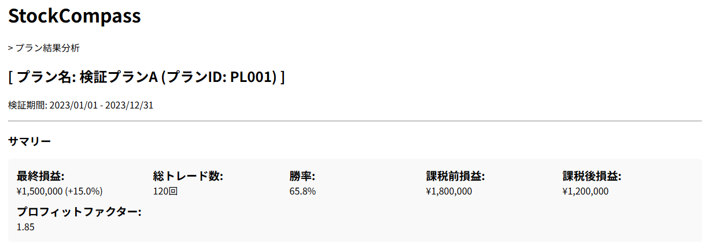
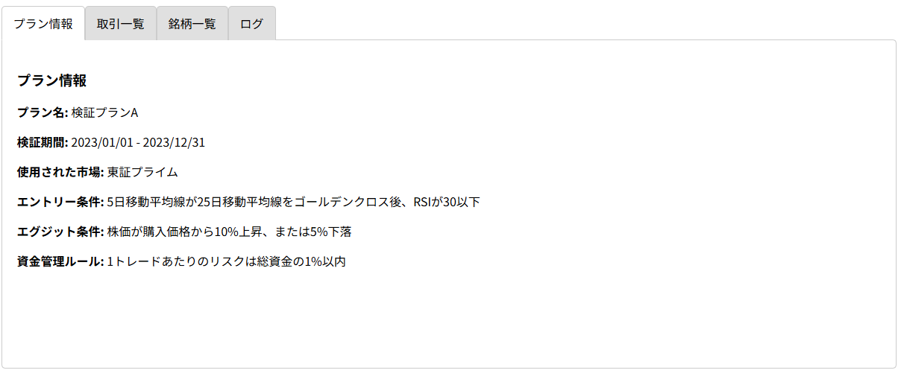
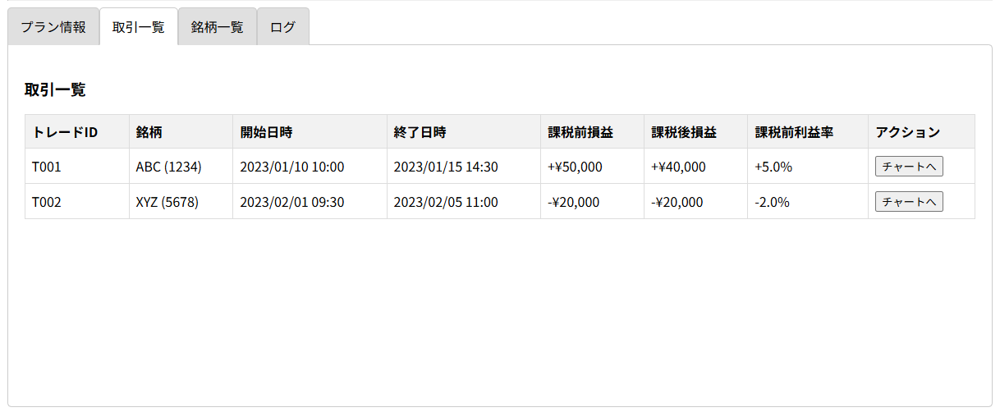
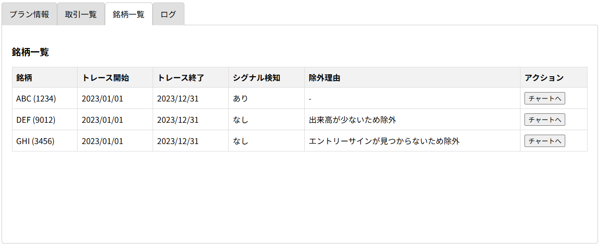
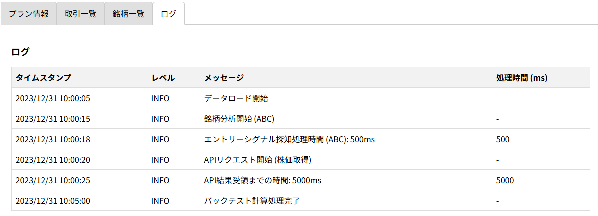

# 04_AnalyzeResults: プラン結果分析

## 役割の説明
### AnalyzeResults（プラン結果分析）
* **定義：** 選ばれたPlanに対応する結果を確認、結果もとに、Planが妥当かどうかを判断する
* **役割：** バックテストで生成された詳細なデータ（損益グラフ、各トレードの詳細履歴、パフォーマンス指標など）をユーザーが視覚的・数値的に把握し、仮説の有効性を判断するための機能が含まれます。

## 機能詳細

### 1. 検証結果の確認ワークフロー
GenerateResultPlanで生成されたシミュレーション結果を確認し、分析します。

* **結果参照**
    * ユーザーは、シミュレーションによって算出された最終損益や損益発生日などの結果を参照します。
    * 必要であれば、プランの見直しなどを実施する。

### 2. 目的の明確化と結果の評価
StockCompassの目的である「市場の動向を過去のデータをベースに分析し、投資するためのシグナルをキャッチするためのＰｌａｎを作成する」の中で、妥当な、プランかどうかを判断するための処理

- プランに基づいた結果が期待した値になっているかの確認・
- 期待通りに動かないときは原因を選別できること。その情報に基づいてプランを再作成する。

### 3. 画面
- 生成された分析レポートを元に、妥当なプランかどうかを判断する役割を担う
- 生成された分析レポートは「」「」に保存される。
- 実際にプランに基づいて、取引を実施したとして、その成果を確認する
  - 合計しての損益の状態、課税前の損益、課税後の損益が確認できる。
- タブを選択することでプランの情報、銘柄一覧、取引一覧、ログが確認できる
  - プランの情報
    - 現状のプランの画面が提示されること　確認画面と同じ内容を想定
  - 銘柄一覧
    - 保存された内容を比較するために、詳細銘柄単位での状況の記載
    - 対象の銘柄が、別の要因（出来高などではじかれた）なども確認できる。
    - 対象の銘柄が、いつトレース開始でいつトレース終了か確認できる。
    - 実際の時系列のチャートへの遷移を持つ
    - プランの株すべてが対象で、それに対してはじかれた理由を提示すること
      - 出来高が少ないや、エントリーサイン見つからないなど
  - 取引一覧
    - 各々の取引したと仮定した実績として銘柄単位で以下のことが確認できる
      - トレード開始日時。株価、株数、金額、
      - トレース終了日時、株価、株数、金額、
        - トレース開始日からトレード終了日での金額の差分を損益とする。
      - プラン通り実施したとしてのトレード終了後の課税前損益、課税後損益、課税前履歴率、課税後利益率
    - 実際の時系列のチャートへの遷移可能
  - ログ画面
    - 各々の処理でどれだけ時間が掛かったか確認できること
    - 銘柄単位での時間
    - 実際にエントリーシグナル探知後の計算処理時間などをログから表示する
    - 特にAPIへのリクエストと結果受領までの時間は確認できる必要あり。

## 画面
### ヘッダー

### サマリ

### トレード

### 銘柄

### ログ

