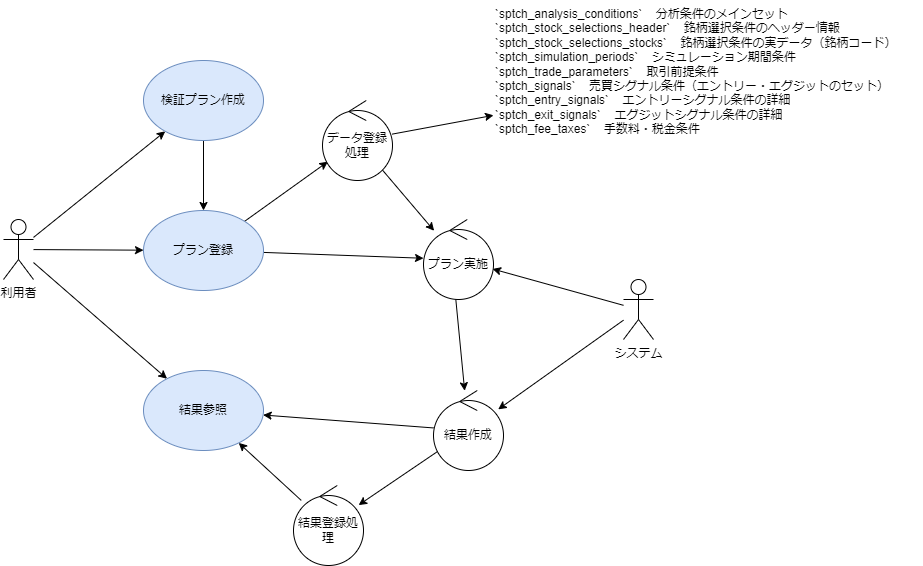

# 04_AnalyzeResults: プラン結果分析

## 役割の説明
### AnalyzeResults（プラン結果分析）
* **定義：** 選ばれたPlanに対応する結果を確認、結果もとに、Planが妥当かどうかを判断する
* **役割：** バックテストで生成された詳細なデータ（損益グラフ、各トレードの詳細履歴、パフォーマンス指標など）をユーザーが視覚的・数値的に把握し、仮説の有効性を判断するための機能が含まれます。

## 機能詳細

### 1. 検証結果の確認ワークフロー
GenerateResultPlanで生成されたシミュレーション結果を確認し、分析します。

* **Step9：利用者：「検証結果（損益）」を参照する。**
    * ユーザーは、シミュレーションによって算出された最終損益や損益発生日などの結果を参照します。
    * 必要であれば、Step1, Step2, Step3などに戻って再度評価を行い、プランを改善します。

### 2. 目的の明確化と結果の評価
StockCompassの目的である「市場の動向を過去のデータをベースに分析する」ための具体的な予測目標と、その達成状況を評価します。

* **何を予測したいのか？**
    * 14日後のトレンド。
    * 起点後株価の変動率10%以上の銘柄を探す。

### 3. 可視化・レポート化
生成された結果データに基づき、より正確に近いデータを確認できるように視覚的なレポートや詳細な数値レポートを提供します。

* **結果の可視化:** 損益推移グラフ、個別の取引履歴チャート表示、シグナル発生箇所のマークなど。
* **パフォーマンス指標:** 総損益、勝率、最大ドローダウン、平均利益率、平均損失率などの主要なバックテスト指標。
* 変数に応じて、より正確に近いデータを確認できるようにします。

### 関連する画面
* **7. 検証結果（損益）詳細画面:**
    * シグナル発生/売却日時・株価の表示。
    * 損益額/率の表示。
    * 検証条件概要の表示。
    * グラフ表示（オプション）。
    * 前画面に戻るボタン。
    * 
### 実行履歴　プラン選択後
*ヘッダ
  * 作成日時、作成者、名前、メモ
		銘柄
    銘柄（スクリーニング後）
		スクリーニング、期間、SL
* 一覧

|起点日|銘柄| | |PERVIEW| |ENTRY| | | |EXIT| | | |RESULT| |RESULT(F)| |チャート参照|
|:----|:----|:----|:----|:----|:----|:----|:----|:----|:----|:----|:----|:----|:----|:----|:----|:----|:----|:----|
| |銘柄|名前|市場|DATE|CLOSE|DATE|CLOSE|VOLUME|PRICE|DATE|CLOSE|VOLUME|PRICE|PROFIT|P-M|PROFIT|P-M| |
|2025-01-10|1234|xxx商事|ｘｘｘｘ|2025-01-07|1,222|2025-01-10|1,240|200|248,000|2025-01-15|1,300|200|260,000|12000|5%|12000|4%|チャート参照|
|2025-02-08|1235|yyy商事|ｘｘｘｘ|2025-02-06|2,200|2025-02-08|2,300|100|230,000|2025-01-15|2,500|100|250,000|20000|9%|20000|8%|チャート参照|
|2025-02-10|9001|zzz商事|ｘｘｘｘ|2025-02-07|1,001|2025-02-10|1,201|200|240,200|2025-01-15|1,500|200|300,000|59800|-25%|59800|-25%|チャート参照|
|2025-03-10|9002|vvvvv|ｘｘｘｘ|2025-03-07|300|2025-03-10|340|600|204,000|2025-01-15|370|600|222,000|18000|-9%|18000|-9%|チャート参照|