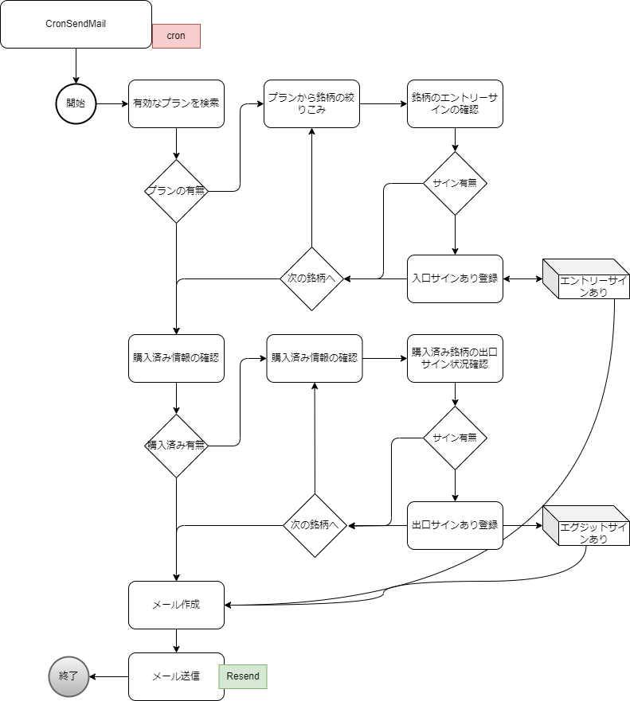
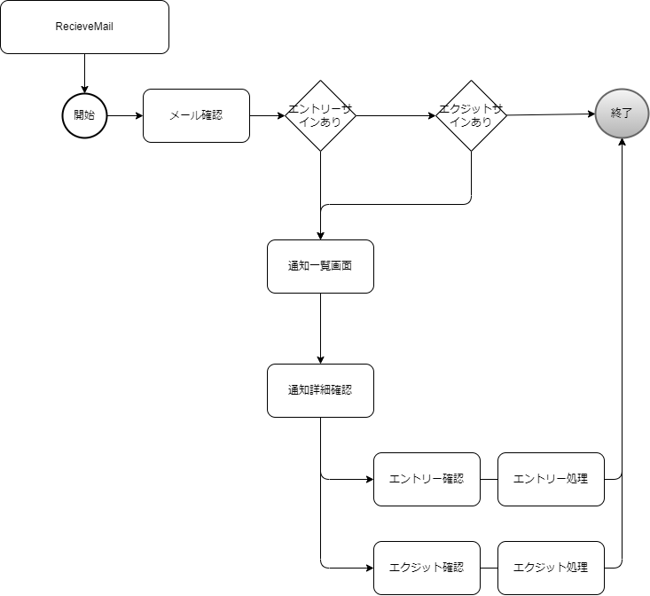

# タスク処理、メール
## 目的
Cronなどで作成されたキックをもとに
分析開始、分析した結果を
スクリーニングされた情報として、メールで利用者に通知

## 前提
あらかじめプランを作成しておく
プランに従って、Entryサインの検索、Exitサインの検索を行った結果をアナウンス
Entryサインから、Web画面に遷移して、そこから、購入情報の入植た可能
購入扱いの情報方は、Exitサイン探知の対象となる。

## 動き
転送するには１日１回を想定
想定時には本日のエントリーサイン取得銘柄
購入済みのエグジットサインの状況

### 事前準備

- palnの作成（既存機能）
  - 対象の銘柄の指定（別テーブル：sptch_analysis_conditions sptch_stock_selections_header sptch_stock_selections_stocks）
  - 銘柄に対するパラメーター指定（上限金額など）（別テーブル：sptch_analysis_conditions sptch_trade_parameters）
  - Entryサインの登録（別テーブル：sptch_analysis_conditions sptch_signals sptch_entry_signals）
  - Exitサインの登録（別テーブル：sptch_analysis_conditions sptch_signals sptch_exit_signals）
  - 税・手数料の登録（別テーブル：sptch_analysis_conditions sptch_fee_taxes）
- プランに対しての定期的に実行するための設定　テーブル名：PlanExecutionSettings:sptce_plan_execution_settings
  - プラン自体は別のテーブルにもつ。あくまでも定期的に実行するための設定
  - 期間（2025/08/01から2025/08/10までなど）
    - 指定された期間での調査を行う。メール送信までの処理を実施
  - 自動でのＥｎｔｒｙ，Ｅｘｉｔの実施フラグ
    - 実施フラグがたっている場合には自動で売買したとしてのシュミレーション実施
    - 購入した、売却したとして記録を残す
    - 記録を残さない場合は、手動での購入の実施、売却の実施を行う、その時の銘柄などは個別で登録する。
  - 送信先メアド確認
- プランに対して自動で作成した場合の株取引の情報 テーブル名：PlanExecutionSimulationResults:sptce_plan_execution_simulation_results
  - 実際に売買したばあは別のテーブルで管理する

- sptce_xxx sptc + c + e (c:cron e:execute)　識別子

### メール送信まで



- Resendの利用
  - １日200件ほど
  - Sendmailは企業での契約が必要なので、利用不可の認識

### メール受信後の処理




### 📧メール文例

---

件名：
【StockProfit10】本日のエントリー・エグジット情報（2025年12月12日 金曜日分）

本文：

---

〇〇様
StockProfit10より本日（2025年12月12日）のスクリーニング結果をお送りします。
以下リンクより詳細をご確認ください。

---

🔔 **本日の通知概要**

* 本日の**エントリーサイン検出銘柄**：あり / なし
* **購入済銘柄**の**エグジットサイン状況**：あり / なし

**通知詳細**
[本日の通知詳細はこちら](https://・・・・・・・・・・・・・・・・)

**通知履歴一覧**
[通知一覧はこちら](https://・・・・・・・・・・・・・・・・)

**バックアップログ**
[ログはこちら](https://・・・・・・・・・・・・・・・・)

**トップページ**
[StockProfit10 トップページ](https://・・・・・・・・・・・・・・・・)

---

**補足**

* 本通知は事前に設定されたプランに基づき、自動的に作成・送信されています。
* 検出されたエントリー銘柄はWeb画面から「デモ購入」が可能です。
* デモ購入された銘柄は、後日エグジットサイン検出後に「デモ売却」可能です。
* 損益状況等は一覧画面よりご確認いただけます。

⚠️ 実際の株式購入・売却はご利用の証券会社にて行ってください。

---

📩 **このメールに心当たりがない場合**
設定画面にて処理対象や送信対象から除外設定できます。
[設定変更はこちら](https://・・・・・・・・・・・・・・・・)

---

StockProfit10
自動通知システム


## テーブルデザイン
- 
### 既存テーブル
  * **`sptch_analysis_conditions`**: 株の分析プランを定義する主要なテーブルです。
    * **`sptch_simulation_results_stocks`**: `sptch_analysis_conditions` に基づく銘柄フィルタリングの結果を格納します。どの銘柄が投資対象になったかを記録します。
    * **`sptch_simulation_results_trade`**: `sptch_analysis_conditions` に基づく個々の銘柄のトレードシミュレーション結果（エントリーからエグジットまで）を格納します。
    * **`sptch_simulation_results_summary`**: `sptch_analysis_conditions` に基づくプラン全体の総合的な損益結果を格納します。
    * **`sptch_simulation_results`**: 特定の分析プラン (`sptch_analysis_conditions`) に対するシミュレーション実行全体の状況（ステータス、開始/完了時刻、概要、エラーなど）を管理するテーブルです。
    * **`sptch_simulation_logs`**: `sptch_simulation_results` の各シミュレーション実行における個別の処理ステップの詳細なログ（開始/完了時刻、処理時間、詳細情報など）を記録します。


### ✅ `sptce_plan_execution_settings`（プラン定期実行設定）

| カラム名                  | データ型            | 説明                                             |
| --------------------- | --------------- | ---------------------------------------------- |
| `id`                  | `int` (PK)      | 主キー                                            |
| `analysis_condition_id` | `int` (FK)      | 対象の分析プラン（`sptch_analysis_conditions.Id`）への外部キー |
| `name`                | `text`       | 名前（報告には記載する、実行タスク名） |
| `start_date`           | `date`          | 実行期間の開始日（この日付から実行、実際には前日の情報からの処理）   |
| `end_date`             | `date`          | 実行期間の終了日 （この日までの実行、あくまでも分析対象の日付なので、実際の処理は先になる可能性あり）  |
| `excute_end_date`             | `date`          | exit-signに従って、最大での日付、既に銘柄所有していないものは評価対象外 |
| `is_auto_enabled`  | `bit`           | 自動エントリー実施フラグ                                   |
| `is_active`            | `bit`           | この設定が有効かどうか（定期バッチが拾う対象か）                       |
| `send_mail_to`          | `nvarchar(255)` | 結果送信先のメールアドレス（カンマ区切りで複数指定可）                    |
| `created_at`           | `datetime`      | 作成日時                                           |
| `updated_at`           | `datetime`      | 更新日時                                           |

> 🔍 **備考**:
>
> * 「送信先メアド確認」は `send_mail_to` で対応
> * 既存プランとの関連性を保つため `analysis_condition_id` を指定


### ✅ `sptce_plan_execution_simulation_results`（定期実行による売買シミュレーション結果）
| カラム名                   | データ型            | 説明                                   |
| ---------------------- | --------------- | ------------------------------------ |
| `id`                   | `int` (PK)      | 主キー                                  |
| `execution_setting_id` | `int` (FK)      | 実行設定への外部キー（PlanExecutionSettings.Id） |
| `stock_code`           | `varchar(12)`   | 銘柄コード                                |
| `entry_sign_date`      | `date`          | Entryシグナルが出た日                        |
| `entry_auto_flg`       | `boolean`       | Entryを自動実行したか                        |
| `entry_date`           | `date`          | Entry実行日（想定）                         |
| `entry_price`          | `decimal(18,2)` | Entry価格                              |
| `entry_quantity`       | `int`           | Entry株数                              |
| `exit_sign_date`       | `date`          | Exitシグナルが出た日                         |
| `exit_auto_flg`        | `boolean`       | Exitを自動実行したか                         |
| `exit_date`            | `date`          | Exit実行日（想定）                          |
| `exit_price`           | `decimal(18,2)` | Exit価格                               |
| `exit_quantity`        | `int`           | Exit株数                               |
| `commission_fee`       | `decimal(18,2)` | 手数料                                  |
| `tax`                  | `decimal(18,2)` | 税金                                   |
| `cost`                 | `decimal(18,2)` | コスト合計（手数料+税）                         |
| `note`                 | `text` | 自由記載                         |
| `created_at`           | `datetime`      | 作成日時                                 |
| `updated_at`           | `datetime`      | 更新日時                                 |


> 🔍 **備考**:
>
> * **実際のトレード結果とは分離**（本テーブルはシミュレーション専用）
> * 1行にentry exit ともに記録
> １つのシュミレーション１行で扱うものとする。
> EntrからExitまでをもつ、各々のサイン発生日、実際の売買した日付をもつ、ExitDateが入っているものは既に処分済みと扱う


---

### 🔗 関連構造（概要図）

```plaintext
sptch_analysis_conditions (プラン本体)
    ↑
    └─ sptce_plan_execution_settings
           ↑
           └─ sptce_plan_execution_simulation_results
```


以下は **Supabase (PostgreSQL)** に対応した `sptce_plan_execution_settings` および `sptce_plan_execution_simulation_results` テーブルのDDL（`CREATE TABLE`）です。

---

### ✅ `sptce_plan_execution_settings` `sptce_plan_execution_simulation_results` テーブル定義

```sql
CREATE TABLE sptce_plan_execution_settings (
    id SERIAL PRIMARY KEY,
    analysis_condition_id INTEGER NOT NULL REFERENCES sptch_analysis_conditions(id) ON DELETE CASCADE,
    name TEXT NOT NULL,
    start_date DATE NOT NULL,
    end_date DATE NOT NULL,
    excute_end_date DATE,
    is_auto_enabled BOOLEAN NOT NULL DEFAULT FALSE,
    is_active BOOLEAN NOT NULL DEFAULT TRUE,
    send_mail_to TEXT,
    created_at TIMESTAMP WITH TIME ZONE DEFAULT NOW(),
    updated_at TIMESTAMP WITH TIME ZONE DEFAULT NOW()
);
CREATE TABLE sptce_plan_execution_simulation_results (
    id SERIAL PRIMARY KEY,
    execution_setting_id INTEGER NOT NULL REFERENCES sptce_plan_execution_settings(id) ON DELETE CASCADE,
    stock_code VARCHAR(12) NOT NULL,
    entry_sign_date DATE,
    entry_auto_flg BOOLEAN DEFAULT FALSE,
    entry_date DATE,
    entry_price DECIMAL(18,2),
    entry_quantity INTEGER,
    exit_sign_date DATE,
    exit_auto_flg BOOLEAN DEFAULT FALSE,
    exit_date DATE,
    exit_price DECIMAL(18,2),
    exit_quantity INTEGER,
    commission_fee DECIMAL(18,2),
    tax DECIMAL(18,2),
    cost DECIMAL(18,2),
    note TEXT,
    created_at TIMESTAMP WITH TIME ZONE DEFAULT NOW(),
    updated_at TIMESTAMP WITH TIME ZONE DEFAULT NOW()
);


ALTER TABLE public.sptce_plan_execution_settings DISABLE ROW LEVEL SECURITY;
ALTER TABLE public.sptce_plan_execution_simulation_results DISABLE ROW LEVEL SECURITY;

-- ALTER DEFAULT PRIVILEGES IN SCHEMA public GRANT ALL PRIVILEGES ON SEQUENCES TO authenticated;
-- ALTER DEFAULT PRIVILEGES IN SCHEMA public GRANT ALL PRIVILEGES ON SEQUENCES TO anon;

-- 既存のすべてのシーケンスに対して権限を付与
GRANT USAGE, SELECT ON ALL SEQUENCES IN SCHEMA public TO anon;
GRANT USAGE, SELECT ON ALL SEQUENCES IN SCHEMA public TO authenticated;

-- 今後 public スキーマで作成されるすべてのシーケンスに対してデフォルトの権限を付与
ALTER DEFAULT PRIVILEGES IN SCHEMA public GRANT USAGE, SELECT ON SEQUENCES TO anon;
ALTER DEFAULT PRIVILEGES IN SCHEMA public GRANT USAGE, SELECT ON SEQUENCES TO authenticated;

-- 現在のユーザー（通常は postgres）が作成する将来のテーブルに対するデフォルト権限を設定
ALTER DEFAULT PRIVILEGES IN SCHEMA public GRANT SELECT, INSERT, UPDATE, DELETE ON TABLES TO authenticated;
-- 将来のシーケンスに対するデフォルト権限も設定
ALTER DEFAULT PRIVILEGES IN SCHEMA public GRANT USAGE ON SEQUENCES TO authenticated;

GRANT USAGE ON SEQUENCE public.sptce_plan_execution_settings_id_seq TO authenticated;
GRANT USAGE ON SEQUENCE public.sptce_plan_execution_simulation_results_id_seq TO authenticated;


```