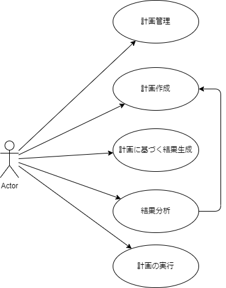
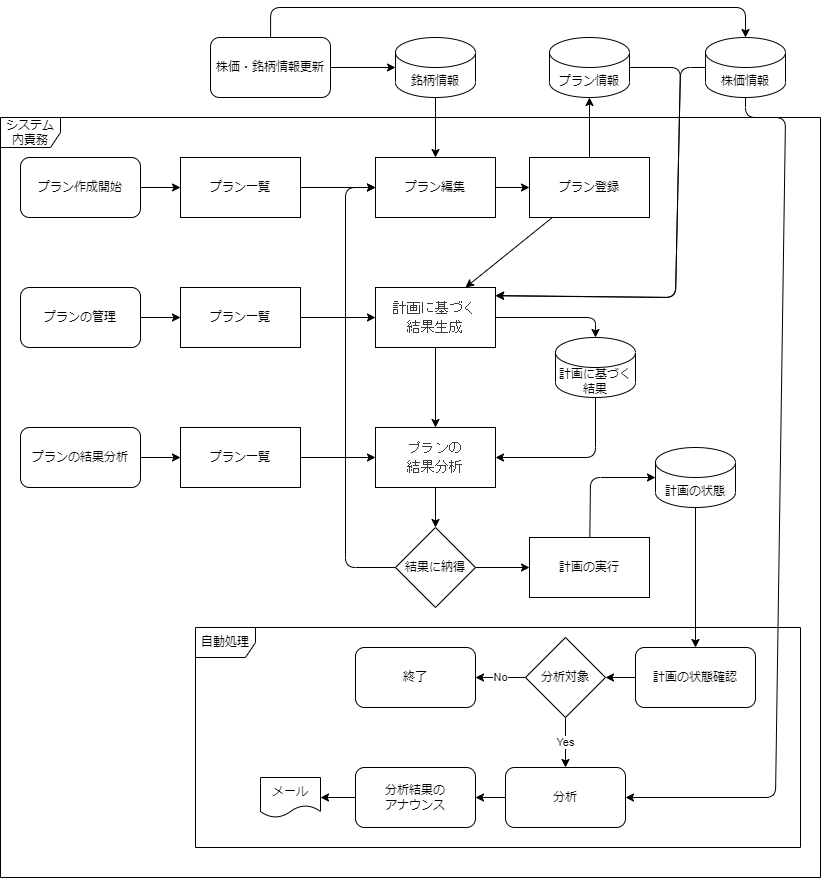

# StockCompass

[Top](../../README.md)


README.md (全体概要)
01_PlanMaintenance.md (計画の管理)
02_FormulatePlan.md (計画の作成)
03_GenerateResultPlan.md (計画に基づく結果生成)
04_AnalyzeResults.md (プラン結果分析)
05_ExecutePlan.md (計画の実行)


## StockCompassの概要

### 目的
市場の動向を過去のデータをベースに分析するツールです。
取得済みの市場データをベースに１０％上がる銘柄を探し、過去の株式市場データを用いて仮説を立て、期待値１０％を見つけることを目指します。

### 動き
15日（市場公開日）ベースで、過去のデータの中で、以下のシナリオに沿うものを選別します。
* [チャート](./DisplayChart.md) - ※このリンクは現状の「チャート表示」に関するものですが、もし`04_AnalyzeResults.md`内でチャート機能が詳細化される場合、リンクを調整することを推奨します。


## ユースケース


## ワークフロー全体



+ ※各データベースの役割はテーブル一覧（概要）参照のこと。


## 用語集
### **基準日Entry日**
* 取引を行うと仮定する日付とする。**Entry**のサイン探知後は**Entry**日になる。
* 前日までの株価に従って、**Entry**する日付
* 前日からN日前までのN日は、**Entry**シグナルに従う
  * 具体的には３日前からの状況が条件時には2025/6/10日(火)基準日とすると5日(木)の終値、6日(金)の終値、9日（月）の終値が対象となる。
    * 7日（土）、８日（日）は省かれる
* **Exit**するかどうかは、Entry日からN日後での終値、翌日での実施とする
* **Exit**条件にはN日後などの条件が付与される。
  * 具体的には10日後の**Exit**が条件の時には、Entryが10日の場合は、11日(火)が1日、13日(金)が3日、20日(金)が8日、24日(火)が10日となる。24日の終値が評価対象の株価となる。
    * 14日21日（土）、15日22日（日）は省かれる

### **開始日**
* Entryシグナルの条件の中で、一番判断に日数を使う条件の日数に従う

### **Exit日、Exit日前日**
* Exitシグナルは強制退出日のルールに従う
* Exitの強制退出日以前にも条件に適合すれば、退出日となる。

```
      2025年 6月
日 月 火 水 木 金 土
 1  2  3  4  5  6  7
 8  9 10 11 12 13 14
15 16 17 18 19 20 21
22 23 24 25 26 27 28
29 30

↓開始日　　　　　　　　　　  
○ ■ ■ 
      □  ←Entry日（基準日:base_date）
        ■ ■ ■ ■ ■ ■ ■ ■ ■ ■ ▲ ←Exit前日（株価はこの日のクローズが対象）
                              ● ←Exit日

基準日6/10、３日前→6/5　１０日後→ 6/24
      2025年 6月
日 月 火 水 木 金 土
 1  2  3  4  5  6  7
                ○
 8  9 10 11 12 13 14
       □
15 16 17 18 19 20 21

22 23 24 25 26 27 28
       ▲ ●
29 30

　　　　　　　　　　　　　　　
```

## 基本的な利用手順

### 目的
利用者が、株式市場で株価上昇のサインを探すための処理です。


## 画面一覧 New

|機能|画面|機能|
|:----|:----|:----|
|01_PlanMaintenance：計画管理|一覧画面|ユーザーが所有する計画の一覧が確認可能|
|01_PlanMaintenance：計画管理|一覧画面|新規で計画作成画面への遷移|
|01_PlanMaintenance：計画管理|一覧画面|結果表示の画面へ遷移|
|01_PlanMaintenance：計画管理|一覧画面|計画に対する結果があるときには、編集画面へ遷移できない|
|01_PlanMaintenance：計画管理|一覧画面|計画に対して結果の有無を持つ|
|01_PlanMaintenance：計画管理|一覧画面|計画に対して、実行の有無を確認できる|
|02_FormulatePlan：計画作成|計画作成|計画を作成する機能を持つ。|
|02_FormulatePlan：計画作成|計画作成|ポートフォリオから銘柄は引用できる。|
|03:GeneratePlanResult:計画に基づく結果生成|進捗確認|慎重の確認ができる|
|04_AnalyzeResults.md (プラン結果分析)|結果分析画面|０３で取得した結果を参照する画面。|
|05_ExecutePlan.md (計画の実行)|実行設定画面| |

## テーブル一覧 (概要)

StockCompassの機能を実現するための主要なテーブル群です。ユーザーの分析条件を柔軟かつ構造的に保存するために設計されています。詳細な定義は[DDL](./90_ddl.sql.md)を参照してください。


|責務(*)|役割|テーブル名|説明|
|:----|:----|:----|:----|
|内|計画情報|**sptch_analysis_conditions**|分析条件のメインセット|
|内|計画情報|**sptch_stock_selections_header**|銘柄選択条件のヘッダー情報|
|内|計画情報|**sptch_stock_selections_stocks**|銘柄選択条件の実データ（銘柄コード）|
|内|計画情報|**sptch_simulation_periods**|シミュレーション期間条件|
|内|計画情報|**sptch_trade_parameters**|取引前提条件|
|内|計画情報|**sptch_signals**|売買シグナル条件（エントリー・エグジットのセット）|
|内|計画情報|**sptch_entry_signals**|エントリーシグナル条件の詳細|
|内|計画情報|**sptch_exit_signals**|エグジットシグナル条件の詳細|
|内|計画情報|**sptch_fee_taxes**|手数料・税金条件|
|内|計画に基づく結果|**sptch_simulation_results_stocks**|フィルタリング銘柄結果|
|内|計画に基づく結果|**sptch_simulation_results_trade** |トレードシミュレーション結果|
|内|計画に基づく結果|**sptch_simulation_results_summary**|プラン全体の総合損益|
|内|計画の状態| | |
|内|計画の状態| | |
|外|銘柄情報|**spt_stocks**|銘柄基本情報|
|外|株価情報|**spt_daily_quotes**|株価情報|

* (*)責務内かどうか、責務外のものは別システムでの作成とする。


## 検討すること
* Vercelのサーバーアクションで頑張る方が、体験的には優位
* Yahoo.APIからの取得もサーバーアクションで頑張るケースでてくるので。
* 


## ハッシュ値の計算方法

```js
import crypto from 'crypto';

/**
 * 汎用的なハッシュ生成関数
 * @param {Array<any>} values - 任意の値の配列
 * @returns {string} - SHA256のハッシュ値（hex文字列）
 */
function generateHash(values) {
  const normalized = values.map(v => {
    if (v === null || v === undefined) {
      return '';
    }
    if (typeof v === 'object') {
      // JSONの場合はキー順にソートして文字列化
      return JSON.stringify(v, Object.keys(v).sort());
    }
    return String(v);
  });

  const joined = normalized.join('|');

  return crypto.createHash('sha256').update(joined).digest('hex');
}

```
