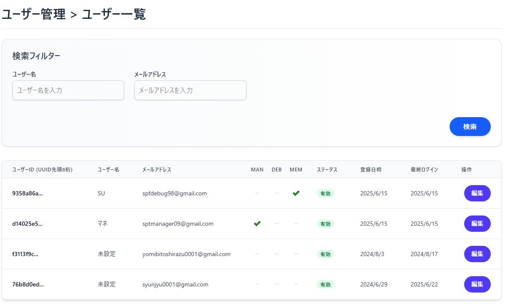
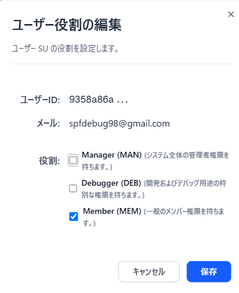

[Top](../README.md)

# UserListの動き

## 画面イメージ

### メイン画面

### モーダル画面

## 概要 (Overview)
* **目的**: デバッカー、マネージャーなどで、システムの質を高めるために必要なので、あらかじめ資格を準備しておく
* **対象ユーザー**: このUserList機能を利用する対象者（例: システム管理者、運用担当者）とする。

## 機能 (Features)
ユーザー管理機能として提供される具体的な機能一覧を記述します。
* **ユーザー一覧表示**: 登録されているユーザーのリストを表示します。
* **ロール/権限管理**: ユーザーに特定の役割（ロール）を付与したり、その権限を管理したりする機能があれば記述します。

## 記録される情報 (Recorded Information)
各ユーザーについて、どのような情報がデータベースに記録されるかを具体的に記述します。
* **ユーザーID (`id`)**: ユーザーを一意に識別するためのID（Supabase認証の`auth.users.id`と連携） 。
* **メールアドレス (`email`)**: ユーザーのメールアドレス（ログインIDとして使用される可能性、`auth.users`と同期） 。
* **表示名 (`name`)**: ユーザーがアプリケーション内で表示される名前 。
* **役割/ロール (`role_id`)**: ユーザーに割り当てられた役割（例: Manager, Memberなど） [cite: 32, 34]。
* **登録日時 (`created_at`)**: ユーザーがシステムに登録された日時（必要であれば） 。
* **更新日時 (`updated_at`)**: ユーザー情報が最後に更新された日時（必要であれば） 。
* （その他、ユーザープロファイルに関連する情報があれば追記）

## データ構造 (Data Structure)
ユーザー情報に関連するデータベーステーブルとそのカラムについて説明します。
* **`spt_user` テーブル**: ユーザーの基本情報を格納するテーブル 。
    * `id` (UUID): 主キー、Supabase認証の`auth.users.id`と連携 。
    * `email` (TEXT): ユーザーのメールアドレス 。
    * `name` (TEXT): ユーザーの表示名 。
    * `created_at` (TIMESTAMPTZ): 作成日時 。
    * `updated_at` (TIMESTAMPTZ): 更新日時 。
* **`roles` テーブル**: システム内で定義される役割（ロール）のマスタテーブル [cite: 32]。
    * `id` (SERIAL): 主キー、自動採番 [cite: 32]。
    * `name` (TEXT): 役割名（例: 'Manager', 'Member'） [cite: 32]。
    * `short_name` (TEXT): 役割の短縮名 [cite: 32]。
    * `description` (TEXT): 役割の説明 [cite: 32]。
    * `created_at` (TIMESTAMPTZ): 作成日時 [cite: 32]。
* **`user_roles` テーブル**: ユーザーと役割の多対多のリレーションを管理する中間テーブル [cite: 34]。
    * `user_id` (UUID): `spt_user.id`を参照 [cite: 34]。
    * `role_id` (INTEGER): `roles.id`を参照 [cite: 34]。
    * `assigned_at` (TIMESTAMPTZ): 役割が割り当てられた日時 [cite: 34]。

## 考慮事項 (Considerations)
ユーザー管理機能に関する技術的または運用上の考慮事項を記載します。
* **認証連携**: Supabase Authenticationとの連携方法、セッション管理など 。
* **セキュリティ**: ユーザーデータの保護、パスワードのハッシュ化、アクセス制御（RLSなど）に関する方針 。
* **データ量とパフォーマンス**: ユーザー数が増加した場合のパフォーマンスへの影響と対策。
* **プライバシー**: 個人情報の取り扱いに関するポリシーや、 GDPR/Pマークなどの規制への対応。
* **ユーザー削除時の影響**: ユーザー削除が他のデータ（例: ポートフォリオ、閲覧履歴など）に与える影響（ON DELETE CASCADEの設定など） 。
* [予定：]**管理者機能**: ユーザーアカウントのロック/アンロック、強制パスワードリセットなどの管理者向け機能の有無。

---

