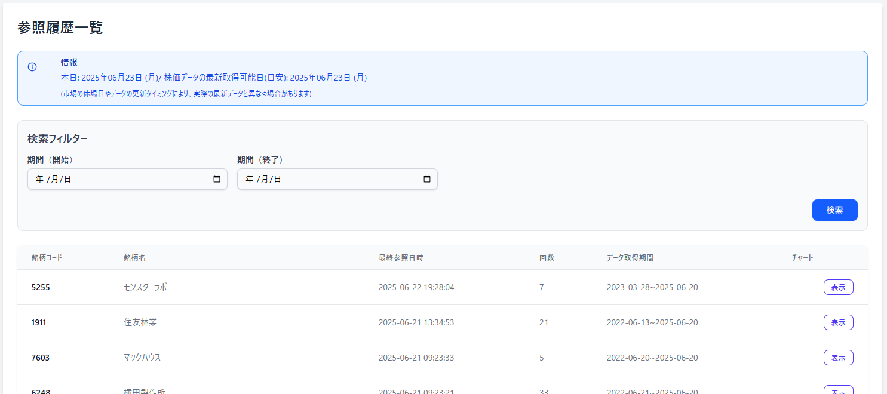

[Top](../README.md)

# ViewHistoryの動き

## **概要 (Overview)**
- 閲覧履歴機能の目的と、それがユーザー体験やアプリケーション全体にどのように貢献するかを説明します。例えば、ユーザーが過去に閲覧した銘柄を素早く見つけられるようにすることなどが挙げられます。
## **利用方法 (Usage)**
* 記録された閲覧履歴データがどのように活用されるか、ユーザー視点での利用シナリオを記載します。
  * 「最近閲覧した銘柄」リストの表示 
  * ユーザーへのレコメンデーション（推奨銘柄）の生成
  * ユーザーの興味分析

## **記録される情報 (Recorded Information)**
* 閲覧履歴として、どのような情報が記録されるかを具体的に記述します。
  * ユーザーID (`user_id`): どのユーザーが銘柄を閲覧したか
  * 銘柄コード (`stock_code`): どの銘柄が閲覧されたか 
  * 閲覧日時 (`viewed_at`): いつ銘柄が閲覧されたか 

## イメージ

## **データ構造 (Data Structure)**
* 裏側で使用されているデータベーステーブル`spt_stock_view_history`の構造について簡単に説明します。
  * テーブル名: `spt_stock_view_history` 
  * カラム: `id`, `user_id`, `stock_code`, `viewed_at` 
  * インデックス: `user_id`, `stock_code`, `viewed_at`
## **考慮事項 (Considerations)**
* 閲覧履歴機能に関する技術的または運用上の考慮事項を記載します。
  * データ量とパフォーマンス: 閲覧履歴データは増加する可能性があるため、パフォーマンスへの影響と、それに対する対策（例: インデックス、定期的なデータクリーンアップの方針）
  * プライバシー: ユーザーの閲覧履歴データの取り扱いに関するプライバシーポリシーや考慮事項

