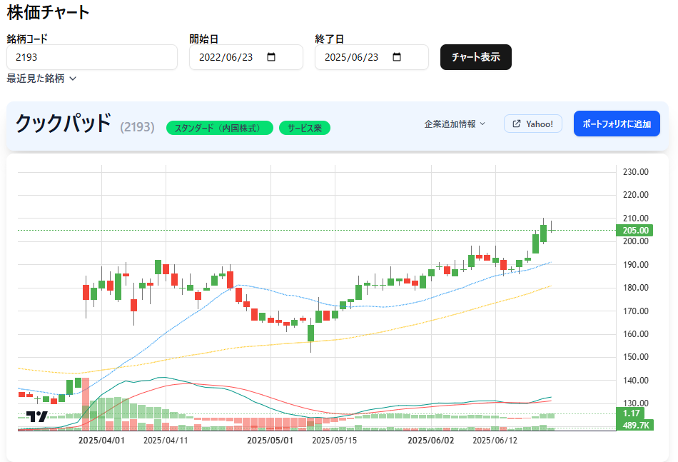
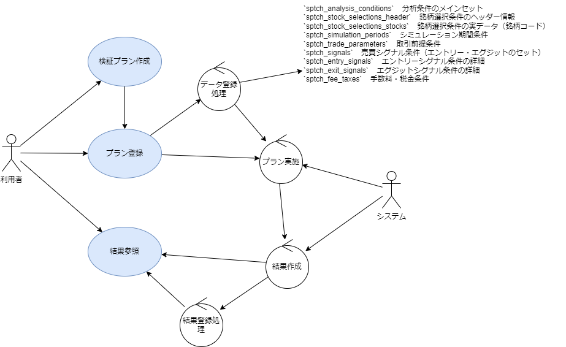
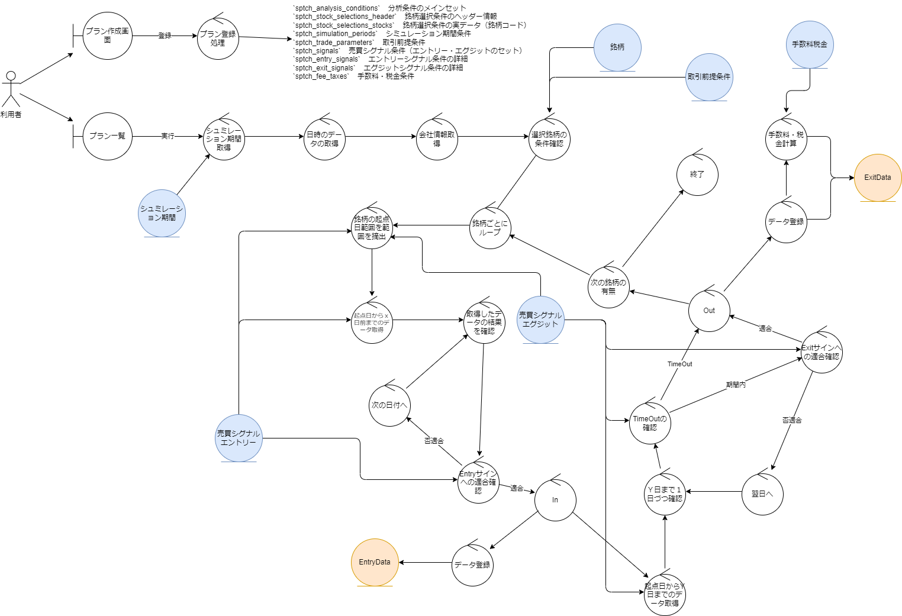
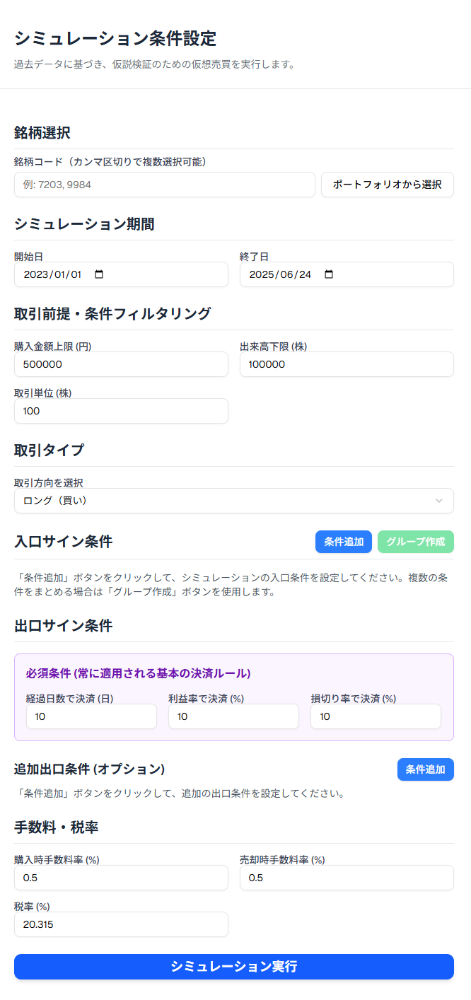
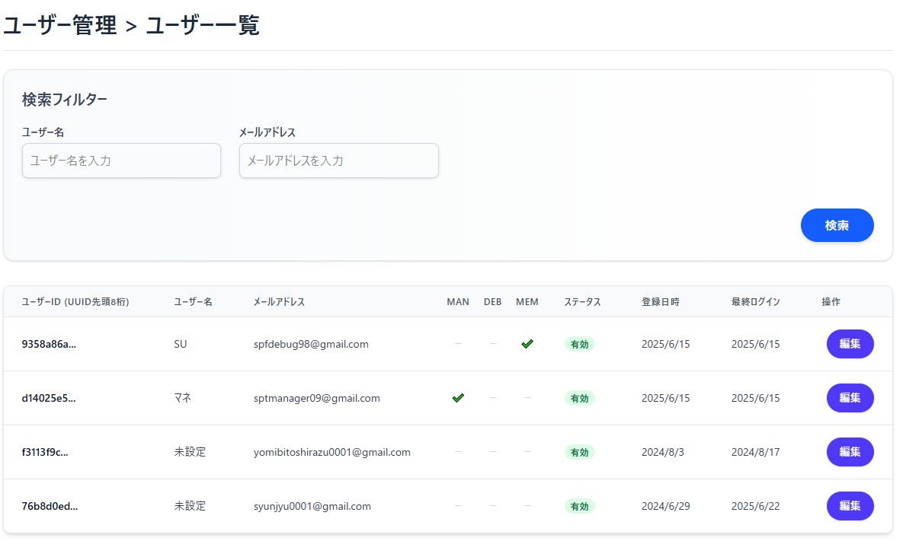
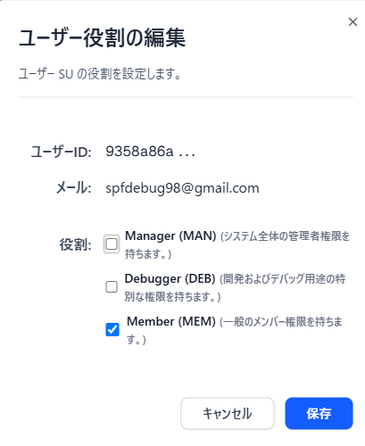
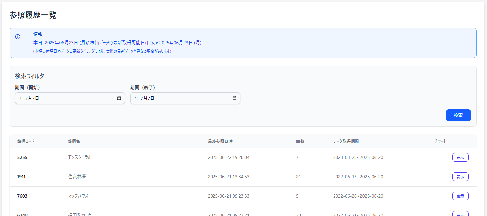

# README.md

# 概要
StockProfit10に関する仕様です。

* [全体概要](./01_overview.md)
* [システム構成仕様書](./02_architecture_design.md)
* [テーブル設計](./03_db_design.md)
* [画面構成](./04_ui_design.md)
* [API使用](./05_api_spec.md)
* 機能仕様書
  * [チャート](./features/DisplayChart.md)
  * [銘柄情報入手](./features/getDetailStockInfo.md)
  * [API比較](./features/review.md)
  * [仮説検証](./features/StockCompass/README.MD.md)
  

```
docs/
├─ overview.md                # 全体概要
├─ api_spec.md                # API仕様
├─ db_design.md               # テーブル設計
├─ ui_design.md               # UI設計
├─ architecture_design.md     # システム構成設計
└─ features/                 # 機能ごとの詳細仕様
    ├── simulation.md
    └── portfolio.md
```

|||


---

# 01_overview.md

[Top](./README.md)

# 要件定義書
## 1. 全体での概要と目的
### ◆概要
株式市場は常に変動し、多くの投資家が感情に左右されず、客観的かつ論理的な投資判断を下すことに困難を感じています。「StockProfit10」は、この課題を解決するために開発された株式投資シミュレーション＆シグナル提供アプリケーションです。過去の膨大な株価データと独自開発の分析アルゴリズムに基づいた「買い・売りシグナル」を提供し、さらにそのシグナルが過去の相場でどれほどの成果を上げたかを具体的に示す「シミュレーション機能」を搭載しています。これにより、ユーザーは冷静な判断を促され、自信を持って売買タイミングを見極められるよう支援します。


### ◆目的
本アプリケーションの究極の目的は、ユーザーが株式投資において**「もしあの時買っていたら、売っていたら」という疑問を解消し、具体的な根拠に基づいた自信ある売買判断を下せる環境を提供**することです。具体的には、以下の主要な価値を提供します。

- 「10%のキャピタルゲイン獲得」を現実的な目標としてサポート: アプリの提案するシグナルに従った場合の過去の取引成果をシミュレーションすることで、その有効性をユーザーが体感し、目標達成に向けた具体的なきっかけと安心感を得られるようにします。
- 感情に左右されない客観的な意思決定の支援: 過去のデータに基づいた買い・売りシグナルと、それによるシミュレーション結果を提供することで、ユーザーが自身の判断を客観的に検証し、感情的な売買を抑制できるようサポートします。
- 株式投資学習・検証の促進: 実際の資金を投入する前に、様々な条件でのシミュレーションを繰り返すことで、ユーザーが投資戦略の有効性を試行錯誤し、スキルを向上させるための学習ツールとしての役割も果たします。
この信頼性と納得感の醸成を通じて、ユーザーのアプリ利用継続を促し、最終的に彼らの安定的な資産形成に貢献します。

## 2. アプリケーションの提供価値と主要機能
### 2.1. 提供価値
「StockProfit10」は、以下の価値をユーザーに提供します。

- 過去実績に基づいた信頼性の可視化: 独自シグナルによるシミュレーションを通じて、「もしあの時取引していたらどうなっていたか」を明確に示し、アプリの信頼性を感覚だけでなくデータで納得いただけます。
- 客観的な売買タイミングの提示: 20日・60日移動平均線、出来高といった客観的指標に基づく「買い・売りシグナル」を提供し、感情に流されない冷静な投資判断を支援します。
- パーソナライズされた投資戦略の検証: 銘柄、期間、取引単位、手数料など、ユーザーが細かく条件を設定できるシミュレーション機能により、個々の投資スタイルに合わせた戦略の有効性を事前に検証できます。
- シンプルなUI/UX: 複雑な株価データを直感的かつ分かりやすく表示することで、投資初心者から経験者まで、誰もがストレスなくアプリを操作し、必要な情報を得られるデザインを目指します。
- 投資行動を促すための「きっかけ」提供: 実際の売買を直接サポートするのではなく、ユーザーが自信を持って売買判断を下すための「確かな情報と根拠」を提供することに特化し、自主的な投資行動を強力に後押しします。
### 2.2. 主要機能一覧
本アプリケーションは、上記提供価値を実現するために、以下の主要な機能を提供します。

- ユーザー管理機能:
    - ログイン、サインアップ、パスワード再設定、ユーザー情報編集
- ポートフォリオ管理機能:
    - 複数のポートフォリオ作成・管理
    - ポートフォリオへの銘柄追加・削除
    - ポートフォリオ内の銘柄表示順、グループ管理
- 株価情報表示機能:
    - 個別銘柄の株価チャート表示（日足、移動平均線表示）
    - 過去の株価データ閲覧
- 買い・売りシグナル通知機能:
    - 独自アルゴリズム（20日・60日移動平均線、出来高など）に基づく「買いシグナル」「売りシグナル」の算出と表示
    - シグナル発生時のユーザーへの通知（アプリ内通知、将来的にメール通知も検討）
- シミュレーション機能（中核機能）:
    - 指定銘柄・期間での売買シミュレーション実行
    - アプリ推奨シグナル、またはカスタム条件（指定価格、日付）による売買トリガー設定
    - 購入株数/金額、手数料の設定
    - シミュレーション結果の表示（総損益、損益率、取引履歴一覧）
    - 株価チャート上へのシミュレーション売買タイミング、シグナル表示
- データ連携機能:
    - YahooFinanceAPIからの最新株価データ取得、および過去データの蓄積管理

## 3. シミュレーション機能
### ◆目的
ユーザーが「StockProfit10」の提案する買いシグナルと売りシグナルに従って取引を行った場合、過去のデータに基づいてどの程度の利益または損失が発生したかをシミュレートし、その結果を可視化することで、アプリの有効性を体感し、利用継続を促します。

### ◆動機
「買い」「売り」候補を提示するだけでなく、「もしあの時買っていたら、売っていたら」というユーザーの疑問に答えることで、ツールの信頼性と納得感を高めます。これにより、ユーザーはより安心してアプリのシグナルを活用できるようになります。


## 要件
### シミュレーションの基本ロジック
対象銘柄: ポートフォリオに登録されている銘柄、またはユーザーが指定する単一の銘柄。
期間設定: ユーザーがシミュレーション対象期間（開始日、終了日）を指定できる。
買いのトリガー:
アプリの買いシグナル: 「20日平均線と60日平均線によるゴールデンクロス」と「出来高のボーダーライン」の条件を満たした場合。
ユーザー指定の買い値: 特定の株価になった場合。
日付指定: 特定の日に購入したと仮定する。
売りのトリガー:
アプリの売りシグナル: 「購入時より10%アップ」または「購入時より10%ダウン」の条件を満たした場合。
ユーザー指定の売り値: 特定の株価になった場合。
日付指定: 特定の日に売却したと仮定する。
購入・売却単位: ユーザーが1回の取引で売買する株数または購入金額を指定できる。
取引コスト: ユーザーが設定する手数料（購入時、売却時）を考慮する。
データソース: spt_daily_quotes テーブルに格納されている過去の株価データを使用。YahooFinanceAPIから取得した履歴データが前提。
### シミュレーション結果の表示
損益額: シミュレーション期間中の総損益（売却益 - 購入費用 - 手数料）。
損益率: 総損益を購入総額で割ったパーセンテージ。
取引履歴: シミュレーション期間中の各取引（購入、売却）の詳細（日付、銘柄、株数、価格、損益）。
チャート表示: 実際の株価チャート上に、購入・売却のタイミングとシグナルをプロットして可視化。
2.3. 設定項目
シミュレーション期間: 開始日、終了日
購入株数 / 購入金額: 1回あたりの取引単位
手数料: 購入時手数料、売却時手数料（固定額または割合）
買いシグナル利用: アプリのシグナル、またはカスタム条件
売りシグナル利用: アプリのシグナル、またはカスタム条件

### 術的考慮事項
シミュレーションの実装における考慮事項
データ量: 長期間、複数の銘柄でシミュレーションを行う場合、処理に時間がかかる可能性があります。非同期処理やバックグラウンドでの実行も検討が必要です。
精度: 日次データのみを使用するため、日中の値動きや指値・成行などの細かい取引条件は考慮できません。あくまで「ルール通りの売買」をシミュレートするツールであることを明記することが重要です。
パフォーマンス: 大量の過去データに対する移動平均線の計算や、売買条件のチェックは計算コストが高くなる可能性があります。効率的なアルゴリズムやデータベースクエリの最適化が必要です。
YahooFinanceAPIの利用制限: 過去データの取得期間やリクエスト回数に制限があるため、効率的にデータを取得・キャッシュする仕組みが必要です。


---

# 02_architecture_design.md

[Top](./README.md)

# 基本デザイン

## 1.1. ドキュメントの目的
本システム「StockProfit10」についての説明です。

## 1.2. システムの概要
### ◆動機
株式ってどこまでいっても複雑だとは思う。
ただし、シンプルに、冷静に判断できないかなぁと
期待した判断ができない理由としては「」
なぜできないか？というと、外的要因の可能性が高いと思う
そこらへん含めて、冷静に判断して買い時を作るアプリを作りたい


### ◆目的

１０％のキャピタルゲインを得るためのきっかけを与えるアプリ
- 気になる株を登録
- 過去の実績の分析
- 買いシグナルとして、対象の株を気になる株から上げる
- チャンスの基準は株価自体が日付単位でみたときに上がり調子
  - ２０日の平均線、６０日の平均線から判断する
  - 日ごとの出来高は別途ボーダーライン設ける
- 売り時シグナルも出す
  - 株価が購入時より１０％アップが出る
  - 株価が購入時より１０％ダウンでシグナルが出る
- 「買い」「売り」候補を挙げる
  - 実際の売買まではサポートしない
- 「買い」「売り」候補を挙げる 
  - 購入、売却ルールに基づいた過去のシミュレーション機能を提供する

## 1.3. 想定ユーザー・利用シナリオ

株式購入売却で得したい人


## 1.4. 技術スタック（Technology Stack）

#### 1. 開発環境・ホスティング

| 項目           | 使用技術・サービス                        |
| ------------ | -------------------------------- |
| フロントエンド      | Next.js (Reactベース、App Router使用)  |
| バックエンド（BaaS） | Supabase（データベース、認証、ストレージ）        |
| デプロイ先        | Vercel（CI/CD含む）                  |
| データベース       | Supabase PostgreSQL              |
| 外部API        | YahooFinanceAPI（株価情報）               |
| デザイン管理       | Figma                            |
| メール送信        | Supabase Functions（または外部メールサービス） |

#### 2. 開発言語・ライブラリ

- TypeScript
- Tailwind CSS（UI設計時に記述）
- shadcn/ui（UIコンポーネントライブラリ）
- react-query / tanstack-query（API管理）
- chart.js / recharts（チャート表示用）

#### 4. 前提条件
自動での売買は想定していないので、売買するきっかけを見つけるためのツールです。

#### 5. 用語定義

## 1.5. システム構成
本システムは、Next.jsのApp Router、Supabaseの機能、およびTypeScriptを活用したSPA（Single Page Application）として構築されます。効率的な開発と保守性を確保するため、以下のディレクトリ構成を基本的な指針とします。各ディレクトリの目的と格納されるファイルの概要を以下に示します。

* 画面の追加などでは以下の仕様に従うものとする

```
src/app/actions/PortfolioList.ts  # ポートフォリオ用のサーバーアクション
src/app/Portfolio/List/page.tsx   # AppRouter用のページ
src/app/components/domain/Portfolio/　　# ポートフォリオ用のドメイン                   
   ├── PortfolioList.tsx        # ポートフォリオ一覧ページのコンポーネント（メイン）
   └── PagePortfolioList.tsx    # page.tsxから呼び出される
                                #（メインコンポーネントの呼び出しのみ）
```


* 現行のファイル構造）
```
.
├── .vscode/               # VS Codeの設定ファイル（推奨設定、拡張機能、デバッグ設定など）
├── public/                # 静的アセット（ブラウザから直接アクセス可能な画像、faviconなど）
│   └── images/            # アプリケーションで使用する画像ファイル
├── docs/                        　 # 仕様書、設計書の保存場所
│   ├── images/                  　 # 画像の保存場所
│   │   ├── README_image01.png      # 画像：
│   │   └── 01_design_image01.png   # 画像：
│   ├── future/                 　　# 機能別の仕様
│   │   ├── imaegs              　　# 画像：
│   │   │   └── xxxxx_image01.png 　# xxxxの画像
│   │   └── xxxxx.md              　# 機能xxxxの仕様：
│   ├── README.MD         # ディレクトリの役割の説明
│   ├── 00_overview.MD    # 大まかな概要
│   └── 01_design.MD      # 期間部分の使用
├── docs_combine/          # MD結合用スクリプト配置場所
├── src/                   # アプリケーションの主要なソースコード
│   ├── app/               # Next.js App Routerのルートディレクトリ。ルーティング構造に準拠
│   │   ├── (auth)/        # 認証関連のルートグループ（例: ログイン、サインアップ、パスワードリセット）
│   │   │   ├── login/
│   │   │   │   └── page.tsx       # ログインページ
│   │   │   └── signup/
│   │   │       └── page.tsx       # サインアップページ
│   │   ├── (main)/        # メイン機能のルートグループ（認証後のページ群）
│   │   │   ├── layout.tsx # メイン機能共通のレイアウト（ナビゲーション、フッターなど）
│   │   │   ├── page.tsx   # メイン画面（ダッシュボードなど）のページ
│   │   │   ├── portfolios/
│   │   │   │   ├── page.tsx                 # ポートフォリオ一覧ページ
│   │   │   │   ├── [id]/                    # 個別ポートフォリオ詳細（動的ルーティング）
│   │   │   │   │   ├── page.tsx              # 個別ポートフォリオ表示ページ
│   │   │   │   │   ├── conditions/           # 監視条件指定画面のルート
│   │   │   │   │   │   └── page.tsx
│   │   │   │   │   ├── portfolio-conditions/ # ポートフォリオ条件指定画面のルート
│   │   │   │   │   │   └── page.tsx
│   │   │   │   │   └── settings/             # ポートフォリオ設定指定画面のルート
│   │   │   │   │       └── page.tsx
│   │   │   ├── simulation/ # シミュレーション機能のルート
│   │   │   │   ├── page.tsx # シミュレーション結果表示、設定フォーム
│   │   │   │   └── [id]/ # 個別シミュレーション結果詳細（特定の銘柄に対するシミュレーション）
│   │   │   │       └── page.tsx
│   │   │   ├── action/
│   │   │   │   └── simulation.ts # シミュレーション実行に関するサーバーアクション
│   │   │   ├── notifications/ # 通知確認画面のルート
│   │   │   │   └── page.tsx
│   │   │   └── user-settings/ # ユーザー設定画面のルート
│   │   │       └── page.tsx
│   │   ├── action/        # Next.js Server Actions の定義ファイル群
│   │   │   ├── auth.ts        # 認証（ログイン、サインアップ）に関するサーバーアクション
│   │   │   ├── user.ts        # ユーザー情報（編集、取得）に関するサーバーアクション
│   │   │   ├── portfolio.ts   # ポートフォリオ（作成、編集、削除）に関するサーバーアクション
│   │   │   └── stock.ts       # 銘柄（追加、削除、シミュレーション設定）に関するサーバーアクション
│   │   ├── favicon.ico
│   │   ├── globals.css        # グローバルスタイルシート（Tailwind CSSのインポートなど）
│   │   └── layout.tsx         # アプリケーション全体のルートレイアウト
│   │   └── loading.tsx        # ページ全体のローディングUI（オプション）
│   ├── components/        # 再利用可能なUIコンポーネントおよびドメインごとの実装
│   │   ├── ui/            # shadcn/uiのコンポーネント群（カスタマイズ版含む）
│   │   │   ├── button.tsx
│   │   │   ├── dialog.tsx
│   │   │   └── ...
│   │   ├── common/        # 汎用的なUIコンポーネント（アプリ全体で利用）
│   │   │   ├── Header.tsx         # アプリケーションヘッダー
│   │   │   ├── Footer.tsx         # アプリケーションフッター
│   │   │   ├── LoadingSpinner.tsx # ローディングスピナー
│   │   │   └── ConfirmationDialog.tsx # 確認ダイアログ
│   │   ├── atoms/         # Atomic DesignのAtoms層（最小単位のUI要素）
│   │   │   ├── Button.tsx
│   │   │   └── Input.tsx
│   │   ├── molecules/     # Atomic DesignのMolecules層（Atomsの組み合わせ）
│   │   │   ├── LoginForm.tsx
│   │   │   └── StockCard.tsx
│   │   ├── organisms/     # Atomic DesignのOrganisms層（Moleculesの組み合わせ）
│   │   │   ├── PortfolioList.tsx
│   │   │   └── ChartDisplay.tsx
│   │   ├── domain/        # ドメインごとのコンポーネントやビジネスロジックに近い実装
│   │   │   ├── Portfolio/ # ポートフォリオドメイン
│   │   │   │   ├── PortfolioEditor.tsx          # ポートフォリオ編集コンポーネント
│   │   │   │   ├── PortfolioDetailView.tsx      # ポートフォリオ詳細表示コンポーネント
│   │   │   │   ├── api/                         # クライアント側で利用するAPI呼び出し関数
│   │   │   │   │   ├── portfolioApi.ts          # ポートフォリオ関連のAPI
│   │   │   │   │   └── stockApi.ts              # ポートフォリオ内の銘柄関連API
│   │   │   │   └── hooks/                       # ポートフォリオ関連のカスタムフック
│   │   │   │       └── usePortfolio.ts
│   │   │   ├── Stock/     # 銘柄（株式）ドメイン
│   │   │   │   ├── StockSearchBar.tsx           # 銘柄検索バー
│   │   │   │   ├── StockChart.tsx               # 株価チャート表示
│   │   │   │   ├── api/
│   │   │   │   │   └── yFinanceClient.ts        # YahooFinanceAPIクライアント
│   │   │   │   └── analysis/                    # 銘柄分析ロジック
│   │   │   │       └── movingAverage.ts         # 移動平均線計算
│   │   │   ├── Notification/ # 通知ドメイン
│   │   │   │   ├── NotificationList.tsx         # 通知一覧表示
│   │   │   │   └── api/
│   │   │   │       └── notificationApi.ts
│   │   │   ├── Simulation/ # シミュレーション関連コンポーネント
│   │   │   │   ├── SimulationForm.tsx # シミュレーション条件入力フォーム
│   │   │   │   ├── SimulationResultTable.tsx # シミュレーション結果テーブル
│   │   │   │   ├── SimulationChart.tsx # シミュレーション結果表示用チャート
│   │   │   │   ├── api/ # クライアント側で利用するAPI呼び出し関数
│   │   │   │   │   └── simulationApi.ts # シミュレーション関連API
│   │   │   │   └── hooks/ # シミュレーション関連カスタムフック
│   │   │   │       └── useSimulation.ts
│   │   │   └── User/      # ユーザー設定ドメイン
│   │   │       ├── UserProfileForm.tsx          # ユーザー情報編集フォーム
│   │   │       └── api/
│   │   │           └── userApi.ts
│   ├── lib/               # 汎用的なユーティリティ関数やサービス
│   │   ├── db/            # Supabaseクライアントの初期化と共通DB操作ヘルパー
│   │   │   └── supabase.ts
│   │   ├── utils/         # その他の汎用ユーティリティ（日付フォーマット、数値計算など）
│   │   │   ├── datetime.ts
│   │   │   └── common.ts
│   │   ├── auth.ts        # 認証関連のヘルパー関数（Supabase Authとの連携）
│   │   └── api/           # 外部APIとの連携（サーバー側で呼び出す共通ロジックなど）
│   │       └── yFinanceService.ts # YahooFinanceAPIトークン管理、呼び出しロジック
│   ├── types/             # TypeScriptの型定義ファイル
│   │   ├── db.d.ts            # データベーススキーマの型
│   │   ├── yFinance.d.ts       # YahooFinanceAPIレスポンスの型
│   │   ├── component.d.ts     # コンポーネントpropsの型
│   │   └── index.d.ts         # その他の汎用型定義
│   ├── contexts/          # React Context APIの定義（グローバルな状態管理）
│   │   └── AuthContext.tsx    # 認証状態管理用のコンテキスト
│   ├── constants/         # アプリケーション全体で使用する定数定義
│   │   └── routes.ts          # ルーティングパスの定数
│   │   └── messages.ts        # 表示メッセージの定数
│   │   └── common.ts          # その他の定数
│   ├── styles/            # スタイル関連ファイル（もしあれば）
│   │   └── tailwind.css
│   └── assets/            # その他のアセット（アイコン、フォントなど）
├── supabase/              # Supabase関連の構成ファイル、マイグレーション、Edge Functions
│   ├── migrations/        # データベーススキーマのバージョン管理用SQLファイル
│   │   └── 20240101_initial_schema.sql
│   ├── functions/         # Supabase Edge Functionsのソースコード
│   └── seed.sql           # 開発環境用の初期データ投入スクリプト
├── .env.local             # 環境変数定義ファイル（本番環境ではVercelの環境変数で設定）
├── next.config.mjs        # Next.jsのビルド設定ファイル
├── postcss.config.mjs     # PostCSSの設定ファイル（主にTailwind CSS用）
├── tailwind.config.ts     # Tailwind CSSの設定ファイル
├── tsconfig.json          # TypeScriptのコンパイラ設定ファイル
├── package.json           # プロジェクトの依存関係とスクリプト定義
├── package-lock.json      # npm/yarnによる依存関係のロックファイル
└── README.md              # プロジェクトの概要、開発環境セットアップ手順、主要コマンドなど
```


# 機能仕様（ユースケース）
## 1. 機能一覧
## 2. 各機能の処理概要
### シミュレーション機能
#### 3.1. シミュレーション実行機能
- ユースケース名: シミュレーション実行
- アクター: ユーザー
- 概要: ユーザーが指定した銘柄、期間、売買条件に基づき、過去の株価データを用いて仮想的な取引を行い、その損益を計算・表示する。
- 事前条件:
  - ユーザーがログインしている。
  - YahooFinanceAPIから対象期間の株価データが取得済みである（spt_daily_quotesにデータが存在する）。
- 主フロー:
  - ユーザーがポートフォリオ一覧または個別銘柄詳細画面からシミュレーション機能を選択する。
  - ユーザーがシミュレーション設定画面で以下の項目を入力する:
    - 対象銘柄（ポートフォリオ内の銘柄から選択、または銘柄コードを直接入力）
    - シミュレーション開始日、終了日
    - 1回あたりの購入株数または購入金額
    - 購入時手数料、売却時手数料
    - 買いシグナル（アプリの推奨シグナルを使用するか、カスタム条件を指定するか）
    - 売りシグナル（アプリの推奨シグナルを使用するか、カスタム条件を指定するか）
  - ユーザーが「シミュレーション実行」ボタンをクリックする。
  - システムは指定された期間の株価データをspt_daily_quotesから取得する。
  - システムは指定された売買条件に基づき、日付順に仮想的な取引（購入・売却）をシミュレートする。
  - システムは各取引の損益を計算し、総損益、損益率を算出する。
  - システムはシミュレーション結果（総損益、損益率、取引履歴、チャート）を画面に表示する。
- 代替フロー:
  - 株価データ不足: 指定期間の株価データが不足している場合、エラーメッセージを表示し、シミュレーションを実行しない。
  - 無効な入力: 入力された設定値が無効な場合（例: 開始日 > 終了日）、エラーメッセージを表示する。
### 3.2 YahooFinanceAPIデータ確認・登録機能
- ユースケース名: YahooFinanceAPIデータ確認・登録
- アクター: ユーザー
- 概要: ユーザーが指定した銘柄と期間でYahooFinanceAPIから株価データを取得し、その結果を確認後、データベースに登録する。
- 事前条件:
  - ユーザーがログインしている。
- 主フロー:
  - ユーザーがメイン画面またはポートフォリオ一覧から「APIデータ確認」機能を選択する。
  - ユーザーがAPIデータ確認画面で以下の項目を入力する:
    - 対象銘柄コード
    - 期間（開始日、終了日）
  - ユーザーが「API呼び出し」ボタンをクリックする。
  - システムは入力された情報に基づき、src/components/domain/Stock/api/yFinanceClient.tsを経由してsrc/lib/api/yFinanceService.tsを呼び出し、YahooFinanceAPIから株価データを取得する。
  - システムは取得した未加工のJSONデータを画面の「APIレスポンス」エリアに表示する。
  - システムはJSONデータから必要な株価情報を抽出し、整形してテーブル形式で「整形済みデータ」エリアに表示する。
  - ユーザーが「データベースに登録」ボタンをクリックする。
  - システムは表示されている整形済みデータをspt_daily_quotesテーブルに登録する。この際、Next.js Server Actions (src/app/action/stock.ts内に関数を追加) を介してSupabaseにデータを挿入する。
  - システムはデータベース登録の成否をメッセージ表示エリアに表示する。
- 代替フロー:
  - API呼び出し失敗:
    - YahooFinanceAPIからのレスポンスがエラー（4xx, 5xx）の場合、エラーメッセージを画面に表示し、データの表示・登録は行わない。
    - ネットワークエラーの場合も同様にエラーメッセージを表示。
  - データ形式不正: YahooFinanceAPIから予期しない形式のデータが返却された場合、エラーメッセージを表示し、整形済みデータの表示・登録は行わない。
  - データベース登録時の重複: spt_daily_quotesテーブルに既に存在する日付のデータに対して登録を試みた場合、UPSERT（存在すれば更新、なければ挿入）またはエラーメッセージを表示する。
  - 無効な入力: 入力された銘柄コードや期間がバリデーションルールに違反する場合、エラーメッセージを表示し、API呼び出しを行わない。
## 3. 操作シーケンス図（必要に応じて）


### 認証トークンの取得（初回）


### 利用API名・エンドポイント
### 認証方式（トークン、OAuth等）
### リクエスト仕様（パラメータ、ヘッダ）
### レスポンス仕様（JSON構造、エラーコード）
## 4.2. 外部サービスとの連携（メール、通知、Googleログイン等）

# 非機能要件
## 5.1. セキュリティ要件
## 5.2. パフォーマンス要件
## 5.3. アクセシビリティ・レスポンシブ対応
## 5.4. ログ・監視要件

# 権限・認可設計
## 6.1. ユーザー種別と権限一覧
## 6.2. 各画面・機能へのアクセス制御

# エラーハンドリング設計
## 1. 画面別エラーケースと対応
## 2. API通信失敗時の処理
## 3. 想定される異常系とメッセージ方針

# 通知・メッセージ設計
## 8.1. 表示メッセージ一覧（成功/失敗/警告）
## 8.2. トースト・モーダルの使用ルール
## 8.3. メール・通知のトリガーと文面


## 2. 入出力データ仕様（CSV, JSON等）
## 3. データのマスキング・加工要件

# 添付資料
## 10.1. モック画像（Figma など）
StockProfit10 UI Mockup: https://www.figma.com/design/j6MqagLNYSju7cH2SVUpvK/Zettelkasten_tool_-shadcn-ui?node-id=2250-483&p=f&t=z9iOuObxKi30CYLo-0

## 10.2. APIドキュメントURL一覧
## 10.3. その他参考資料（画面設計ツール、バックログ等）
|サイト|説明|
|-|-|
| [excel to markdowntable](https://notepm.jp/markdown-table-tool)|エクセル→MDテーブル変換ツール|
|


### `architecture_design.md` に記載する主な内容

1.  **システム全体像 (Overall System Architecture)**
    * **概要**: システムがどのような問題を解決し、どのような目的を達成するか。
    * **高レベルの構成図**: システムを構成する主要なコンポーネント（フロントエンド、バックエンド、データベース、外部サービスなど）とその関係をブロック図などで視覚的に表現します。（例えば、draw.ioなどで作成した図の参照や埋め込み）
    * **デプロイメント構成**: システムがどのような環境にデプロイされるか（オンプレミス、クラウドサービス（AWS, GCP, Azureなど）、コンテナ（Docker, Kubernetes）など）。

2.  **技術スタック (Technology Stack)**
    * **主要なフレームワーク/ライブラリ**: Next.js, React, Node.js, Express, .NET, Vue.js, Django, Ruby on Rails など、主要な技術選択とそのバージョン。
    * **データベース**: 使用するデータベースの種類（PostgreSQL, MySQL, MongoDBなど）と、ORM/ODM（TypeORM, Prisma, Mongooseなど）の利用。
    * **ミドルウェア**: キャッシュ（Redis, Memcached）、メッセージキュー（RabbitMQ, Kafka）、認証サービスなど。
    * **インフラ**: サーバーOS、Webサーバー（Nginx, Apache）、CI/CDツール（GitHub Actions, CircleCIなど）。

3.  **アーキテクチャスタイル/パターン (Architecture Style/Patterns)**
    * 採用しているアーキテクチャスタイル（モノリシック、マイクロサービス、イベント駆動、サーバレスなど）。
    * 適用している設計パターン（MVC, MVP, MVVM, レイヤードアーキテクチャ、クリーンアーキテクチャなど）。
    * 各層（プレゼンテーション層、アプリケーション層、ドメイン層、インフラストラクチャ層など）の役割と依存関係。

4.  **データフロー (Data Flow)**
    * ユーザーからのリクエストがシステム内でどのように処理され、データがどこを経由してどのように永続化されるかを示します。主要なデータパスを説明します。

5.  **モジュール構成 (Module Structure)**
    * 主要な論理モジュールやサービスがどのように分割され、互いにどのように連携するか。
    * 各モジュールの責任範囲。

6.  **非機能要件に関する設計 (Non-Functional Requirements Design)**
    * **スケーラビリティ**: システムの拡張性に関する設計（ロードバランシング、オートスケーリングなど）。
    * **信頼性/可用性**: エラーハンドリング、冗長化、障害回復メカニズムなど。
    * **セキュリティ**: 認証・認可の仕組み、データ暗号化、脆弱性対策など。
    * **パフォーマンス**: パフォーマンスボトルネックの特定と対策。
    * **保守性**: コード規約、ロギング、モニタリングの設計。

7.  **設計上の考慮事項と意思決定 (Design Considerations & Decisions)**
    * 特定の技術やアーキテクチャパターンを採用した理由、その選択肢のメリット・デメリット。
    * 将来的な拡張性や変更への対応方針。
    * トレードオフ（例: 開発速度 vs. 厳密な設計）。

### ご提示のファイル構成との関連

* `api_spec.md`: バックエンドのAPIインターフェースの詳細と密接に関連します。`architecture_design.md` ではAPIゲートウェイや認証基盤など、APIを支えるアーキテクチャ部分に触れることになります。
* `ui_design.md`: フロントエンドの画面設計やユーザー体験に関する内容です。`architecture_design.md` では、UI層とビジネスロジック層、データ層の連携方法など、UIを支える技術アーキテクチャに触れます。
* `features` フォルダ内の `flow.drawio.png`, `readme.md` など: 各機能の詳細なフローや個別の設計は `features` 以下の各機能の `readme.md` に記載し、`architecture_design.md` はそれらの機能が全体の中でどのように配置され、連携するかといった**高レベルな視点**を提供します。

`architecture_design.md` は、このプロジェクトがどのような「骨格」と「血液循環」で成り立っているかを開発者や関係者に伝えるための最も重要なドキュメントの一つとなるでしょう。


---

# 03_db_design.md

[Top](./README.md)

# データ設計（外部的な観点）

## 1. 主要エンティティとデータ項目
### テーブル作成時共通の処理

- スキーマの使用権限 (これは既存であれば再実行しても問題ないです)
- RLS (Row Level Security) を無効にする場合はここで設定

<details>
<summary>common_query</summary>

```sql
-- スキーマの使用権限 (これは既存であれば再実行しても問題ないです)
-- RLS (Row Level Security) を無効にする場合はここで設定
ALTER TABLE public.ｘｘｘｘ DISABLE ROW LEVEL SECURITY;

GRANT USAGE ON SCHEMA "public" TO anon;
GRANT USAGE ON SCHEMA "public" TO authenticated;

-- テーブルへのアクセス権限
GRANT SELECT, INSERT, UPDATE, DELETE ON ALL TABLES IN SCHEMA "public" TO authenticated;
GRANT SELECT, INSERT, UPDATE, DELETE ON ALL TABLES IN SCHEMA "public" TO anon;
```

</details>


### spt_daily_quotes

| カラム名        | 型           | 補足                |
| ----------- | ----------- | ----------------- |
| code        | `text`      | 銘柄コード（例: 7203）PK  |
| date        | `date`      | 日付（例: 2024-06-01）PK|
| open        | `numeric`   | 始値                |
| high        | `numeric`   | 高値                |
| low         | `numeric`   | 安値                |
| close       | `numeric`   | 終値                |
| volume      | `bigint`    | 出来高               |
| created_at | `timestamp` | データ挿入日時（自動）       |


```sql
CREATE TABLE spt_daily_quotes (
    code TEXT NOT NULL,
    date DATE NOT NULL,
    open NUMERIC,
    high NUMERIC,
    low NUMERIC,
    close NUMERIC,
    volume BIGINT,
    created_at TIMESTAMP DEFAULT now(),
    PRIMARY KEY (code, date) -- こちらに変更
);
```

### spt_stock_view_history
| カラム名   | 型                       | 補足                                                                              | 
| ---------- | ------------------------ | --------------------------------------------------------------------------------- | 
| id         | BIGSERIAL                | 主キー。参照履歴の一意な識別子。自動採番。                                        | 
| user_id    | UUID                     | 参照したユーザーのID。stock_user テーブルの id を参照。                           | 
| stock_code | TEXT                     | 参照した銘柄のコード。spt_daily_quotes または spt_stocks テーブルの code を参照。 | 
| viewed_at  | TIMESTAMP WITH TIME ZONE | 銘柄が参照された日時。自動的に現在日時が設定されます。                            | 

<details>
<summary>creat:spt_stock_view_history</summary>


```sql
CREATE TABLE spt_stock_view_history (
    id BIGSERIAL PRIMARY KEY,
    user_id UUID REFERENCES stock_user(id) ON DELETE CASCADE NOT NULL,
    stock_code TEXT NOT NULL, -- spt_daily_quotes or spt_stocks の code を参照
    viewed_at TIMESTAMP WITH TIME ZONE DEFAULT now() NOT NULL
);

GRANT USAGE ON SEQUENCE spt_stock_view_history_id_seq TO authenticated;

-- インデックスを追加して検索パフォーマンスを向上
CREATE INDEX idx_spt_stock_view_history_user_id ON spt_stock_view_history (user_id);
CREATE INDEX idx_spt_stock_view_history_stock_code ON spt_stock_view_history (stock_code);
CREATE INDEX idx_spt_stock_view_history_viewed_at ON spt_stock_view_history (viewed_at DESC);

-- RLS (Row Level Security) を有効にする場合はここで設定
ALTER TABLE public.spt_stock_view_history DISABLE ROW LEVEL SECURITY;

```
</details>

### spt_user テーブル (ユーザー情報)
|カラム名|型|補足|
|-------|---|----|
|id|UUID|主キー (Supabase認証のauth.users.id と連携)|
|email|TEXT|ユーザーのメールアドレス (NULL許容、auth.users と同期)|
|name|TEXT|ユーザーの表示名 (NULL許容)|


### roles テーブル (役割マスタ)
|カラム名|型|補足|
|-------|---|----|
|id|SERIAL|主キー (自動採番)|
|name|TEXT|役割名 (例: 'Manager', 'Member') |UNIQUE NOT NULL|
|short_name|TEXT|役割名 'MAN', 'MEM','ADMI') |NOT NULL|
|description	|TEXT	|役割の説明 (任意)|
|created_at	|TIMESTAMPTZ	|作成日時 (デフォルト: 現在時刻)|

### user_roles テーブル (ユーザーと役割の中間テーブル)
|カラム名|型|補足|
|-------|---|----|
|id|INTEGER|主キー|
|user_id|UUID|spt_user.id を参照 (ON DELETE CASCADE)|
|role_id|INTEGER|roles.id を参照 (ON DELETE CASCADE)|
|assigned_at|TIMESTAMPTZ|役割が割り当てられた日時 (デフォルト: 現在時刻, 任意)|


<details>
<summary>creat:spt_user</summary>


```sql


-- spt_user テーブル (Supabaseの auth.users テーブルと連携することを想定)
CREATE TABLE spt_user (
    id UUID PRIMARY KEY,
    email TEXT, -- auth.users.email と同期する場合があるため、UNIQUE制約はauth.users側で担保
    name TEXT  -- 表示名
    -- created_at TIMESTAMPTZ DEFAULT now(), -- 必要であれば作成日時
    -- updated_at TIMESTAMPTZ DEFAULT now()  -- 必要であれば更新日時
);

-- ユーザー役割を管理するテーブル
CREATE TABLE roles (
    id SERIAL PRIMARY KEY, -- 自動採番されるID
    name TEXT UNIQUE NOT NULL, -- 役割名 (例: 'Manager', 'Debugger', 'Member')
    short_name TEXT , --短縮名、テーブル用
    description TEXT, -- 役割の説明 (任意)
    created_at TIMESTAMPTZ DEFAULT now() -- 作成日時
);

-- 初期データの挿入 (例)
-- アプリケーションの要件に応じて調整してください。
INSERT INTO roles (name, description) VALUES
('Manager', 'MAN','システム全体の管理者権限を持ちます。'),
('Debugger', 'DEB','開発およびデバッグ用途の特別な権限を持ちます。'),
('Member', 'MEM','一般のメンバー権限を持ちます。');


-- ユーザーと役割の多対多関連を管理する中間テーブル
CREATE TABLE user_roles (
    user_id UUID REFERENCES spt_user(id) ON DELETE CASCADE,
    role_id INTEGER REFERENCES roles(id) ON DELETE CASCADE,
    assigned_at TIMESTAMPTZ DEFAULT now(), -- 役割が割り当てられた日時 (任意)
    PRIMARY KEY (user_id, role_id) -- ユーザーIDと役割IDの組み合わせで一意
);

-- テーブルへのアクセス権限 xxxx
ALTER TABLE public.spt_user DISABLE ROW LEVEL SECURITY;
ALTER TABLE public.roles DISABLE ROW LEVEL SECURITY;
ALTER TABLE public.user_roles DISABLE ROW LEVEL SECURITY;

-- スキーマの使用権限 (これは既存であれば再実行しても問題ないです)
GRANT USAGE ON SCHEMA "public" TO anon;
GRANT USAGE ON SCHEMA "public" TO authenticated;

-- テーブルへのアクセス権限
GRANT SELECT, INSERT, UPDATE, DELETE ON ALL TABLES IN SCHEMA "public" TO authenticated;
GRANT SELECT, INSERT, UPDATE, DELETE ON ALL TABLES IN SCHEMA "public" TO anon;

```

</details>


### spt_portals(ユーザーが作成するポートフォリオ)
ユーザーが作成するポートフォリオ（銘柄リストのまとまり）を格納するテーブルです

| カラム名      | 型        | 補足| 
| ------------- | --------- | ----------- | 
| id            | uuid      | 主キー（Supabaseのgen_random_uuid()などで自動生成）。                                                                                                   | 
| user_id       | uuid      | ポートフォリオを作成したユーザーのID。stock_usersテーブルのidを参照し、ユーザー削除時にはポートフォリオも削除されます。NOT NULL制約で必須項目とします。 | 
| name          | text      | ポートフォリオ名。ユーザーごとに一意である必要があります。NOT NULL制約で必須項目とします。  | 
| memo          | text      | ポートフォリオに関する注釈やメモ（任意項目）。| 
| created_at    | timestamp | レコードが挿入された日時。now()で自動的にタイムスタンプが設定されます。 | 
| display_order | integer   | ポートフォリオ一覧での表示順（小さいほど上位に表示）。デフォルト値は0です。| 

<details>
<summary>spt_portals</summary>

```sql
CREATE TABLE spt_portals (
    id UUID PRIMARY KEY,
    user_id UUID REFERENCES users(id) ON DELETE CASCADE,
    name TEXT NOT NULL,
    memo TEXT, -- ポータルへの注釈・メモ（任意）
    created_at TIMESTAMP DEFAULT now(),
    display_order INTEGER DEFAULT 0,-- 表示順
    UNIQUE (user_id, name)
);

```

</details>


### spt_portal_stocks（ポータルと銘柄のリレーション）
多対多対応  
spt_portalsテーブルと株銘柄（stock_daily_quotesテーブルに紐づく概念）の多対多のリレーションを管理する中間テーブルです。特定のポートフォリオにどの銘柄が追加されているかを管理します。

| カラム名      | 型        | 補足| 
| ------------- | --------- | --- | 
| id            | uuid      | 主キー（Supabaseのgen_random_uuid()などで自動生成）。                                                                                               | 
| portal_id     | uuid      | 関連するポートフォリオのID。stock_portalsテーブルのidを参照し、ポートフォリオ削除時にはこのレコードも削除されます。NOT NULL制約で必須項目とします。 | 
| stock_code    | text      | ポートフォリオに追加された銘柄のコード（例: '7203'）。NOT NULL制約で必須項目とします。                                                              | 
| added_at      | timestamp | 銘柄がポートフォリオに追加された日時。now()で自動的にタイムスタンプが設定されます。                                                                 | 
| display_order | integer   | ポートフォリオ内での銘柄の表示順。デフォルト値は0です。                                                                                             | 
| group_name    | text      | 銘柄のグループ名（任意項目）。例: '成長株', '高配当' など。                                                                                         | 
| memo          | text      | 個々の銘柄に対する注釈やメモ（任意項目）。                                                                                                          | 

<details>
<summary>create:spt_portal_stocks</summary>

```sql
CREATE TABLE spt_portal_stocks (
  id UUID PRIMARY KEY,
  portal_id UUID REFERENCES portals(id) ON DELETE CASCADE,
  stock_code TEXT NOT NULL,  -- 銘柄コード（例: '7203'）
  added_at TIMESTAMP DEFAULT now(),
  display_order INTEGER DEFAULT 0, -- 銘柄の表示順
  group_name TEXT, -- 銘柄のグループ名（任意）
  memo TEXT,       -- 銘柄への注釈・メモ（任意）
  UNIQUE (portal_id, stock_code)
);
```
</details>


### spt_stocks

個々の銘柄（企業）の基本情報

| カラム名     | 型        | 補足|
| ------------ | --------- | --------------------------------- | 
| code         | text      | 主キー。銘柄コード（例: 7203）。YahooFinanceAPIなどで一意に識別されるコードで、NOT NULL制約で必須項目とします。 | 
| name         | text      | 銘柄名/会社名（例: トヨタ自動車）。NOT NULL制約で必須項目とします。 | 
| market       | text      | 上場市場（例: 東証プライム, ナスダック など）。任意項目。| 
| industry     | text      | 業種（例: 自動車, 電気機器 など）。任意項目。        | 
| tradable     | boolean   | 取引可能フラグ。現在取引されている銘柄かどうかを示す（任意、デフォルトTRUEなど）。   | 
| listing_date | date      | 上場日。任意項目。 | 
| created_at   | timestamp | レコードが挿入された日時。now()で自動的にタイムスタンプが設定されます。| 
| updated_at   | timestamp | レコードが最終更新された日時。now()で自動更新されるように設定することが一般的です。 | 


<details>
<summary>create:spt_stocks</summary>

```sql
CREATE TABLE spt_stocks (
    code TEXT PRIMARY KEY, -- 銘柄コードを主キーとする
    name TEXT NOT NULL,
    market TEXT,
    industry TEXT,
    tradable BOOLEAN DEFAULT TRUE,
    listing_date DATE,
    created_at TIMESTAMP WITH TIME ZONE DEFAULT now(),
    updated_at TIMESTAMP WITH TIME ZONE DEFAULT now()
);

```
</details>


### spt_company_stock_details（株式の詳細）

| カラム名             | 型           | 説明                |
| ---------------- | ----------- | ----------------- |
| `code`         | VARCHAR(10) | 株式コード（ユニーク）       |
| `market_cap`     | BIGINT      | 時価総額（百万円）         |
| `issued_shares`  | BIGINT      | 発行済株式数            |
| `div_yield`      | FLOAT       | 配当利回り（%）          |
| `dividend`       | FLOAT       | 1株配当（円）           |
| `per`            | FLOAT       | PER（倍）            |
| `pbr`            | FLOAT       | PBR（倍）            |
| `eps`            | FLOAT       | EPS（円）            |
| `bps`            | FLOAT       | BPS（円）            |
| `roe`            | FLOAT       | ROE（%）            |
| `equity_ratio`   | FLOAT       | 自己資本比率（%）         |
| `min_price`      | INTEGER     | 最低購入代金（円）         |
| `unit_shares`    | INTEGER     | 単元株数              |
| `high_price_ytd` | INTEGER     | 年初来高値（円）          |
| `low_price_ytd`  | INTEGER     | 年初来安値（円）          |
| `roa`            | FLOAT       | ROA（%）            |
| `operating_margin`| FLOAT       | 営業利益率（%）         |
| `free_cash_flow` | BIGINT      | フリーキャッシュフロー（百万円） |
| `interest_coverage`| FLOAT       | インタレストカバレッジレシオ |
| `beta`           | FLOAT       | ベータ値              |
| `peg_ratio`      | FLOAT       | PEGレシオ            |
| `updated_at`     | DATE        | 最終更新日（YYYY-MM-DD） |


<details>
<summary>create spt_company_stock_details</summary>

```sql
CREATE TABLE public.spt_company_stock_details (
    code VARCHAR(10) PRIMARY KEY,
    market_cap BIGINT,
    issued_shares BIGINT,
    div_yield FLOAT,
    dividend FLOAT,
    per FLOAT,
    pbr FLOAT,
    eps FLOAT,
    bps FLOAT,
    roe FLOAT,
    equity_ratio FLOAT,
    min_price INTEGER,
    unit_shares INTEGER,
    high_price_ytd INTEGER,
    low_price_ytd INTEGER,
    roa FLOAT,
    operating_margin FLOAT,
    free_cash_flow BIGINT,
    interest_coverage FLOAT,
    beta FLOAT,
    peg_ratio FLOAT,
    updated_at DATE
);

ALTER TABLE public.spt_company_stock_details DISABLE ROW LEVEL SECURITY;
```

</details>


### spt_notifications
データ構造: spt_notifications テーブル（別途定義が必要）
id: UUID
user_id: UUID (ユーザーID)
stock_code: TEXT (対象銘柄コード)
type: TEXT (通知の種類: 'BUY_SIGNAL', 'SELL_SIGNAL', 'INFO' など)
message: TEXT (通知メッセージ)
is_read: BOOLEAN (既読/未読)
created_at: TIMESTAMP

### spt_simulations （シミュレーション結果の保存用テーブル）
ユーザーが実行したシミュレーションの設定と結果を保存するテーブル。

| カラム名               | 型        | 補足                                                     | 
| ---------------------- | --------- | -------------------------------------------------------- | 
| id                     | uuid      | 主キー   | 
| user_id                | uuid      | ユーザーID (usersテーブル参照) | 
| portal_id              | uuid      | 関連するポートフォリオID (spt_portalsテーブル参照、任意) | 
| stock_code             | text      | 対象銘柄コード (spt_stocksテーブル参照) | 
| start_date             | date      | シミュレーション開始日   | 
| end_date               | date      | シミュレーション終了日 | 
| buy_amount_per_trade   | numeric   | 1回あたりの購入金額（または株数）| 
| buy_fee_rate           | numeric   | 購入手数料率（例: 0.001 = 0.1%）                         | 
| sell_fee_rate          | numeric   | 売却手数料率         | 
| buy_condition_type     | text      | 買い条件の種類 (APP_SIGNAL, CUSTOM_PRICE, CUSTOM_DATE)   | 
| sell_condition_type    | text      | 売り条件の種類 (APP_SIGNAL, CUSTOM_PRICE, CUSTOM_DATE)   | 
| custom_buy_price       | numeric   | カスタム買い条件の株価 (任意)                            | 
| custom_sell_price      | numeric   | カスタム売り条件の株価 (任意)                            | 
| total_profit_loss      | numeric   | 総損益               | 
| total_profit_loss_rate | numeric   | 総損益率             | 
| trade_count            | integer   | 総取引回数           | 
| created_at             | timestamp | シミュレーション実行日時                                 | 
| memo                   | text      | シミュレーションに関するメモ (任意)                      | 

<details>
<summary>spt_simulations</summary>

```sql
CREATE TABLE spt_simulations (
    id UUID PRIMARY KEY DEFAULT gen_random_uuid(),
    user_id UUID REFERENCES users(id) ON DELETE CASCADE,
    portal_id UUID REFERENCES spt_portals(id) ON DELETE SET NULL, -- ポートフォリオと紐付けないシミュレーションも考慮
    stock_code TEXT REFERENCES spt_stocks(code) ON DELETE CASCADE,
    start_date DATE NOT NULL,
    end_date DATE NOT NULL,
    buy_amount_per_trade NUMERIC, -- 1回あたりの購入金額 or 株数
    buy_fee_rate NUMERIC DEFAULT 0,
    sell_fee_rate NUMERIC DEFAULT 0,
    buy_condition_type TEXT NOT NULL, -- 'APP_SIGNAL', 'CUSTOM_PRICE', 'CUSTOM_DATE'
    sell_condition_type TEXT NOT NULL, -- 'APP_SIGNAL', 'CUSTOM_PRICE', 'CUSTOM_DATE'
    custom_buy_price NUMERIC,
    custom_sell_price NUMERIC,
    total_profit_loss NUMERIC,
    total_profit_loss_rate NUMERIC,
    trade_count INTEGER,
    created_at TIMESTAMP DEFAULT now(),
    memo TEXT
);
```

</details>


### spt_simulation_trades （シミュレーション中の個々の取引履歴）
シミュレーションで発生した個々の仮想取引（購入、売却）の詳細を記録するテーブル

| カラム名               | 型      | 補足                      | 
| ---------------------- | ------- | ------------------------------------------------------------- | 
| id                     | uuid    | 主キー                    | 
| simulation_id          | uuid    | 関連するシミュレーションID (spt_simulationsテーブル参照)      | 
| trade_date             | date    | 取引日                    | 
| trade_type             | text    | BUY または SELL           | 
| stock_code             | text    | 銘柄コード                | 
| price                  | numeric | 取引価格                  | 
| quantity               | integer | 取引株数                  | 
| fee                    | numeric | 取引手数料                | 
| profit_loss            | numeric | この取引における損益 (売却時のみ計算)                         | 
| cumulative_profit_loss | numeric | この取引までの累積損益 (参考情報)                             | 
| memo                   | text    | 取引に関するメモ (例: "買いシグナル発生", "10%利益達成" など) | 

<details>
<summary>create spt_simulation_trades</summary>


```sql
CREATE TABLE spt_simulation_trades (
    id UUID PRIMARY KEY DEFAULT gen_random_uuid(),
    simulation_id UUID REFERENCES spt_simulations(id) ON DELETE CASCADE,
    trade_date DATE NOT NULL,
    trade_type TEXT NOT NULL, -- 'BUY', 'SELL'
    stock_code TEXT NOT NULL,
    price NUMERIC NOT NULL,
    quantity INTEGER NOT NULL,
    fee NUMERIC DEFAULT 0,
    profit_loss NUMERIC, -- 売却時のみ、この取引での損益
    cumulative_profit_loss NUMERIC, -- その時点での累積損益
    memo TEXT,
    created_at TIMESTAMP DEFAULT now()
);
```

</details>


### jpx_company_master
| カラム名         | データ型   | NULL許容 | 説明         | 主キー/その他                  | 
| ---------------- | ---------- | -------- | ------------------------------------------------ | ------------------------------ | 
| code| TEXT       | NO       | 銘柄コード（例: "1301", "130A"）                 | 主キー (一意性が保証される)    | 
| company_name     | TEXT       | NO       | 銘柄名（例: "極洋"）                             |                                | 
| market_segment   | TEXT       | NO       | 市場・商品区分（例: "プライム（内国株式）"）     |                                | 
| industry_33_code | TEXT       | YES      | 33業種コード（例: "50", "-" は空文字列）         | NULL許容（ETFなどの場合）      | 
| industry_33_name | TEXT       | YES      | 33業種区分（例: "水産・農林業", "-" は空文字列） | NULL許容（ETFなどの場合）      | 
| industry_17_code | TEXT       | YES      | 17業種コード（例: "1", "-" は空文字列）          | NULL許容（ETFなどの場合）      | 
| industry_17_name | TEXT       | YES      | 17業種区分（例: "食品", "-" は空文字列）         | NULL許容（ETFなどの場合）      | 
| scale_code       | TEXT       | YES      | 規模コード（例: "7", "-" は空文字列）            | NULL許容（ETFなどの場合）      | 
| scale_name       | TEXT       | YES      | 規模区分（例: "TOPIX Small 2", "-" は空文字列）  | NULL許容（ETFなどの場合）      | 
| updated_at       | TIMESTAMPZ | NO       | レコード最終更新日時                             | NOW() のデフォルト値を設定推奨 | 

<details>
<summary>create:jpx_company_master</summary>

```sql
---
CREATE TABLE public.jpx_company_master (
    code TEXT PRIMARY KEY,                          -- 銘柄コードを主キーとする
    company_name TEXT NOT NULL,                     -- 銘柄名
    market_segment TEXT NOT NULL,                   -- 市場・商品区分
    industry_33_code TEXT,                          -- 33業種コード (NULL許容)
    industry_33_name TEXT,                          -- 33業種区分 (NULL許容)
    industry_17_code TEXT,                          -- 17業種コード (NULL許容)
    industry_17_name TEXT,                          -- 17業種区分 (NULL許容)
    scale_code TEXT,                                -- 規模コード (NULL許容)
    scale_name TEXT,                                -- 規模区分 (NULL許容)
    updated_at TIMESTAMPTZ DEFAULT NOW() NOT NULL   -- レコード最終更新日時
);

-- RLSを無効にする
ALTER TABLE public.jpx_company_master DISABLE ROW LEVEL SECURITY;

-- スキーマの使用権限 (これは既存であれば再実行しても問題ないです)
GRANT USAGE ON SCHEMA "public" TO anon;
GRANT USAGE ON SCHEMA "public" TO authenticated;

-- テーブルへのアクセス権限
GRANT SELECT, INSERT, UPDATE, DELETE ON ALL TABLES IN SCHEMA "public" TO authenticated;
GRANT SELECT, INSERT, UPDATE, DELETE ON ALL TABLES IN SCHEMA "public" TO anon;

-- データを挿入または更新する際のポリシーの例（例：認証されたユーザーのみ）
-- Upsert (INSERT ON CONFLICT UPDATE) を利用する場合、INSERTとUPDATE両方のポリシーが必要になることがあります。
-- 特定のユーザーロールやサービスロールからの書き込みに制限することを検討してください。
-- CREATE POLICY "Enable write access for authenticated users" ON public.company_master_latest
--   FOR INSERT WITH CHECK (auth.role() = 'authenticated');
-- CREATE POLICY "Enable update access for authenticated users" ON public.company_master_latest
--   FOR UPDATE USING (auth.role() = 'authenticated');

```

</details>

importjpx01.html：
[その他統計資料](https://www.jpx.co.jp/markets/statistics-equities/misc/01.html)のXmlから取得する。
そこから、Xmlを開いて、全選択して、インポート画面へコピー


### Supabase PostgreSQL Function
できるだけ利用しないようにする。**Server Actions**をできるだけ利用する。
- /app/actions/stock.ts (Server Actions) 「フォームの送信」や「データ変更」など、特定のUI操作に紐づくサーバーサイドの処理に特化しています。
- /api/stock.ts (Route Handler) 従来のAPIルート（Pages Routerのpages/apiに相当）のApp Router版です。
#### get_period_stock_views
- Supabase PostgreSQL Function: get_period_stock_views
- 指定された期間内の株価参照履歴を集計し、
- 銘柄コード、銘柄名、市場、業種、期間内の参照件数、期間内最新参照日時を返します。


<details>
<summary>fn:get_period_stock_views</summary>

```sql
-- Supabase PostgreSQL Function: get_period_stock_views
-- 指定された期間内の株価参照履歴を集計し、
-- 銘柄コード、銘柄名、市場、業種、期間内の参照件数、期間内最新参照日時を返します。

CREATE OR REPLACE FUNCTION public.get_period_stock_views(
    start_date_param DATE DEFAULT NULL, -- 期間の開始日 (NULLの場合、期間を考慮しない)
    end_date_param DATE DEFAULT NULL,   -- 期間の終了日 (NULLの場合、期間を考慮しない)
    stock_code_param TEXT DEFAULT NULL, -- 銘柄コードのフィルタ (NULLの場合、フィルタしない)
    stock_name_param TEXT DEFAULT NULL  -- 銘柄名のフィルタ (NULLの場合、フィルタしない)
)
RETURNS TABLE (
    stock_code TEXT,
    stock_name TEXT,
    stock_market TEXT,
    stock_industry TEXT,
    period_view_count BIGINT,
    latest_viewed_at_in_period TIMESTAMP WITH TIME ZONE
)
LANGUAGE plpgsql
AS $$
BEGIN
    RETURN QUERY
    SELECT
        svh.stock_code,
        s.name AS stock_name,
        s.market AS stock_market,
        s.industry AS stock_industry,
        COUNT(svh.id) AS period_view_count,
        MAX(svh.viewed_at) AS latest_viewed_at_in_period
    FROM
        public.spt_stock_view_history AS svh
    JOIN
        public.spt_stocks AS s ON svh.stock_code = s.code
    WHERE
        (start_date_param IS NULL OR svh.viewed_at >= start_date_param::timestamp WITH TIME ZONE) AND
        (end_date_param IS NULL OR svh.viewed_at < (end_date_param + INTERVAL '1 day')::timestamp WITH TIME ZONE) AND -- 終了日の翌日0時まで
        (stock_code_param IS NULL OR svh.stock_code ILIKE ('%' || stock_code_param || '%')) AND
        (stock_name_param IS NULL OR s.name ILIKE ('%' || stock_name_param || '%'))
    GROUP BY
        svh.stock_code,
        s.name,
        s.market,
        s.industry
    ORDER BY
        MAX(svh.viewed_at) DESC, -- 次に最新参照日時でソート (件数が同じ場合)
        COUNT(svh.id) DESC; -- 参照件数が多い順にソート
END;
$$;

-- この関数を`authenticated`ロールが実行できるように権限を付与します。
-- 必要に応じて`anon`ロールにも付与できますが、認証済みのユーザーに限定することが推奨されます。
GRANT EXECUTE ON FUNCTION public.get_period_stock_views(DATE, DATE, TEXT, TEXT) TO authenticated;

SELECT * FROM public.get_period_stock_views(
'2025-06-01', -- start_date_param
'2025-06-07', -- end_date_param
null,
null
);

```

</details>

#### handle_new_user
- Supabase PostgreSQL Function: handle_new_user
- ユーザー作成時、sp_user作成するためのトリガー


<details>
<summary>fn:handle_new_user</summary>


```sql
-- Function to insert a new user into spt_user table
-- This function will be triggered when a new user signs up.
CREATE OR REPLACE FUNCTION public.handle_new_user()
RETURNS TRIGGER
LANGUAGE plpgsql
SECURITY DEFINER -- IMPORTANT: Allows the function to operate with definer's privileges, necessary for accessing auth.users
SET search_path = public -- Ensures the function operates within the public schema context
AS $$
BEGIN
  -- Insert the new user's id and email into the public.spt_user table.
  -- Tries to get 'name' from the raw_user_meta_data. If 'name' is not provided during signup,
  -- (NEW.raw_user_meta_data->>'name') will evaluate to NULL, which is acceptable for the nullable 'name' column.
  INSERT INTO public.spt_user (id, email, name)
  VALUES (NEW.id, NEW.email, NEW.raw_user_meta_data->>'name');
  RETURN NEW;
END;
$$;

CREATE TRIGGER on_auth_user_created
  AFTER INSERT ON auth.users
  FOR EACH ROW EXECUTE FUNCTION public.handle_new_user();
```
</details>


#### get_all_daily_quotes_periods
- Supabase PostgreSQL Function: get_all_daily_quotes_periods
- 株価データ取得の期間を取得する関数


<details>
<summary>fn:get_all_daily_quotes_periods</summary>


```sql
CREATE OR REPLACE FUNCTION get_all_daily_quotes_periods()
RETURNS TABLE (
  code TEXT,
  min_date TEXT, -- Changed to TEXT to match current "N/A" logic, or use DATE and handle NULLs
  max_date TEXT  -- Same as above
)
LANGUAGE sql
AS $$
  SELECT
    spt_daily_quotes.code,
    MIN(spt_daily_quotes.date)::TEXT AS min_date,
    MAX(spt_daily_quotes.date)::TEXT AS max_date
  FROM
    spt_daily_quotes
  GROUP BY
    spt_daily_quotes.code;
$$;
```

</details>

#### get_portfolio_stock_details
- ポートフォリオIDに基づいて、ポートフォリオ内の各銘柄の詳細情報を取得します。
- 銘柄の基本情報、詳細情報（年初来高値・安値）、最新の株価終値、および前日の株価終値を含みます。
<details>
<summary>fn:get_portfolio_stock_details</summary>

```sql
-- PostgreSQL Function: get_portfolio_stock_details
-- ポートフォリオIDに基づいて、ポートフォリオ内の各銘柄の詳細情報を取得します。
-- 銘柄の基本情報、詳細情報（年初来高値・安値）、最新の株価終値、および前日の株価終値を含みます。

CREATE OR REPLACE FUNCTION public.get_portfolio_stock_details(
    p_portal_id INTEGER -- 取得したいポートフォリオのID
)
RETURNS TABLE (
    id INTEGER, -- spt_portfolio_stocks のID
    stock_code TEXT, -- 銘柄コード
    created_at TIMESTAMP WITH TIME ZONE, -- spt_portfolio_stocks の作成日時
    updated_at TIMESTAMP WITH TIME ZONE, -- spt_portfolio_stocks の更新日時
    stock_name TEXT, -- spt_stocks からの銘柄名
    stock_market TEXT, -- spt_stocks からの上場市場
    stock_industry TEXT, -- spt_stocks からの業種
    high_price_ytd INTEGER, -- spt_company_stock_details からの年初来高値
    low_price_ytd INTEGER, -- spt_company_stock_details からの年初来安値
    current_price NUMERIC, -- spt_daily_quotes からの最新株価終値
    previous_day_close_price NUMERIC -- spt_daily_quotes からの最新から一つ前の日の株価終値
)
LANGUAGE plpgsql
SECURITY DEFINER -- この関数が auth スキーマのテーブルや RLS が有効なテーブルにアクセスするために必要
SET search_path = public -- 関数が public スキーマ内で動作することを保証
AS $$
BEGIN
    RETURN QUERY
    SELECT
        sps.id,
        sps.stock_code,
        sps.created_at,
        sps.updated_at,
        ss.name AS stock_name,
        ss.market AS stock_market,
        ss.industry AS stock_industry,
        scsd.high_price_ytd,
        scsd.low_price_ytd,
        ldq.close AS current_price,
        pdq.close AS previous_day_close_price -- 前日終値を設定
    FROM
        public.spt_portfolio_stocks sps
    JOIN
        public.spt_stocks ss ON sps.stock_code = ss.code -- 銘柄の基本情報を結合
    LEFT JOIN
        public.spt_company_stock_details scsd ON sps.stock_code = scsd.code -- 銘柄の詳細情報を結合 (LEFT JOIN は詳細がない銘柄も含むため)
    LEFT JOIN LATERAL ( -- 各銘柄の最新の日次終値を取得するための LATERAL JOIN (current_price用)
        SELECT
            sq_latest.date,
            sq_latest.close
        FROM
            public.spt_daily_quotes sq_latest
        WHERE
            sq_latest.code = sps.stock_code
        ORDER BY
            sq_latest.date DESC -- 最新日付のデータを取得
        LIMIT 1
    ) AS ldq ON TRUE
    LEFT JOIN LATERAL ( -- 各銘柄の最新から一つ前の日の終値を取得するための LATERAL JOIN (previous_day_close_price用)
        SELECT
            sq_prev.close
        FROM
            public.spt_daily_quotes sq_prev
        WHERE
            sq_prev.code = sps.stock_code
            AND sq_prev.date < ldq.date -- 最新日より前の日付のデータに限定
        ORDER BY
            sq_prev.date DESC -- 最新から一つ前の日付のデータを取得
        LIMIT 1
    ) AS pdq ON TRUE
    WHERE
        sps.portal_id = p_portal_id -- 指定されたポートフォリオIDでフィルタリング
    ORDER BY
        sps.display_order; -- ポートフォリオ内での表示順でソート
END;
$$;

-- この関数を `authenticated` ロールが実行できるように権限を付与します。
-- 必要に応じて `anon` ロールにも付与できますが、通常は認証済みユーザーに限定することが推奨されます。
GRANT EXECUTE ON FUNCTION public.get_portfolio_stock_details(INTEGER) TO authenticated;

-- 関数呼び出しの例
-- SELECT * FROM public.get_portfolio_stock_details(1); -- 例: ポートフォリオIDが1の場合
```

</details>


#### get_users_with_roles_and_status
- public.get_users_with_roles_and_status(): ユーザー一覧と役割情報を取得
- 管理画面表示用に、ユーザー名、メール、役割、ステータスでフィルタリングし、ページネーションも考慮
  
<details>
<summary>fn:get_users_with_roles_and_status</summary>

```sql
-- DROP FUNCTION public.get_users_with_roles_and_status(text,text,integer[],boolean,integer,integer);
CREATE OR REPLACE FUNCTION public.get_users_with_roles_and_status(
    p_user_name TEXT DEFAULT NULL,
    p_email TEXT DEFAULT NULL,
    p_role_ids INTEGER[] DEFAULT NULL, -- 役割IDの配列（フィルタリング用）
    p_status BOOLEAN DEFAULT NULL,     -- True: 有効 (メール確認済み), False: 無効 (メール未確認/無効化)
    p_limit INTEGER DEFAULT 10,
    p_offset INTEGER DEFAULT 0
)
RETURNS TABLE (
    user_id UUID,
    user_name TEXT,
    user_email TEXT,
    user_roles TEXT[], -- ロール名の配列
    is_active BOOLEAN, -- ユーザーのステータス (email_confirmed_atを基に判断)
    registered_at TIMESTAMPTZ,
    last_signed_in_at TIMESTAMPTZ,
    total_count BIGINT -- フィルタリング後の総ユーザー数 (ページネーション用)
)
LANGUAGE plpgsql
SECURITY DEFINER -- IMPORTANT: auth.usersテーブルへのアクセスが必要なため、定義者の権限で実行
SET search_path = public, auth -- authスキーマを検索パスに追加
AS $$
DECLARE
    _total_count BIGINT;
BEGIN
    -- フィルタリング後の総ユーザー数を計算 (ページネーションの合計ページ数算出に必要)
    SELECT COUNT(DISTINCT au.id)
    INTO _total_count
    FROM auth.users au
    JOIN public.spt_user su ON au.id = su.id
    LEFT JOIN public.user_roles ur ON su.id = ur.user_id
    LEFT JOIN public.roles r ON ur.role_id = r.id
    WHERE
        (p_user_name IS NULL OR su.name ILIKE '%' || p_user_name || '%') AND
        (p_email IS NULL OR au.email ILIKE '%' || p_email || '%') AND
        (p_role_ids IS NULL OR r.id = ANY(p_role_ids)) AND -- 役割IDでフィルタ
        (p_status IS NULL OR (au.email_confirmed_at IS NOT NULL) = p_status)
    ;

    RETURN QUERY
    SELECT
        au.id AS user_id,
        su.name AS user_name,
        au.email::text AS user_email,
        -- ARRAY_AGGで重複しない役割名を配列として取得
        ARRAY_AGG(DISTINCT r.name ORDER BY r.name) FILTER (WHERE r.name IS NOT NULL) AS user_roles,
        (au.email_confirmed_at IS NOT NULL) AS is_active, -- email_confirmed_atが存在すれば有効とみなす
        au.created_at AS registered_at,
        au.last_sign_in_at,
        _total_count -- 各行に総数を付与
    FROM
        auth.users au
    JOIN
        public.spt_user su ON au.id = su.id
    LEFT JOIN
        public.user_roles ur ON su.id = ur.user_id
    LEFT JOIN
        public.roles r ON ur.role_id = r.id
    WHERE
        (p_user_name IS NULL OR su.name ILIKE '%' || p_user_name || '%') AND
        (p_email IS NULL OR au.email ILIKE '%' || p_email || '%') AND
        (p_role_ids IS NULL OR r.id = ANY(p_role_ids)) AND
        (p_status IS NULL OR (au.email_confirmed_at IS NOT NULL) = p_status)
    GROUP BY
        au.id, su.name, au.email, au.created_at, au.last_sign_in_at
    ORDER BY
        au.created_at DESC -- 登録日時で降順ソート
    LIMIT p_limit OFFSET p_offset;
END;
$$;
-- authenticated ユーザーがこの関数を実行できるようにします
GRANT EXECUTE ON FUNCTION public.get_users_with_roles_and_status(TEXT, TEXT, INTEGER[], BOOLEAN, INTEGER, INTEGER) TO authenticated;

select * from    get_users_with_roles_and_status(null , 'syunjyu0001@gmail.com',null , null , 1,0)
```

</details>


## 2. データベース側での設計
```sql
-- ユーザーと役割の多対多関連を管理する中間テーブル
CREATE TABLE user_roles (
    user_id UUID REFERENCES spt_user(id) ON DELETE CASCADE,
    role_id INTEGER REFERENCES roles(id) ON DELETE CASCADE,
    assigned_at TIMESTAMPTZ DEFAULT now(), -- 役割が割り当てられた日時 (任意)
    PRIMARY KEY (user_id, role_id) -- ユーザーIDと役割IDの組み合わせで一意
);
```


<details>
  <summary>既存データの移行</summary>
  <p>これが折りたたまれる内容です。</p>
  <pre>
    <code>
INSERT INTO public.spt_user (id, email, name)
SELECT
    u.id,
    u.email,
    u.raw_user_meta_data->>'name' AS name -- Extracts 'name' from the user's metadata if available
FROM
    auth.users u
WHERE
    NOT EXISTS (
        SELECT 1
        FROM public.spt_user su
        WHERE su.id = u.id
    );

select * from spt_user
    </code>
  </pre>
</details>


---

# 04_ui_design.md

[Top](./README.md)

# 画面設計（UI Layout）
## 2.1. 画面一覧

| No. | 画面名                     | htmlファイル名         | 概要・目的                           | 主な機能・補足   | 
| --- | -------------------------- | ---------------------- | ------------------------------------ | ---------------------------------------------------- | 
| 1   | ログイン画面               |                        | ユーザーがシステムにログインする画面 | メール・パスワード入力、ログイン処理、エラー表示     | 
| 2   | サインイン画面             |                        | 新規ユーザー登録画面                 | 名前、メール、パスワード入力、認証メール送信         | 
| 3   | ユーザー設定画面           | profile_edit           | ユーザーの情報や通知設定を編集       | 名前・パスワード変更、通知設定ON/OFF                 | 
| 4   | メイン画面                 |                        | ユーザーがログイン後最初に見る画面   | 案内メッセージ、通知一覧への導線                     | 
| 5   | 通知確認画面               | notifications           | 通知の一覧を表示                     | 通知一覧、既読・未読管理、詳細表示                   | 
| 6   | ポートフォリオ一覧         | portfolio_list         | 作成済みポートフォリオの一覧表示     | 新規作成、削除、各ポートフォリオへのリンク           | 
| 7   | ポートフォリオ画面         | portfolio_detail       | 個別のポートフォリオ管理画面         | 監視株の追加・削除、シミュレーション買・売の設定     | 
| 8   | 監視条件指定画面           | condition              | 売買の推奨条件を設定する画面         | ゴールデンクロスなどの条件、価格や期間の指定         | 
| 9   | ポートフォリオ条件指定画面 | portfolio_conditions   | 売買時の制約やフィルタ条件を指定     | 購入金額上限、手数料、出来高フィルタなど             | 
| 10  | チャート | stock_chart | 株のチャート、状態の確認| 様々なテクニカル指標も表示可能 | 
| 11 | シミュレーション設定・結果画面 | simulation | 指定したルールで過去の株価データに基づきシミュレーションを実行し、結果を表示 | 銘柄選択、期間指定、売買条件設定、取引単位指定、損益計算結果表示、取引履歴表示、チャート表示以下に保存しています。|
| 12 | シミュレーション設定・結果画面 | simulation | 指定したルールで過去の株価データに基づきシミュレーションを実行し、結果を表示 | 銘柄選択、期間指定、売買条件設定、取引単位指定、損益計算結果表示、取引履歴表示、チャート表示以下に保存しています。|
|13	|APIデータ確認画面	|api_data_viewer|	YahooFinanceAPIから取得した株価データ（未加工）を一覧で確認し、データベースへの登録を指示する画面。	銘柄コード・期間入力、API呼び出し結果のJSON表示、テーブル形式でのデータ表示、データベース登録ボタン。|
|14	|参照履歴一覧画面	|StocksViewHistory|過去の参照履歴から、参照している株価コード、株価名称の一覧、および、取得済みデータの情報も表示する（取得済みデータは株価について、〇月〇日から〇月〇日までなど）、また対象の株のチャート画面への遷移もできるものとする|
|15	|ユーザー一覧	|UserList|SuperUser、Manager用の画面、利用者に管理者の権限、デバッカーの権限を与えることができる。|


## 2.2. 画面遷移図（UI Flow Diagram）


## 2.3. 各画面の詳細設計(UI Deital)

### ユーザー一覧
Superユーザーは、アプリケーションのユーザーを管理する権限を持つと想定し、ユーザー情報の閲覧、状態（有効/無効）の変更、役割の管理などができるような画面構成を提案します。


#### 画面ID
`UserList`

#### ワイヤーフレーム（またはモック）

```
+-------------------------------------------------+
| StockProfit10                                   |
| Header (共通ヘッダー) - Superユーザーメニュー   |
+-------------------------------------------------+
| ユーザー管理 > ユーザー一覧                |
|-------------------------------------------------|
| [検索フィルター]                                |
|   [ユーザー名入力] [メールアドレス入力] [役割選択ドロップダウン] [ステータス選択] [検索ボタン]
|                                                 |
| **ユーザーリスト** |
| +---------------------------------------------+ |
| | ユーザーID (UUID先頭8桁) | ユーザー名 | メールアドレス | Mem | DEB |     | ステータス | 登録日時   | 最終ログイン | 操作       |
| |------------------------|------------|----------------|----------|------------|------------|--------------|------------|
| | 1234abcd               | 山田 太郎  | yamada@example.com | Member   | 有効       | 2024-01-01 | 2025-06-14   | [編集] |
| | 5678efgh               | 鈴木 花子  | suzuki@example.com | Debugger | 有効       | 2024-02-15 | 2025-06-13   | [編集] |
| | 9012ijkl               | 田中 聡    | tanaka@example.com | Manager  | 有効       | 2024-03-20 | 2025-06-12   | [編集] |
| | ...                    | ...        | ...            | ...      | ...        | ...        | ...          | ...        |
| +---------------------------------------------+ |
| [ページネーション] (例: < 1 2 3 >)            |
+-------------------------------------------------+
| Footer (共通フッター)                           |
+-------------------------------------------------+
```

#### 入力項目・表示項目

* **入力項目**:
    * **ユーザー名**: テキスト入力フィールド。部分一致検索を可能にする。
    * **メールアドレス**: テキスト入力フィールド。部分一致検索を可能にする。
    * **役割選択**: ドロップダウンリスト。`roles` テーブルから取得した役割 (`Manager`, `Debugger`, `Member` など) を選択。複数選択も可能。
    * **ステータス選択**: ドロップダウンリスト。`有効`, `無効` などのステータスを選択。
    * **検索ボタン**: 入力されたフィルター条件でユーザーリストを絞り込む。

* **表示項目**:
    * **ユーザーリスト（テーブル形式）**:
        * **ユーザーID**: `spt_user.id` の先頭数桁（例: UUIDの先頭8桁）を表示。詳細画面へのリンクとなる。
        * **ユーザー名**: `spt_user.name`。
        * **メールアドレス**: `spt_user.email`。
        * **役割**: `user_roles` テーブルを介して`roles`テーブルから取得した役割名。複数ある場合はカンマ区切りなどで表示。
        * **ステータス**: ユーザーの有効/無効状態（例: Supabase Authの`confirmed_at`やカスタムフィールドによる）。
        * **登録日時**: `spt_user` または `auth.users` の作成日時。
        * **最終ログイン**: `auth.users` の `last_sign_in_at`。
        * **操作**: ユーザー詳細/編集画面へ遷移するためのボタンまたはリンク。

#### バリデーション仕様

* **検索フィルター**: 特に必須入力のバリデーションは不要。未指定なら全てを表示。
* **日付範囲**: もし登録日時や最終ログイン日時で期間検索を追加する場合は、開始日が終了日より過去または同日であること。未来の日付は指定不可。

#### アクション（ボタン・リンク）

* **「編集」ボタン/リンク**:
    * 押下時にはポップアップで、資格を複数選択できるようにする（Manager、Debugger、Memberなど）

#### エラーメッセージ仕様

* **データ取得エラー**:
    * ポップアップホバーでの表示。
    * 「ユーザーリストの取得中にエラーが発生しました。時間をおいて再度お試しください。」
* **検索結果なし**:
    * 「該当するユーザーはいません。」というメッセージを表示。

#### 状態遷移（例：読み込み中／エラー表示）

* **初期状態**: フィルター項目は空欄またはデフォルト値で表示。ユーザーリストは全ユーザーまたはページングの最初のページが表示されている。
* **検索実行中**: 検索ボタンが無効化され、リスト表示領域にローディングスピナーが表示される。
* **検索結果表示**: 検索条件に合致するユーザーがリストに表示される。
* **検索結果なし**: 「該当するユーザーはいません。」というメッセージが表示される。
* **エラー発生時**: ポップアップホバーでエラーメッセージが表示される。

#### 補足事項

* **権限管理**: この画面自体がSuperユーザーのみアクセス可能であることを前提とし、Next.jsのミドルウェアやサーバーサイドの認証チェックでアクセス制限をかける必要があります。
* **ユーザー状態の変更**: 詳細/編集画面で、ユーザーの有効/無効の切り替えや役割の付与/剥奪といった操作ができるようにします。これらの操作はServer Actionsを介してSupabaseの`auth.users`テーブルや`user_roles`テーブルを更新することになります。
* **データ取得**: `spt_user`, `roles`, `user_roles`, `auth.users` テーブルをJOINしてデータを取得するPostgreSQL関数（RPC）をSupabaseに作成し、それをNext.jsのServer Actionから呼び出すと効率的です。
    * `auth.users`テーブルはSupabaseの認証機能で管理されるため、直接参照するには特別な権限（Service Role Keyなど）が必要になる場合があります。RPC関数を使用することで、安全にアクセスできます。


### 画面詳細：StocksViewHistory

#### ワイヤーフレーム（またはモック）

```
+-------------------------------------------------+
| StockProfit10                                   |
| Header (共通ヘッダー)                           |
+-------------------------------------------------+
| 参照履歴一覧                                    |
|-------------------------------------------------|
| [検索フィルター]                                |
|   [期間選択] [検索ボタン]
|                                                 |
| **参照履歴リスト** |
| +---------------------------------------------+ |
| | 銘柄コード | 銘柄名     | 最終参照日時 | データ取得期間 | チャート |
| |------------|------------|--------------|----------------|----------|
| | 7203.T     | トヨタ自動車 | 2025-06-14   | 2020-01-01~2025-06-14 | [表示]   |
| | 9984.T     | ソフトバンクG| 2025-06-13   | 2022-03-01~2025-06-13 | [表示]   |
| | 6758.T     | ソニーグループ| 2025-06-12   | 2021-05-01~2025-06-12 | [表示]   |
| | ...        | ...        | ...          | ...            | ...      |
| +---------------------------------------------+ |
| [ページネーション] (例: < 1 2 3 >)            |
+-------------------------------------------------+
| Footer (共通フッター)                           |
+-------------------------------------------------+
```

#### 入力項目・表示項目

* **入力項目**:
    * **銘柄コード**: テキスト入力フィールド。部分一致検索を可能にする。
    * **銘柄名**: テキスト入力フィールド。部分一致検索を可能にする。
    * **期間選択**: カレンダーピッカーなどで参照日時を絞り込むための開始日と終了日を選択。
    * **検索ボタン**: 入力されたフィルター条件で履歴を絞り込む。
* **表示項目**:
    * **参照履歴リスト（テーブル形式）**:
        * **銘柄コード**: 参照された株価コード。
        * **銘柄名**: 参照された株価の名称。
        * **最終参照日時**: その銘柄が最後に参照された日時 (`spt_stock_view_history.viewed_at` の最新値)。
        * **データ取得期間**: データベースに取得済みの株価データ（`spt_daily_quotes` テーブルに存在するデータ）の最も古い日付から最も新しい日付まで。例: 「2023-01-01～2024-12-31」。データがない場合は「データなし」などと表示。
        * **チャート**: 対象の株のチャート画面へ遷移するためのボタンまたはリンク。

### バリデーション仕様
* **期間選択**: 開始日と終了日の両方が選択されていること。開始日が終了日より過去または同日であること。未来の日付は指定不可。
  * 未指定なら、すべてを表示

### アクション（ボタン・リンク）
* **検索ボタン**:
    * 入力されたフィルター条件に基づいて、参照履歴リストを更新する。
    * 検索中はローディングスピナーなどを表示。
* **「チャート表示」ボタン/リンク**:
    * 各行の「チャート」列にあるボタンをクリックすると、その銘柄の株価チャート画面（`stock_chart` 画面）へ遷移する。
    * 遷移時には、対象銘柄のコードをパラメータとして渡す。

```TypeScript
'use server'; // これをファイルの先頭に記述することで、Server Actionとして機能します

import { createClient } from '@supabase/supabase-js'; // Supabaseクライアントのインポート

// Supabaseクライアントの初期化
// Server Actionはサーバーサイドで実行されるため、環境変数を直接安全に利用できます。
// ただし、Next.jsのServer Actionでは、通常NEXT_PUBLIC_プレフィックスなしの環境変数も利用可能ですが、
// ここではフロントエンドと共有するためにNEXT_PUBLIC_を使用します。
// 実際のデプロイ時には、Vercelのプロジェクト設定でこれらの環境変数を設定してください。
const supabaseUrl = process.env.NEXT_PUBLIC_SUPABASE_URL!;
const supabaseAnonKey = process.env.NEXT_PUBLIC_SUPABASE_ANON_KEY!;
const supabase = createClient(supabaseUrl, supabaseAnonKey);

// get_period_stock_views 関数が返す行の型定義
// これはSupabaseのRPC関数の戻り値の型と一致させる必要があります
interface PeriodStockView {
  stock_code: string;
  stock_name: string;
  stock_market: string | null; // NULL許容の型に合わせる
  stock_industry: string | null; // NULL許容の型に合わせる
  period_view_count: number; // BIGINTはTypeScriptではnumberで扱われることが多い
  latest_viewed_at_in_period: string; // TIMESTAMP WITH TIME ZONE は通常stringで扱われる
}

interface GetPeriodStockViewsParams {
  startDate?: string | null; // YYYY-MM-DD
  endDate?: string | null;   // YYYY-MM-DD
  stockCode?: string | null;
  stockName?: string | null;
}

/**
 * 指定された期間とフィルター条件に基づいて、株価参照履歴の集計データを取得するServer Action。
 * この関数はSupabaseのPostgreSQL関数 'get_period_stock_views' を呼び出します。
 *
 * @param params フィルター条件を含むオブジェクト
 * @returns 集計された株価参照履歴の配列、またはエラーオブジェクト
 */
export async function getPeriodStockViewsAction(
  params: GetPeriodStockViewsParams
): Promise<PeriodStockView[] | { error: string }> {
  try {
    // SupabaseのRPC (Remote Procedure Call) メソッドを使って
    // PostgreSQL関数 'get_period_stock_views' を呼び出します。
    // 引数がundefined/nullの場合は、PostgreSQL関数のDEFAULT NULL設定が適用されます。
    const { data, error } = await supabase.rpc('get_period_stock_views', {
      start_date_param: params.startDate,
      end_date_param: params.endDate,
      stock_code_param: params.stockCode,
      stock_name_param: params.stockName,
    });

    // エラーハンドリング
    if (error) {
      console.error("Supabase RPC 呼び出しエラー (get_period_stock_views):", error.message);
      return { error: "参照履歴データの取得に失敗しました。" };
    }

    // 取得したデータを返す
    return data as PeriodStockView[]; // 型アサーション
  } catch (err: unknown) {
    console.error("Server Action 'getPeriodStockViewsAction' で予期せぬエラー:", err);
    let errorMessage = "データの取得中にサーバーエラーが発生しました。";
    if (err instanceof Error) {
      errorMessage = `データの取得中にサーバーエラーが発生しました: ${err.message}`;
    } else if (typeof err === "string") {
      errorMessage = `データの取得中にサーバーエラーが発生しました: ${err}`;
    }
    return { error: errorMessage };
  }
}
```
#### エラーメッセージ仕様

* **データ取得エラー**:
    * ポップアップホバーでの表示
    * 「参照履歴の取得中にエラーが発生しました。時間をおいて再度お試しください。」

#### 状態遷移（例：読み込み中／エラー表示）

* **初期状態**: 参照履歴リストは最新の履歴（またはページングの最初のページ）が表示されている。
* **検索実行中**: 検索ボタンが無効化され、リスト表示領域にローディングスピナーが表示される。
* **検索結果表示**: 検索条件に合致する履歴がリストに表示される。
* **検索結果なし**: 「該当する履歴はありません」というメッセージが表示される。
* **エラー発生時**: ポップアップホバーでの表示


---

# 05_api_spec.md


[Top](./README.md)

# 外部インターフェース仕様
## 4.1. API仕様（Yahoo Financeなど外部APIとの連携）
YahooFinanceAPIからのデータ取得は既存の定義で問題ありません。シミュレーションロジックは主にバックエンド（Supabase FunctionsまたはNext.js Server Actions）で実装し、spt_daily_quotesテーブルに蓄積されたデータを利用します。
本システムでは、株価情報などを取得するために外部APIとの連携を行います。以下に各APIの仕様を記載します。

### API 1: 株価時系列情報取得（YahooFinanceAPI）

- **レスポンス例**:

- 主な利用目的:
  - 過去の株価情報を取得し、買いシグナルの判定に利用。
  - 20日・60日移動平均線の算出。

### エラー仕様（共通）
401 Unauthorized: トークンの期限切れ、未認証
429 Too Many Requests: APIの利用制限を超過（一定時間リトライを停止）
500 Server Error: YahooFinance側の問題、再試行を推奨


---

# DisplayChart.md

[Top](../README.md)

# displayChartの動き

## 画面



---

# displayChartの動き

## 概要 (Overview)
* この機能の目的や役割を簡潔に説明します。
    * 例: ユーザーが指定した銘柄の株価チャートを表示する。最新の株価データを効率的に取得・更新し、正確な情報を提供する。

## 主要技術スタック
* `use client` と `use server` の説明は、このセクションに配置すると良いでしょう。
    * **クライアントサイド (`use client`)**: 画面描画、ユーザー操作の処理、サーバーAPIの呼び出しなどを担当。
    * **サーバーサイド (`use server`)**: データベースとの連携、外部API（Yahoo Financeなど）からのデータ取得、データ加工、ビジネスロジックの実行などを担当。

## 処理フロー (Process Flow)
* ここに「処理詳細」の内容を整理して記述します。
    * **基本的なデータの流れ**:
        1. **チャート表示リクエスト**: ユーザーが銘柄コードと期間を指定してチャート表示をリクエストする。
        2. **DB情報確認**: 指定された期間のデータがDBに存在するか、最新であるかを確認する。
        3. **API呼び出し（必要に応じて）**: DBのデータが不足している場合、外部API (Yahoo Finance) から不足分のデータを取得する。
        4. **データ登録**: 取得した新しいデータをDBに登録する。
        5. **データ読み取り**: チャート表示に必要なデータをDBから読み込む。
        6. **表示処理**: 取得したデータに基づいてチャートを描画する。

* **詳細なデータ更新ロジック**: 「現状」と「更新後」の内容をここに具体的に記述します。
    * **企業情報の更新ロジック**:
        * 企業情報の最終更新日時を確認。
        * 24時間以内であれば更新不要。
        * 24時間以上経過していれば、企業情報を再取得・更新。
    * **株価情報の更新ロジック**:
        * 指定期間の開始日とDBに登録されている最新日付を比較。
        * DBにデータが不足している場合、最新日付の翌日から指定期間の終了日までのデータをYahoo Financeから取得。
        * 取得したデータをDBに登録。

## データ構造 (Data Structure)
* チャート表示に関連する主要なデータベーステーブル（例: `spt_stock_prices` や `spt_company_info` など、もしあれば）とそのカラムについて説明します。
* 閲覧履歴`spt_stock_view_history` を更新します。

## 用語 (Terminology)
*  `StockCode`: 銘柄を識別するための一意なコード（例: 2701, AAPLなど）。

## 運用・デプロイに関する事項
* パッケージのインストールやVercelへのデプロイ方法は、一般的な開発・デプロイ手順として、別のドキュメント（例: `DEVELOPMENT.md` や `DEPLOYMENT.md`）に切り出すことも検討できます。このドキュメントでは「この機能がVercel上で動作する」という事実を記述するに留めることも可能です。もしここに残すのであれば、セクション名を明確にします。

## データベース管理 (Database Management)
* テーブルサイズ調査のSQLクエリとSupabase Studioに関する補足は、データベースの運用や管理に関する情報として、独立したセクションにまとめると良いでしょう。これは`displayChart`の動きというよりは、システム全体の運用に関する知識となります。

### その他コメント


## 補足
- use client
  - クライアント側処理
    - 画面の描画や、サーバーの呼び出しなどをする
- use server
  - サーバー側の処理
    - Actionの下にある
    - データベースからのデータの取得や、yへのAPI接続の実施
    - データの差分を確認して、データベースへの登録などを担う

## 処理詳細
### コードに対するデータ読取
- 前提
  - StockCode、期間（開始日、終了日）は受け取る
  - そのまま条件として、DB情報確認を呼び出す
### DBの情報確認→欠陥の有無
- 処理
  - 登録済みデータの中で終了日以前の一番新しいもの確認
- 移動先
  - 終了日と同じなら、取得済みとみなして、「データ読取処理」へ
  - 終了日よりも前（条件が2025･6･1までで、データが5･31）なら、データ欠落有とみなして、API呼び出し処理へ
### APIの呼び出し
- 処理
- データベースのデータと指定された期間の終了日を
### API結果受領
### データの登録
### データの読み取り
### 表示処理


##
### 現状
- 1:企業情報の入手（ｘｘｘ）
- 2:ＹＦから株価の入手
- 3:DBへの登録
### 更新後
- 1:企業情報の確認
  - 対象情報の更新日を確認
  - 24時間以内なら更新対象外
  - 24時間以前なら、企業情報入手
- 2:ＹＦから株価の入手
  - 対象情報の株価がいつまであるかを確認
  - 今回の対象期間開始と登録済みデータの最新日付を確認
  - 対象期間の方が新しければ、データの最新日付の翌日からがデータの取得対象
  - ＹＦからの株価の取得
- 3:DBへの登録


### 3. **パッケージのインストール**

`yahoo-finance2` パッケージが必要です。Vercel でデプロイする前に、以下のコマンドを実行して依存関係をインストールしてください。

```bash
npm install yahoo-finance2
```

### 4. **Vercelへのデプロイ**

1. 上記のコードが完成したら、Next.js プロジェクトを Vercel にデプロイします。Vercel で GitHub リポジトリを連携させ、`next.config.js` をデフォルトのままデプロイするだけです。
2. Vercel では、`pages/api` フォルダ内の API Route を自動的にサーバーレス関数としてデプロイします。

これで、クライアントサイドからティッカーシンボルを入力し、ボタンをクリックすると Yahoo Finance からデータを取得し、画面に表示することができます。Vercel 上でも正常に動作するはずです。


## 補足 テーブルサイズ調査
``` sql
SELECT
  table_schema,
  table_name,
  pg_size_pretty(pg_total_relation_size(quote_ident(table_schema) || '.' || quote_ident(table_name))) AS total_size,
  pg_size_pretty(pg_relation_size(quote_ident(table_schema) || '.' || quote_ident(table_name))) AS table_only_size,
  (SELECT reltuples FROM pg_class WHERE relname = table_name) AS approx_rows
FROM information_schema.tables
WHERE table_schema = 'public'
  AND table_type = 'BASE TABLE'
ORDER BY pg_total_relation_size(quote_ident(table_schema) || '.' || quote_ident(table_name)) DESC;
```
|項目名|	内容|
|-|-|
|table_name|	テーブル名|
|total_size|	インデックスやTOASTデータも含む合計サイズ|
|table_only_size|	テーブル本体のサイズのみ|
|approx_rows|	おおよその行数（精密ではありません）|

✅ 方法2：Supabase Studioでは？
- 現在（2025年時点）Supabase Studio（Web管理画面）ではテーブルサイズの直接表示は非対応です。
- ただし：
  - 各テーブルのレコード件数は見えます
  - ストレージ全体の使用量は「Storage」→「Database Usage」などで確認可能
- 詳細なサイズを確認したい場合は SQLクエリで確認するのが最も確実です。


---

# StockCompass.bak.md

[Top](../README.md)

## StockCompass
### 目的
市場の動向を過去のデータをベースに分析するツール


### 動き
取得済みの市場データをベースに１０％上がるものを探すツールです。
過去の株式の市場は入手している前提で仮説を立てて、期待値１０％を見つける
１５日（市場公開日）ベースで、過去のデータの中で、以下のシナリオに沿うものを選別する
  * [チャート](./DisplayChart.md)

## ワークフロー全体

## ワークフロー詳細　
* 検証プラン作成→プラン登録→検証結果確認まで

  


## ロハストネス（プラン検証）



* 01.01 シュミレーション期間取得処理
* 01.02 市場データ取得処理
* 01.03 株券情報取得処理
* 01.04 選択銘柄の条件確認
* 02.01 銘柄ごとのループ
* 03.01 銘柄の起点は範囲を摘出（起点からｘｘ日前など）
* 03.02 起点日からＸ日前のデータ確認
* 03.03 取得したデータの結果の確認
* 03.04 Ｅｎｔｒｙサインの確認
* 03.05 次の日付へ　起点日＋１　→03.01へ
* 04.01 In　Ｅｎｔｒｙ条件クリア
* 04.02 データ登録、Ｅｎｔｒｙ条件クリアデータの登録
* 04.03 起点日からＹ日までのデータ取得
* 05.01 Ｙ日まで一日づつ実行
* 05.02 タイムアウトの確認（Ｅｘｉｔサインのタイムアウトの確認）
* 05.04 Ｅｘｉｔサインの確認
* 05.05 翌日へ　→05.01へ
* 06.01 Out
* 06.02 データ登録、Outに基づた計算の実行
* 06.03 次の銘柄の確認　有→02.01へ　なし→終了


### 前提
- 株の購入金額は５０万円以下とする
- 出来高はｘｘｘ以上とする
- １００単位でのみ株は購入できる想定
- 株の売買には手数料が０．５％かかる、購入で０．５％、売却で０．５％とする。
- 利益に対しては税金が２０％かかるものとする。
- 外的要因は考慮に入れない

### 目的の明確化

* **何を予測したいのか？**
  * １４日後のトレンド
  * 起点後株価の変動率１０％以上の物を探したい。


### データ準備
* **基本データ**
  * 日付、始値、高値、安値、終値、出来高などは持っている状態です。
  * 各企業ごとの現状での情報
    * 企業名、純資産、従業員数、発行株式数など
## イメージ

## 基本的な流れ

### 目的
　利用者が、株式市場で株価上昇のサインを探すための処理
### 利用手順
* Step1：利用者：Stock、銘柄コードの一覧を入力する 
  * ポートフォリオがあれば、そこから銘柄コードの一覧を入手する
  * OutPut：「銘柄一覧」
* Step2：利用者；会社が評価対象かどうかのフィルターを指定する
  * 例）資産額、平均出来高、最低購入金額、決算発表前後3日は対象外とする、今日から1年前までが検索対象など
  * OutPut：「フィルター条件」
* Step3：システム：「銘柄一覧」、「フィルター条件」から、銘柄コードを絞る
  * OutPut：「フィルター後銘柄」
* Step4:利用者：対象となる銘柄コードを確認する。
* Step5:利用者：株価上昇サインの仮設を立てる
  * 例）移動平均線を超えてゴールデンクロスになった、過去３日間で平均上昇３％以上など
  * Output:「シグナル条件」
* Step6:利用者：売却条件の入力
  * 例）１０日後に売却する、１０％超える、１０％下がると売却する
  * Output:「出口条件」
* Step7:利用者：仮説、銘柄コード一覧を確認し、摘出の実施
* Step8:システム：摘出処理
  * 指定された、「シグナル条件」、「フィルター後銘柄」から、事象の発生している日付を確認
  * 「出口条件」の条件に従って、処理したとした場合に最終損益、損益発生日を登録する。
  * output:「検証結果（損益）」
* Step9:利用者：「検証結果（損益）」を参照する。必要なら、Step1,Step2,Step3などへ戻って再度評価を行う。

お送りいただいた仕様から、**画面一覧**と**機能一覧**を作成しました。これらを基に、プロジェクトの要件に合わせて調整してください。


---

#### 画面一覧

| 画面名 | 目的 | 主な要素 |
| --- | --- | --- |
| 1. 銘柄入力画面 | 分析したい銘柄コードを登録または選択する | ・銘柄コード入力（手入力、CSVインポート）<br>・既存ポートフォリオからの選択&<br>・登録/次へボタン |
| 2. フィルター条件設定画面 | 銘柄を絞り込むための条件を設定する | ・資産額、平均出来高などの数値入力<br>・日付範囲（決算発表前後、検索対象期間）設定<br>・条件保存/次へボタン |
| 3. フィルター後銘柄確認画面 | フィルターで絞り込まれた銘柄を確認する | ・絞り込み済み銘柄リスト（銘柄コード、銘柄名、フィルター適用日など）&<br>・確認/次へボタン |
| 4. シグナル条件設定画面 | 株価上昇サインの仮説（シグナル条件）を設定する | ・シグナル条件名入力<br>・テクニカル指標（移動平均線など）、上昇率、期間などの設定UI<br>・条件保存/次へボタン |
| 5. 出口条件設定画面 | 売却条件を設定する | ・出口条件名入力<br>・保有期間、目標利益率、損切り率などの設定UI<br>・条件保存/次へボタン |
| 6. 検証実行・履歴画面 | 設定条件で検証実行、過去の検証履歴を確認する | ・選択中の条件表示（フィルター、シグナル、出口）<br>・「検証実行」ボタン<br>・過去の検証実行リスト<br>・各結果へのリンク |
| 7. 検証結果（損益）詳細画面 | 個々の検証結果（損益）を詳細に参照する | ・シグナル発生/売却日時・株価<br>・損益額/率<br>・検証条件概要<br>・グラフ表示（オプション）<br>・前画面に戻るボタン |

### テーブル一覧

以下に、「StockCompass」の機能を実現するためのテーブルの一覧を示します。これらのテーブルは、ユーザーの分析条件を柔軟かつ構造的に保存するために設計されています。

| No. | テーブル名  | 説明   |
|-----|---------------------------------|-------------------------------------------|
| 1   | `sptch_analysis_conditions`| 分析条件のメインセット|
| 2   | `sptch_stock_selections_header` | 銘柄選択条件のヘッダー情報 |
| 3   | `sptch_stock_selections_stocks` | 銘柄選択条件の実データ（銘柄コード） |
| 4   | `sptch_simulation_periods` | シミュレーション期間条件   |
| 5   | `sptch_trade_parameters`   | 取引前提条件|
| 6   | `sptch_signals`  | 売買シグナル条件（エントリー・エグジットのセット） |
| 7   | `sptch_entry_signals` | エントリーシグナル条件の詳細    |
| 8   | `sptch_exit_signals`  | エグジットシグナル条件の詳細    |
| 9   | `sptch_fee_taxes`| 手数料・税金条件 |


**`sptch_analysis_conditions` (分析条件のメインセット)**
* このテーブルが、各分析シナリオの全体を定義する中心です。
* 以下の各条件テーブルは、`sptch_analysis_conditions`から参照される「テンプレート」として機能します。
    * [N:1]**`sptch_stock_selections_header` (銘柄選択条件のヘッダー情報)**　目的：銘柄コードのリストを定義します。複数の分析条件で再利用可能です。
        * [1:N]**`sptch_stock_selections_stocks` (銘柄選択条件の実データ)**　目的：個々の銘柄コードを格納します。
    * [N:1]**`sptch_simulation_periods` (シミュレーション期間条件)** 目的：シミュレーションの開始日と終了日を定義します。複数の分析条件で再利用可能です。
    * [N:1]**`sptch_trade_parameters` (取引前提条件)** 目的：最大購入金額、最低出来高、取引単位などを定義します。複数の分析条件で再利用可能です。
    * [N:1]**`sptch_signals` (売買シグナル条件セット)** 目的：取引タイプ、エントリー条件、エグジット条件の組み合わせを定義します。複数の分析条件で再利用可能です。
        * [N:1]**`sptch_entry_signals` (エントリーシグナル条件の詳細)** 目的：具体的なエントリー条件のロジック（JSONB）を格納します。複数のシグナルセットで再利用可能です。
        * [N:1]**`sptch_exit_signals` (エグジットシグナル条件の詳細)** 目的：具体的なエグジット条件のロジック（JSONB）を格納します。複数のシグナルセットで再利用可能です。
    * [N:1]**`sptch_fee_taxes` (手数料・税金条件)** 目的：手数料率や税率を定義します。複数の分析条件で再利用可能です。 

```
sptch_analysis_conditions               【分析条件のメインセット】
├── stock_selection_header_id ─────▶ sptch_stock_selections_header
│                                         └── [1:N] sptch_stock_selections_stocks
│                                               （銘柄コードのリスト）
├── simulation_period_id ──────────▶ sptch_simulation_periods
│                                        （シミュレーション期間）
├── trade_parameter_id ───────────▶ sptch_trade_parameters
│                                        （取引前提条件）
├── signal_id ─────────────────────▶ sptch_signals
│    ├── entry_signal_id ────────▶ sptch_entry_signals
│    └── exit_signal_id ─────────▶ sptch_exit_signals
│          （売買シグナル詳細（条件ロジック JSONB））
└── fee_tax_id ───────────────────▶ sptch_fee_taxes
        （手数料・税金条件）
```

###　テーブル詳細

#### 1\. `sptch_analysis_conditions`

  * **分析条件のメインテーブル**
  * シミュレーションや予測に使う分析条件セット全体を定義し、各サブ条件への参照を保持します。

| カラム名 | データ型| 制約    | 説明    |
|:-----------------------------|:-----------------------|:----------------------------|:----------------------------------------------------------|
| `id`| `BIGSERIAL` / `INTEGER` | `PRIMARY KEY`| 条件セットの一意のID (自動採番)  |
| `user_id`| `UUID`  | `NOT NULL`   | 条件を作成したユーザーのID (認証ユーザー)  |
| `name`   | `TEXT`  |    | 条件セットの名前 (ユーザーが設定)|
| `memo`   | `TEXT`  |    | 条件セットに関するメモ |
| `stock_selection_header_id`  | `BIGINT`| `REFERENCES sptch_stock_selections_header(id)` | 銘柄選択条件への外部キー（任意） |
| `simulation_period_id`  | `BIGINT`| `REFERENCES sptch_simulation_periods(id)`  | シミュレーション期間条件への外部キー（任意）    |
| `trade_parameter_id`    | `BIGINT`| `REFERENCES sptch_trade_parameters(id)`    | 取引前提条件への外部キー（任意） |
| `signal_id`   | `BIGINT`| `REFERENCES sptch_signals(id)`   | 売買シグナル条件セットへの外部キー（任意） |
| `fee_tax_id`  | `BIGINT`| `REFERENCES sptch_fee_taxes(id)` | 手数料・税金条件への外部キー（任意）  |
| `created_at`  | `TIMESTAMP WITH TIME ZONE` | `DEFAULT NOW()`   | レコード作成日時  |
| `updated_at`  | `TIMESTAMP WITH TIME ZONE` | `DEFAULT NOW()`   | レコード更新日時 (トリガーで自動更新を推奨)|
| `deleted_at`  | `TIMESTAMP WITH TIME ZONE` |    | レコード削除日時 (論理削除の場合)|


#### 2\. `sptch_stock_selections_header`

  * **銘柄選択条件のヘッダー情報**
  * 個別の銘柄コードリスト（`sptch_stock_selections_stocks`）をまとめるヘッダー情報です。複数の分析条件から共通の銘柄リストを参照・再利用できます。

| カラム名| データ型    | 制約    | 説明    |
|:-------------|:---------------------------|:----------------------------|:----------------------------------------------------------|
| `id`    | `BIGSERIAL` / `INTEGER`| `PRIMARY KEY`| 銘柄選択条件セットの一意のID  |
| `user_id`    | `UUID` | `NOT NULL`   | 条件を作成したユーザーのID (認証ユーザー)  |
| `name`  | `TEXT` |    | 条件セットの名前 (ユーザーが設定)|
| `memo`  | `TEXT` |    | 条件セットに関するメモ |
| `created_at` | `TIMESTAMP WITH TIME ZONE` | `DEFAULT NOW()`   | レコード作成日時  |
| `updated_at` | `TIMESTAMP WITH TIME ZONE` | `DEFAULT NOW()`   | レコード更新日時 (トリガーで自動更新を推奨)|
| `deleted_at`  | `TIMESTAMP WITH TIME ZONE` |    | レコード削除日時 (論理削除の場合)|


#### 3\. `sptch_stock_selections_stocks`

  * **銘柄選択条件の実データ**
  * `sptch_stock_selections_header`の実態です。各銘柄コードを複数保持します。

| カラム名   | データ型    | 制約 | 説明 |
|:-----------|:---------------------------|:-----------------------------------|:---------------|
| `id`  | `BIGSERIAL` / `INTEGER`| `PRIMARY KEY`  | レコードの一意のID |
| `header_id`| `BIGINT`    | `NOT NULL REFERENCES sptch_stock_selections_header(id) ON DELETE CASCADE` | 銘柄選択ヘッダーへの外部キー |
| `order_no` | `INTEGER`   | `NOT NULL`| 銘柄の表示順/連番  |
| `stock_code`| `VARCHAR(10)`    | `NOT NULL`| 銘柄コード  |

#### 4\. `sptch_simulation_periods`

  * **シミュレーション期間条件**
  * シミュレーションの対象期間を定義します。複数の分析条件から共通の期間設定を参照・再利用できます。

| カラム名| データ型    | 制約    | 説明    |
|:-------------|:---------------------------|:----------------------------|:----------------------------------------------------------|
| `id`    | `BIGSERIAL` / `INTEGER`| `PRIMARY KEY`| 期間条件の一意のID|
| `user_id`    | `UUID` | `NOT NULL`   | 条件を作成したユーザーのID (認証ユーザー)  |
| `name`  | `TEXT` |    | 条件セットの名前 (ユーザーが設定)|
| `memo`  | `TEXT` |    | 条件セットに関するメモ |
| `start_date` | `DATE` | `NOT NULL`   | シミュレーション開始日 |
| `end_date`   | `DATE` | `NOT NULL`   | シミュレーション終了日 |
| `created_at` | `TIMESTAMP WITH TIME ZONE` | `DEFAULT NOW()`   | レコード作成日時  |
| `updated_at` | `TIMESTAMP WITH TIME ZONE` | `DEFAULT NOW()`   | レコード更新日時 (トリガーで自動更新を推奨)|


#### 5\. `sptch_trade_parameters`

  * **取引前提条件**
  * 資金管理や取引の前提となる条件を格納します。複数の分析条件から共通の取引前提を参照・再利用できます。

| カラム名| データ型    | 制約    | 説明 |
|:------------------|:---------------------------|:----------------------------|:---------------|
| `id`    | `BIGSERIAL` / `INTEGER`| `PRIMARY KEY`| 取引ルールの一意のID |
| `user_id`    | `UUID` | `NOT NULL`   | 条件を作成したユーザーのID (認証ユーザー)  |
| `name`  | `TEXT` |    | 条件セットの名前 (ユーザーが設定)|
| `memo`  | `TEXT` |    | 条件セットに関するメモ |
| `max_purchase_amount` | `INTEGER`   |    | 最大購入金額|
| `min_volume` | `BIGINT`    |    | 最低出来高  |
| `trade_unit` | `INTEGER`   | `NOT NULL`   | 取引単位  |
| `conditions_json`   | `JSONB`|    | 条件 (JSONで格納・可変になることを想定) |
| `created_at` | `TIMESTAMP WITH TIME ZONE` | `DEFAULT NOW()`   | レコード作成日時 |
| `updated_at` | `TIMESTAMP WITH TIME ZONE` | `DEFAULT NOW()`   | レコード更新日時 (トリガーで自動更新を推奨)|
| `deleted_at`  | `TIMESTAMP WITH TIME ZONE` |    | レコード削除日時 (論理削除の場合)|


#### 6\. `sptch_signals`

  * **売買シグナル条件（エントリー・エグジットのセット）**
  * エントリー条件とエグジット条件の組み合わせを定義します。これにより、取引タイプと、それぞれ独立したエントリー条件およびエグジット条件を紐付けます。

| カラム名| データ型    | 制約    | 説明    |
|:------------------|:---------------------------|:----------------------------|:----------------------------------------------------------|
| `id`    | `BIGSERIAL` / `INTEGER`| `PRIMARY KEY`| シグナル条件セットの一意のID|
| `user_id`    | `UUID` | `NOT NULL`   | 条件を作成したユーザーのID (認証ユーザー)  |
| `name`  | `TEXT` |    | 条件セットの名前 (ユーザーが設定)|
| `memo`  | `TEXT` |    | 条件セットに関するメモ |
| `transaction_type`| `VARCHAR(10)`    | `NOT NULL`   | 取引タイプ ('long', 'short')|
| `entry_signal_id` | `BIGINT`    | `NOT NULL REFERENCES sptch_entry_signals(id)` | エントリーシグナル条件への外部キー    |
| `exit_signal_id`  | `BIGINT`    | `REFERENCES sptch_exit_signals(id)` | エグジットシグナル条件への外部キー（NULL許容）|
| `created_at` | `TIMESTAMP WITH TIME ZONE` | `DEFAULT NOW()`   | レコード作成日時  |
| `updated_at` | `TIMESTAMP WITH TIME ZONE` | `DEFAULT NOW()`   | レコード更新日時 (トリガーで自動更新を推奨)|
| `deleted_at`  | `TIMESTAMP WITH TIME ZONE` |    | レコード削除日時 (論理削除の場合)|


#### 7\. `sptch_entry_signals`

  * **エントリーシグナル条件の詳細**
  * エントリー条件の具体的な内容をJSONB形式で格納します。複数のシグナルセットから共通のエントリー条件を参照・再利用できます。

| カラム名  | データ型    | 制約    | 説明 |
|:--------------------|:---------------------------|:----------------------------|:---------------|
| `id` | `BIGSERIAL` / `INTEGER`| `PRIMARY KEY`| エントリーシグナル条件の一意のID |
| `user_id` | `UUID` | `NOT NULL`   | 条件を作成したユーザーのID (認証ユーザー)  |
| `name`    | `TEXT` |    | 条件セットの名前 (ユーザーが設定)|
| `memo`    | `TEXT` |    | 条件セットに関するメモ |
| `conditions_json`   | `JSONB`| `NOT NULL`   | エントリー条件 (JSONで格納) |
| `created_at`   | `TIMESTAMP WITH TIME ZONE` | `DEFAULT NOW()`   | レコード作成日時 |
| `updated_at`   | `TIMESTAMP WITH TIME ZONE` | `DEFAULT NOW()`   | レコード更新日時 (トリガーで自動更新を推奨)|
| `deleted_at`  | `TIMESTAMP WITH TIME ZONE` |    | レコード削除日時 (論理削除の場合)|

#### 8\. `sptch_exit_signals`

  * **エグジットシグナル条件の詳細**
  * エグジット条件の具体的な内容をJSONB形式で格納します。複数のシグナルセットから共通のエグジット条件を参照・再利用できます。

| カラム名  | データ型    | 制約    | 説明 |
|:--------------------|:---------------------------|:----------------------------|:---------------|
| `id` | `BIGSERIAL` / `INTEGER`| `PRIMARY KEY`| エグジットシグナル条件の一意のID |
| `user_id` | `UUID` | `NOT NULL`   | 条件を作成したユーザーのID (認証ユーザー)  |
| `name`    | `TEXT` |    | 条件セットの名前 (ユーザーが設定)|
| `memo`    | `TEXT` |    | 条件セットに関するメモ |
| `conditions_json`   | `JSONB`| `NOT NULL`   | エグジット条件 (JSONで格納) |
| `created_at`   | `TIMESTAMP WITH TIME ZONE` | `DEFAULT NOW()`   | レコード作成日時 |
| `updated_at`   | `TIMESTAMP WITH TIME ZONE` | `DEFAULT NOW()`   | レコード更新日時 (トリガーで自動更新を推奨)|
| `deleted_at`  | `TIMESTAMP WITH TIME ZONE` |    | レコード削除日時 (論理削除の場合)|

#### 9\. `sptch_fee_taxes`

  * **手数料・税金条件**
  * シミュレーションの損益計算に直接影響する要素を格納します。NUMERIC 型で精度を保証します。複数の分析条件から共通の手数料・税金設定を参照・再利用できます。

| カラム名| データ型    | 制約    | 説明    |
|:-------------|:---------------------------|:----------------------------|:----------------------------------------------------------|
| `id`    | `BIGSERIAL` / `INTEGER`| `PRIMARY KEY`| 手数料・税金情報の一意のID  |
| `user_id`    | `UUID` | `NOT NULL`   | 条件を作成したユーザーのID (認証ユーザー)  |
| `name`  | `TEXT` |    | 条件セットの名前 (ユーザーが設定)|
| `memo`  | `TEXT` |    | 条件セットに関するメモ |
| `buy_fee_rate`| `NUMERIC(8,5)`   | `NOT NULL`   | 買い手数料率 (例: 0.00450)  |
| `sell_fee_rate`| `NUMERIC(8,5)`   | `NOT NULL`   | 売り手数料率 (例: 0.005)    |
| `tax_rate`   | `NUMERIC(8,5)`   | `NOT NULL`   | 税率 (例: 0.20315)|
| `created_at` | `TIMESTAMP WITH TIME ZONE` | `DEFAULT NOW()`   | レコード作成日時  |
| `updated_at` | `TIMESTAMP WITH TIME ZONE` | `DEFAULT NOW()`   | レコード更新日時 (トリガーで自動更新を推奨)|
| `deleted_at`  | `TIMESTAMP WITH TIME ZONE` |    | レコード削除日時 (論理削除の場合)|

<details>
<summary>DDL</summary>

```sql
-- テーブル作成の順番留意すること。
-- updated_at を自動更新するトリガー関数 (任意だが推奨)
-- Supabaseのトリガー設定でこの関数をBEFORE UPDATEに設定してください
-- CREATE OR REPLACE FUNCTION update_updated_at_column()
-- RETURNS TRIGGER AS $$
-- BEGIN
--    NEW.updated_at = NOW();
--    RETURN NEW;
-- END;
-- $$ LANGUAGE plpgsql;

CREATE TABLE sptch_analysis_conditions (
    id BIGSERIAL PRIMARY KEY,
    user_id UUID NOT NULL, -- Supabase auth.users.id を参照 (RLSで管理)
    name TEXT NOT NULL, -- 条件セットの名前
    memo TEXT, -- 条件セットに関するメモ
    -- 各サブ条件への参照を追加
    stock_selection_header_id BIGINT REFERENCES sptch_stock_selections_header(id) ON DELETE SET NULL, -- 選択は必須でなければNULL許容
    simulation_period_id BIGINT REFERENCES sptch_simulation_periods(id) ON DELETE SET NULL,
    trade_parameter_id BIGINT REFERENCES sptch_trade_parameters(id) ON DELETE SET NULL,
    signal_id BIGINT REFERENCES sptch_signals(id) ON DELETE SET NULL,
    fee_tax_id BIGINT REFERENCES sptch_fee_taxes(id) ON DELETE SET NULL,
    created_at TIMESTAMP WITH TIME ZONE DEFAULT NOW(), -- レコード作成日時
    updated_at TIMESTAMP WITH TIME ZONE DEFAULT NOW(), -- レコード更新日時
    deleted_at TIMESTAMP WITH TIME ZONE -- レコード削除日時 (論理削除の場合)
);

-- CREATE TRIGGER set_updated_at_on_analysis_conditions
-- BEFORE UPDATE ON sptch_analysis_conditions
-- FOR EACH ROW
-- EXECUTE FUNCTION update_updated_at_column();


CREATE TABLE sptch_stock_selections_header (
    id BIGSERIAL PRIMARY KEY,
    user_id UUID NOT NULL, -- 条件を作成したユーザーのID (RLSで管理)
    name TEXT NOT NULL, -- 条件セットの名前
    memo TEXT, -- 条件セットに関するメモ
    created_at TIMESTAMP WITH TIME ZONE DEFAULT NOW(), -- レコード作成日時
    updated_at TIMESTAMP WITH TIME ZONE DEFAULT NOW(), -- レコード更新日時
    deleted_at TIMESTAMP WITH TIME ZONE -- レコード削除日時 (論理削除の場合)
    );

-- CREATE TRIGGER set_updated_at_on_stock_selections_header
-- BEFORE UPDATE ON sptch_stock_selections_header
-- FOR EACH ROW
-- EXECUTE FUNCTION update_updated_at_column();

CREATE TABLE sptch_stock_selections_stocks (
    id BIGSERIAL PRIMARY KEY,
    header_id BIGINT NOT NULL REFERENCES sptch_stock_selections_header(id) ON DELETE CASCADE,
    order_no INTEGER NOT NULL, -- 銘柄の表示順/連番
    stock_code VARCHAR(10) NOT NULL, -- 銘柄コード
    UNIQUE (header_id, stock_code) -- 同じヘッダーID内で同じ銘柄コードは重複しない
);
CREATE INDEX idx_sptch_stock_selections_stocks_header_id ON sptch_stock_selections_stocks(header_id);

CREATE TABLE sptch_simulation_periods (
    id BIGSERIAL PRIMARY KEY,
    user_id UUID NOT NULL, -- 条件を作成したユーザーのID (RLSで管理)
    name TEXT NOT NULL, -- 条件セットの名前
    memo TEXT, -- 条件セットに関するメモ
    start_date DATE NOT NULL, -- シミュレーション開始日
    end_date DATE NOT NULL, -- シミュレーション終了日
    created_at TIMESTAMP WITH TIME ZONE DEFAULT NOW(), -- レコード作成日時
    updated_at TIMESTAMP WITH TIME ZONE DEFAULT NOW(), -- レコード更新日時
    deleted_at TIMESTAMP WITH TIME ZONE -- レコード削除日時 (論理削除の場合)
);

-- CREATE TRIGGER set_updated_at_on_simulation_periods
-- BEFORE UPDATE ON sptch_simulation_periods
-- FOR EACH ROW
-- EXECUTE FUNCTION update_updated_at_column();

CREATE TABLE sptch_trade_parameters (
    id BIGSERIAL PRIMARY KEY,
    user_id UUID NOT NULL, -- 条件を作成したユーザーのID (RLSで管理)
    name TEXT NOT NULL, -- 条件セットの名前
    memo TEXT, -- 条件セットに関するメモ
    max_purchase_amount INTEGER, -- 最大購入金額
    min_volume BIGINT, -- 最低出来高
    trade_unit INTEGER NOT NULL, -- 取引単位
    conditions_json JSONB , -- エントリー条件 (JSONで格納)
    created_at TIMESTAMP WITH TIME ZONE DEFAULT NOW(), -- レコード作成日時
    updated_at TIMESTAMP WITH TIME ZONE DEFAULT NOW(), -- レコード更新日時
    deleted_at TIMESTAMP WITH TIME ZONE -- レコード削除日時 (論理削除の場合)
);

-- CREATE TRIGGER set_updated_at_on_trade_parameters
-- BEFORE UPDATE ON sptch_trade_parameters
-- FOR EACH ROW
-- EXECUTE FUNCTION update_updated_at_column();

CREATE TABLE sptch_signals (
    id BIGSERIAL PRIMARY KEY,
    user_id UUID NOT NULL, -- 条件を作成したユーザーのID (RLSで管理)
    name TEXT NOT NULL, -- 条件セットの名前
    memo TEXT, -- 条件セットに関するメモ
    transaction_type VARCHAR(10) NOT NULL, -- 取引タイプ ('long', 'short')
    entry_signal_id BIGINT NOT NULL REFERENCES sptch_entry_signals(id) ON DELETE RESTRICT, -- エントリーシグナル条件への外部キー
    exit_signal_id BIGINT REFERENCES sptch_exit_signals(id) ON DELETE SET NULL, -- エグジットシグナル条件への外部キー（NULL許容）
    created_at TIMESTAMP WITH TIME ZONE DEFAULT NOW(), -- レコード作成日時
    updated_at TIMESTAMP WITH TIME ZONE DEFAULT NOW(), -- レコード更新日時
    deleted_at TIMESTAMP WITH TIME ZONE -- レコード削除日時 (論理削除の場合)
);

-- CREATE TRIGGER set_updated_at_on_signals
-- BEFORE UPDATE ON sptch_signals
-- FOR EACH ROW
-- EXECUTE FUNCTION update_updated_at_column();

CREATE TABLE sptch_entry_signals (
    id BIGSERIAL PRIMARY KEY,
    user_id UUID NOT NULL, -- 条件を作成したユーザーのID (RLSで管理)
    name TEXT NOT NULL, -- 条件セットの名前
    memo TEXT, -- 条件セットに関するメモ
    conditions_json JSONB NOT NULL, -- エントリー条件 (JSONで格納)
    created_at TIMESTAMP WITH TIME ZONE DEFAULT NOW(), -- レコード作成日時
    updated_at TIMESTAMP WITH TIME ZONE DEFAULT NOW(), -- レコード更新日時
    deleted_at TIMESTAMP WITH TIME ZONE -- レコード削除日時 (論理削除の場合)
);

-- CREATE TRIGGER set_updated_at_on_entry_signals
-- BEFORE UPDATE ON sptch_entry_signals
-- FOR EACH ROW
-- EXECUTE FUNCTION update_updated_at_column();

CREATE TABLE sptch_exit_signals (
    id BIGSERIAL PRIMARY KEY,
    user_id UUID NOT NULL, -- 条件を作成したユーザーのID (RLSで管理)
    name TEXT NOT NULL, -- 条件セットの名前
    memo TEXT, -- 条件セットに関するメモ
    conditions_json JSONB NOT NULL, -- エグジット条件 (JSONで格納)
    created_at TIMESTAMP WITH TIME ZONE DEFAULT NOW(), -- レコード作成日時
    updated_at TIMESTAMP WITH TIME ZONE DEFAULT NOW(), -- レコード更新日時
    deleted_at TIMESTAMP WITH TIME ZONE -- レコード削除日時 (論理削除の場合)
);

-- CREATE TRIGGER set_updated_at_on_exit_signals
-- BEFORE UPDATE ON sptch_exit_signals
-- FOR EACH ROW
-- EXECUTE FUNCTION update_updated_at_column();


CREATE TABLE sptch_fee_taxes (
    id BIGSERIAL PRIMARY KEY,
    user_id UUID NOT NULL, -- 条件を作成したユーザーのID (RLSで管理)
    name TEXT NOT NULL, -- 条件セットの名前
    memo TEXT, -- 条件セットに関するメモ
    buy_fee_rate NUMERIC(8,5) NOT NULL, -- 買い手数料率
    sell_fee_rate NUMERIC(8,5) NOT NULL, -- 売り手数料率
    tax_rate NUMERIC(8,5) NOT NULL, -- 税率
    created_at TIMESTAMP WITH TIME ZONE DEFAULT NOW(), -- レコード作成日時
    updated_at TIMESTAMP WITH TIME ZONE DEFAULT NOW(), -- レコード更新日時
    deleted_at TIMESTAMP WITH TIME ZONE -- レコード削除日時 (論理削除の場合)
);

-- CREATE TRIGGER set_updated_at_on_fee_taxes
-- BEFORE UPDATE ON sptch_fee_taxes
-- FOR EACH ROW
-- EXECUTE FUNCTION update_updated_at_column();


ALTER TABLE public.sptch_analysis_conditions DISABLE ROW LEVEL SECURITY; 
ALTER TABLE public.sptch_stock_selections_header DISABLE ROW LEVEL SECURITY; 
ALTER TABLE public.sptch_stock_selections_stocks DISABLE ROW LEVEL SECURITY; 
ALTER TABLE public.sptch_simulation_periods DISABLE ROW LEVEL SECURITY; 
ALTER TABLE public.sptch_trade_parameters DISABLE ROW LEVEL SECURITY; 
ALTER TABLE public.sptch_signals DISABLE ROW LEVEL SECURITY; 
ALTER TABLE public.sptch_entry_signals DISABLE ROW LEVEL SECURITY; 
ALTER TABLE public.sptch_exit_signals DISABLE ROW LEVEL SECURITY; 
ALTER TABLE public.sptch_fee_taxes DISABLE ROW LEVEL SECURITY; 

GRANT USAGE ON SCHEMA "public" TO anon; 
GRANT USAGE ON SCHEMA "public" TO authenticated; 

-- テーブルへのアクセス権限
GRANT SELECT, INSERT, UPDATE, DELETE ON ALL TABLES IN SCHEMA "public" TO authenticated; 
GRANT SELECT, INSERT, UPDATE, DELETE ON ALL TABLES IN SCHEMA "public" TO anon;

-- シーケンスへのアクセス権限 (INSERT時の自動採番ID生成に必要)
GRANT USAGE, SELECT ON ALL SEQUENCES IN SCHEMA "public" TO authenticated;
GRANT USAGE, SELECT ON ALL SEQUENCES IN SCHEMA "public" TO anon;

```

</details>

## 準備
- 評価対象の企業を選定する。
### 対象選定
- 企業の一覧は、個人ポートフォリオを指定することで対象とする。
### 機械的な条件で省けるもの
| カテゴリ   | イベント   | 解説  |
| ---------- | ------------------------------ | -------------------------------------------------- |
| 決算発表日 | 四半期決算 | 突発的な窓開け・高出来高になりやすいため、省く想定 |
| 出来高平均 | 出来高| 株式の売買が容易|
| 株価  | 株価１００以上を想定 | 突発的な動きになる可能性あり   |
| 資本金| 想定外の動きの回避１００億以上 |  |

### 省くのが難しいもの

| カテゴリ  | イベント    | 解説 ||
| -------------- | ------------------------------------ | ------------------------------------------------------ | --------------------------------- |
| 決算関連  | 業績修正    | 突発的な窓開け・高出来高になりやすい    | APIで入手が困難    |
| 決算内容  | 決算表開示  | 結果次第・読み方次第なので    | APIで入手が困難、人での判断が必要 |
| 株式アクション | 増資、株式分割、自社株買い、配当発表 | 流動性や需給が急変します | APIで入手が困難    |
| IR/適時開示    | 大口契約、新製品発表、M\&A、事業譲渡 | 市場の期待・失望を大きく動かす要素 | APIで入手が困難    |
| 金融制度  | 日銀政策、金利変更、為替介入    | 外需系銘柄などに強い影響 | APIで入手が困難    |
| 経済指標  | 雇用統計、GDP、インフレ率  | 特にマクロ影響の強い業種は注意（銀行、輸出、建設など） | APIで入手が困難    |
| 政治・規制| 法改正、規制強化、政権交代 | インフラ・IT・金融などに特に影響大 | APIで入手が困難    |
| 海外市場  | 米FOMC、米決算、地政学リスク    | 時差の関係で翌営業日にギャップが生じやすい   | APIで入手が困難    |
| 災害/突発事象  | 地震・感染症・戦争・テロ   | 非連続な売買の原因となるため除外が望ましい   | APIで入手が困難    |

## 手順
- １：仮説の構築【仮説瀬舘】
  - Case１：平均サイン：３日間で、３％以上上がっている（過去x日間、y%以上の上昇が確認できる）
  - Case２：ゴールデンクロス：過去ｘ日間でゴールデンクロス発生、（a日平均線、b日平均線を基準に）
  - Case３：MACDサイン：過去ｘ日間でMACDでのサイン発生
  - Case４：パーフェクトオーダー：
 - 各サインは逆も想定すること 購入、売却でなく、空売り、購入の流れ。
- ２：仮説にあった株券、日付の調査【処理・仮説評価】
- ３：１０日間後への移動（n日後）
- ４；値動き評価・確認【処理・情報収集】
- ５：評価を分析  【評価画面】
　- 「１：仮説の構築」へ  
  **これの繰り返しで、４の評価を高くする**

### Case 1：平均線サイン

* **内容**：3日間で3％以上の上昇など、**一定期間内に急上昇している銘柄を探すケース**
* 「平均サイン」
「平均サイン：３日間で、３％以上上がっている（過去x日間、y%以上の上昇が確認できる）」という条件でサイン（シグナル）を作成する場合、株価や暗号資産などのトレンド分析や売買サインとして有効です。ただし、メリットや注意点を整理しておくと、精度や運用効率を高められます。

#### ✅ メリット
##### 1. **短期トレンドの把握が容易**
* 3日間・3%以上の上昇は、比較的短期で明確な上昇トレンドを示すため、短期売買において有効なシグナルになりやすいです。
##### 2. **客観的で再現性がある**
* 数値ベースの条件なので、誰が検証しても同じサインを再現できます。アルゴリズムトレードにも転用しやすいです。
##### 3. **バックテストがしやすい**

* 「過去x日間でy%以上」などパラメータを変えて検証することで、戦略の有効性を検証しやすくなります。

#### ⚠️ 注意点・デメリット
##### 1. **「だまし」の可能性**
* 短期的な急騰や一時的なニュースによって一時的に3%以上上昇しても、継続的なトレンドでない可能性があります。
　**対策：**
　- 出来高も条件に入れる（例：出来高が平均の2倍以上）。
　- 直近の安値や移動平均線の位置も見る。
##### 2. **レンジ相場に弱い**
* 横ばい（レンジ）相場の中で一時的に3%上がることがあり、すぐに反落するケースもあります。
　**対策：**
　- RSIやMACDと併用して、過熱感を判断。
　- ブレイクアウト条件も加える。

##### 3. **日数や割合のパラメータ選定が難しい**

* 3日・3%が最適とは限らず、銘柄や市場ごとに変える必要があります。

　**対策：**
　- セクター別、銘柄ボラティリティ別に条件を柔軟に設定。
　- バックテストで最適な「x日」「y%」を探る。
##### 4. **過去の再現性 ≠ 未来の予測性**
* 過去に機能した条件が今後も機能するとは限らない。
　**対策：**
　- 定期的な戦略の見直し。
　- 過剰最適化（オーバーフィッティング）に注意。

#### ✅ おすすめの実装パラメータ例

| 条件名   | 内容    |
| -------- | ------------------------------------------ |
| `x日間`  | 3〜5日程度が多い。変動の早い市場なら短く。 |
| `y%`| 2〜5%。銘柄ボラティリティにより調整。 |
| 補助条件 | 出来高増、移動平均上抜け、RSI30→50、など   |
#### 🧠 まとめ
* メリット：短期トレンドを数値で定義できる、再現性が高い。
* 注意点：だまし、相場状況依存、パラメータ選定に注意。
* 補強策：他指標との併用、出来高や移動平均との合わせ技。


### Case 2：ゴールデンクロスシグナル（Golden Cross Signal）

* **内容**：**短期移動平均線が長期移動平均線を上抜ける現象**
* 「ゴールデンクロス検出」

### Case 3：MACDシグナル（MACD Signal）

* **内容**：MACDがシグナルラインを上抜ける、またはゼロラインを越えるなどの**MACDに基づくサイン**
* 「MACD上昇サイン」
  * 意味：MACDが上向きに転じたこと全般を指す。
  * 範囲：シグナルラインを上抜けた／ゼロラインを超えた、両方含む可能性がある。
  * 曖昧さ：やや広め。MACD自体が上向きでも、シグナルを抜けていないケースも含むかもしれない。

* 通常のMACD：
  * 短期EMA（例：12） - 長期EMA（例：26） = MACD線
  * MACD線とそのシグナル（例：9日EMA）を使ってクロスやゼロライン突破を判断

| 用語 | 内容   |
| -------------- | ------------------------------------ |
| EMA(12)   | 直近12日間の価格に基づく指数移動平均 |
| EMA(26)   | 直近26日間の価格に基づく指数移動平均 |
| MACD | EMA(12) − EMA(26)|
| シグナルライン | MACDの9日EMA|

#### 変数
12-26-9


| 指標| 特徴    |
| ----------------------- | ---------------------------------------------------- |
| **単純移動平均（SMA）** | 過去n日分をすべて「同じ重み」で平均する    |
| **指数移動平均（EMA）** | **直近の価格に大きな重み**、古い価格は徐々に軽くなる |


| 用語| 内容   |
| ------------------ | -------------------------------------------------------------------------------------- |
| **MACD** | 2本の移動平均線（短期・長期）の差をとって得られる指標（例：12日EMA − 26日EMA）    |
| **シグナルライン** | 上記MACDの**9日間の指数移動平均（EMA）**。MACDの動きをスムーズにして、売買判断に使う線 |


🔢 MACDの基本構成
* 短期EMA（例：12日）
* 長期EMA（例：26日）
* MACD線 ＝ 12日EMA − 26日EMA（トレンドの勢いを表す）
* シグナルライン ＝ MACD線の 9日EMA

 一般的な売買シグナル：
| シグナル | 意味|
| ---------------------------- | ------------------ |
| MACDがシグナルラインを上抜け | 買いサイン（上昇） |
| MACDがシグナルラインを下抜け | 売りサイン（下降） |
> MACDの勢いが強くなり、9日間の平均を上回ったタイミングを「トリガー」として見る。

メモ）
補足：MACDについて
短期指数移動平均線: 通常 12日間
長期指数移動平均線: 通常 26日間
シグナル線: 通常 9日間 (MACD線の9日移動平均)
MACD線: これは、短期移動平均線から長期移動平均線を引いたものです。トレンドの方向性と勢いを示します。
シグナル線: これは、MACD線の移動平均線です（通常はMACD線の9日移動平均）。MACD線の動きを平滑化し、売買シグナルを判断するために使われます。
ヒストグラム: MACD線とシグナル線の差を棒グラフで表したものです。トレンドの強弱や転換点を示します。
ゴールデンクロスやデッドクロスといった売買サインは、この「MACD線」が「シグナル線」をクロスする時に発生します。


### Case 4：パーフェクトオーダーシグナル（Perfect Order Signal）

* **内容**：短期・中期・長期の移動平均線が上から順に整列している、**強い上昇トレンドの形**
* **例名**：
  * 「パーフェクトオーダー」
  価格
　↑
　5日移動平均線（最も反応が早い）
　25日移動平均線（中期）
　75日移動平均線（長期）

 | 用語 | 指標  | 内容    | 厳密には…    |
 | ------------------------ | ---------- | ------------------------------------- | ---------------------------------------------------- |
 | **パーフェクトオーダー** | 移動平均線 | 5日・25日・75日などが順に上向きに並ぶ | テクニカル分析で非常に多用される 4-20-60で作ってみる |
 | **三役上昇揃い**    | 一目均衡表 | 転換線・基準線・雲・遅行線の関係 | より伝統的かつ複雑な指標    |

変数：５日線→X日線、２５日→Ｙ日線、７５日線→Ｚ日線　変数で、4-20-60を想定

| 移動平均 | 日数| 主な意味・役割  |
| -------- | -------- | --------------------------------------------------------------------------- |
| 短期線   | **5日**  | \*\*1週間（営業日ベース）\*\*の平均。トレーダーの超短期的な動き・勢いを表す |
| 中期線   | **25日** | \*\*約1か月（営業日）\*\*の平均。短期と長期の中間的なトレンドを反映    |
| 長期線   | **75日** | \*\*約3か月（1四半期）\*\*の平均。中長期の方向感を示す  |


---
### 仮説立案ー１
* 三日間で３％の上昇が見られる場合は、継続して１３日間で１０％の上昇は推定できる。


#### ④ 特徴量の作成（Feature Engineering）

* 株価毎に、仮説に対しての実現率を調査する
  * 起点（株購入時点）の変数Ａ日前（３日前など）
  * 起点（株購入時点）と変数Ａ日前での値上がり率：変数Ｂ％（３％など）
  * 起点（株購入時点）の変数Ｃ日後（１０日後など）
  * 起点（株購入時点）と変数Ｃ日後での値上がり率：変数Ｄ％（１０％など）


#### ⑤ ラベリング（必要に応じて）

* **分類問題（上がる/下がる）** → ラベル（1:上昇, 0:下降）を付ける


#### ⑨ 可視化・レポート化

* 変数に応じて、より正確に近いデータを確認できるようにする。

---

### 仮説立案ー２
* ゴールデンクロス発生後の投資額に応じての利益率
* ゴールデンクロスの指標は２０日線、８０日線とする。

#### ④ 特徴量の作成（Feature Engineering）

* 株価毎に、仮説に対しての実現率を調査する
  * 起点はゴールデンクロス発生日とする
  * 起点（株購入時点）の変数A日後（１０日後など）
  * 起点（株購入時点）と変数A日後での値上がり率：変数B％（１０％など）


#### ⑤ ラベリング（必要に応じて）

* **分類問題（上がる/下がる）** → ラベル（1:上昇, 0:下降）を付ける


#### ⑨ 可視化・レポート化

* 変数に応じて、より正確に近いデータを確認できるようにする。

---


### 仮説立案ー３
* MACDでの数値が好転した場合
    * MACDとは株価のトレンド（方向性）や転換点を把握するために使われるテクニカル指標
#### ④ 特徴量の作成（Feature Engineering）

* 株価毎に、仮説に対しての実現率を調査する
  * 起点はゴールデンクロス発生日とする
  * 起点（株購入時点）の変数A日後（１０日後など）
  * 起点（株購入時点）と変数A日後での値上がり率：変数B％（１０％など）

### 仮説立案ー３
* MACDでの数値が好転した場合
    * MACDとは株価のトレンド（方向性）や転換点を把握するために使われるテクニカル指標
#### ④ 特徴量の作成（Feature Engineering）

* 株価毎に、仮説に対しての実現率を調査する
  * 起点はゴールデンクロス発生日とする
  * 起点（株購入時点）の変数A日後（１０日後など）
  * 起点（株購入時点）と変数A日後での値上がり率：変数B％（１０％など）

### 仮説立案ー４
* パーフェクトオーダー

#### ⑤ ラベリング（必要に応じて）

* **分類問題（上がる/下がる）** → ラベル（1:上昇, 0:下降）を付ける


#### ⑨ 可視化・レポート化

* 変数に応じて、より正確に近いデータを確認できるようにする。


---


### ServerFunction
#### StockCode0002

<details>
<summary>StockCode0002</summary>

``` SQL
-- 関数: analyze_stock_00003
-- Next.js/Vercel、Server Actionなどのフロントエンドから呼び出されることを想定し、
-- 株価の仮説分析を動的なパラメータと日付範囲で行います。
-- 指定された期間と変動率に基づいて、仮説の前提条件の達成状況、結果条件の達成状況、
-- および各分析ポイントの詳細な情報（株価、日付、仮説ラベルなど）をテーブル形式で返します。
CREATE OR REPLACE FUNCTION analyze_stock_00003(
    p_stock_code TEXT DEFAULT NULL, -- 分析対象の銘柄コード (NULLの場合は全銘柄)
    p_start_date_range_start DATE DEFAULT NULL, -- 分析の起点となる日付範囲の開始日 (NULLの場合は今日の日付を使用)
    p_start_date_range_end DATE DEFAULT NULL,   -- 分析の起点となる日付範囲の終了日 (NULLの場合は今日の日付を使用)
    p_variable_a_days INT DEFAULT 3,-- 仮説の前提条件となる日数 (起点からA日前)
    p_variable_b_percent NUMERIC DEFAULT 3.0, -- 仮説の前提条件となる上昇率 (%)
    p_variable_c_days INT DEFAULT 13,    -- 仮説の結果条件となる日数 (起点からC日後)
    p_variable_d_percent NUMERIC DEFAULT 10.0 -- 仮説の結果条件となる上昇率 (%)
)
RETURNS TABLE (
    stock_code TEXT,-- 銘柄コード
    start_date DATE,-- 起点の日付
    date_a_days_ago DATE,-- 起点A日前での日付
    close_a_days_ago NUMERIC, -- 起点A日前での株価
    current_close NUMERIC,    -- 起点での株価
    date_c_days_forward DATE, -- 起点C日後での日付
    close_c_days_forward NUMERIC, -- 起点C日後での株価
    change_percent_a_days NUMERIC, -- 変数A日間の変化率 (%)
    change_percent_c_days NUMERIC, -- 変数C日間の変化率 (%)
    condition_a_b_met INT,    -- 仮説の前提条件 (A日間B%上昇) を達成したかどうか (1:達成, 0:未達成)
    condition_c_d_met INT,    -- 仮説の結果条件 (C日間D%上昇) を達成したかどうか (1:達成, 0:未達成)
    hypothesis_label INT -- 仮説ラベル (1:成功, 0:失敗)
)
LANGUAGE plpgsql
AS $$
BEGIN
    -- RETURN QUERY の後に続く SELECT ステートメント全体でロジックを構成します。
    -- p_start_date_range_start と p_start_date_range_end のNULLチェックはCOALESCE関数で処理します。
    RETURN QUERY
    WITH relevant_quotes AS (
   SELECT
  sq.code,
  sq.date,
  sq.close,
  -- PARTITION BY code ORDER BY date で銘柄ごとに日付順で処理し、
  -- p_variable_a_days日前の終値とその日付を取得します。
  LAG(sq.close, p_variable_a_days) OVER (PARTITION BY sq.code ORDER BY sq.date) AS close_a_days_ago,
  LAG(sq.date, p_variable_a_days) OVER (PARTITION BY sq.code ORDER BY sq.date) AS date_a_days_ago,
  -- p_variable_c_days日後の終値とその日付を取得します。
  LEAD(sq.close, p_variable_c_days) OVER (PARTITION BY sq.code ORDER BY sq.date) AS close_c_days_forward,
  LEAD(sq.date, p_variable_c_days) OVER (PARTITION BY sq.code ORDER BY sq.date) AS date_c_days_forward
   FROM
  spt_daily_quotes sq
   WHERE
  -- 特定の銘柄コードが指定されていればフィルタリング、そうでなければ全銘柄
  (p_stock_code IS NULL OR sq.code = p_stock_code)
  -- 分析に必要な全期間（起点範囲の開始A日前から終了C日後まで）のデータを取得
  -- COALESCEでNULLの場合にCURRENT_DATEを使用
  AND sq.date BETWEEN
 (COALESCE(p_start_date_range_start, CURRENT_DATE) - p_variable_a_days)
 AND (COALESCE(p_start_date_range_end, CURRENT_DATE) + p_variable_c_days)
    ),
    -- 株価変化率を計算し、起点となる日付範囲のデータのみを対象とします。
    calculated_changes AS (
   SELECT
  rq.code,
  rq.date,
  rq.close AS current_close,
  rq.date_a_days_ago,
  rq.close_a_days_ago,
  rq.date_c_days_forward,
  rq.close_c_days_forward,
  -- 変数A日間の株価変化率を計算します。ゼロ除算を避けるためにNULLIFを使用します。
  CASE
 WHEN rq.close_a_days_ago IS NOT NULL AND rq.close_a_days_ago != 0 THEN ((rq.close - rq.close_a_days_ago) / rq.close_a_days_ago) * 100
 ELSE NULL
  END AS change_percent_a_days,
  -- 変数C日後の株価変化率を計算します。
  CASE
 WHEN rq.close_c_days_forward IS NOT NULL AND rq.close != 0 THEN ((rq.close_c_days_forward - rq.close) / rq.close) * 100
 ELSE NULL
  END AS change_percent_c_days
   FROM
  relevant_quotes rq
   WHERE
  -- 起点となる日付範囲内のデータのみを最終的な分析対象とする
  -- COALESCEでNULLの場合にCURRENT_DATEを使用
  rq.date BETWEEN COALESCE(p_start_date_range_start, CURRENT_DATE) AND COALESCE(p_start_date_range_end, CURRENT_DATE)
  -- 仮説に必要な過去と未来のデータが存在することを保証
  AND rq.close_a_days_ago IS NOT NULL
  AND rq.close_c_days_forward IS NOT NULL
  AND rq.date_a_days_ago IS NOT NULL
  AND rq.date_c_days_forward IS NOT NULL
    ),
    -- 仮説の前提条件と結果条件を評価し、ラベリングします。
    hypothesis_results AS (
   SELECT
  cc.code,
  cc.date AS start_date, -- 起点日時
  cc.current_close, -- 起点での株価
  cc.date_a_days_ago,    -- 起点A日前での日付
  cc.close_a_days_ago,   -- 起点A日前での株価
  cc.date_c_days_forward, -- 起点C日後での日付
  cc.close_c_days_forward, -- 起点C日後での株価
  cc.change_percent_a_days, -- 変数A日間の変化率
  cc.change_percent_c_days, -- 変数C日間の変化率
  -- 仮説の前提条件: 変数A日間で変数B%以上の上昇が確認されたかどうか (1:達成, 0:未達成)
  CASE
 WHEN (cc.change_percent_a_days IS NOT NULL AND cc.change_percent_a_days >= p_variable_b_percent) THEN 1
 ELSE 0
  END AS condition_a_b_met,
  -- 仮説の結果条件: 変数C日間で変数D%以上の上昇が確認されたかどうか (1:達成, 0:未達成)
  CASE
 WHEN (cc.change_percent_c_days IS NOT NULL AND cc.change_percent_c_days >= p_variable_d_percent) THEN 1
 ELSE 0
  END AS condition_c_d_met, -- ここが変更点
  -- 仮説のラベリング:
  -- 前提条件を満たし、かつ結果条件も満たした場合は 1 (成功)
  -- 前提条件は満たしたが、結果条件を満たさなかった場合は 0 (失敗)
  -- 仮説の前提条件を満たさない場合も 0 (失敗) とする
  CASE
 WHEN (cc.change_percent_a_days IS NOT NULL AND cc.change_percent_a_days >= p_variable_b_percent) THEN
CASE
    WHEN (cc.change_percent_c_days IS NOT NULL AND cc.change_percent_c_days >= p_variable_d_percent) THEN 1 -- 仮説成功
    ELSE 0 -- 仮説失敗 (前提条件は満たしたが結果条件は満たさず)
END
 ELSE 0 -- 仮説失敗 (前提条件を満たさず)
  END AS hypothesis_label
   FROM
  calculated_changes cc
    )
    -- hypothesis_results から各レコードをテーブル形式で返します。
    SELECT
   hr.code,
   hr.start_date,
   hr.date_a_days_ago,
   hr.close_a_days_ago,
   hr.current_close,
   hr.date_c_days_forward,
   hr.close_c_days_forward,
   hr.change_percent_a_days,
   hr.change_percent_c_days,
   hr.condition_a_b_met,
   hr.condition_c_d_met, -- 新しく追加された列
   hr.hypothesis_label
    FROM
   hypothesis_results hr
    ORDER BY
   hr.code, hr.start_date;
END;
$$;

```

</details>

<details>
<summary>analyze_stock_00003</summary>

```SQL
CREATE FUNCTION dbo.analyze_stock_00003 (
    @p_stock_code NVARCHAR(10) = NULL, -- 分析対象の銘柄コード (NULLの場合は全銘柄)
    @p_start_date_range_start DATE = NULL,   -- 分析の起点となる日付範囲の開始日 (NULLの場合は今日の日付を使用)
    @p_start_date_range_end DATE = NULL,-- 分析の起点となる日付範囲の終了日 (NULLの場合は今日の日付を使用)
    @p_variable_a_days INT = 3,    -- 仮説の前提条件となる日数 (起点からA日前)
    @p_variable_b_percent DECIMAL(5, 2) = 3.0,    -- 仮説の前提条件となる上昇率 (%)
    @p_variable_c_days INT = 13,   -- 仮説の結果条件となる日数 (起点からC日後)
    @p_variable_d_percent DECIMAL(5, 2) = 10.0    -- 仮説の結果条件となる上昇率 (%)
)
RETURNS @result TABLE (
    stock_code NVARCHAR(10),-- 銘柄コード
    start_date DATE,   -- 起点の日付
    date_a_days_ago DATE,   -- 起点A日前での日付
    close_a_days_ago DECIMAL(18, 2),  -- 起点A日前での株価
    current_close DECIMAL(18, 2),    -- 起点での株価
    date_c_days_forward DATE,   -- 起点C日後での日付
    close_c_days_forward DECIMAL(18, 2), -- 起点C日後での株価
    change_percent_a_days DECIMAL(5, 2), -- 変数A日間の変化率 (%)
    change_percent_c_days DECIMAL(5, 2), -- 変数C日間の変化率 (%)
    condition_a_b_met INT,  -- 仮説の前提条件 (A日間B%上昇) を達成したかどうか (1:達成, 0:未達成)
    condition_c_d_met INT,  -- 仮説の結果条件 (C日間D%上昇) を達成したかどうか (1:達成, 0:未達成)
    hypothesis_label INT    -- 仮説ラベル (1:成功, 0:失敗)
)
AS
BEGIN
    -- 仮説の前提条件と結果条件を評価し、テーブルを返します
    WITH relevant_quotes AS (
   SELECT
  sq.code,
  sq.date,
  sq.[close],
  -- LAG と LEAD を使って日付A日前とC日後のデータを取得
  LAG(sq.[close], @p_variable_a_days) OVER (PARTITION BY sq.code ORDER BY sq.date) AS close_a_days_ago,
  LAG(sq.date, @p_variable_a_days) OVER (PARTITION BY sq.code ORDER BY sq.date) AS date_a_days_ago,
  LEAD(sq.[close], @p_variable_c_days) OVER (PARTITION BY sq.code ORDER BY sq.date) AS close_c_days_forward,
  LEAD(sq.date, @p_variable_c_days) OVER (PARTITION BY sq.code ORDER BY sq.date) AS date_c_days_forward
   FROM
  spt_daily_quotes sq
   WHERE
  -- 特定の銘柄コードが指定されていればフィルタリング、そうでなければ全銘柄
  (@p_stock_code IS NULL OR sq.code = @p_stock_code)
  -- 分析に必要な全期間（起点範囲の開始A日前から終了C日後まで）のデータを取得
  AND sq.date BETWEEN
 (COALESCE(@p_start_date_range_start, GETDATE()) - @p_variable_a_days)
 AND (COALESCE(@p_start_date_range_end, GETDATE()) + @p_variable_c_days)
    ),
    -- 株価変化率を計算
    calculated_changes AS (
   SELECT
  rq.code,
  rq.date,
  rq.[close] AS current_close,
  rq.date_a_days_ago,
  rq.close_a_days_ago,
  rq.date_c_days_forward,
  rq.close_c_days_forward,
  -- 変数A日間の株価変化率
  CASE
 WHEN rq.close_a_days_ago IS NOT NULL AND rq.close_a_days_ago != 0 THEN ((rq.[close] - rq.close_a_days_ago) / rq.close_a_days_ago) * 100
 ELSE NULL
  END AS change_percent_a_days,
  -- 変数C日後の株価変化率
  CASE
 WHEN rq.close_c_days_forward IS NOT NULL AND rq.[close] != 0 THEN ((rq.close_c_days_forward - rq.[close]) / rq.[close]) * 100
 ELSE NULL
  END AS change_percent_c_days
   FROM
  relevant_quotes rq
   WHERE
  -- 起点となる日付範囲内のデータ
  rq.date BETWEEN COALESCE(@p_start_date_range_start, GETDATE()) AND COALESCE(@p_start_date_range_end, GETDATE())
  AND rq.close_a_days_ago IS NOT NULL
  AND rq.close_c_days_forward IS NOT NULL
  AND rq.date_a_days_ago IS NOT NULL
  AND rq.date_c_days_forward IS NOT NULL
    ),
    -- 仮説の前提条件と結果条件を評価
    hypothesis_results AS (
   SELECT
  cc.code,
  cc.date AS start_date,
  cc.current_close,
  cc.date_a_days_ago,
  cc.close_a_days_ago,
  cc.date_c_days_forward,
  cc.close_c_days_forward,
  cc.change_percent_a_days,
  cc.change_percent_c_days,
  -- 仮説の前提条件を評価
  CASE
 WHEN (cc.change_percent_a_days IS NOT NULL AND cc.change_percent_a_days >= @p_variable_b_percent) THEN 1
 ELSE 0
  END AS condition_a_b_met,
  -- 仮説の結果条件を評価
  CASE
 WHEN (cc.change_percent_c_days IS NOT NULL AND cc.change_percent_c_days >= @p_variable_d_percent) THEN 1
 ELSE 0
  END AS condition_c_d_met,
  -- 仮説のラベリング
  CASE
 WHEN (cc.change_percent_a_days IS NOT NULL AND cc.change_percent_a_days >= @p_variable_b_percent) THEN
CASE
    WHEN (cc.change_percent_c_days IS NOT NULL AND cc.change_percent_c_days >= @p_variable_d_percent) THEN 1 -- 成功
    ELSE 0 -- 失敗
END
 ELSE 0 -- 失敗
  END AS hypothesis_label
   FROM
  calculated_changes cc
    )
    -- hypothesis_results からデータを返す
    INSERT INTO @result
    SELECT
   hr.code,
   hr.start_date,
   hr.date_a_days_ago,
   hr.close_a_days_ago,
   hr.current_close,
   hr.date_c_days_forward,
   hr.close_c_days_forward,
   hr.change_percent_a_days,
   hr.change_percent_c_days,
   hr.condition_a_b_met,
   hr.condition_c_d_met,
   hr.hypothesis_label
    FROM
   hypothesis_results hr
    ORDER BY
   hr.code, hr.start_date;

    RETURN;
END;

--sample
SELECT *
FROM dbo.analyze_stock_00003(
    '2667', -- 銘柄コード (NULLの場合は全銘柄)
    '2024-01-01',   -- 分析の起点となる日付範囲の開始日
    '2025-01-31',   -- 分析の起点となる日付範囲の終了日
    3,    -- 仮説の前提条件となる日数
    3.0,  -- 仮説の前提条件となる上昇率 (%)
    13,   -- 仮説の結果条件となる日数
    10.0  -- 仮説の結果条件となる上昇率 (%)
);
```


</details>


---

### StockCompass MVP 画面・機能提案

#### MVPのコア機能（仕様書に基づき再確認）

* **目的**: ユーザーが株式投資において「もしあの時買っていたら、売っていたら」という疑問を解消し、具体的な根拠に基づいた自信ある売買判断を下せる環境を提供すること。
* **中核**: 過去の株価データに基づいた「買い・売りシグナル」の提供と、そのシグナルが過去の相場でどれほどの成果を上げたかを具体的に示す「シミュレーション機能」。
* **前提の仮説**:
    * **Case 1: 平均サイン**：「3日間で3%以上の上昇が見られる場合は、継続して13日間で10%の上昇は推定できる。」（またはこれに準ずるルールベースの仮説）
    * **取引の前提**: 株の購入金額上限、出来高、100単位での購入、手数料、税金などを考慮。

---

#### MVPで実装すべき「画面」と「機能」の提案

MVPの範囲として、ユーザーが以下の主要なステップを実行できることを目指します。

1.  **銘柄の選定（フィルター）**
2.  **売買条件（シグナル・出口）の設定**
3.  **シミュレーション実行**
4.  **結果の確認**

これを実現するための画面と機能は以下の通りです。

---

**【MVP 画面一覧】**

仕様書にある「画面一覧」をベースに、MVPとして必要なものを厳選し、ユーザーのフローに沿って再構成しました。

1.  **ログイン画面 `[1]` / サインアップ画面 `[2]`**
    * **目的**: アプリケーションへのアクセス。
    * **理由**: 必須機能。ユーザー認証とセッション管理の基盤。
    * **主要要素**: ユーザー認証フォーム。
    * →実装済

2.  **メイン画面（またはダッシュボード） `[4]`**
    * **目的**: アプリケーションの入り口。各機能へのナビゲーションハブ。
    * **理由**: ユーザーがログイン後最初に訪れる場所。主要機能への導線を提供。
    * **主要要素**: 各機能へのリンクボタン（例: ポートフォリオ、シミュレーション設定など）。
    * →実装済

3.  **ポートフォリオ一覧画面 `[6]`**
    * **目的**: ユーザーが作成したポートフォリオの管理と選択。
    * **理由**: シミュレーション対象銘柄の選定に「ポートフォリオがあれば、そこから銘柄コードの一覧を入手する」という記述があるため、MVP段階でポートフォリオを通じた銘柄選定は重要。
    * **主要要素**: ポートフォリオのリスト、新規作成、編集、削除機能。
    * →実装済

4.  **ポートフォリオ画面（詳細） `[7]`**
    * **目的**: 特定のポートフォリオ内の銘柄管理。
    * **理由**: ポートフォリオ内の銘柄の追加・削除、個々の銘柄の保有情報管理（もしMVPで「保有数」「購入価格」を考慮するなら）。
    * **主要要素**: 銘柄の追加/削除、銘柄リスト表示。
    * →実装済

5.  **シグナル・出口条件設定画面（統合または簡易版）**
    * **目的**: シミュレーションに用いる買い・売り条件を設定。
    * **理由**: 仕様の `Step5`「株価上昇サインの仮設を立てる」と `Step6`「売却条件の入力」に該当。MVPでは、まずは「仮説立案ー１：三日間で３％の上昇が見られる場合は、継続して１３日間で１０％の上昇は推定できる」の条件設定に特化。
    * **主要要素**:
   * ポートフォリオ選択
   * 銘柄条件
* 間近の週平均で出来高の下限
* 企業規模（時価総額の範囲指定１０億～１００億など・指定なしも許容する）
   * サイン検知期間（基準日の範囲を指定）
* 基準日は６月３日から６月５日でのサインの有無を行うのなら、基準日は６月６日になる
   * 株価上昇サイン探知条件（日数（３日間）など、上昇率（３％など））
* ひとまずは仮説立案１のみ対応
   * 出口探知条件
* １）サイン確認後翌日のCloseの値と指定日数後の株価
* ２）指定日後以前での株売却条件への適合
  * １０％以上値上がり、１０％以上値下がりしたら出口条件クリアとみなす。
   * 購入・売却単位、手数料
    * **補足**
 * ポートフォリオは指定されているので、株価の情報はすでにあるものとする。
 * 株
6.  **仮説検証結果 `[12]` (または `[7]` 内のタブ)**
    * **目的**: 「５」で作成した仮説がどれだけ成果を出しているかの確認
    * **主要要素**:
   * 総損益額、損益率。
   * サイン発生率、検証対象数
   * 個別株でのサイン発生率、その内訳
   * 個別株での実績（総損益額、損益率。）

7.  **株価チャート画面 `[10]`**
    * **目的**: 個別銘柄の株価チャート表示。
    * **理由**: シミュレーション結果の視覚的確認や、銘柄分析の補助として必須。
    * **主要要素**: 日足チャート、移動平均線表示、拡大縮小、期間選択。
    * →実装済み

---

**【MVP 機能一覧】**

MVPとして優先的に実装すべき機能は、上記の画面でユーザーが実行する主要な操作です。

1.  **ユーザー認証・管理**
    * ユーザー登録 (サインアップ)
    * ログイン/ログアウト
    * ユーザー情報の基本編集 (パスワード変更など)

2.  **ポートフォリオ管理**
    * ポートフォリオの作成、編集（タイトル、説明）、削除
    * ポートフォリオ一覧表示とDndによる並び替え
    * ポートフォリオへの銘柄追加、削除

3.  **銘柄データ管理**
    * **YahooFinanceAPIからの日次株価データ取得**（`spt_daily_quotes` への蓄積）
   * これはバックエンド処理として定期的に実行されるか、`[14] APIデータ確認画面` の簡易版として手動実行を想定。MVPでは、まずはデータが存在すること前提で進めるのが効率的。
    * `spt_stocks`, `spt_company_stock_details` への銘柄基本情報の登録。

4.  **シミュレーションエンジン（中核）**
    * **「摘出処理」ロジックの実装**:
   * ユーザーが指定した銘柄（ポートフォリオから選択）、期間、**MVPのコア仮説（例: `analyze_stock_00003` 関数のような3日間3%上昇、13日後10%上昇）**、および取引前提（手数料、税金、単位）に基づき、過去データで仮想売買を実行。
   * 総損益、損益率、取引履歴の計算。
   * 結果のデータベースへの保存（`spt_simulations`, `spt_simulation_trades`）。
    * **条件フィルタリング**:
   * 「購入金額は50万円以下」、「出来高はXXX以上」などの、指定された「前提」をシミュレーションロジックに組み込む。

5.  **結果表示**
    * シミュレーション結果（総損益、損益率、取引履歴）の表示。
    * 銘柄別チャート表示。

---

**【MVPから除外を検討する機能（フェーズ2以降）】**

* **高度なフィルター条件設定**（複雑な日付条件、決算発表前後除外など）: 初期は基本的なフィルターに絞る。
* **複数のシグナル条件**（ゴールデンクロス、MACD、パーフェクトオーダーなど）： MVPではまず1つの代表的な仮説に絞る。
* **シグナル通知機能** `[5]`： シミュレーション結果の確認を優先し、通知は後回し。
* **高度なグラフ表示**： 初期は基本的な折れ線グラフで十分。
* **参照履歴一覧画面** `[15]`： MVPでは必須ではない。
* **ユーザー一覧画面** `[16]`： 管理者機能はMVPでは後回し。
* **データマスキング・加工要件**： まずは基本的なデータ表示から。
* **認証トークンの取得**： YahooFinanceAPIのデータ取得がバックエンドで行われるなら、直接ユーザーには見えないためMVPでは簡略化。
* **メール通知**： アプリ内通知を優先。

---


## 将来的にしたいこと
### ⑥ モデルの選択と学習

* **ルールベース検証**：最初の仮説をスクリプトで検証
* **機械学習を使うなら：**

  * ランダムフォレスト、XGBoost、LightGBM（初心者にも扱いやすい）
  * 時系列モデル：ARIMA、Prophet、LSTM（時系列性を活かすなら）

---

### ⑦ バックテスト（過去データで検証）

* 検証期間を「トレーニング」「検証」「テスト」に分ける（例: 60%/20%/20%）
* **指標例**：

  * 正解率、F1スコア、平均絶対誤差（MAE）、損益曲線（戦略の収益性）

---

### ⑧ 評価・改善

* 仮説が有効かどうかを判断
* 改善アイデア：

  * 特徴量を変える
  * 仮説を組み合わせる
  * モデルをチューニングする


## 💡補足

* 株価は**ノイズが多く再現性が低い**領域なので、**仮説検証型**は現実的かつ堅実なアプローチです。
* 初期は「ルールベース＋バックテスト」で全体像を掴み、精度向上を目指すなら機械学習に発展させるのがおすすめです。


## 検討すること
* Vercelのサーバーアクションで頑張る方が、体験的には優位
* Yahoo.APIからの取得もサーバーアクションで頑張るケースでてくるので。
* 


## 検証画面案
### プランの一覧
* 無効は一覧に上がらくなるだけです。
* すべて表示で無効も表示されます。

|参照|作成日時|作成者|名前|メモ|銘柄|スクリーニング|期間|S/L|Entry|Exit|利益率|-|
|-|-|-|-|-|-|-|-|-|-|-|-|-|
|結果参照/編集/引用新規	|2025/01/07 11:12|sickboy|検証用||(9)1234,1111,2123・・・・|出来高:100以上、資本金|2024/01/01-2025/01/01|ロング|Entry↓|Exit↓|+2%|無効|
|結果参照/編集/引用新規	|2025/01/11 23:12|sickboy|検証用||(21)1234,2222,2123・・・・|出来高:100以上、資本金|2024/01/01-2025/01/01|ロング|Entry↓|Exit↓|+11%|無効|
|プラン実行/編集/引用新規	|2025/01/14 20:12|sickboy|検証用||(10)5555,4444,2123・・・・|出来高:100以上、資本金|2024/01/01-2025/01/01|ロング|Entry↓|Exit↓|-|無効|
|プラン実行/編集/引用新規	|2025/01/16 08:12|sickboy|検証用||(2)1234,2123・・・・|出来高:100以上、資本金|2024/01/01-2025/01/01|ロング|Entry↓|Exit↓|-|無効|


### 実行履歴　プラン選択後
*ヘッダ
  * 作成日時、作成者、名前、メモ
		銘柄
    銘柄（スクリーニング後）
		スクリーニング、期間、SL
* 一覧

|起点日|銘柄| | |PERVIEW| |ENTRY| | | |EXIT| | | |RESULT| |RESULT(F)| |チャート参照|
|:----|:----|:----|:----|:----|:----|:----|:----|:----|:----|:----|:----|:----|:----|:----|:----|:----|:----|:----|
| |銘柄|名前|市場|DATE|CLOSE|DATE|CLOSE|VOLUME|PRICE|DATE|CLOSE|VOLUME|PRICE|PROFIT|P-M|PROFIT|P-M| |
|2025-01-10|1234|xxx商事|ｘｘｘｘ|2025-01-07|1,222|2025-01-10|1,240|200|248,000|2025-01-15|1,300|200|260,000|12000|5%|12000|4%|チャート参照|
|2025-02-08|1235|yyy商事|ｘｘｘｘ|2025-02-06|2,200|2025-02-08|2,300|100|230,000|2025-01-15|2,500|100|250,000|20000|9%|20000|8%|チャート参照|
|2025-02-10|9001|zzz商事|ｘｘｘｘ|2025-02-07|1,001|2025-02-10|1,201|200|240,200|2025-01-15|1,500|200|300,000|59800|-25%|59800|-25%|チャート参照|
|2025-03-10|9002|vvvvv|ｘｘｘｘ|2025-03-07|300|2025-03-10|340|600|204,000|2025-01-15|370|600|222,000|18000|-9%|18000|-9%|チャート参照|


### StockHeaderStocksの扱い
ご質問ありがとうございます。`sptch_stock_selections_stocks` で重複を避け、すでに作成済みの銘柄リストセットを再利用したいというご要望ですね。これは、単一の銘柄コードの重複防止（これは`UNIQUE (header_id, stock_code)`制約で達成済み）とは異なり、**特定の銘柄リストの組み合わせ全体**を識別し、それを再利用したいという高度な要件です。

現在のリレーショナル設計は個別の銘柄の整合性には強いですが、異なるヘッダーが全く同じ銘柄リストを持つことを直接的に防ぐメカニズムはありません。この「リストの再利用」を実現するためには、主に以下の対策が考えられます。

### 銘柄リストセットの重複防止と再利用のための対策

この問題に対応するための最も一般的なアプローチは、「銘柄リストセット」自体を一意に識別するためのハッシュ値（またはシグネチャ）を生成し、それをヘッダーテーブルに持たせることです。

#### 1\. ヘッダーテーブルに「銘柄リストのハッシュ値」カラムを追加する

`sptch_stock_selections_header` テーブルに、そのヘッダーに紐づくすべての銘柄コードと順序情報から生成されるハッシュ値を格納するカラムを追加します。

**`sptch_stock_selections_header` テーブルの拡張例:**

```sql
-- PostgreSQL の場合
ALTER TABLE sptch_stock_selections_header
ADD COLUMN stock_list_hash TEXT UNIQUE; -- または VARCHAR(64) など、ハッシュ値の長さに応じて
-- ハッシュ値で検索できるように、インデックスも追加すると良いでしょう
CREATE UNIQUE INDEX idx_sptch_stock_selections_header_stock_list_hash
ON sptch_stock_selections_header (stock_list_hash)
WHERE deleted_at IS NULL; -- 論理削除されていないもののみ対象
```

#### 2\. 新規銘柄選択条件作成時のロジック

アプリケーション側で、ユーザーが新しい銘柄選択条件を作成・保存しようとするときに、以下のロジックを実装します。

1.  **入力された銘柄リストの正規化**:
      * ユーザーが指定した銘柄コードのリスト（例：`[1234, 4321, 123]`）とそれぞれの順序情報を取得します。
      * **重要**: ハッシュ値を生成する前に、銘柄リストが常に同じ形で「正規化」されていることを確認します。例えば、銘柄コードと順序のペアを順序番号でソートしたJSON文字列にするなどです。
          * 例: `{ "stocks": [{"code":"1234", "order":1}, {"code":"4321", "order":2}, {"code":"0123", "order":3}] }`
          * 順序が関係ない場合は、銘柄コードをアルファベット順にソートした配列文字列などでも良いでしょう。
2.  **ハッシュ値の生成**:
      * 正規化された銘柄リスト文字列からハッシュ値（例: SHA256）を生成します。アプリケーションコード（JavaScript, Python, C\#など）でハッシュ関数を使用します。
3.  **既存リストの検索**:
      * 生成されたハッシュ値を使って、`sptch_stock_selections_header` テーブルを検索します。
      * `SELECT id, name FROM sptch_stock_selections_header WHERE stock_list_hash = '[生成されたハッシュ値]' AND deleted_at IS NULL;`
4.  **再利用の判断と処理**:
      * **ハッシュ値が既存のヘッダーと一致した場合**:
          * **ユーザーに選択を促す**: 「この銘柄リストは、すでに『[既存のヘッダー名]』という条件セットで登録されています。これを再利用しますか？それとも新しい条件セットとして保存しますか？」といったメッセージをユーザーに表示します。
          * **再利用を選択した場合**: 既存のヘッダーID（例: ヘッダーID:1）を、新しい分析条件（`sptch_analysis_conditions`）で参照するように設定します。新しい `sptch_stock_selections_header` レコードや、その詳細である `sptch_stock_selections_stocks` レコードは作成しません。
          * **新しい条件として保存を選択した場合**: そのまま新規の `sptch_stock_selections_header` レコードと `sptch_stock_selections_stocks` レコードを作成します。この場合、同じ銘柄リストを持つ異なるヘッダーが複数存在することになりますが、これはユーザーの意図によるものとして許容します。
      * **ハッシュ値が既存のヘッダーと一致しない場合**:
          * 通常の新規作成フローに進み、新しい `sptch_stock_selections_header` レコードと、それに紐づく `sptch_stock_selections_stocks` レコードを登録します。この際、`sptch_stock_selections_header` の `stock_list_hash` カラムには生成されたハッシュ値を保存します。

#### 3\. 考慮事項

  * **ハッシュ衝突**: 異なる入力から同じハッシュ値が生成される「ハッシュ衝突」の可能性は非常に低いですが、理論的には存在します。厳密に同一性を保証したい場合は、ハッシュが一致した際に、実際に紐づく銘柄リストの内容を詳細に比較する追加のチェックを行うことができます。
  * **パフォーマンス**: ハッシュ値の生成と検索は高速ですが、銘柄リストが非常に巨大な場合、ハッシュ生成のオーバーヘッドを考慮する必要があります。
  * **ユーザーエクスペリエンス**: ユーザーが「同じ銘柄リストだけど、別の名前で保存したい」というユースケースがある場合、上記のロジックでは重複を検知した際にその選択肢を提示することが重要です。

このアプローチにより、データベースの正規化を維持しつつ、アプリケーションレベルで「銘柄リストの組み合わせ」としての重複を検知し、再利用を促すことが可能になります。


### 各テーブルにハッシュ値を持たすかどうか？
####　検索など綱領に入れると持たした方がいい。
####　テーブル構成変更

*　Value_hashの追加

| カラム名  | データ型    | 制約    | 説明 |
|:--------------------|:---------------------------|:----------------------------|:---------------|
| id | BIGSERIAL / INTEGER| PRIMARY KEY| エグジットシグナル条件の一意のID |
| user_id | UUID | NOT NULL   | 条件を作成したユーザーのID (認証ユーザー)  |
| name    | TEXT |    | 条件セットの名前 (ユーザーが設定)|
| memo    | TEXT |    | 条件セットに関するメモ |
| conditions_json   | JSONB| NOT NULL   | エグジット条件 (JSONで格納) |
| **value_hash** |**TEXT**| **NOT NULL UNIQUE**|**JSONの正規化後のハッシュ値**|
| created_at   | TIMESTAMP WITH TIME ZONE | DEFAULT NOW()   | レコード作成日時 |
| updated_at   | TIMESTAMP WITH TIME ZONE | DEFAULT NOW()   | レコード更新日時 (トリガーで自動更新を推奨)|

*　計算自体はServerActionで実施すること

####　ハッシュ値の計算方法

```js
import crypto from 'crypto';

/**
 * 汎用的なハッシュ生成関数
 * @param {Array<any>} values - 任意の値の配列
 * @returns {string} - SHA256のハッシュ値（hex文字列）
 */
function generateHash(values) {
  const normalized = values.map(v => {
    if (v === null || v === undefined) {
      return '';
    }
    if (typeof v === 'object') {
      // JSONの場合はキー順にソートして文字列化
      return JSON.stringify(v, Object.keys(v).sort());
    }
    return String(v);
  });

  const joined = normalized.join('|');

  return crypto.createHash('sha256').update(joined).digest('hex');
}

```

###　テーブル詳細

#### 1\. `sptch_analysis_conditions`

  * **分析条件のメインテーブル**
  * シミュレーションや予測に使う分析条件セット全体を定義し、各サブ条件への参照を保持します。

| カラム名 | データ型| 制約    | 説明    |
|:-----------------------------|:-----------------------|:----------------------------|:----------------------------------------------------------|
| `id`| `BIGSERIAL` / `INTEGER` | `PRIMARY KEY`| 条件セットの一意のID (自動採番)  |
| `user_id`| `UUID`  | `NOT NULL`   | 条件を作成したユーザーのID (認証ユーザー)  |
| `name`   | `TEXT`  |    | 条件セットの名前 (ユーザーが設定)|
| `memo`   | `TEXT`  |    | 条件セットに関するメモ |
| `stock_selection_header_id`  | `BIGINT`| `REFERENCES sptch_stock_selections_header(id)` | 銘柄選択条件への外部キー（任意） |
| `simulation_period_id`  | `BIGINT`| `REFERENCES sptch_simulation_periods(id)`  | シミュレーション期間条件への外部キー（任意）    |
| `trade_parameter_id`    | `BIGINT`| `REFERENCES sptch_trade_parameters(id)`    | 取引前提条件への外部キー（任意） |
| `signal_id`   | `BIGINT`| `REFERENCES sptch_signals(id)`   | 売買シグナル条件セットへの外部キー（任意） |
| `fee_tax_id`  | `BIGINT`| `REFERENCES sptch_fee_taxes(id)` | 手数料・税金条件への外部キー（任意）  |
| `value_hash` |TEXT| NOT NULL UNIQUE|JSONの正規化後のハッシュ値|
| `created_at`  | `TIMESTAMP WITH TIME ZONE` | `DEFAULT NOW()`   | レコード作成日時  |
| `updated_at`  | `TIMESTAMP WITH TIME ZONE` | `DEFAULT NOW()`   | レコード更新日時 (トリガーで自動更新を推奨)|
| `deleted_at`  | `TIMESTAMP WITH TIME ZONE` |    | レコード削除日時 (論理削除の場合)|


#### 2\. `sptch_stock_selections_header`

  * **銘柄選択条件のヘッダー情報**
  * 個別の銘柄コードリスト（`sptch_stock_selections_stocks`）をまとめるヘッダー情報です。複数の分析条件から共通の銘柄リストを参照・再利用できます。

| カラム名| データ型    | 制約    | 説明    |
|:-------------|:---------------------------|:----------------------------|:----------------------------------------------------------|
| `id`    | `BIGSERIAL` / `INTEGER`| `PRIMARY KEY`| 銘柄選択条件セットの一意のID  |
| `user_id`    | `UUID` | `NOT NULL`   | 条件を作成したユーザーのID (認証ユーザー)  |
| `name`  | `TEXT` |    | 条件セットの名前 (ユーザーが設定)|
| `memo`  | `TEXT` |    | 条件セットに関するメモ |
| `value_hash` |TEXT| NOT NULL UNIQUE|JSONの正規化後のハッシュ値|
| `created_at` | `TIMESTAMP WITH TIME ZONE` | `DEFAULT NOW()`   | レコード作成日時  |
| `updated_at` | `TIMESTAMP WITH TIME ZONE` | `DEFAULT NOW()`   | レコード更新日時 (トリガーで自動更新を推奨)|
| `deleted_at`  | `TIMESTAMP WITH TIME ZONE` |    | レコード削除日時 (論理削除の場合)|


#### 3\. `sptch_stock_selections_stocks`

  * **銘柄選択条件の実データ**
  * `sptch_stock_selections_header`の実態です。各銘柄コードを複数保持します。

| カラム名   | データ型    | 制約 | 説明 |
|:-----------|:---------------------------|:-----------------------------------|:---------------|
| `id`  | `BIGSERIAL` / `INTEGER`| `PRIMARY KEY`  | レコードの一意のID |
| `header_id`| `BIGINT`    | `NOT NULL REFERENCES sptch_stock_selections_header(id) ON DELETE CASCADE` | 銘柄選択ヘッダーへの外部キー |
| `order_no` | `INTEGER`   | `NOT NULL`| 銘柄の表示順/連番  |
| `stock_code`| `VARCHAR(10)`    | `NOT NULL`| 銘柄コード  |

#### 4\. `sptch_simulation_periods`

  * **シミュレーション期間条件**
  * シミュレーションの対象期間を定義します。複数の分析条件から共通の期間設定を参照・再利用できます。

| カラム名| データ型    | 制約    | 説明    |
|:-------------|:---------------------------|:----------------------------|:----------------------------------------------------------|
| `id`    | `BIGSERIAL` / `INTEGER`| `PRIMARY KEY`| 期間条件の一意のID|
| `user_id`    | `UUID` | `NOT NULL`   | 条件を作成したユーザーのID (認証ユーザー)  |
| `name`  | `TEXT` |    | 条件セットの名前 (ユーザーが設定)|
| `memo`  | `TEXT` |    | 条件セットに関するメモ |
| `start_date` | `DATE` | `NOT NULL`   | シミュレーション開始日 |
| `end_date`   | `DATE` | `NOT NULL`   | シミュレーション終了日 |
| `value_hash` |TEXT| NOT NULL UNIQUE|JSONの正規化後のハッシュ値|
| `created_at` | `TIMESTAMP WITH TIME ZONE` | `DEFAULT NOW()`   | レコード作成日時  |
| `updated_at` | `TIMESTAMP WITH TIME ZONE` | `DEFAULT NOW()`   | レコード更新日時 (トリガーで自動更新を推奨)|


#### 5\. `sptch_trade_parameters`

  * **取引前提条件**
  * 資金管理や取引の前提となる条件を格納します。複数の分析条件から共通の取引前提を参照・再利用できます。

| カラム名| データ型    | 制約    | 説明 |
|:------------------|:---------------------------|:----------------------------|:---------------|
| `id`    | `BIGSERIAL` / `INTEGER`| `PRIMARY KEY`| 取引ルールの一意のID |
| `user_id`    | `UUID` | `NOT NULL`   | 条件を作成したユーザーのID (認証ユーザー)  |
| `name`  | `TEXT` |    | 条件セットの名前 (ユーザーが設定)|
| `memo`  | `TEXT` |    | 条件セットに関するメモ |
| `max_purchase_amount` | `INTEGER`   |    | 最大購入金額|
| `min_volume` | `BIGINT`    |    | 最低出来高  |
| `trade_unit` | `INTEGER`   | `NOT NULL`   | 取引単位  |
| `conditions_json`   | `JSONB`|    | 条件 (JSONで格納・可変になることを想定) |
| `value_hash` |TEXT| NOT NULL UNIQUE|JSONの正規化後のハッシュ値|
| `created_at` | `TIMESTAMP WITH TIME ZONE` | `DEFAULT NOW()`   | レコード作成日時 |
| `updated_at` | `TIMESTAMP WITH TIME ZONE` | `DEFAULT NOW()`   | レコード更新日時 (トリガーで自動更新を推奨)|
| `deleted_at`  | `TIMESTAMP WITH TIME ZONE` |    | レコード削除日時 (論理削除の場合)|


#### 6\. `sptch_signals`

  * **売買シグナル条件（エントリー・エグジットのセット）**
  * エントリー条件とエグジット条件の組み合わせを定義します。これにより、取引タイプと、それぞれ独立したエントリー条件およびエグジット条件を紐付けます。

| カラム名| データ型    | 制約    | 説明    |
|:------------------|:---------------------------|:----------------------------|:----------------------------------------------------------|
| `id`    | `BIGSERIAL` / `INTEGER`| `PRIMARY KEY`| シグナル条件セットの一意のID|
| `user_id`    | `UUID` | `NOT NULL`   | 条件を作成したユーザーのID (認証ユーザー)  |
| `name`  | `TEXT` |    | 条件セットの名前 (ユーザーが設定)|
| `memo`  | `TEXT` |    | 条件セットに関するメモ |
| `transaction_type`| `VARCHAR(10)`    | `NOT NULL`   | 取引タイプ ('long', 'short')|
| `entry_signal_id` | `BIGINT`    | `NOT NULL REFERENCES sptch_entry_signals(id)` | エントリーシグナル条件への外部キー    |
| `exit_signal_id`  | `BIGINT`    | `REFERENCES sptch_exit_signals(id)` | エグジットシグナル条件への外部キー（NULL許容）|
| `value_hash` |TEXT| NOT NULL UNIQUE|JSONの正規化後のハッシュ値|
| `created_at` | `TIMESTAMP WITH TIME ZONE` | `DEFAULT NOW()`   | レコード作成日時  |
| `updated_at` | `TIMESTAMP WITH TIME ZONE` | `DEFAULT NOW()`   | レコード更新日時 (トリガーで自動更新を推奨)|
| `deleted_at`  | `TIMESTAMP WITH TIME ZONE` |    | レコード削除日時 (論理削除の場合)|


#### 7\. `sptch_entry_signals`

  * **エントリーシグナル条件の詳細**
  * エントリー条件の具体的な内容をJSONB形式で格納します。複数のシグナルセットから共通のエントリー条件を参照・再利用できます。

| カラム名  | データ型    | 制約    | 説明 |
|:--------------------|:---------------------------|:----------------------------|:---------------|
| `id` | `BIGSERIAL` / `INTEGER`| `PRIMARY KEY`| エントリーシグナル条件の一意のID |
| `user_id` | `UUID` | `NOT NULL`   | 条件を作成したユーザーのID (認証ユーザー)  |
| `name`    | `TEXT` |    | 条件セットの名前 (ユーザーが設定)|
| `memo`    | `TEXT` |    | 条件セットに関するメモ |
| `conditions_json`   | `JSONB`| `NOT NULL`   | エントリー条件 (JSONで格納) |
| `value_hash` |TEXT| NOT NULL UNIQUE|JSONの正規化後のハッシュ値|
| `created_at`   | `TIMESTAMP WITH TIME ZONE` | `DEFAULT NOW()`   | レコード作成日時 |
| `updated_at`   | `TIMESTAMP WITH TIME ZONE` | `DEFAULT NOW()`   | レコード更新日時 (トリガーで自動更新を推奨)|
| `deleted_at`  | `TIMESTAMP WITH TIME ZONE` |    | レコード削除日時 (論理削除の場合)|

#### 8\. `sptch_exit_signals`

  * **エグジットシグナル条件の詳細**
  * エグジット条件の具体的な内容をJSONB形式で格納します。複数のシグナルセットから共通のエグジット条件を参照・再利用できます。

| カラム名  | データ型    | 制約    | 説明 |
|:--------------------|:---------------------------|:----------------------------|:---------------|
| `id` | `BIGSERIAL` / `INTEGER`| `PRIMARY KEY`| エグジットシグナル条件の一意のID |
| `user_id` | `UUID` | `NOT NULL`   | 条件を作成したユーザーのID (認証ユーザー)  |
| `name`    | `TEXT` |    | 条件セットの名前 (ユーザーが設定)|
| `memo`    | `TEXT` |    | 条件セットに関するメモ |
| `conditions_json`   | `JSONB`| `NOT NULL`   | エグジット条件 (JSONで格納) |
| `value_hash` |TEXT| NOT NULL UNIQUE|JSONの正規化後のハッシュ値|
| `created_at`   | `TIMESTAMP WITH TIME ZONE` | `DEFAULT NOW()`   | レコード作成日時 |
| `updated_at`   | `TIMESTAMP WITH TIME ZONE` | `DEFAULT NOW()`   | レコード更新日時 (トリガーで自動更新を推奨)|
| `deleted_at`  | `TIMESTAMP WITH TIME ZONE` |    | レコード削除日時 (論理削除の場合)|

#### 9\. `sptch_fee_taxes`

  * **手数料・税金条件**
  * シミュレーションの損益計算に直接影響する要素を格納します。NUMERIC 型で精度を保証します。複数の分析条件から共通の手数料・税金設定を参照・再利用できます。

| カラム名| データ型    | 制約    | 説明    |
|:-------------|:---------------------------|:----------------------------|:----------------------------------------------------------|
| `id`    | `BIGSERIAL` / `INTEGER`| `PRIMARY KEY`| 手数料・税金情報の一意のID  |
| `user_id`    | `UUID` | `NOT NULL`   | 条件を作成したユーザーのID (認証ユーザー)  |
| `name`  | `TEXT` |    | 条件セットの名前 (ユーザーが設定)|
| `memo`  | `TEXT` |    | 条件セットに関するメモ |
| `buy_fee_rate`| `NUMERIC(8,5)`   | `NOT NULL`   | 買い手数料率 (例: 0.00450)  |
| `sell_fee_rate`| `NUMERIC(8,5)`   | `NOT NULL`   | 売り手数料率 (例: 0.005)    |
| `tax_rate`   | `NUMERIC(8,5)`   | `NOT NULL`   | 税率 (例: 0.20315)|
| `value_hash` |TEXT| NOT NULL UNIQUE|JSONの正規化後のハッシュ値|
| `created_at` | `TIMESTAMP WITH TIME ZONE` | `DEFAULT NOW()`   | レコード作成日時  |
| `updated_at` | `TIMESTAMP WITH TIME ZONE` | `DEFAULT NOW()`   | レコード更新日時 (トリガーで自動更新を推奨)|
| `deleted_at`  | `TIMESTAMP WITH TIME ZONE` |    | レコード削除日時 (論理削除の場合)|

<details>
<summary>DDL</summary>

```sql
-- テーブル作成の順番留意すること。
-- updated_at を自動更新するトリガー関数 (任意だが推奨)
-- Supabaseのトリガー設定でこの関数をBEFORE UPDATEに設定してください
-- CREATE OR REPLACE FUNCTION update_updated_at_column()
-- RETURNS TRIGGER AS $$
-- BEGIN
--    NEW.updated_at = NOW();
--    RETURN NEW;
-- END;
-- $$ LANGUAGE plpgsql;

-- drop table sptch_analysis_conditions
CREATE TABLE sptch_analysis_conditions (
    id BIGSERIAL PRIMARY KEY,
    user_id UUID NOT NULL, -- Supabase auth.users.id を参照 (RLSで管理)
    name TEXT NOT NULL, -- 条件セットの名前
    memo TEXT, -- 条件セットに関するメモ
    -- 各サブ条件への参照を追加
    stock_selection_header_id BIGINT REFERENCES sptch_stock_selections_header(id) ON DELETE SET NULL, -- 選択は必須でなければNULL許容
    simulation_period_id BIGINT REFERENCES sptch_simulation_periods(id) ON DELETE SET NULL,
    trade_parameter_id BIGINT REFERENCES sptch_trade_parameters(id) ON DELETE SET NULL,
    signal_id BIGINT REFERENCES sptch_signals(id) ON DELETE SET NULL,
    fee_tax_id BIGINT REFERENCES sptch_fee_taxes(id) ON DELETE SET NULL,
    value_hash text not null unique,
    created_at TIMESTAMP WITH TIME ZONE DEFAULT NOW(), -- レコード作成日時
    updated_at TIMESTAMP WITH TIME ZONE DEFAULT NOW(), -- レコード更新日時
    deleted_at TIMESTAMP WITH TIME ZONE -- レコード削除日時 (論理削除の場合)
);

-- CREATE TRIGGER set_updated_at_on_analysis_conditions
-- BEFORE UPDATE ON sptch_analysis_conditions
-- FOR EACH ROW
-- EXECUTE FUNCTION update_updated_at_column();

-- drop table sptch_stock_selections_header
CREATE TABLE sptch_stock_selections_header (
    id BIGSERIAL PRIMARY KEY,
    user_id UUID NOT NULL, -- 条件を作成したユーザーのID (RLSで管理)
    name TEXT NOT NULL, -- 条件セットの名前
    memo TEXT, -- 条件セットに関するメモ
    value_hash text not null unique,
    created_at TIMESTAMP WITH TIME ZONE DEFAULT NOW(), -- レコード作成日時
    updated_at TIMESTAMP WITH TIME ZONE DEFAULT NOW(), -- レコード更新日時
    deleted_at TIMESTAMP WITH TIME ZONE -- レコード削除日時 (論理削除の場合)
    );

-- CREATE TRIGGER set_updated_at_on_stock_selections_header
-- BEFORE UPDATE ON sptch_stock_selections_header
-- FOR EACH ROW
-- EXECUTE FUNCTION update_updated_at_column();

-- drop table sptch_stock_selections_stocks
CREATE TABLE sptch_stock_selections_stocks (
    id BIGSERIAL PRIMARY KEY,
    header_id BIGINT NOT NULL REFERENCES sptch_stock_selections_header(id) ON DELETE CASCADE,
    order_no INTEGER NOT NULL, -- 銘柄の表示順/連番
    stock_code VARCHAR(10) NOT NULL, -- 銘柄コード
    UNIQUE (header_id, stock_code) -- 同じヘッダーID内で同じ銘柄コードは重複しない
);
CREATE INDEX idx_sptch_stock_selections_stocks_header_id ON sptch_stock_selections_stocks(header_id);

-- drop table sptch_simulation_periods
CREATE TABLE sptch_simulation_periods (
    id BIGSERIAL PRIMARY KEY,
    user_id UUID NOT NULL, -- 条件を作成したユーザーのID (RLSで管理)
    name TEXT NOT NULL, -- 条件セットの名前
    memo TEXT, -- 条件セットに関するメモ
    start_date DATE NOT NULL, -- シミュレーション開始日
    end_date DATE NOT NULL, -- シミュレーション終了日
    value_hash text not null unique,
    created_at TIMESTAMP WITH TIME ZONE DEFAULT NOW(), -- レコード作成日時
    updated_at TIMESTAMP WITH TIME ZONE DEFAULT NOW(), -- レコード更新日時
    deleted_at TIMESTAMP WITH TIME ZONE -- レコード削除日時 (論理削除の場合)
);

-- CREATE TRIGGER set_updated_at_on_simulation_periods
-- BEFORE UPDATE ON sptch_simulation_periods
-- FOR EACH ROW
-- EXECUTE FUNCTION update_updated_at_column();

-- drop table sptch_trade_parameters
CREATE TABLE sptch_trade_parameters (
    id BIGSERIAL PRIMARY KEY,
    user_id UUID NOT NULL, -- 条件を作成したユーザーのID (RLSで管理)
    name TEXT NOT NULL, -- 条件セットの名前
    memo TEXT, -- 条件セットに関するメモ
    max_purchase_amount INTEGER, -- 最大購入金額
    min_volume BIGINT, -- 最低出来高
    trade_unit INTEGER NOT NULL, -- 取引単位
    conditions_json JSONB , -- エントリー条件 (JSONで格納)
    value_hash text not null unique,
    created_at TIMESTAMP WITH TIME ZONE DEFAULT NOW(), -- レコード作成日時
    updated_at TIMESTAMP WITH TIME ZONE DEFAULT NOW(), -- レコード更新日時
    deleted_at TIMESTAMP WITH TIME ZONE -- レコード削除日時 (論理削除の場合)
);

-- CREATE TRIGGER set_updated_at_on_trade_parameters
-- BEFORE UPDATE ON sptch_trade_parameters
-- FOR EACH ROW
-- EXECUTE FUNCTION update_updated_at_column();

-- drop table sptch_signals
CREATE TABLE sptch_signals (
    id BIGSERIAL PRIMARY KEY,
    user_id UUID NOT NULL, -- 条件を作成したユーザーのID (RLSで管理)
    name TEXT NOT NULL, -- 条件セットの名前
    memo TEXT, -- 条件セットに関するメモ
    transaction_type VARCHAR(10) NOT NULL, -- 取引タイプ ('long', 'short')
    entry_signal_id BIGINT NOT NULL REFERENCES sptch_entry_signals(id) ON DELETE RESTRICT, -- エントリーシグナル条件への外部キー
    exit_signal_id BIGINT REFERENCES sptch_exit_signals(id) ON DELETE SET NULL, -- エグジットシグナル条件への外部キー（NULL許容）
    value_hash text not null unique,
    created_at TIMESTAMP WITH TIME ZONE DEFAULT NOW(), -- レコード作成日時
    updated_at TIMESTAMP WITH TIME ZONE DEFAULT NOW(), -- レコード更新日時
    deleted_at TIMESTAMP WITH TIME ZONE -- レコード削除日時 (論理削除の場合)
);

-- CREATE TRIGGER set_updated_at_on_signals
-- BEFORE UPDATE ON sptch_signals
-- FOR EACH ROW
-- EXECUTE FUNCTION update_updated_at_column();

-- drop table sptch_entry_signals
CREATE TABLE sptch_entry_signals (
    id BIGSERIAL PRIMARY KEY,
    user_id UUID NOT NULL, -- 条件を作成したユーザーのID (RLSで管理)
    name TEXT NOT NULL, -- 条件セットの名前
    memo TEXT, -- 条件セットに関するメモ
    conditions_json JSONB NOT NULL, -- エントリー条件 (JSONで格納)
    value_hash text not null unique,
    created_at TIMESTAMP WITH TIME ZONE DEFAULT NOW(), -- レコード作成日時
    updated_at TIMESTAMP WITH TIME ZONE DEFAULT NOW(), -- レコード更新日時
    deleted_at TIMESTAMP WITH TIME ZONE -- レコード削除日時 (論理削除の場合)
);

-- CREATE TRIGGER set_updated_at_on_entry_signals
-- BEFORE UPDATE ON sptch_entry_signals
-- FOR EACH ROW
-- EXECUTE FUNCTION update_updated_at_column();

-- drop table sptch_exit_signals 
CREATE TABLE sptch_exit_signals (
    id BIGSERIAL PRIMARY KEY,
    user_id UUID NOT NULL, -- 条件を作成したユーザーのID (RLSで管理)
    name TEXT NOT NULL, -- 条件セットの名前
    memo TEXT, -- 条件セットに関するメモ
    conditions_json JSONB NOT NULL, -- エグジット条件 (JSONで格納)
    value_hash text not null unique,
    created_at TIMESTAMP WITH TIME ZONE DEFAULT NOW(), -- レコード作成日時
    updated_at TIMESTAMP WITH TIME ZONE DEFAULT NOW(), -- レコード更新日時
    deleted_at TIMESTAMP WITH TIME ZONE -- レコード削除日時 (論理削除の場合)
);

-- CREATE TRIGGER set_updated_at_on_exit_signals
-- BEFORE UPDATE ON sptch_exit_signals
-- FOR EACH ROW
-- EXECUTE FUNCTION update_updated_at_column();

-- drop table sptch_fee_taxes
CREATE TABLE sptch_fee_taxes (
    id BIGSERIAL PRIMARY KEY,
    user_id UUID NOT NULL, -- 条件を作成したユーザーのID (RLSで管理)
    name TEXT NOT NULL, -- 条件セットの名前
    memo TEXT, -- 条件セットに関するメモ
    buy_fee_rate NUMERIC(8,5) NOT NULL, -- 買い手数料率
    sell_fee_rate NUMERIC(8,5) NOT NULL, -- 売り手数料率
    tax_rate NUMERIC(8,5) NOT NULL, -- 税率
    value_hash text not null unique,
    created_at TIMESTAMP WITH TIME ZONE DEFAULT NOW(), -- レコード作成日時
    updated_at TIMESTAMP WITH TIME ZONE DEFAULT NOW(), -- レコード更新日時
    deleted_at TIMESTAMP WITH TIME ZONE -- レコード削除日時 (論理削除の場合)
);

-- CREATE TRIGGER set_updated_at_on_fee_taxes
-- BEFORE UPDATE ON sptch_fee_taxes
-- FOR EACH ROW
-- EXECUTE FUNCTION update_updated_at_column();


ALTER TABLE public.sptch_analysis_conditions DISABLE ROW LEVEL SECURITY; 
ALTER TABLE public.sptch_stock_selections_header DISABLE ROW LEVEL SECURITY; 
ALTER TABLE public.sptch_stock_selections_stocks DISABLE ROW LEVEL SECURITY; 
ALTER TABLE public.sptch_simulation_periods DISABLE ROW LEVEL SECURITY; 
ALTER TABLE public.sptch_trade_parameters DISABLE ROW LEVEL SECURITY; 
ALTER TABLE public.sptch_signals DISABLE ROW LEVEL SECURITY; 
ALTER TABLE public.sptch_entry_signals DISABLE ROW LEVEL SECURITY; 
ALTER TABLE public.sptch_exit_signals DISABLE ROW LEVEL SECURITY; 
ALTER TABLE public.sptch_fee_taxes DISABLE ROW LEVEL SECURITY; 

GRANT USAGE ON SCHEMA "public" TO anon; 
GRANT USAGE ON SCHEMA "public" TO authenticated; 

-- テーブルへのアクセス権限
GRANT SELECT, INSERT, UPDATE, DELETE ON ALL TABLES IN SCHEMA "public" TO authenticated; 
GRANT SELECT, INSERT, UPDATE, DELETE ON ALL TABLES IN SCHEMA "public" TO anon;

-- シーケンスへのアクセス権限 (INSERT時の自動採番ID生成に必要)
GRANT USAGE, SELECT ON ALL SEQUENCES IN SCHEMA "public" TO authenticated;
GRANT USAGE, SELECT ON ALL SEQUENCES IN SCHEMA "public" TO anon;

```

</details>

非常に明確な方向性です。
指示に基づいて以下の形に整理しました。


# プランの分析結果


## ① **sptch_simulation_results_stocks**

→ フィルタリング結果（銘柄ごとの判定結果）

| カラム名| データ型| 説明|
| :---------------------- | :---------- | :-------------------------------------------- |
| id  | BIGSERIAL   | 主キー   |
| analysis_condition_id | BIGINT  | 分析プランID（`sptch_analysis_conditions.id`への外部キー） |
| stock_code | VARCHAR(10) | 銘柄コード |
| filter_reason  | TEXT| 除外理由（例: 出来高不足・資本金不足・投資額オーバーなど）|
| score   | INTEGER | 自動判定のスコア（0: 対象外、1: 対象）|
| manual_score   | INTEGER | 手動での調整スコア（0: 対象外、1: 対象）   |
| created_at | TIMESTAMP   | 作成日時  |
| updated_at | TIMESTAMP   | 更新日時  |

## ② **sptch_simulation_results_trade**

→ 銘柄ごとのトレードシミュレーション結果（Entry→Exit）

| カラム名| データ型  | 説明|
| :---------------------- | :------------ | :-------------------------------------------- |
| id  | BIGSERIAL | 主キー   |
| analysis_condition_id | BIGINT| 分析プランID（`sptch_analysis_conditions.id`への外部キー） |
| stock_code | VARCHAR(10)   | 銘柄コード |
| target_date| DATE  | 評価開始日（この日からシミュレーション開始）|
| target_close_price| NUMERIC(12,2) | 評価開始日の終値（参考用） |
| entry_date | DATE | **エントリー情報** エントリー日 |
| entry_close_price | NUMERIC(12,2) | **エントリー情報**エントリー時の株価（終値）|
| entry_quantity | INTEGER | **エントリー情報**エントリーした株数（100株単位など）|
| entry_amount | NUMERIC(14,2) | **エントリー情報**エントリー時の金額（株価×数量）|
| exit_date | DATE | **エグジット情報**エグジット日 |
| exit_close_price | NUMERIC(12,2) | **エグジット情報**エグジット時の株価（終値）|
| exit_quantity | INTEGER | **エグジット情報**エグジットした株数 |
| exit_amount | NUMERIC(14,2) |**エグジット情報** エグジット時の金額 |
| gross_profit_amount | NUMERIC(14,2) | **損益情報**税引前の利益金額 |
| gross_profit_rate | NUMERIC(7,4) | **税引前の利益率** |
| net_profit_amount | NUMERIC(14,2) | **損益情報**税引後の利益金額 |
| net_profit_rate | NUMERIC(7,4) | **損益情報**税引後の利益率 |
| created_at | TIMESTAMP | 作成日時 |
| updated_at | TIMESTAMP | 更新日時 |

---

## ③ **sptch_simulation_results_summary**（新規）

→ プラン全体の総合結果

| カラム名| データ型  | 説明|
| :---------------------- | :-------- | :-------------------------------------------- |
| id  | BIGSERIAL | 主キー   |
| analysis_condition_id | BIGINT| 分析プランID（`sptch_analysis_conditions.id`への外部キー） |
| gross_profit_amount | NUMERIC(14,2) | プラン全体の損益:税引前の総利益金額 |
| gross_profit_rate | NUMERIC(7,4) | プラン全体の損益:税引前の利益率（総合）|
| net_profit_amount | NUMERIC(14,2) | プラン全体の損益:税引後の総利益金額 |
| net_profit_rate | NUMERIC(7,4) | プラン全体の損益:税引後の利益率（総合）|
| created_at | TIMESTAMP | 作成日時 |
| updated_at | TIMESTAMP | 更新日時 |

---

# 🏗 ER図イメージ

```
sptch_analysis_conditions
├── sptch_simulation_results_stocks   ← フィルタリング銘柄結果
├── sptch_simulation_results_trade    ← トレードシミュレーション結果
└── sptch_simulation_results_summary  ← プラン全体の総合損益
```

---

# 🚩 補足

* **「stocks」→「フィルタ結果」**（この銘柄は投資対象になるか？）
* **「trade」→「個別のEntry/Exit」**（売買の実行と結果）
* **「summary」→「プランの総合利益」**（最終的な成績）

---

<details><summary>DDL</summmary>

```SQL

CREATE TABLE sptch_simulation_results_stocks (
    id BIGSERIAL PRIMARY KEY,
    analysis_condition_id BIGINT NOT NULL REFERENCES sptch_analysis_conditions(id) ON DELETE CASCADE,
    stock_code VARCHAR(10) NOT NULL,
    filter_reason TEXT,
    score INTEGER NOT NULL DEFAULT 0,
    manual_score INTEGER NOT NULL DEFAULT 0,
    created_at TIMESTAMP NOT NULL DEFAULT CURRENT_TIMESTAMP,
    updated_at TIMESTAMP NOT NULL DEFAULT CURRENT_TIMESTAMP
);

-- インデックス（検索高速化）
CREATE INDEX idx_srs_analysis_stock ON sptch_simulation_results_stocks(analysis_condition_id, stock_code);


CREATE TABLE sptch_simulation_results_trade (
    id BIGSERIAL PRIMARY KEY,
    analysis_condition_id BIGINT NOT NULL REFERENCES sptch_analysis_conditions(id) ON DELETE CASCADE,
    stock_code VARCHAR(10) NOT NULL,
    target_date DATE NOT NULL,
    target_close_price NUMERIC(12,2),
    
    -- Entry
    entry_date DATE,
    entry_close_price NUMERIC(12,2),
    entry_quantity INTEGER,
    entry_amount NUMERIC(14,2),
    
    -- Exit
    exit_date DATE,
    exit_close_price NUMERIC(12,2),
    exit_quantity INTEGER,
    exit_amount NUMERIC(14,2),
    
    -- Profit
    gross_profit_amount NUMERIC(14,2),
    gross_profit_rate NUMERIC(7,4),
    net_profit_amount NUMERIC(14,2),
    net_profit_rate NUMERIC(7,4),

    created_at TIMESTAMP NOT NULL DEFAULT CURRENT_TIMESTAMP,
    updated_at TIMESTAMP NOT NULL DEFAULT CURRENT_TIMESTAMP
);

-- インデックス
CREATE INDEX idx_srt_analysis_stock_date 
    ON sptch_simulation_results_trade(analysis_condition_id, stock_code, target_date);


CREATE TABLE sptch_simulation_results_summary (
    id BIGSERIAL PRIMARY KEY,
    analysis_condition_id BIGINT NOT NULL UNIQUE REFERENCES sptch_analysis_conditions(id) ON DELETE CASCADE,

    gross_profit_amount NUMERIC(14,2),
    gross_profit_rate NUMERIC(7,4),
    net_profit_amount NUMERIC(14,2),
    net_profit_rate NUMERIC(7,4),

    created_at TIMESTAMP NOT NULL DEFAULT CURRENT_TIMESTAMP,
    updated_at TIMESTAMP NOT NULL DEFAULT CURRENT_TIMESTAMP
);

```

</details>


### StockCompassのサブ機能

#### **1. PlanMaintenance（計画の管理）**
* **定義：** プランの一覧画面、実施の有無、GeneratResultの実施のトリガー
* **役割：**ユーザーが作成した多様な**分析計画（プラン）を一覧で確認し、管理する中心的な機能**を担います。「GeneratResultの実施のトリガー」がここに含まれる。ユーザーは管理画面から直接シミュレーション実行を指示できる流れが想像できます。プランの有効/無効の切り替え（実施の有無）なども含まれる

#### **2. FormulatePlan（計画を作成する）**
* **定義：** 計画の詳細を立てる、対象の銘柄、銘柄に対するフィルタ、Entry条件、Exit条件、TaxFeeなど
* **役割：** StockCompassの核となる「分析条件の定義」を担う役割です。ユーザーが様々な要素（銘柄、フィルター、売買シグナル、コストなど）を組み合わせて、**独自の検証シナリオを構築する**ためのUI/UXとロジックを包括します。`PlanMaintenance` が「管理」であるのに対し、`FormulatePlan` は「創造・定義」のフェーズ

#### **3. GenerateResultPlan（計画に基づいて（収集済みデータから）結果を作成する）**
* **定義：** 既存のデータから、結果の作成、作成されたデータをもとに、妥当な計画か判断する。
* **役割：** 既存のプランを用いて評価するための結果を導くことが責務。ロバストネス検証のフロー図（StockCompass_LH_image03.drawio.png）に示されている複雑な計算ロジックが、この役割の具体的な内容です。

#### **4. AnalyzeResults（プラン結果分析）**
* **定義：** 選ばれたPlanに対応する結果を確認、結果もとに、Planが妥当かどうかを判断する
* **役割：** バックテストで生成された詳細なデータ（損益グラフ、各トレードの詳細履歴、パフォーマンス指標など）をユーザーが視覚的・数値的に把握し、仮説の有効性を判断するための機能が含まれます。


#### **5. ExecutePlan（計画の実行）**
* **定義：** 計画を実行する処理、当日（前日までのデータ）をベースに既存のPlanに従ってEntryのサインを計測する。
* **役割：** これまで定義してきた「過去データでの検証（バックテスト）」とは異なり、**「実際の市場データ（当日または前日までの最新データ）を使って、現在有効な売買シグナルを検出する」** という、リアルタイムに近い実行フェーズを担います。これにより、ユーザーは過去の検証結果だけでなく、実際に「今日（または直近で）どの銘柄に買いサインが出ているか」を知ることができます。この機能は、StockCompassの利用目的（「10%上がるものを探すツール」）に直結する重要な役割です。


---

# 01_PlanMaintenance.md


#### **2. `01_PlanMaintenance.md` (計画の管理)**

# 01_PlanMaintenance: 計画の管理

## 役割の説明
### PlanMaintenance（計画の管理）
* **定義：** プランの一覧画面、実施の有無、GenerateResultの実施のトリガー
* **役割：** ユーザーが作成した多様な**分析計画（プラン）を一覧で確認し、管理する中心的な機能**を担います。「GeneratResultの実施のトリガー」がここに含まれます。ユーザーは管理画面から直接シミュレーション実行を指示できる流れが想像できます。プランの有効/無効の切り替え（実施の有無）なども含まれます。

## 機能詳細

### 1. プラン一覧表示
* ユーザーがこれまでに作成・保存した全ての分析計画を一覧で表示します。
* 各プランの状態（有効/無効）や、最終更新日などの概要情報を表示します。
* 各プランの詳細編集画面、またはシミュレーション実行画面へのリンクを提供します。

### 2. プランの有効/無効切り替え
* 特定のプランをシミュレーション対象から除外したり、再度有効にしたりする機能です。
* 「実施の有無」として、プランのステータス管理を行います。

### 3. シミュレーション実行トリガー
* 一覧画面から、選択したプランに基づいてGenerateResultPlanの処理を起動するトリガーを提供します。
* これにより、ユーザーは過去のプランを簡単に再実行できます。

### 関連する画面
* **6. 検証実行・履歴画面:**
    * 「過去の検証実行リスト」の表示と、それらの管理。
    * 選択中の条件を表示し、「検証実行」をトリガーする。

### 関連するテーブル
* **`sptch_analysis_conditions`**: 分析条件のメインテーブルであり、プランのID、名前、メモ、各サブ条件への参照、有効/無効ステータス（必要であれば追加）、作成・更新・削除日時を管理します。
    * このテーブルのレコードが、一覧表示される各「プラン」に対応します。


## 画面
### プランの一覧
* 無効は一覧に上がらくなるだけです。
* すべて表示で無効も表示されます。

|参照|作成日時|作成者|名前|メモ|銘柄|スクリーニング|期間|S/L|Entry|Exit|利益率|-|
|-|-|-|-|-|-|-|-|-|-|-|-|-|
|結果参照/編集/引用新規	|2025/01/07 11:12|sickboy|検証用||(9)1234,1111,2123・・・・|出来高:100以上、資本金|2024/01/01-2025/01/01|ロング|Entry↓|Exit↓|+2%|無効|
|結果参照/編集/引用新規	|2025/01/11 23:12|sickboy|検証用||(21)1234,2222,2123・・・・|出来高:100以上、資本金|2024/01/01-2025/01/01|ロング|Entry↓|Exit↓|+11%|無効|
|プラン実行/編集/引用新規	|2025/01/14 20:12|sickboy|検証用||(10)5555,4444,2123・・・・|出来高:100以上、資本金|2024/01/01-2025/01/01|ロング|Entry↓|Exit↓|-|無効|
|プラン実行/編集/引用新規	|2025/01/16 08:12|sickboy|検証用||(2)1234,2123・・・・|出来高:100以上、資本金|2024/01/01-2025/01/01|ロング|Entry↓|Exit↓|-|無効|


---

# 02_FormulatePlan.md

# 02_FormulatePlan: 計画の作成


## 役割の説明
### FormulatePlan（計画を作成する）
* **定義：** 計画の詳細を立てる、対象の銘柄、銘柄に対するフィルタ、Entry条件、Exit条件、TaxFeeなど
* **役割：** StockCompassの核となる「分析条件の定義」を担う役割です。ユーザーが様々な要素（銘柄、フィルター、売買シグナル、コストなど）を組み合わせて、**独自の検証シナリオを構築する**ためのUI/UXとロジックを包括します。`FormulatePlan` は「創造・定義」のフェーズです。
## 画面


## 機能詳細

### 1. 銘柄選択
* **対象選定:**
    * 企業の一覧は、個人のポートフォリオを指定することで対象とすることができます。
* **関連画面:**
    * **1. 銘柄入力画面:**
        * 銘柄コードの直接入力（手入力、CSVインポート）。
        * 既存ポートフォリオからの銘柄選択。

### 2. フィルター条件設定
* **機械的な条件で省けるもの:**
    * **（予定）**決算発表日: 四半期決算前後（突発的な窓開け・高出来高になりやすいため、省く想定）。
    * 出来高平均: 出来高が低い銘柄（株式の売買が容易な銘柄に限定するため）。
    * 株価: 株価100円未満の銘柄（突発的な動きになる可能性あり）。
    * 資本金: 資本金100億円未満の企業（想定外の動きを回避するため）。
* **省くのが難しいもの（考慮はするが、システムでの自動除外が困難なもの）:** 
    * 決算関連: 業績修正（API入手困難）。
    * 決算内容: 決算表開示（API入手困難、人での判断が必要）。
    * 株式アクション: 増資、株式分割、自社株買い、配当発表（API入手困難）。
    * IR/適時開示: 大口契約、新製品発表、M&A、事業譲渡（API入手困難）。
    * 金融制度: 日銀政策、金利変更、為替介入（API入手困難）。
    * 経済指標: 雇用統計、GDP、インフレ率（API入手困難）。
    * 政治・規制: 法改正、規制強化、政権交代（API入手困難）。
    * 海外市場: 米FOMC、米決算、地政学リスク（API入手困難）。
    * 災害/突発事象: 地震・感染症・戦争・テロ（API入手困難）。
* **関連画面:**
    * **2. フィルター条件設定画面:**
        * 資産額、平均出来高などの数値入力。
        * 日付範囲（決算発表前後、検索対象期間）設定。
    * **3. フィルター後銘柄確認画面:**
        * フィルターで絞り込まれた銘柄リストの表示。

### 3. シグナル条件設定（仮説構築）
ユーザーが株価上昇サインの仮説を定義します。各サインは逆（空売り、下降トレンド）も想定します。

* **Case 1：平均線サイン（一定期間内の急上昇銘柄）**
    * **内容**：3日間で3%以上の上昇など、一定期間内に急上昇している銘柄を探すケース。
    * **定義例**：「過去X日間でY%以上の上昇が確認できる」。
    * **メリット**：短期トレンドの把握が容易、客観的で再現性がある、バックテストがしやすい。
    * **注意点・デメリット**：「だまし」の可能性、レンジ相場に弱い、日数や割合のパラメータ選定が難しい、過去の再現性 ≠ 未来の予測性。
    * **おすすめの実装パラメータ例**：`x日間` (3〜5日程度)、`y%` (2〜5%)。補助条件として出来高増、移動平均上抜け、RSI30→50などを考慮。
* **Case 2：ゴールデンクロスシグナル**
    * **内容**：短期移動平均線が長期移動平均線を上抜ける現象を検出。
    * **定義例**：短期20日線が長期80日線を上抜ける。
* **Case 3：MACDシグナル**
    * **内容**：MACDがシグナルラインを上抜ける、またはゼロラインを越えるなどのMACDに基づくサインを検出。
    * **定義例**：MACD線がシグナルラインを上抜け。
    * **MACDの基本構成**：短期EMA（例：12日）、長期EMA（例：26日）、MACD線（短期EMA - 長期EMA）、シグナルライン（MACD線の9日EMA）。
* **Case 4：パーフェクトオーダーシグナル**
    * **内容**：短期・中期・長期の移動平均線が上から順に整列している強い上昇トレンドの形を検出。
    * **定義例**：価格 → 短期移動平均線（例：5日） → 中期移動平均線（例：25日） → 長期移動平均線（例：75日）の順で並んでいる。推奨変数例: 4-20-60日線。

* **関連画面:**
    * **4. シグナル条件設定画面:**
        * シグナル条件名入力。
        * テクニカル指標（移動平均線など）、上昇率、期間などの設定UI。

### 4. 売却条件設定（出口条件）
* **内容:** 株の売却タイミングを決定する条件を設定します。
* **定義例:**
    * 10日後に売却する（時間ベース）。
    * 10%超える（利益確定ライン）。
    * 10%下がると売却する（損切りライン）。
* **関連画面:**
    * **5. 出口条件設定画面:**
        * 出口条件名入力。
        * 保有期間、目標利益率、損切り率などの設定UI。

### 5. 取引前提条件・手数料・税金設定
* **前提:**
    * 株の購入金額は50万円以下とする。（可変）
    * 出来高はXXX以上とする。
    * 100単位でのみ株は購入できる想定。
    * 株の売買には手数料が0.5%かかる（購入で0.25%、売却で0.25%）。
    * 利益に対しては税金が20%かかるものとする。
    * **重要:** 外的要因は考慮に入れない（システムが自動で判断しない前提）。
* **関連するテーブル:**
    * `sptch_trade_parameters`: 最大購入金額、最低出来高、取引単位などを定義。
    * `sptch_fee_taxes`: 買い手数料率、売り手数料率、税率を定義。

### 関連するテーブル（詳細）

* **`sptch_analysis_conditions`**: `FormulatePlan`で定義されるすべての条件の組み合わせを指し示すメインのテーブル。ここで作成されたプランが保存されます。
* **`sptch_stock_selections_header`**: 銘柄選択条件のヘッダー情報。
* **`sptch_stock_selections_stocks`**: 銘柄選択条件の実データ（個々の銘柄コード）。
* **`sptch_simulation_periods`**: シミュレーション期間条件。
* **`sptch_trade_parameters`**: 取引前提条件。
* **`sptch_signals`**: 売買シグナル条件（エントリー・エグジットのセット）。
* **`sptch_entry_signals`**: エントリーシグナル条件の詳細（JSONB形式で具体的なロジックを格納）。
* **`sptch_exit_signals`**: エグジットシグナル条件の詳細（JSONB形式で具体的なロジックを格納）。
* **`sptch_fee_taxes`**: 手数料・税金条件。


---

# 03_GenerateResultPlan..md

# 03_GenerateResultPlan: 計画に基づく結果生成

## 役割の説明
### GenerateResultPlan（計画に基づいて（収集済みデータから）結果を作成する）
* **定義：** 既存のデータから、結果の作成、作成されたデータをもとに、妥当な計画か判断する。
* **役割：** 既存のプランを用いて評価するための結果を導くことが責務です。ロバストネス検証のフロー図（StockCompass_LH_image03.drawio.png）に示されている複雑な計算ロジックが、この役割の具体的な内容です。

## 機能詳細

### 1. ロバストネス（プラン検証）ワークフロー
設定されたプラン（銘柄、シグナル、出口条件など）に基づき、過去の市場データを使ってシミュレーションを実行します。


* **01.01 シミュレーション期間取得処理:** シミュレーションの対象となる期間を取得します。
* **01.02 市場データ取得処理:** 対象期間の市場データ（日足データなど）を取得します。
* **01.03 株券情報取得処理:** 対象銘柄の基本情報を取得します。
* **01.04 選択銘柄の条件確認:** 選択された銘柄がプランの条件（フィルターなど）を満たすか確認します。
* **02.01 銘柄ごとのループ:** 対象となる各銘柄に対して以下の処理を繰り返します。
* **03.01 銘柄の起点を範囲を抽出（起点からXX日前など）:** シグナル検出の起点となる日付範囲を特定します。
* **03.02 起点日からX日前のデータ確認:** シグナル検出に必要な過去N日間のデータを取得します。
* **03.03 取得したデータの結果の確認:** シグナル条件（例: 移動平均線のクロス、特定期間内の価格変動率）を適用し、結果（シグナル発生の有無）を確認します。
* **03.04 Entryサインの確認:** エントリーシグナルが発生したかどうかを判定します。
* **03.05 次の日付へ（起点日＋1）→03.01へ:** 次の日に処理を進め、シグナル検出を続行します。
* **04.01 In Entry条件クリア:** エントリー条件をクリアした場合の処理を開始します。
* **04.02 データ登録、Entry条件クリアデータの登録:** エントリーが成立した時点のデータと条件クリア情報を記録します。
* **04.03 起点日からY日までのデータ取得:** ポジション保有期間（Y日間）のデータを取得します。
* **05.01 Y日まで一日ずつ実行:** ポジション保有期間中の各日について以下の処理を実行します。
* **05.02 タイムアウトの確認（Exitサインのタイムアウトの確認）:** Exitサインに時間的な制約（例: 〇日経過で強制売却）があるかを確認します。
* **05.04 Exitサインの確認:** エグジットシグナルが発生したかどうかを判定します。
* **05.05 翌日へ →05.01へ:** 次の日に処理を進め、Exitサインの確認を続行します。
* **06.01 Out:** エグジット条件をクリアした場合の処理を開始します。
* **06.02 データ登録、Outに基づいた計算の実行:** エグジットが成立した時点のデータ、最終損益、損益発生日などを記録し、計算を実行します。
* **06.03 次の銘柄の確認（有→02.01へ なし→終了）:** 全ての銘柄の処理が完了したかを確認し、次の銘柄へ進むか、処理を終了します。

### 2. データ準備
この役割を実行するために必要なデータです。
* **基本データ:**
    * 日付、始値、高値、安値、終値、出来高などの日次市場データ。
* **各企業ごとの現状での情報:**
    * 企業名、純資産、従業員数、発行株式数など（フィルター条件適用時に使用）。

### 3. ServerFunction (SQL関数例)
PostgreSQLの関数例として、株価の仮説分析を行うための関数です。フロントエンドから呼び出され、動的なパラメータと日付範囲に基づいて、仮説の前提条件の達成状況、結果条件の達成状況、および各分析ポイントの詳細な情報をテーブル形式で返します。

<details>
<summary>StockCode0002関数 (PostgreSQL)</summary>

```sql
-- 関数: analyze_stock_00003
-- Next.js/Vercel、Server Actionなどのフロントエンドから呼び出されることを想定し、
-- 株価の仮説分析を動的なパラメータと日付範囲で行います。
-- 指定された期間と変動率に基づいて、仮説の前提条件の達成状況、結果条件の達成状況、
-- および各分析ポイントの詳細な情報（株価、日付、仮説ラベルなど）をテーブル形式で返します。
CREATE OR REPLACE FUNCTION analyze_stock_00003(
    p_stock_code TEXT DEFAULT NULL, -- 分析対象の銘柄コード (NULLの場合は全銘柄)
    p_start_date_range_start DATE DEFAULT NULL, -- 分析の起点となる日付範囲の開始日 (NULLの場合は今日の日付を使用)
    p_start_date_range_end DATE DEFAULT NULL,   -- 分析の起点となる日付範囲の終了日 (NULLの場合は今日の日付を使用)
    p_variable_a_days INT DEFAULT 3,-- 仮説の前提条件となる日数 (起点からA日前)
    p_variable_b_percent NUMERIC DEFAULT 3.0, -- 仮説の前提条件となる上昇率 (%)
    p_variable_c_days INT DEFAULT 13,    -- 仮説の結果条件となる日数 (起点からC日後)
    p_variable_d_percent NUMERIC DEFAULT 10.0 -- 仮説の結果条件となる上昇率 (%)
)
RETURNS TABLE (
    stock_code TEXT,-- 銘柄コード
    start_date DATE,-- 起点の日付
    date_a_days_ago DATE,-- 起点A日前での日付
    close_a_days_ago NUMERIC, -- 起点A日前での株価
    current_close NUMERIC,    -- 起点での株価
    date_c_days_forward DATE, -- 起点C日後での日付
    close_c_days_forward NUMERIC, -- 起点C日後での株価
    change_percent_a_days NUMERIC, -- 変数A日間の変化率 (%)
    change_percent_c_days NUMERIC, -- 変数C日間の変化率 (%)
    condition_a_b_met INT,    -- 仮説の前提条件 (A日間B%上昇) を達成したかどうか (1:達成, 0:未達成)
    condition_c_d_met INT,    -- 仮説の結果条件 (C日間D%上昇) を達成したかどうか (1:達成, 0:未達成)
    hypothesis_label INT -- 仮説ラベル (1:成功, 0:失敗)
)
LANGUAGE plpgsql
AS $$
BEGIN
    -- RETURN QUERY の後に続く SELECT ステートメント全体でロジックを構成します。
    -- p_start_date_range_start と p_start_date_range_end のNULLチェックはCOALESCE関数で処理します。
    RETURN QUERY
    WITH relevant_quotes AS (
   SELECT
  sq.code,
  sq.date,
  sq.close,
  -- PARTITION BY code ORDER BY date で銘柄ごとに日付順で処理し、
  -- p_variable_a_days日前の終値とその日付を取得します。
  LAG(sq.close, p_variable_a_days) OVER (PARTITION BY sq.code ORDER BY sq.date) AS close_a_days_ago,
  LAG(sq.date, p_variable_a_days) OVER (PARTITION BY sq.code ORDER BY sq.date) AS date_a_days_ago,
  -- p_variable_c_days日後の終値とその日付を取得します。
  LEAD(sq.close, p_variable_c_days) OVER (PARTITION BY sq.code ORDER BY sq.date) AS close_c_days_forward,
  LEAD(sq.date, p_variable_c_days) OVER (PARTITION BY sq.code ORDER BY sq.date) AS date_c_days_forward
   FROM
  spt_daily_quotes sq
   WHERE
  -- 特定の銘柄コードが指定されていればフィルタリング、そうでなければ全銘柄
  (p_stock_code IS NULL OR sq.code = p_stock_code)
  -- 分析に必要な全期間（起点範囲の開始A日前から終了C日後まで）のデータを取得
  -- COALESCEでNULLの場合にCURRENT_DATEを使用
  AND sq.date BETWEEN
 (COALESCE(p_start_date_range_start, CURRENT_DATE) - p_variable_a_days)
 AND (COALESCE(p_start_date_range_end, CURRENT_DATE) + p_variable_c_days)
    ),
    -- 株価変化率を計算し、起点となる日付範囲のデータのみを対象とします。
    calculated_changes AS (
   SELECT
  rq.code,
  rq.date,
  rq.close AS current_close,
  rq.date_a_days_ago,
  rq.close_a_days_ago,
  rq.date_c_days_forward,
  rq.close_c_days_forward,
  -- 変数A日間の株価変化率を計算します。ゼロ除算を避けるためにNULLIFを使用します。
  CASE
 WHEN rq.close_a_days_ago IS NOT NULL AND rq.close_a_days_ago != 0 THEN ((rq.close - rq.close_a_days_ago) / rq.close_a_days_ago) * 100
 ELSE NULL
  END AS change_percent_a_days,
  -- 変数C日後の株価変化率を計算します。
  CASE
 WHEN rq.close_c_days_forward IS NOT NULL AND rq.close != 0 THEN ((rq.close_c_days_forward - rq.close) / rq.close) * 100
 ELSE NULL
  END AS change_percent_c_days
   FROM
  relevant_quotes rq
   WHERE
  -- 起点となる日付範囲内のデータのみを最終的な分析対象とする
  -- COALESCEでNULLの場合にCURRENT_DATEを使用
  rq.date BETWEEN COALESCE(p_start_date_range_start, CURRENT_DATE) AND COALESCE(p_start_date_range_end, CURRENT_DATE)
  -- 仮説に必要な過去と未来のデータが存在することを保証
  AND rq.close_a_days_ago IS NOT NULL
  AND rq.close_c_days_forward IS NOT NULL
  AND rq.date_a_days_ago IS NOT NULL
  AND rq.date_c_days_forward IS NOT NULL
    ),
    -- 仮説の前提条件と結果条件を評価し、ラベリングします。
    hypothesis_results AS (
   SELECT
  cc.code,
  cc.date AS start_date, -- 起点日時
  cc.current_close, -- 起点での株価
  cc.date_a_days_ago,    -- 起点A日前での日付
  cc.close_a_days_ago,   -- 起点A日前での株価
  cc.date_c_days_forward, -- 起点C日後での日付
  cc.close_c_days_forward, -- 起点C日後での株価
  cc.change_percent_a_days, -- 変数A日間の変化率
  cc.change_percent_c_days, -- 変数C日間の変化率
  -- 仮説の前提条件: 変数A日間で変数B%以上の上昇が確認されたかどうか (1:達成, 0:未達成)
  CASE
 WHEN (cc.change_percent_a_days IS NOT NULL AND cc.change_percent_a_days >= p_variable_b_percent) THEN 1
 ELSE 0
  END AS condition_a_b_met,
  -- 仮説の結果条件: 変数C日間で変数D%以上の上昇が確認されたかどうか (1:達成, 0:未達成)
  CASE
 WHEN (cc.change_percent_c_days IS NOT NULL AND cc.change_percent_c_days >= p_variable_d_percent) THEN 1
 ELSE 0
  END AS condition_c_d_met,
  -- 仮説ラベル: 前提条件と結果条件の両方が達成された場合に1 (成功), それ以外は0 (失敗)
  CASE
 WHEN (cc.change_percent_a_days IS NOT NULL AND cc.change_percent_a_days >= p_variable_b_percent AND
  cc.change_percent_c_days IS NOT NULL AND cc.change_percent_c_days >= p_variable_d_percent) THEN 1
 ELSE 0
  END AS hypothesis_label
   FROM
  calculated_changes cc
    )
   SELECT * FROM hypothesis_results;
END;
$$;
```
</details>

4. 特徴量の作成（Feature Engineering）
株価毎に、仮説に対しての実現率を調査するために使用する特徴量です。

起点（株購入時点）の変数A日前（3日前など）。

起点（株購入時点）と変数A日前での値上がり率：変数B%（3%など）。

起点（株購入時点）の変数C日後（10日後など）。

起点（株購入時点）と変数C日後での値上がり率：変数D%（10%など）。

5. ラベリング（必要に応じて）
分類問題（上がる/下がる） → ラベル（1:上昇, 0:下降）を付ける


## ① **sptch_simulation_results_stocks**

→ フィルタリング結果（銘柄ごとの判定結果）

| カラム名| データ型| 説明|
| :---------------------- | :---------- | :-------------------------------------------- |
| id  | BIGSERIAL   | 主キー   |
| analysis_condition_id | BIGINT  | 分析プランID（`sptch_analysis_conditions.id`への外部キー） |
| stock_code | VARCHAR(10) | 銘柄コード |
| filter_reason  | TEXT| 除外理由（例: 出来高不足・資本金不足・投資額オーバーなど）|
| score   | INTEGER | 自動判定のスコア（0: 対象外、1: 対象）|
| manual_score   | INTEGER | 手動での調整スコア（0: 対象外、1: 対象）   |
| created_at | TIMESTAMP   | 作成日時  |
| updated_at | TIMESTAMP   | 更新日時  |

## ② **sptch_simulation_results_trade**

→ 銘柄ごとのトレードシミュレーション結果（Entry→Exit）

| カラム名| データ型  | 説明|
| :---------------------- | :------------ | :-------------------------------------------- |
| id  | BIGSERIAL | 主キー   |
| analysis_condition_id | BIGINT| 分析プランID（`sptch_analysis_conditions.id`への外部キー） |
| stock_code | VARCHAR(10)   | 銘柄コード |
| target_date| DATE  | 評価開始日（この日からシミュレーション開始）|
| target_close_price| NUMERIC(12,2) | 評価開始日の終値（参考用） |
| entry_date | DATE | **エントリー情報** エントリー日 |
| entry_close_price | NUMERIC(12,2) | **エントリー情報**エントリー時の株価（終値）|
| entry_quantity | INTEGER | **エントリー情報**エントリーした株数（100株単位など）|
| entry_amount | NUMERIC(14,2) | **エントリー情報**エントリー時の金額（株価×数量）|
| exit_date | DATE | **エグジット情報**エグジット日 |
| exit_close_price | NUMERIC(12,2) | **エグジット情報**エグジット時の株価（終値）|
| exit_quantity | INTEGER | **エグジット情報**エグジットした株数 |
| exit_amount | NUMERIC(14,2) |**エグジット情報** エグジット時の金額 |
| gross_profit_amount | NUMERIC(14,2) | **損益情報**税引前の利益金額 |
| gross_profit_rate | NUMERIC(7,4) | **税引前の利益率** |
| net_profit_amount | NUMERIC(14,2) | **損益情報**税引後の利益金額 |
| net_profit_rate | NUMERIC(7,4) | **損益情報**税引後の利益率 |
| created_at | TIMESTAMP | 作成日時 |
| updated_at | TIMESTAMP | 更新日時 |

---

## ③ **sptch_simulation_results_summary**（新規）

→ プラン全体の総合結果

| カラム名| データ型  | 説明|
| :---------------------- | :-------- | :-------------------------------------------- |
| id  | BIGSERIAL | 主キー   |
| analysis_condition_id | BIGINT| 分析プランID（`sptch_analysis_conditions.id`への外部キー） |
| gross_profit_amount | NUMERIC(14,2) | プラン全体の損益:税引前の総利益金額 |
| gross_profit_rate | NUMERIC(7,4) | プラン全体の損益:税引前の利益率（総合）|
| net_profit_amount | NUMERIC(14,2) | プラン全体の損益:税引後の総利益金額 |
| net_profit_rate | NUMERIC(7,4) | プラン全体の損益:税引後の利益率（総合）|
| created_at | TIMESTAMP | 作成日時 |
| updated_at | TIMESTAMP | 更新日時 |

---

# 🏗 ER図イメージ

```
sptch_analysis_conditions
├── sptch_simulation_results_stocks   ← フィルタリング銘柄結果
├── sptch_simulation_results_trade    ← トレードシミュレーション結果
└── sptch_simulation_results_summary  ← プラン全体の総合損益
```

---

# 🚩 補足

* **「stocks」→「フィルタ結果」**（この銘柄は投資対象になるか？）
* **「trade」→「個別のEntry/Exit」**（売買の実行と結果）
* **「summary」→「プランの総合利益」**（最終的な成績）

---

<details><summary>DDL</summmary>

```SQL

CREATE TABLE sptch_simulation_results_stocks (
    id BIGSERIAL PRIMARY KEY,
    analysis_condition_id BIGINT NOT NULL REFERENCES sptch_analysis_conditions(id) ON DELETE CASCADE,
    stock_code VARCHAR(10) NOT NULL,
    filter_reason TEXT,
    score INTEGER NOT NULL DEFAULT 0,
    manual_score INTEGER NOT NULL DEFAULT 0,
    created_at TIMESTAMP NOT NULL DEFAULT CURRENT_TIMESTAMP,
    updated_at TIMESTAMP NOT NULL DEFAULT CURRENT_TIMESTAMP
);

-- インデックス（検索高速化）
CREATE INDEX idx_srs_analysis_stock ON sptch_simulation_results_stocks(analysis_condition_id, stock_code);


CREATE TABLE sptch_simulation_results_trade (
    id BIGSERIAL PRIMARY KEY,
    analysis_condition_id BIGINT NOT NULL REFERENCES sptch_analysis_conditions(id) ON DELETE CASCADE,
    stock_code VARCHAR(10) NOT NULL,
    target_date DATE NOT NULL,
    target_close_price NUMERIC(12,2),
    
    -- Entry
    entry_date DATE,
    entry_close_price NUMERIC(12,2),
    entry_quantity INTEGER,
    entry_amount NUMERIC(14,2),
    
    -- Exit
    exit_date DATE,
    exit_close_price NUMERIC(12,2),
    exit_quantity INTEGER,
    exit_amount NUMERIC(14,2),
    
    -- Profit
    gross_profit_amount NUMERIC(14,2),
    gross_profit_rate NUMERIC(7,4),
    net_profit_amount NUMERIC(14,2),
    net_profit_rate NUMERIC(7,4),

    created_at TIMESTAMP NOT NULL DEFAULT CURRENT_TIMESTAMP,
    updated_at TIMESTAMP NOT NULL DEFAULT CURRENT_TIMESTAMP
);

-- インデックス
CREATE INDEX idx_srt_analysis_stock_date 
    ON sptch_simulation_results_trade(analysis_condition_id, stock_code, target_date);


CREATE TABLE sptch_simulation_results_summary (
    id BIGSERIAL PRIMARY KEY,
    analysis_condition_id BIGINT NOT NULL UNIQUE REFERENCES sptch_analysis_conditions(id) ON DELETE CASCADE,

    gross_profit_amount NUMERIC(14,2),
    gross_profit_rate NUMERIC(7,4),
    net_profit_amount NUMERIC(14,2),
    net_profit_rate NUMERIC(7,4),

    created_at TIMESTAMP NOT NULL DEFAULT CURRENT_TIMESTAMP,
    updated_at TIMESTAMP NOT NULL DEFAULT CURRENT_TIMESTAMP
);

```

</details>


---

# 04_AnalyzeResults.md

# 04_AnalyzeResults: プラン結果分析

## 役割の説明
### AnalyzeResults（プラン結果分析）
* **定義：** 選ばれたPlanに対応する結果を確認、結果もとに、Planが妥当かどうかを判断する
* **役割：** バックテストで生成された詳細なデータ（損益グラフ、各トレードの詳細履歴、パフォーマンス指標など）をユーザーが視覚的・数値的に把握し、仮説の有効性を判断するための機能が含まれます。

## 機能詳細

### 1. 検証結果の確認ワークフロー
GenerateResultPlanで生成されたシミュレーション結果を確認し、分析します。


* **Step9：利用者：「検証結果（損益）」を参照する。**
    * ユーザーは、シミュレーションによって算出された最終損益や損益発生日などの結果を参照します。
    * 必要であれば、Step1, Step2, Step3などに戻って再度評価を行い、プランを改善します。

### 2. 目的の明確化と結果の評価
StockCompassの目的である「市場の動向を過去のデータをベースに分析する」ための具体的な予測目標と、その達成状況を評価します。

* **何を予測したいのか？**
    * 14日後のトレンド。
    * 起点後株価の変動率10%以上の銘柄を探す。

### 3. 可視化・レポート化
生成された結果データに基づき、より正確に近いデータを確認できるように視覚的なレポートや詳細な数値レポートを提供します。

* **結果の可視化:** 損益推移グラフ、個別の取引履歴チャート表示、シグナル発生箇所のマークなど。
* **パフォーマンス指標:** 総損益、勝率、最大ドローダウン、平均利益率、平均損失率などの主要なバックテスト指標。
* 変数に応じて、より正確に近いデータを確認できるようにします。

### 関連する画面
* **7. 検証結果（損益）詳細画面:**
    * シグナル発生/売却日時・株価の表示。
    * 損益額/率の表示。
    * 検証条件概要の表示。
    * グラフ表示（オプション）。
    * 前画面に戻るボタン。
    * 
### 実行履歴　プラン選択後
*ヘッダ
  * 作成日時、作成者、名前、メモ
		銘柄
    銘柄（スクリーニング後）
		スクリーニング、期間、SL
* 一覧

|起点日|銘柄| | |PERVIEW| |ENTRY| | | |EXIT| | | |RESULT| |RESULT(F)| |チャート参照|
|:----|:----|:----|:----|:----|:----|:----|:----|:----|:----|:----|:----|:----|:----|:----|:----|:----|:----|:----|
| |銘柄|名前|市場|DATE|CLOSE|DATE|CLOSE|VOLUME|PRICE|DATE|CLOSE|VOLUME|PRICE|PROFIT|P-M|PROFIT|P-M| |
|2025-01-10|1234|xxx商事|ｘｘｘｘ|2025-01-07|1,222|2025-01-10|1,240|200|248,000|2025-01-15|1,300|200|260,000|12000|5%|12000|4%|チャート参照|
|2025-02-08|1235|yyy商事|ｘｘｘｘ|2025-02-06|2,200|2025-02-08|2,300|100|230,000|2025-01-15|2,500|100|250,000|20000|9%|20000|8%|チャート参照|
|2025-02-10|9001|zzz商事|ｘｘｘｘ|2025-02-07|1,001|2025-02-10|1,201|200|240,200|2025-01-15|1,500|200|300,000|59800|-25%|59800|-25%|チャート参照|
|2025-03-10|9002|vvvvv|ｘｘｘｘ|2025-03-07|300|2025-03-10|340|600|204,000|2025-01-15|370|600|222,000|18000|-9%|18000|-9%|チャート参照|

---

# 05_ExecutePlan.md

# 05_ExecutePlan: 計画の実行

## 役割の説明
### ExecutePlan（計画の実行）
* **定義：** 計画を実行する処理、当日（前日までのデータ）をベースに既存のPlanに従ってEntryのサインを計測する。
* **役割：** これまで定義してきた「過去データでの検証（バックテスト）」とは異なり、**「実際の市場データ（当日または前日までの最新データ）を使って、現在有効な売買シグナルを検出する」** という、リアルタイムに近い実行フェーズを担います。これにより、ユーザーは過去の検証結果だけでなく、実際に「今日（または直近で）どの銘柄に買いサインが出ているか」を知ることができます。この機能は、StockCompassの利用目的（「10%上がるものを探すツール」）に直結する重要な役割です。

## 機能詳細

### 1. リアルタイムシグナル検出
* ユーザーが事前に`FormulatePlan`で作成し、`PlanMaintenance`で選択した「プラン」に基づき、**最新の市場データ**（例: 当日または前日終値までのデータ）を用いてエントリーシグナルを検出します。
* バックテストとは異なり、将来の損益をシミュレーションするのではなく、**現時点での売買サインのみを検出**します。

### 2. 実行トリガーとスケジュール
* 手動での即時実行機能を提供します。
* 将来的に、ユーザーが指定した時間（例: 毎営業日の市場終了後）に自動でシグナル検出を実行するスケジュール機能を追加できます。

### 3. シグナル通知
* 検出されたシグナル（例: 買いサインが出た銘柄、理由）をユーザーに通知する機能（例: アプリ内通知、メール通知）を検討します。

### 4. 実行ログ
* いつ、どのプランでシグナル検出が実行されたか、どのようなシグナルが検出されたかなどの実行履歴を記録します。

### 関連するデータ
* 最新の日次市場データ（`spt_daily_quotes`テーブルなど）。
* `sptch_analysis_conditions`に保存された既存のプランデータ。

### 考慮事項
* この役割は、バックテストとは異なるインフラ要件（定期実行、より高速なデータ処理）を持つ可能性があります。

---

# 90_ddl.sql.md

```sql

-- テーブル作成の順番留意すること。
-- updated_at を自動更新するトリガー関数 (任意だが推奨)
-- Supabaseのトリガー設定でこの関数をBEFORE UPDATEに設定してください
-- CREATE OR REPLACE FUNCTION update_updated_at_column()
-- RETURNS TRIGGER AS $$
-- BEGIN
--    NEW.updated_at = NOW();
--    RETURN NEW;
-- END;
-- $$ LANGUAGE plpgsql;

-- 1. sptch_analysis_conditions
CREATE TABLE sptch_analysis_conditions (
    id BIGSERIAL PRIMARY KEY,
    user_id UUID NOT NULL, -- Supabase auth.users.id を参照 (RLSで管理)
    name TEXT NOT NULL, -- 条件セットの名前
    memo TEXT, -- 条件セットに関するメモ
    -- 各サブ条件への参照を追加
    stock_selection_header_id BIGINT REFERENCES sptch_stock_selections_header(id) ON DELETE SET NULL, -- 選択は必須でなければNULL許容
    simulation_period_id BIGINT REFERENCES sptch_simulation_periods(id) ON DELETE SET NULL,
    trade_parameter_id BIGINT REFERENCES sptch_trade_parameters(id) ON DELETE SET NULL,
    signal_id BIGINT REFERENCES sptch_signals(id) ON DELETE SET NULL,
    fee_tax_id BIGINT REFERENCES sptch_fee_taxes(id) ON DELETE SET NULL,
    created_at TIMESTAMP WITH TIME ZONE DEFAULT NOW(), -- レコード作成日時
    updated_at TIMESTAMP WITH TIME ZONE DEFAULT NOW(), -- レコード更新日時
    deleted_at TIMESTAMP WITH TIME ZONE -- レコード削除日時 (論理削除の場合)
);

-- CREATE TRIGGER set_updated_at_on_analysis_conditions
-- BEFORE UPDATE ON sptch_analysis_conditions
-- FOR EACH ROW
-- EXECUTE FUNCTION update_updated_at_column();

-- 2. sptch_stock_selections_header
CREATE TABLE sptch_stock_selections_header (
    id BIGSERIAL PRIMARY KEY,
    user_id UUID NOT NULL, -- 条件を作成したユーザーのID (RLSで管理)
    name TEXT NOT NULL, -- 条件セットの名前
    memo TEXT, -- 条件セットに関するメモ
    created_at TIMESTAMP WITH TIME ZONE DEFAULT NOW(), -- レコード作成日時
    updated_at TIMESTAMP WITH TIME ZONE DEFAULT NOW(), -- レコード更新日時
    deleted_at TIMESTAMP WITH TIME ZONE -- レコード削除日時 (論理削除の場合)
    );

-- CREATE TRIGGER set_updated_at_on_stock_selections_header
-- BEFORE UPDATE ON sptch_stock_selections_header
-- FOR EACH ROW
-- EXECUTE FUNCTION update_updated_at_column();

-- 3. sptch_stock_selections_stocks
CREATE TABLE sptch_stock_selections_stocks (
    id BIGSERIAL PRIMARY KEY,
    header_id BIGINT NOT NULL REFERENCES sptch_stock_selections_header(id) ON DELETE CASCADE,
    order_no INTEGER NOT NULL, -- 銘柄の表示順/連番
    stock_code VARCHAR(10) NOT NULL, -- 銘柄コード
    UNIQUE (header_id, stock_code) -- 同じヘッダーID内で同じ銘柄コードは重複しない
);
CREATE INDEX idx_sptch_stock_selections_stocks_header_id ON sptch_stock_selections_stocks(header_id);

-- 4. sptch_simulation_periods
CREATE TABLE sptch_simulation_periods (
    id BIGSERIAL PRIMARY KEY,
    user_id UUID NOT NULL, -- 条件を作成したユーザーのID (RLSで管理)
    name TEXT NOT NULL, -- 条件セットの名前
    memo TEXT, -- 条件セットに関するメモ
    start_date DATE NOT NULL, -- シミュレーション開始日
    end_date DATE NOT NULL, -- シミュレーション終了日
    created_at TIMESTAMP WITH TIME ZONE DEFAULT NOW(), -- レコード作成日時
    updated_at TIMESTAMP WITH TIME ZONE DEFAULT NOW(), -- レコード更新日時
    deleted_at TIMESTAMP WITH TIME ZONE -- レコード削除日時 (論理削除の場合)
);

-- CREATE TRIGGER set_updated_at_on_simulation_periods
-- BEFORE UPDATE ON sptch_simulation_periods
-- FOR EACH ROW
-- EXECUTE FUNCTION update_updated_at_column();

-- 5. sptch_trade_parameters
CREATE TABLE sptch_trade_parameters (
    id BIGSERIAL PRIMARY KEY,
    user_id UUID NOT NULL, -- 条件を作成したユーザーのID (RLSで管理)
    name TEXT NOT NULL, -- 条件セットの名前
    memo TEXT, -- 条件セットに関するメモ
    max_purchase_amount INTEGER, -- 最大購入金額
    min_volume BIGINT, -- 最低出来高
    trade_unit INTEGER NOT NULL, -- 取引単位
    conditions_json JSONB , -- エントリー条件 (JSONで格納)
    created_at TIMESTAMP WITH TIME ZONE DEFAULT NOW(), -- レコード作成日時
    updated_at TIMESTAMP WITH TIME ZONE DEFAULT NOW(), -- レコード更新日時
    deleted_at TIMESTAMP WITH TIME ZONE -- レコード削除日時 (論理削除の場合)
);

-- CREATE TRIGGER set_updated_at_on_trade_parameters
-- BEFORE UPDATE ON sptch_trade_parameters
-- FOR EACH ROW
-- EXECUTE FUNCTION update_updated_at_column();

-- 6. sptch_signals
CREATE TABLE sptch_signals (
    id BIGSERIAL PRIMARY KEY,
    user_id UUID NOT NULL, -- 条件を作成したユーザーのID (RLSで管理)
    name TEXT NOT NULL, -- 条件セットの名前
    memo TEXT, -- 条件セットに関するメモ
    transaction_type VARCHAR(10) NOT NULL, -- 取引タイプ ('long', 'short')
    entry_signal_id BIGINT NOT NULL REFERENCES sptch_entry_signals(id) ON DELETE RESTRICT, -- エントリーシグナル条件への外部キー
    exit_signal_id BIGINT REFERENCES sptch_exit_signals(id) ON DELETE SET NULL, -- エグジットシグナル条件への外部キー（NULL許容）
    created_at TIMESTAMP WITH TIME ZONE DEFAULT NOW(), -- レコード作成日時
    updated_at TIMESTAMP WITH TIME ZONE DEFAULT NOW(), -- レコード更新日時
    deleted_at TIMESTAMP WITH TIME ZONE -- レコード削除日時 (論理削除の場合)
);

-- CREATE TRIGGER set_updated_at_on_signals
-- BEFORE UPDATE ON sptch_signals
-- FOR EACH ROW
-- EXECUTE FUNCTION update_updated_at_column();

-- 7. sptch_entry_signals
CREATE TABLE sptch_entry_signals (
    id BIGSERIAL PRIMARY KEY,
    user_id UUID NOT NULL, -- 条件を作成したユーザーのID (RLSで管理)
    name TEXT NOT NULL, -- 条件セットの名前
    memo TEXT, -- 条件セットに関するメモ
    conditions_json JSONB NOT NULL, -- エントリー条件 (JSONで格納)
    created_at TIMESTAMP WITH TIME ZONE DEFAULT NOW(), -- レコード作成日時
    updated_at TIMESTAMP WITH TIME ZONE DEFAULT NOW(), -- レコード更新日時
    deleted_at TIMESTAMP WITH TIME ZONE -- レコード削除日時 (論理削除の場合)
);

-- CREATE TRIGGER set_updated_at_on_entry_signals
-- BEFORE UPDATE ON sptch_entry_signals
-- FOR EACH ROW
-- EXECUTE FUNCTION update_updated_at_column();

-- 8. sptch_exit_signals
CREATE TABLE sptch_exit_signals (
    id BIGSERIAL PRIMARY KEY,
    user_id UUID NOT NULL, -- 条件を作成したユーザーのID (RLSで管理)
    name TEXT NOT NULL, -- 条件セットの名前
    memo TEXT, -- 条件セットに関するメモ
    conditions_json JSONB NOT NULL, -- エグジット条件 (JSONで格納)
    created_at TIMESTAMP WITH TIME ZONE DEFAULT NOW(), -- レコード作成日時
    updated_at TIMESTAMP WITH TIME ZONE DEFAULT NOW(), -- レコード更新日時
    deleted_at TIMESTAMP WITH TIME ZONE -- レコード削除日時 (論理削除の場合)
);

-- CREATE TRIGGER set_updated_at_on_exit_signals
-- BEFORE UPDATE ON sptch_exit_signals
-- FOR EACH ROW
-- EXECUTE FUNCTION update_updated_at_column();

-- 9. sptch_fee_taxes
CREATE TABLE sptch_fee_taxes (
    id BIGSERIAL PRIMARY KEY,
    user_id UUID NOT NULL, -- 条件を作成したユーザーのID (RLSで管理)
    name TEXT NOT NULL, -- 条件セットの名前
    memo TEXT, -- 条件セットに関するメモ
    buy_fee_rate NUMERIC(8,5) NOT NULL, -- 買い手数料率
    sell_fee_rate NUMERIC(8,5) NOT NULL, -- 売り手数料率
    tax_rate NUMERIC(8,5) NOT NULL, -- 税率
    created_at TIMESTAMP WITH TIME ZONE DEFAULT NOW(), -- レコード作成日時
    updated_at TIMESTAMP WITH TIME ZONE DEFAULT NOW(), -- レコード更新日時
    deleted_at TIMESTAMP WITH TIME ZONE -- レコード削除日時 (論理削除の場合)
);

-- CREATE TRIGGER set_updated_at_on_fee_taxes
-- BEFORE UPDATE ON sptch_fee_taxes
-- FOR EACH ROW
-- EXECUTE FUNCTION update_updated_at_column();


-- RLSを無効化（開発環境用。本番では適切に設定する）
ALTER TABLE public.sptch_analysis_conditions DISABLE ROW LEVEL SECURITY; 
ALTER TABLE public.sptch_stock_selections_header DISABLE ROW LEVEL SECURITY; 
ALTER TABLE public.sptch_stock_selections_stocks DISABLE ROW LEVEL SECURITY; 
ALTER TABLE public.sptch_simulation_periods DISABLE ROW LEVEL SECURITY; 
ALTER TABLE public.sptch_trade_parameters DISABLE ROW LEVEL SECURITY; 
ALTER TABLE public.sptch_signals DISABLE ROW LEVEL SECURITY; 
ALTER TABLE public.sptch_entry_signals DISABLE ROW LEVEL SECURITY; 
ALTER TABLE public.sptch_exit_signals DISABLE ROW LEVEL SECURITY; 
ALTER TABLE public.sptch_fee_taxes DISABLE ROW LEVEL SECURITY; 

-- 権限付与（開発環境用。本番では最小権限の原則に従う）
GRANT USAGE ON SCHEMA "public" TO anon; 
GRANT USAGE ON SCHEMA "public" TO authenticated; 

-- テーブルへのアクセス権限
GRANT SELECT, INSERT, UPDATE, DELETE ON ALL TABLES IN SCHEMA "public" TO authenticated; 
GRANT SELECT, INSERT, UPDATE, DELETE ON ALL TABLES IN SCHEMA "public" TO anon;

-- シーケンスへのアクセス権限 (INSERT時の自動採番ID生成に必要)
GRANT USAGE, SELECT ON ALL SEQUENCES IN SCHEMA "public" TO authenticated;
GRANT USAGE, SELECT ON ALL SEQUENCES IN SCHEMA "public" TO anon;

```


---

# UserList.md

[Top](../README.md)

# UserListの動き

## 画面イメージ

### メイン画面


### モーダル画面



## 概要 (Overview)
* **目的**: デバッカー、マネージャーなどで、システムの質を高めるために必要なので、あらかじめ資格を準備しておく
* **対象ユーザー**: このUserList機能を利用する対象者（例: システム管理者、運用担当者）とする。

## 機能 (Features)
ユーザー管理機能として提供される具体的な機能一覧を記述します。
* **ユーザー一覧表示**: 登録されているユーザーのリストを表示します。
* **ロール/権限管理**: ユーザーに特定の役割（ロール）を付与したり、その権限を管理したりする機能があれば記述します。

## 記録される情報 (Recorded Information)
各ユーザーについて、どのような情報がデータベースに記録されるかを具体的に記述します。
* **ユーザーID (`id`)**: ユーザーを一意に識別するためのID（Supabase認証の`auth.users.id`と連携） 。
* **メールアドレス (`email`)**: ユーザーのメールアドレス（ログインIDとして使用される可能性、`auth.users`と同期） 。
* **表示名 (`name`)**: ユーザーがアプリケーション内で表示される名前 。
* **役割/ロール (`role_id`)**: ユーザーに割り当てられた役割（例: Manager, Memberなど） [cite: 32, 34]。
* **登録日時 (`created_at`)**: ユーザーがシステムに登録された日時（必要であれば） 。
* **更新日時 (`updated_at`)**: ユーザー情報が最後に更新された日時（必要であれば） 。
* （その他、ユーザープロファイルに関連する情報があれば追記）

## データ構造 (Data Structure)
ユーザー情報に関連するデータベーステーブルとそのカラムについて説明します。
* **`spt_user` テーブル**: ユーザーの基本情報を格納するテーブル 。
    * `id` (UUID): 主キー、Supabase認証の`auth.users.id`と連携 。
    * `email` (TEXT): ユーザーのメールアドレス 。
    * `name` (TEXT): ユーザーの表示名 。
    * `created_at` (TIMESTAMPTZ): 作成日時 。
    * `updated_at` (TIMESTAMPTZ): 更新日時 。
* **`roles` テーブル**: システム内で定義される役割（ロール）のマスタテーブル [cite: 32]。
    * `id` (SERIAL): 主キー、自動採番 [cite: 32]。
    * `name` (TEXT): 役割名（例: 'Manager', 'Member'） [cite: 32]。
    * `short_name` (TEXT): 役割の短縮名 [cite: 32]。
    * `description` (TEXT): 役割の説明 [cite: 32]。
    * `created_at` (TIMESTAMPTZ): 作成日時 [cite: 32]。
* **`user_roles` テーブル**: ユーザーと役割の多対多のリレーションを管理する中間テーブル [cite: 34]。
    * `user_id` (UUID): `spt_user.id`を参照 [cite: 34]。
    * `role_id` (INTEGER): `roles.id`を参照 [cite: 34]。
    * `assigned_at` (TIMESTAMPTZ): 役割が割り当てられた日時 [cite: 34]。

## 考慮事項 (Considerations)
ユーザー管理機能に関する技術的または運用上の考慮事項を記載します。
* **認証連携**: Supabase Authenticationとの連携方法、セッション管理など 。
* **セキュリティ**: ユーザーデータの保護、パスワードのハッシュ化、アクセス制御（RLSなど）に関する方針 。
* **データ量とパフォーマンス**: ユーザー数が増加した場合のパフォーマンスへの影響と対策。
* **プライバシー**: 個人情報の取り扱いに関するポリシーや、 GDPR/Pマークなどの規制への対応。
* **ユーザー削除時の影響**: ユーザー削除が他のデータ（例: ポートフォリオ、閲覧履歴など）に与える影響（ON DELETE CASCADEの設定など） 。
* [予定：]**管理者機能**: ユーザーアカウントのロック/アンロック、強制パスワードリセットなどの管理者向け機能の有無。

---


---

# ViewHistory.md

[Top](../README.md)

# ViewHistoryの動き

## **概要 (Overview)**
- 閲覧履歴機能の目的と、それがユーザー体験やアプリケーション全体にどのように貢献するかを説明します。例えば、ユーザーが過去に閲覧した銘柄を素早く見つけられるようにすることなどが挙げられます。
## **利用方法 (Usage)**
* 記録された閲覧履歴データがどのように活用されるか、ユーザー視点での利用シナリオを記載します。
  * 「最近閲覧した銘柄」リストの表示 
  * ユーザーへのレコメンデーション（推奨銘柄）の生成
  * ユーザーの興味分析

## **記録される情報 (Recorded Information)**
* 閲覧履歴として、どのような情報が記録されるかを具体的に記述します。
  * ユーザーID (`user_id`): どのユーザーが銘柄を閲覧したか
  * 銘柄コード (`stock_code`): どの銘柄が閲覧されたか 
  * 閲覧日時 (`viewed_at`): いつ銘柄が閲覧されたか 

## イメージ



## **データ構造 (Data Structure)**
* 裏側で使用されているデータベーステーブル`spt_stock_view_history`の構造について簡単に説明します。
  * テーブル名: `spt_stock_view_history` 
  * カラム: `id`, `user_id`, `stock_code`, `viewed_at` 
  * インデックス: `user_id`, `stock_code`, `viewed_at`
## **考慮事項 (Considerations)**
* 閲覧履歴機能に関する技術的または運用上の考慮事項を記載します。
  * データ量とパフォーマンス: 閲覧履歴データは増加する可能性があるため、パフォーマンスへの影響と、それに対する対策（例: インデックス、定期的なデータクリーンアップの方針）
  * プライバシー: ユーザーの閲覧履歴データの取り扱いに関するプライバシーポリシーや考慮事項


---

# getDetailStockInfo.md

[Top](../README.md)

### 📊 株式投資の参考指標一覧

| 指標名                | 値（または説明）             | 補足・算出式など    | 用途・意義            | 優先度 |
| ------------------ | -------------------- | ----------- | ---------------- | --- |
| **時価総額**           | 990,024百万円 (10:21)   | 株価 × 発行済株式数 | 企業規模の把握          | 高   |
| **発行済株式数**         | 581,000,000株 (06/11) | -           | 時価総額・EPS等の計算に使用  | 高   |
| **配当利回り（会社予想）**    | 2.46% (10:21)        | 年間配当 ÷ 株価   | 配当重視の投資判断        | 高   |
| **1株配当（会社予想）**     | 42.00円 (2026/03)     | 年間配当予定額     | 配当金の予測           | 高   |
| **PER（会社予想）**      | (連)17.01倍 (10:21)    | 株価 ÷ EPS    | 割安・割高の目安         | 高   |
| **PBR（実績）**        | (連)1.38倍 (10:21)     | 株価 ÷ BPS    | 純資産に対する株価の倍率     | 高   |
| **EPS（会社予想）**      | (連)100.17円 (2026/03) | 1株あたり利益     | 収益力の指標、PER計算にも使用 | 高   |
| **BPS（実績）**        | (連)1,233.27円         | 1株あたり純資産    | PBR計算に使用         | 高   |
| **ROE（実績）**        | (連)7.76%             | 純利益 ÷ 自己資本  | 株主視点の収益性         | 高   |
| **自己資本比率（実績）**     | (連)35.3%             | 自己資本 ÷ 総資産  | 財務健全性の指標         | 高   |
| **最低購入代金**         | 170,400円 (10:21)     | 株価 × 単元株数   | 投資コストの目安         | 高   |
| **単元株数**           | 100株                 | -           | 売買単位の確認          | 高   |
| **年初来高値**          | 2,125円 (25/04/23)    | -           | 株価上限の目安          | 高   |
| **年初来安値**          | 1,594円 (25/01/06)    | -           | 株価下限の目安          | 高   |
| **営業利益（EBIT）**     | 利益の源泉                | 売上高－費用      | 本業の利益力           | 中   |
| **営業利益率**          | 営業利益 ÷ 売上高           | %表示         | 利益体質の強さ          | 中   |
| **フリーキャッシュフロー**    | 実際に使える現金             | 営業CF－投資CF   | 財務余力・還元力         | 中   |
| **ROA（総資産利益率）**    | 純利益 ÷ 総資産            | %表示         | 経営効率性の確認         | 中   |
| **流動比率**           | 流動資産 ÷ 流動負債          | ×100%       | 短期支払能力           | 中   |
| **当期純利益**          | 最終的な利益               | 売上総利益－全費用   | EPSの源            | 中   |
| **配当性向**           | 配当 ÷ 純利益             | %表示         | 利益配分方針の確認        | 中   |
| **PEGレシオ**         | PER ÷ 予想成長率          | 低いと割安感あり    | 成長性と割安性のバランス     | 中   |
| **ベータ値（β）**        | 株価の市場連動性             | 1以上：市場より変動大 | リスク評価            | 中   |
  | **インタレストカバレッジレシオ** | 営業利益 ÷ 支払利息          | 高い方が安心      | 借入返済余力           | 中   |
| **短期借入金 / 長期負債**   | 借入の内訳                | 構成バランス      | 借入の安定性分析         | 中   |

---


ご依頼の要件に基づき、サーバーサイドの `Action/getCompanyStockDetail` にて、次のようなフローを想定した処理を実装することができます。

---

### ✅ 処理フロー概要：`getCompanyStockDetail`

1. **株式コード（ticker）を引数として受け取る**
2. **`spt_company_stock_details` テーブルを参照**

   * 当日のデータが存在すれば、そのまま返却。
3. **データが存在しない、または更新日時が古い場合（前日以前）**

   * YahooFinance2 API から最新情報を取得。
   * `spt_company_stock_details` テーブルを更新（INSERT or UPSERT）。
   * 最新データを返却。

---

### 🏗️ テーブル構造（`spt_company_stock_details`）


### 💡 取得・更新処理のTypeScript例（Next.jsのAction関数）


<details><summary>TypeScript</summary>


```ts
// app/api/getCompanyStockDetail/route.ts (または適切なアクションファイル src/app/actions/company.actions.ts など)
"use server"; // Next.js Server Actionとしてマークする場合

import { createClient } from "@/util/supabase/server"; // Supabaseクライアントのインポートパスを実際のプロジェクトに合わせてください
import { fetchStockFromYahoo } from "@/lib/yahoo"; // Yahoo Financeからデータを取得する関数 (これは既存のものを利用)

// spt_company_stock_details テーブルの型定義 (実際のカラムに合わせて調整してください)
interface CompanyStockDetail {
  code: string;
  market_cap?: number | null;
  issued_shares?: number | null;
  div_yield?: number | null;
  dividend?: number | null;
  per?: number | null;
  pbr?: number | null;
  eps?: number | null;
  bps?: number | null;
  roe?: number | null;
  equity_ratio?: number | null;
  min_price?: number | null;
  unit_shares?: number | null;
  high_price_ytd?: number | null;
  low_price_ytd?: number | null;
  updated_at: string; // YYYY-MM-DD
  // fetchStockFromYahooから返されるが、テーブルスキーマに含まれない可能性のある追加フィールド
  // [key: string]: any;
}

export async function getCompanyStockDetail(
  code: string
): Promise<CompanyStockDetail | null> {
  const supabase = await createClient();
  const today = new Date().toISOString().slice(0, 10); // YYYY-MM-DD

  // 既存データを取得
  const { data: existingData, error: fetchError } = await supabase
    .from("spt_company_stock_details")
    .select("*")
    .eq("ticker", ticker)
    .single();

  if (fetchError && fetchError.code !== "PGRST116") {
    // PGRST116は「行が見つからない」エラーで、この場合は問題ない（新規作成される）
    console.error(
      `Error fetching existing stock detail for ${ticker}:`,
      fetchError
    );
    throw new Error(
      `既存の株式詳細データの取得中にエラーが発生しました: ${fetchError.message}`
    );
  }

  const existing = existingData as CompanyStockDetail | null;

  // updated_at が DATE 型で YYYY-MM-DD 形式の文字列として返されると仮定
  if (existing && existing.updated_at === today) {
    console.log(
      `Returning existing, up-to-date stock detail for ${ticker} from DB.`
    );
    return existing;
  }

  // 最新データ取得
  console.log(
    `Fetching latest stock detail for ${ticker} from Yahoo Finance.`
  );
  const latest = await fetchStockFromYahoo(ticker); // fetchStockFromYahooはCompanyStockDetailの一部または互換性のある型を返すと仮定
  if (!latest) {
    console.error(`Failed to fetch latest stock detail for ${ticker}.`);
    throw new Error("最新の株式詳細データの取得に失敗しました。");
  }

  // DBを更新（UPSERT）
  // `latest` オブジェクトには `updated_at: today` が含まれていることを期待
  // また、`ticker` も含める必要がある
  const dataToUpsert: CompanyStockDetail = {
    ticker, // tickerを明示的に含める
    ...(latest as Omit<CompanyStockDetail, "ticker">), // latestの型を調整
    updated_at: today, // 念のため上書き、またはlatestがこれを含んでいることを確認
  };

  console.log(`Upserting stock detail for ${ticker} into DB.`);
  const { data: upsertedData, error: upsertError } = await supabase
    .from("spt_company_stock_details")
    .upsert(dataToUpsert, { onConflict: "ticker" })
    .select() // upsert後にデータを返したい場合
    .single(); // 1行だけ更新/挿入されるはず

  if (upsertError) {
    console.error(`Error upserting stock detail for ${ticker}:`, upsertError);
    throw new Error(
      `株式詳細データの更新中にエラーが発生しました: ${upsertError.message}`
    );
  }

  console.log(`Successfully upserted stock detail for ${ticker}.`);
  // upsertedData が null の場合も考慮 (例: RLSでselect権限がない場合など)
  // 基本的には upsert したデータ (latest に基づく) を返すのが適切
  return upsertedData || dataToUpsert;
}
```

</details>


---

### 🧩 YahooFinance2からの取得処理の例

```ts
// lib/yahoo.ts
export async function fetchStockFromYahoo(ticker: string) {
  const res = await fetch(`https://query2.finance.yahoo.com/v10/finance/quoteSummary/${ticker}?modules=defaultKeyStatistics,financialData`);
  const json = await res.json();

  // ここでJSONをパースして必要な値に変換
  const data = json.quoteSummary.result[0];

  return {
    market_cap: data.defaultKeyStatistics.marketCap?.raw / 1_000_000 ?? null, // 百万円
    issued_shares: data.defaultKeyStatistics.sharesOutstanding?.raw ?? null,
    div_yield: data.summaryDetail.dividendYield?.raw * 100 ?? null, // %
    dividend: data.summaryDetail.dividendRate?.raw ?? null,
    per: data.summaryDetail.trailingPE?.raw ?? null,
    pbr: data.defaultKeyStatistics.priceToBook?.raw ?? null,
    eps: data.defaultKeyStatistics.trailingEps?.raw ?? null,
    bps: data.defaultKeyStatistics.bookValue?.raw ?? null,
    roe: data.financialData.returnOnEquity?.raw * 100 ?? null, // %
    equity_ratio: data.financialData.quickRatio?.raw ?? null, // ※QuickRatio を仮で使用。要調整
    min_price: data.price.regularMarketPrice?.raw * 100 ?? null, // 単元株数100株前提
    unit_shares: data.price.sharesPerMarketCap?.raw ?? 100, // 仮のフィールド。必要に応じて補完
    high_price_ytd: data.summaryDetail.fiftyTwoWeekHigh?.raw ?? null,
    low_price_ytd: data.summaryDetail.fiftyTwoWeekLow?.raw ?? null,
    // 以下は追加で参考になる値（必要に応じてDBスキーマも拡張）
    roa: data.financialData.returnOnAssets?.raw * 100 ?? null, // %
    operating_margin: data.financialData.operatingMargins?.raw * 100 ?? null, // %
    free_cash_flow: data.financialData.freeCashflow?.raw / 1_000_000 ?? null, // 百万円
    interest_coverage: data.financialData.ebitda?.raw / data.financialData.interestExpense?.raw ?? null,
    beta: data.defaultKeyStatistics.beta?.raw ?? null,
    peg_ratio: data.defaultKeyStatistics.pegRatio?.raw ?? null,
    updated_at: new Date().toISOString().slice(0, 10),
  };
}
```

---

### 🔐 注意点

* `ticker` をユニークキーに設定。
* `updated_at` にインデックスを貼ることで取得高速化。
* `fetchStockFromYahoo` では、API制限やnullチェックが必要。

##　YahooFinance2で取得できるもの
主なモジュールとその中身
|モジュール名|	説明|	取得できる指標例|
|-|-|-|
|defaultKeyStatistics|	財務比率や発行株式関連|	✅ priceToBook, sharesOutstanding, enterpriseValue, pegRatio|
|financialData|	損益・キャッシュフロー関連|	✅ ebitda, grossMargins, returnOnEquity, freeCashflow, totalDebt|
|summaryDetail|	株価・配当・利回りなど|	✅ dividendYield, trailingPE, marketCap, beta|
|price|	株価と取引市場|	✅ regularMarketPrice, currency, exchangeName|
|incomeStatementHistory|	過去の損益計算書（年度）|	✅ totalRevenue, netIncome, costOfRevenue|
|balanceSheetHistory|	過去のバランスシート（年度）|	✅ totalAssets, totalLiabilities, totalStockholderEquity|


---


https://github.com/gadicc/node-yahoo-finance2


## 🎯 実用面で特におすすめ

以下は、特に**スクリーニングや投資判断で有用**な指標です：

* **PEGレシオ（成長考慮したPER）**
* **フリーキャッシュフロー（財務の健全性）**
* **ROE（株主視点の効率性）**
* **営業利益率（利益構造）**
* **配当性向（配当の持続性）**
* **ベータ値（リスク）**


---

# review.md

[Top](../README.md)

# すすめ方
- **yahoo-finance2**の使い方見直す
- 無理ならj-quantsの利用視野に
- どちらにしてもCronの設定は必要かも。
  - UI経由でServerAction呼ぶこと

# 目的
- サーバーサイドで自動でデータを取得する動き
# 環境
- nextJs
- vercel
- supabase
# 処理内容
1. 株価でなく、企業にとっての株情報の収集（配当利回り、年初来高値、年初来安値、時価総額など）
2. その情報を特定のデータベース（Supabase）に保存

- 結果などは、別途ログに残すこと。メールなどの通知も現実的かと。
- クライアントでの処理でなく、サーバー（Vercel）ないで行う
- vercel+NextJSでAppRouterでのシステム構成
- パブリックな環境へのデプロイを想定
- 定期的にデータを取得し、結果を特定のDBへ保存する。


# 案
## Cron → AppRoute(NexJs) → ServerAction(serverSideAction) → Yf
- Yf株価ならいけるけど、ROEなど詳細な情報は難しい模様
## Cron → AppRoute(NexJs) → ServerAction(serverSideAction) → j-quants
- JQuoteなら現実感あり。ただしTokenの部分に関しては検討必要
## Cron → AppRoute(NexJs) → ServerAction(serverSideAction) → Rakuten
- Rukutenいまいちかと
## **NG** Cron → AppRoute(NexJs) → ServerAction(serverSideAction) → Tachibabna
- Matsuiが、Windowsアプリ必要の模様なので×
## **NG** Cron →  EdgeFunction(Vercel) → Python → Yf
- 現行だと、VercelにPython仕込んでEdgeFunctionがNG
## **NG** Cron → EdgeFunction(Vercel) → Python → j-quants
- 現行だと、VercelにPython仕込んでEdgeFunctionがNG


## 用語集
- Yf **yfinance API**
  - Pythonで株価や為替、主要な株式指数などの情報を取得できるライブラリ


| カテゴリ  | 取得内容の例                           |
| ----- | -------------------------------- |
| 株価    | 日足／週足／月足／分足（最大60日）               |
| 財務データ | 損益計算書（PL）、貸借対照表（BS）、キャッシュフロー（CF） |
| 株式指標  | PER、PBR、ROE、配当利回りなど（企業による）       |
| 企業情報  | セクター、業種、所在地、社員数、概要など             |
| 株主情報  | 大株主情報（可能な範囲で）                    |


- j-quants
  - 日本の株式情報開示可能なAPI
  - どこまで情報取れるかは不明
  - Free、課金で分かれてる。
    - Freeだと１４日前以前の株価（日単位）しか取得できない
    - 課金でも日単位のみ

| 項目             | 取得可否 / プラン条件         |
| -------------- | -------------------- |
| 日足株価（調整済・未調整）  | ✅ 無料プランで2年分（有料で最大履歴） |
| 前場・後場株価        | ✅ ライト以上              |
| BS/PL（四半期財務諸表） | ✅ プレミアムプラン必須         |
| ROE・PBR等の財務指標  | ❌ 直接取得できないが計算可能      |
| 決算予定日・配当など     | ✅ 多数の情報が包括されている      |
| 信用残・空売り関連      | ✅ 各種信用・投資統計取得可       |

- rakuten
- tachibana **立花証券 e‑支店 API**
  - Vercelでも利用可能の模様


| データ種別         | e支店APIで取得可？ |
| ------------- | ----------- |
| リアルタイム株価      | ✅           |
| 板情報           | ✅           |
| 日足履歴（過去20年）   | ✅           |
| 信用残・建玉・余力情報   | ✅           |
| ニュース          | ✅           |
| マスター情報        | ✅           |
| ROE・総資産など財務指標 | ❌ (非対応)     |


結論：Vercel + Next.js との相性が良いもの
j-quants API：RESTfulで、Next.js の API Routes と直接統合できるため、相性が非常に良い。

立花証券 e‑支店 API：RESTfulでサーバーレス環境で利用可能。API Routes で扱いやすい。

yfinance API：Python ライブラリであり、直接利用は難しい。別途 Python サーバーを用意する必要があり、Vercel のサーバーレス環境には相性が悪い。

## yahoo-finance2使えばJT,TSで利用可能の模様

https://www.npmjs.com/package/yahoo-finance2


const yahooFinance = require('yahoo-finance2').default;

// 企業のティッカーを指定
const ticker = 'AAPL';

// 財務データを取得
async function getFinancialData() {
  const data = await yahooFinance.quoteSummary(ticker, { modules: ['financialData'] });
  console.log(data.financialData);
}

getFinancialData();

`yahoo-finance2` ライブラリを使用して、Yahoo Financeから取得できる主な情報は以下の通りです。`yahoo-finance2`は、Yahoo Financeから株価データや企業の財務情報を取得するための非公式APIラッパーです。取得できる情報には、株価データ、企業の財務データ、アナリスト予測などがあります。

### 取得可能な情報

#### 1. **株価データ**

* **時価総額** (Market Cap)
* **株価** (Price)
* **1日高値/安値** (Day's Range)
* **52週高値/安値** (52 Week Range)
* **出来高** (Volume)
* **前日比** (Previous Close)
* **配当利回り** (Dividend Yield)

#### 2. **財務データ**

* **P/E比** (Price-to-Earnings Ratio)
* **EPS (Earnings Per Share)**：1株あたり利益
* **ROE (Return on Equity)**：自己資本利益率
* **P/B比** (Price-to-Book Ratio)
* **ROA (Return on Assets)**：総資産利益率
* **Revenue**：売上高
* **Operating Income**：営業利益
* **Net Income**：純利益
* **Debt-to-Equity Ratio**：負債比率
* **Book Value**：帳簿価値
* **EBITDA (Earnings Before Interest, Taxes, Depreciation, and Amortization)**

#### 3. **アナリスト情報**

* **アナリストの評価** (Analyst Rating)：売買、保有、売却の評価
* **目標株価** (Target Price)：アナリストが予想する目標株価
* **アナリストの意見** (Analyst Opinion)：強気、中立、弱気などの評価

#### 4. **財務諸表**

* **損益計算書** (Income Statement)

  * 売上高、営業利益、純利益、EPSなど
* **貸借対照表** (Balance Sheet)

  * 現金、負債、資本、資産など
* **キャッシュフロー計算書** (Cash Flow Statement)

  * 営業活動、投資活動、財務活動などのキャッシュフロー

#### 5. **株価履歴データ**

* **過去の株価データ**（日次、週次、月次）

  * 特定の日付範囲内の株価（Open、Close、High、Lowなど）
  * 特定の期間（例えば過去1週間、1ヶ月、1年など）のデータを取得

#### 6. **企業情報**

* **企業名** (Company Name)
* **ティッカーシンボル** (Ticker Symbol)
* **業種** (Industry)
* **セクター** (Sector)
* **所在地** (Address)

### 使用例

以下に、`yahoo-finance2` ライブラリを使って、企業の財務データや株価データを取得する基本的なコード例を示します。

#### 株価情報と財務データの取得

```javascript
const yahooFinance = require('yahoo-finance2').default;

// 企業のティッカーシンボルを指定
const ticker = 'AAPL'; // Appleのティッカー

// 株価情報を取得
async function getStockData() {
  const data = await yahooFinance.quote(ticker);
  console.log("株価情報:", data);
}

// 財務データを取得
async function getFinancialData() {
  const data = await yahooFinance.quoteSummary(ticker, { modules: ['financialData'] });
  console.log("財務データ:", data.financialData);
}

// 実行
getStockData();
getFinancialData();
```

#### 取得されるデータ例

1. **株価情報（例: AAPL）**

```json
{
  "symbol": "AAPL",
  "regularMarketPrice": 145.64,
  "regularMarketDayHigh": 146.35,
  "regularMarketDayLow": 144.30,
  "regularMarketVolume": 55611289,
  "marketCap": 2427800000000,
  "previousClose": 144.60
}
```

2. **財務データ（例: AAPL）**

```json
{
  "financialData": {
    "marketCap": 2427800000000,
    "trailingPE": 27.34,
    "forwardPE": 24.52,
    "pegRatio": 2.48,
    "priceToBook": 33.14,
    "returnOnEquity": 0.84,
    "revenue": 365817000000,
    "operatingIncome": 108948000000,
    "netIncome": 94680000000
  }
}
```

### まとめ

`yahoo-finance2`ライブラリを使うことで、Yahoo Financeから様々なデータを取得できます。特に、株価、財務データ、アナリスト情報、企業情報などの取得が可能です。この情報をNext.jsのAPI Routesで簡単に取得し、フロントエンドで表示することができます。

* **株価情報**（時価総額、日足高値安値、出来高など）
* **財務指標**（P/E比、EPS、ROEなど）
* **アナリストの評価**（目標株価、評価など）
* **過去の株価データ**


---

