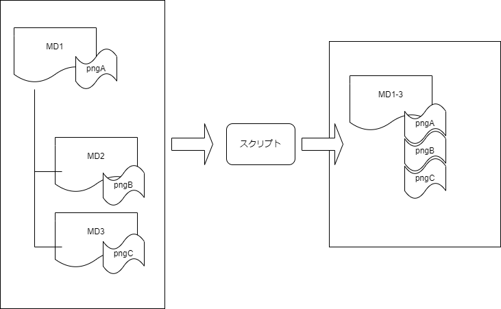

## 設計書や仕様書のMarkdownファイルをまとめる方法
##　導入
* 普段、設計書や仕様書をMarkdownで管理している中で、AIに食わせたり、レビューに使うために単一ファイル化したいことがよくあります。そこで簡単に使えるスクリプトを作りました。

## 目的
* 仕様書・設計書などで、Makrdownの記載は有効だと考えています。
* ただし、資料が多くなると、ファイル自体分散したくなる
* 生成AIなど利用しているときには仕様書・設計書などの提示が有効で、そのためには上記ファイル群を単一にまとめた方が使い勝手いい
  * あくまでもGeminiの場合、ChatGPTなどは、Githubのパス指定や、Zipファイルなどで提示可能の模様
* その際の作業を迷わないようにしたいがための「案」と「ツール」（スクリプト）です。




## 前提
* 特定のディレクトリ「docs」等にファイルをまとめて保存
  * 自分はプロジェクト以下のような形で保存しています。

```
DOCS
│  README.md                    # ディレクトリの意味合い
│  01_overview.md               # 概要
│  02_architecture_design.md    # 基板の設計
・・・
│  05_api_spec.md               # APIの設計
│
├─features                      # 特定機能の機能について保存場所
│  │  DisplayChart.md           # DisplayChartの仕様書
・・・
│  │  ViewHistory.md            # 参照履歴について仕様書
│  │
│  └─images
│          DisplayChart_image01.png # DisplayChart.mdで利用する画像
・・・
│
└─images
        01_overview_image01.drawio.png # 01_overviewで利用する画像
```

* 上記構成で以下のスクリプト作製
    * 指定されたディレクトリ以下のすべてのMarkdownファイルを結合し、単一のMarkdownファイルとして出力します。
    * 結合順は、まずトップレベルのファイルをファイル名順に、次にサブディレクトリ内のファイルをパス名順に結合します。ただしREADME.MDは特殊扱いで必ず統合後ファイルの先頭になります。
    * また、'images'という名前のサブディレクトリを見つけ、その中のファイルを出力先ディレクトリ内の'images'フォルダにコピーします。
    * Args:
       * output_file_path (str): 結合された内容を保存する新しいファイルのパス。

``` python

import os
import shutil

def combine_markdown_files(input_directory, output_file_path):
    combined_content = []
    # 出力ディレクトリのパスを取得し、出力用のimagesディレクトリを準備
    output_dir = os.path.dirname(output_file_path)
    output_images_dir = os.path.join(output_dir, 'images')
    os.makedirs(output_images_dir, exist_ok=True)

    # 入力ディレクトリが存在するか確認
    if not os.path.isdir(input_directory):
        print(f"エラー: 指定されたディレクトリ '{input_directory}' が見つかりません。")
        return

    print(f"'{input_directory}' 内のMarkdownファイルと画像ファイルを検索中...")

    # --- 1. ファイルパスの収集 ---
    markdown_files = []
    image_dirs = []
    for root, dirs, files in os.walk(input_directory):
        # 'images' ディレクトリは特別扱い
        if 'images' in dirs:
            image_dirs.append(os.path.join(root, 'images'))
            dirs.remove('images')  # これ以上 'images' ディレクトリ内を探索しない

        for file_name in files:
            if file_name.endswith(('.md', '.markdown')):
                markdown_files.append(os.path.join(root, file_name))

    # --- 2. Markdownファイルのソート ---
    # トップレベルのファイルとサブディレクトリのファイルを分ける
    top_level_files_raw = [
        f for f in markdown_files
        if os.path.dirname(os.path.normpath(f)) == os.path.normpath(input_directory)
    ]
    sub_dir_files = sorted([
        f for f in markdown_files
        if os.path.dirname(os.path.normpath(f)) != os.path.normpath(input_directory)
    ])

    # _README.md を特別扱い
    readme_file = None
    other_top_level_files = []
    for f in top_level_files_raw:
        if os.path.basename(f).lower() == 'readme.md': # ファイル名が 'README.md' なら特別扱い
            readme_file = f
        else:
            other_top_level_files.append(f)

    # 残りのトップレベルファイルをファイル名順にソート
    sorted_other_top_level_files = sorted(other_top_level_files)

    # 結合順序を確定
    sorted_markdown_files = []
    if readme_file:
        sorted_markdown_files.append(readme_file)
    sorted_markdown_files.extend(sorted_other_top_level_files)
    sorted_markdown_files.extend(sub_dir_files)

    # 3. 画像のコピー 
    print(f"画像のコピー先: '{output_images_dir}'")
    for image_dir in image_dirs:
        print(f"  - 画像ディレクトリ '{image_dir}' を処理中...")
        for file_name in os.listdir(image_dir):
            source_path = os.path.join(image_dir, file_name)
            destination_path = os.path.join(output_images_dir, file_name)
            try:
                shutil.copy2(source_path, destination_path)
                print(f"    - コピー: '{file_name}'")
            except shutil.SameFileError:
                print(f"    - スキップ (コピー元と先が同じ): '{file_name}'")
            except Exception as e:
                print(f"    - エラー: '{file_name}' のコピー中に問題が発生しました: {e}")

    # --- 4. Markdownファイルの結合 ---
    for file_path in sorted_markdown_files:
        try:
            with open(file_path, 'r', encoding='utf-8') as f:
                content = f.read()
                file_name = os.path.basename(file_path)
                combined_content.append(f"# {file_name}\n\n")
                combined_content.append(content)
                combined_content.append("\n\n---\n\n")
            print(f"  - MD追加: '{file_path}'")
        except Exception as e:
            print(f"  - エラー: '{file_path}' の読み込み中に問題が発生しました: {e}")

    # --- 5. ファイルへの書き込み ---
    if combined_content:
        try:
            with open(output_file_path, 'w', encoding='utf-8') as f:
                f.write("".join(combined_content))
            print(f"\nすべてのMarkdownファイルが '{output_file_path}' に結合されました。")
        except Exception as e:
            print(f"エラー: 結合されたファイルの書き込み中に問題が発生しました: {e}")
    else:
        print("\nMarkdownファイルが見つからなかったため、ファイルの結合は行われませんでした。")

# --- 使用例 ---
if __name__ == "__main__":
    # ここを実際のパスに置き換えてください
    input_dir = "./docs"  # 例: カレントディレクトリ下の 'spec_docs' フォルダ
    output_file = "./docs_combine/readme_all.md" # 出力するファイル名

    # 実行
    combine_markdown_files(input_dir, output_file)

    # 別の例: カレントディレクトリにあるMDファイルを全て結合する場合
    # input_dir_current = "."
    # output_file_current = "./all_in_one.md"
    # combine_markdown_files(input_dir_current, output_file_current)
    # python ./docs_combine/combine_docs.py


```

* スクリプトを「python ./docs_combine/combine_docs.py」で実行することで保存場所にまとまったMDが作成されます。
* 対象保存先のImagesフォルダ以下もコピーされるのでMD内での画像参照も有効
* 同じディレクトリ内だと、ファイル名順でソートされます。ただし、README.MDは先頭扱い
* これで、複数ファイルに分かれていた、マークダウンファイルが画像含めて、単一ファイル、単一ディレクトリにまとまります。参照している画像も到底のフォルダにまとまるる形になります。

## 結論
* 生成AIに問い合わせるときには有効
* ただし、単一のMDに収まっているだけなので、実際には「[md-to-pdf](https://github.com/simonhaenisch/md-to-pdf)」（[使い方](https://dev.classmethod.jp/articles/md-to-pdf/)）などで、PDF化してから、生成AIに問い合わせる必要あり
* Markdownファイル保存時に勝手に、Markdownの統合から、PDFまで作ってくれれば助かると持っています。

